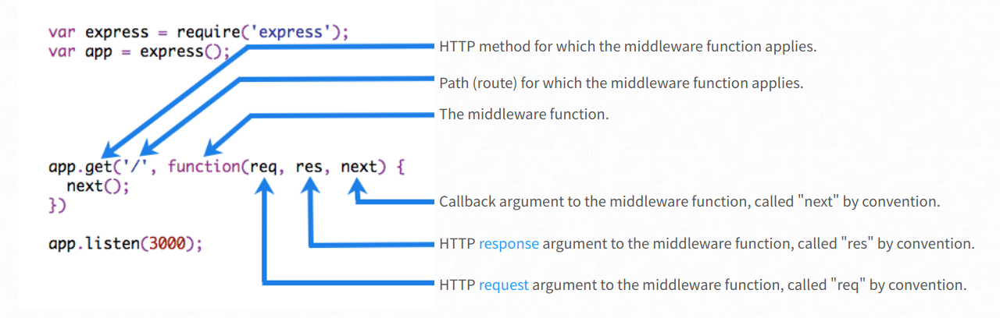

[TOC]
> [官网](<http://www.expressjs.com.cn/>)

## 1. Routing ##

1. 路由方法可以有多个回调函数作为参数。对于多个回调函数，重要的是为回调函数提供`next`作为参数，然后在函数体中调用`next()`，将控制权移交给下一个回调。
2. 在`express 4.x`中，[正则表达式中的`*`字符没有以通常的方式解释](https://github.com/expressjs/express/issues/2495)。作为解决方法，使用` 0`，代替`*`。将在`express5`修正。

## 2. Route handlers ##

路由处理程序可以是函数、函数数组或两者的组合形式。

## 3. Response methods ##

下表所列出的 响应对象（`res`）上的方法 可以向客户端发送响应，并终止请求响应周期。如果没有从路由处理程序调用这些方法，则客户机请求将被**挂起。**

| Method                                                       | Description                                                  |
| ------------------------------------------------------------ | ------------------------------------------------------------ |
| [res.download()](http://www.expressjs.com.cn/en/4x/api.html#res.download) | Prompt a file to be downloaded.                              |
| [res.end()](http://www.expressjs.com.cn/en/4x/api.html#res.end) | End the response process.                                    |
| [res.json()](http://www.expressjs.com.cn/en/4x/api.html#res.json) | Send a JSON response.                                        |
| [res.jsonp()](http://www.expressjs.com.cn/en/4x/api.html#res.jsonp) | Send a JSON response with JSONP support.                     |
| [res.redirect()](http://www.expressjs.com.cn/en/4x/api.html#res.redirect) | Redirect a request.                                          |
| [res.render()](http://www.expressjs.com.cn/en/4x/api.html#res.render) | Render a view template.                                      |
| [res.send()](http://www.expressjs.com.cn/en/4x/api.html#res.send) | Send a response of various types.                            |
| [res.sendFile()](http://www.expressjs.com.cn/en/4x/api.html#res.sendFile) | Send a file as an octet(八位字节流) stream.                  |
| [res.sendStatus()](http://www.expressjs.com.cn/en/4x/api.html#res.sendStatus) | Set the response status code and send its string representation as the response body. |

## 4. app.route() ##

可以使用'app.route（）'为路由路径创建可链接的路由处理程序。因为路径是在单个位置指定的，所以创建模块化路由很有帮助，减少了冗余和打字错误。有关路由的详细信息，请参阅：【router（）文档】（http://www.expressjs.com.cn/en/4x/api.html router）。
下面是一个使用“app.route（）”定义的链接路由处理程序的示例。

```javascript
app.route('/book')
  .get(function (req, res) {
    res.send('Get a random book')
  })
  .post(function (req, res) {
    res.send('Add a book')
  })
  .put(function (req, res) {
    res.send('Update the book')
  })
```

## 5. express.Router ##

使用'express.router'类创建模块化的可安装路由处理程序。“路由器”实例是一个完整的中间件和路由系统；因此，它通常被称为“迷你应用程序”。

## 6. Writing middleware for use in Express apps ##

[Writing middleware](http://www.expressjs.com.cn/guide/writing-middleware.html)



如果当前中间件函数没有结束请求响应周期，则必须调用“next（）”将控制权传递给下一个中间件函数。否则，请求将被挂起。

**Configurable middleware**

```js
module.exports = function(options) {
  return function(req, res, next) {
    // Implement the middleware function based on the options object
    next()
  }
}
// The middleware can now be used as shown below.

var mw = require('./my-middleware.js')

app.use(mw({ option1: '1', option2: '2' }))
```

## 8. Using middleware ##

*中间件*函数是可以访问[请求对象](http://www.expressjs.com.cn/en/4x/api.html req)（`req`）、[响应对象](http://www.expressjs.com.cn/en/4x/api.html res)（`res`）的函数，以及应用程序请求响应周期中的下一个中间件函数。下一个中间件函数通常由名为“next”的变量表示。
Express应用程序可以使用以下类型的中间件：

* [应用级中间件](http://www.expressjs.com.cn/guide/using middleware.html middleware.application)
* [路由器级中间件](http://www.expressjs.com.cn/guide/using middleware.html middleware.router)
* [错误处理中间件](http://www.expressjs.com.cn/guide/using middleware.html middleware.error handling)
* [内置中间件](http://www.expressjs.com.cn/guide/using middleware.html middleware.built-in)
* [第三方中间件](http://www.expressjs.com.cn/guide/using middleware.html middleware.third-party)

您可以使用一个**可选的装载路径来装载应用程序级和路由器级的中间件。**您还可以将一系列中间件功能一起装载，从而在装载点创建中间件系统的子堆栈。

### **8.1 Application-level middleware** ###

通过使用`app.use（）`和`app.method（）`函数，将应用程序级中间件绑定到[app-object](http://www.expressjs.com.cn/en/4x/api.html) app的实例，其中`method`是中间件函数处理的请求（如get、put或post）的HTTP方法（小写）。

没有挂载路径的中间件功能。每次应用程序收到请求时都会执行该功能。

```js
app.use(func);
app.use(path, func);
app.METHODS(path, func);
```

### **8.2 Router-level middleware** ###

路由器级中间件与应用程序级中间件的工作方式相同，只是它**绑定到了`express.router（）`**
**使用`router.use（）`和 `router.method（）` 函数加载路由器级中间件。**

```js
// mount the router on the app
app.use('/', router)
```

### **8.3 Error-handling middleware** ###

> 错误处理中间件**始终采用*四个*参数**。您必须提供四个参数来将其标识为错误处理中间件函数。即使不需要使用“next”对象，也**必须指定它来维护签名**。否则，“next”对象将被解释为常规中间件，并且将无法处理错误。

```js
app.use(function (err, req, res, next) {
  console.error(err.stack)
  res.status(500).send('Something broke!')
})
```

有关错误处理中间件的详细信息，请参阅：[错误处理](http://www.expressjs.com.cn/en/guide/error handling.html)。

### **8.4 Built-in（内置） middleware** ###

从4.x版开始，Express不再依赖于[connect](https://github.com/senchalabs/connect)。以前包含在Express中的中间件功能现在位于单独的模块中；请参阅**[中间件功能列表](https://github.com/senchalabs/connect中间件)。**

Express具有以下内置中间件功能：

- [express.static](http://www.expressjs.com.cn/en/4x/api.html#express.static) 提供静态资产，如HTML文件、图像等。
- [express.json](http://www.expressjs.com.cn/en/4x/api.html#express.json) 使用json有效负载解析传入请求。**注：Express 4.16.0提供 **
- [express.urlencoded](http://www.expressjs.com.cn/en/4x/api.html#express.urlencoded) 使用URL编码的有效负载解析传入请求。**注：Express 4.16.0提供**

### **8.5 Third-party middleware** ###

为所需的功能安装node.js模块，然后将其加载到应用程序的**应用程序级**或**路由器级**。

**安装**

```bash
$ npm install cookie-parser
```

**使用**

```js
var express = require('express')
var app = express()
var cookieParser = require('cookie-parser')

// load the cookie-parsing middleware
app.use(cookieParser())
```

**有关Express常用的第三方中间件功能的部分列表，请参见: [Third-party middleware](http://www.expressjs.com.cn/resources/middleware.html).**

## 9. Error Handling ##

[Error Handling](http://www.expressjs.com.cn/guide/error-handling.html)

Express附带了一个默认的错误处理程序，所以您不需要编写自己的错误处理程序就可以开始了。

### 9.1 Catching Errors ###

***sync***

路由处理程序和中间件内同步代码中发生的错误需要**无额外工作**。如果同步代码抛出错误，那么Express将捕获并处理它。例如：

```javascript
app.get("/", function (req, res) {
  throw new Error("BROKEN"); // Express will catch this on its own.
});
```

***async***

对于路由处理程序和中间件调用的异步函数返回的错误，必须将它们传递给“next（）”函数，Express将在该函数中捕获并处理它们。例如：

```javascript
app.get("/", function (req, res, next) {
  fs.readFile("/file-does-not-exist", function (err, data) {
    if (err) {
      next(err); // Pass errors to Express.
    }
    else {
      res.send(data);
    }
  });
});
```

### 9.2 The default error handler ###

Express附带了一个内置的错误处理程序，可以处理应用程序中可能遇到的任何错误。此缺省错误处理中间件功能添加在中间件功能堆栈的末尾。

**如果您将错误传递给`next()`并且您没有在自定义错误处理程序中处理它，它将由内置错误处理程序处理; 错误将通过堆栈跟踪写入客户端。堆栈跟踪不包含在生产环境中。**

>  将环境变量设置`NODE_ENV`为`production`，以在生产模式下运行应用程序。

### 9.3 Writing error handlers ###

对于组织（和更高级别的框架）目的，您可以定义多个错误处理中间件函数，就像使用常规中间件函数一样。

以与其他中间件函数相同的方式定义错误处理中间件函数，但错误处理函数有四个参数而不是三个参数。最后，在其他`app.use（）`和路由调用之后定义错误处理中间件；例如：

```javascript
var bodyParser = require('body-parser')
var methodOverride = require('method-override')

app.use(bodyParser.urlencoded({
  extended: true
}))
app.use(bodyParser.json())
app.use(methodOverride())
app.use(logErrors)
app.use(clientErrorHandler)
app.use(errorHandler)
app.use(function (err, req, res, next) {
  // logic
})
```

> 如果将任何内容传递给 `next（）` 函数（字符串 `route` 除外），**express将当前请求视为错误，并将跳过任何剩余的非错误处理路由和中间件函数。**如果要处理该错误，则必须创建下一节中描述的错误处理路由。

## 其他 ##

### [文件上传](http://www.runoob.com/nodejs/nodejs-express-framework.html) ###

app.use(multer({ dest: '/tmp/'}).array('image'));

```js
var express = require('express');
var app = express();
var fs = require("fs");
 
var bodyParser = require('body-parser');
var multer  = require('multer');
 
app.use('/public', express.static('public'));
app.use(bodyParser.urlencoded({ extended: false }));
app.use(multer({ dest: '/tmp/'}).array('image'));
 
app.get('/index.htm', function (req, res) {
   res.sendFile( __dirname + "/" + "index.htm" );
})
 
app.post('/file_upload', function (req, res) {
 
   console.log(req.files[0]);  // 上传的文件信息
 
   var des_file = __dirname + "/" + req.files[0].originalname;
   fs.readFile( req.files[0].path, function (err, data) {
        fs.writeFile(des_file, data, function (err) {
         if( err ){
              console.log( err );
         }else{
               response = {
                   message:'File uploaded successfully', 
                   filename:req.files[0].originalname
              };
          }
          console.log( response );
          res.end( JSON.stringify( response ) );
       });
   });
})
 
var server = app.listen(8081, function () {
 
  var host = server.address().address
  var port = server.address().port
 
  console.log("应用实例，访问地址为 http://%s:%s", host, port)
 
})
```


### 注意 ###

（1）、`app.all('/', func)` 和 `app.use('/', router)` 和 `app.use(func)` 的区别

（2）、`router.use('/', func)` 和 `router.use(func)` 和 `router.use('/', func)` 

> `app.get('/', func)` 不用 `next()` 的话不会阻断后面的路由处理

