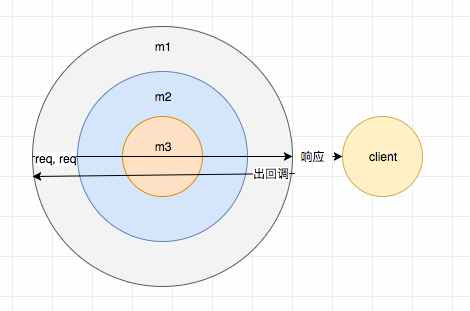

[TOC]

## 1. koa 和 express 的区别

### 1.1 框架

Express 更为贴近 Web Framework 这一概念，比如自带 Router、路由规则等（在没有剥离bodyParser之前更为贴切）；相比之下 Koa 更多是一个中间件框架，更为宽松。koa其提供的是一个架子，而几乎所有的功能都需要由第三方中间件完成（光是 Router 就有 20+ 个）。

### 1.2 异步流程控制

Express 采用 callback 来处理异步，Koa v1 采用 generator，Koa v2 采用 async/await。

### 1.3 中间件处理

1. **Express** 中间件模型是线性的, 也就是一个一个往下执行的。就是一层一层嵌套的回调。

2. **Koa**，洋葱形

