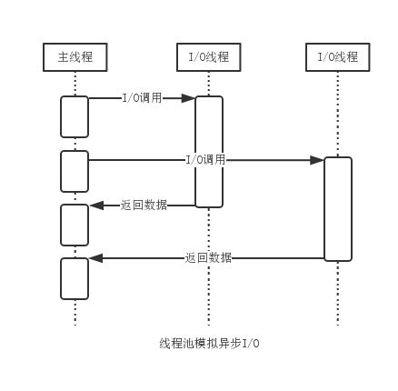
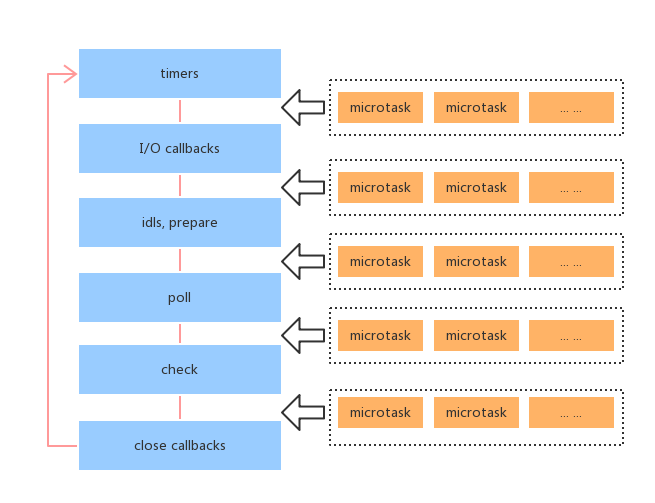
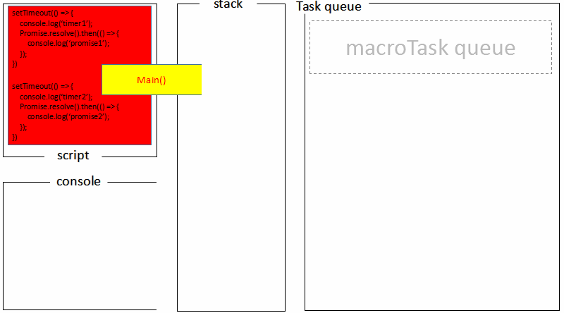

[TOC]

> Event Loop是一个程序结构，用于等待和发送消息和事件。（a programming construct that waits for and dispatches events or messages in a program.）
> 异步任务有了运行结果，就在"任务队列"之中放置一个事件。
>
> ***所谓的异步，本质上还是借助于多线程的宿主实现的，并发 Javascript 语言本身特性。***而且，几乎所有的异步任务都是并发的，例如多个 Job Queue、Ajax、Timer、I/O(Node)等等。

## 1. NODE - Event Loop ##

[JavaScript 运行机制详解：再谈Event Loop——阮一峰老师](http://www.ruanyifeng.com/blog/2014/10/event-loop.html)        

[异步操作概述——阮一峰老师](http://javascript.ruanyifeng.com/advanced/single-thread.html)

[浏览器与Node的事件循环(Event Loop)有何区别?——知乎](<https://zhuanlan.zhihu.com/p/54882306>)

***异步机制-线程池***



***NODE System***


**运行机制**

- V8 引擎解析 JavaScript 脚本。
- 解析后的代码，调用 Node API。
- libuv 库负责 Node API 的执行。它将不同的任务分配给不同的线程，形成一个 Event Loop（事件循环），以异步的方式将任务的执行结果返回给 V8 引擎。
- V8 引擎再将结果返回给用户。

**六个阶段**

```
   ┌───────────────────────┐
┌─>│        timers         │<————— 执行 setTimeout()、setInterval() 的回调
│  └──────────┬────────────┘
|             |<-- 执行所有 Next Tick Queue 以及 MicroTask Queue 的回调
│  ┌──────────┴────────────┐
│  │     pending callbacks │<————— 执行由上一个 Tick 延迟下来的 I/O 回调（待完善，可忽略）
│  └──────────┬────────────┘
|             |<-- 执行所有 Next Tick Queue 以及 MicroTask Queue 的回调
│  ┌──────────┴────────────┐
│  │     idle, prepare     │<————— 内部调用（可忽略）
│  └──────────┬────────────┘     
|             |<-- 执行所有 Next Tick Queue 以及 MicroTask Queue 的回调
|             |                   ┌───────────────┐
│  ┌──────────┴────────────┐      │   incoming:   │ - (执行几乎所有的回调，除了 close callbacks 以及 timers 调度的回调和 setImmediate() 调度的回调，在恰当的时机将会阻塞在此阶段)
│  │         poll          │<─────┤  connections, │ 
│  └──────────┬────────────┘      │   data, etc.  │ 
│             |                   |               | 
|             |                   └───────────────┘
|             |<-- 执行所有 Next Tick Queue 以及 MicroTask Queue 的回调
|  ┌──────────┴────────────┐      
│  │        check          │<————— setImmediate() 的回调将会在这个阶段执行
│  └──────────┬────────────┘
|             |<-- 执行所有 Next Tick Queue 以及 MicroTask Queue 的回调
│  ┌──────────┴────────────┐
└──┤    close callbacks    │<————— socket.on('close', ...)
   └───────────────────────┘
```

## 2. 浏览器 - Event Loop ##

[JavaScript 运行机制详解：再谈Event Loop——阮一峰老师](http://www.ruanyifeng.com/blog/2014/10/event-loop.html)       

[异步操作概述——阮一峰老师](http://javascript.ruanyifeng.com/advanced/single-thread.html) 

[浏览器与Node的事件循环(Event Loop)有何区别?——知乎](<https://zhuanlan.zhihu.com/p/54882306>)

[JS浏览器事件循环机制——博客](https://www.cnblogs.com/yqx0605xi/p/9267827.html)

> 主线程从"任务队列"中读取事件，这个过程是循环不断的，所以整个的这种运行机制又称为Event Loop。

**浏览器内核**


**事件循环**


**事件循环流程图**


- 一开始执行栈空,我们可以把**执行栈认为是一个存储函数调用的栈结构，遵循先进后出的原则**。micro 队列空，macro 队列里有且只有一个 script 脚本（整体代码）。
- 全局上下文（script 标签）被推入执行栈，同步代码执行。在执行的过程中，会判断是同步任务还是异步任务，通过对一些接口的调用，可以产生新的 macro-task 与 micro-task，它们会分别被推入各自的任务队列里。同步代码执行完了，script 脚本会被移出 macro 队列，这个过程本质上是队列的 macro-task 的执行和出队的过程。
- 上一步我们出队的是一个 macro-task，这一步我们处理的是 micro-task。但需要注意的是：当 macro-task 出队时，任务是**一个一个**执行的；而 micro-task 出队时，任务是**一队一队**执行的。因此，我们处理 micro 队列这一步，会逐个执行队列中的任务并把它出队，直到队列被清空。
- **执行渲染操作，更新界面**
- 检查是否存在 Web worker 任务，如果有，则对其进行处理
- 上述过程循环往复，直到两个队列都清空

**event-loop-过程**


（1）浏览器内核*

​	GUI渲染线程 、 JS引擎线程 、 事件触发线程 、 定时器触发线程 、 http请求线程

*（2）*Javascript 有一个 main thread 主线程和 call-stack 调用栈(执行栈)，所有的任务都会被放到调用栈等待主线程执行。

*（3）循环机制*
	js调用栈（后进先出） 、 任务队列（先进先出）

*（4）* *任务分类*
	*广义*：同步异步

> ***同步任务指的是***，在主线程上排队执行的任务，只有前一个任务执行完毕，才能执行后一个任务
>
> ***异步任务指的是***，不进入主线程、而进入"任务队列"（task queue）的任务，只有"任务队列"通知主线程，某个异步任务可以执行了，该任务才会进入主线程执行。

​	JavaScript 单线程中的任务可以细分为***宏任务(macro-task)***、***微任务(micro-task)***

> ***macro-task包括***：script(整体代码), setTimeout, setInterval, setImmediate, I/O, UI rendering。
>
> ***micro-task包括***：process.nextTick, Promises, Object.observe, MutationObserver。

（5）*回调函数（callback）*，就是那些会被主线程挂起来的代码。异步任务必须指定回调函数，当主线程开始执行异步任务，就是执行对应的回调函数。

*（6）例子*

```js
Promise.resolve().then(()=>{
  console.log('Promise1')
  setTimeout(()=>{
    console.log('setTimeout2')
  },0)
})
setTimeout(()=>{
  console.log('setTimeout1')
  Promise.resolve().then(()=>{
    console.log('Promise2')
  })
},0)
```

***最后输出结果是 Promise1，setTimeout1，Promise2，setTimeout2***

## 3. 浏览器与Node 差异 ##

[深入理解js事件循环机制（Node.js篇）](<http://lynnelv.github.io/js-event-loop-nodejs>)

浏览器环境下，microtask 的任务队列是每个 macrotask 执行完之后执行。而在 Node.js 中，microtask 会在事件循环的各个阶段之间执行，也就是一个阶段执行完毕，就会去执行 microtask 队列的任务。

浏览器和 Node 环境下，microtask 任务队列的执行时机不同

- **Node 端，microtask 在事件循环的各个阶段之间执行**
- **浏览器端，microtask 在事件循环的 macrotask 执行完之后执行**




**例子**

```js
setTimeout(()=>{
    console.log('timer1')
    Promise.resolve().then(function() {
        console.log('promise1')
    })
}, 0)
setTimeout(()=>{
    console.log('timer2')
    Promise.resolve().then(function() {
        console.log('promise2')
    })
}, 0)
```

***浏览器端***运行结果：`timer1=>promise1=>timer2=>promise2`



***Node 端运行***结果：`timer1=>timer2=>promise1=>promise2`

- 全局脚本（main()）执行，将 2 个 timer 依次放入 timer 队列，main()执行完毕，调用栈空闲，任务队列开始执行；
- 首先进入 timers 阶段，执行 timer1 的回调函数，打印 timer1，并将 promise1.then 回调放入 microtask 队列，同样的步骤执行 timer2，打印 timer2；
- 至此，timer 阶段执行结束，event loop 进入下一个阶段之前，执行 microtask 队列的所有任务，依次打印 promise1、promise2

