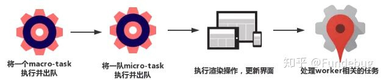
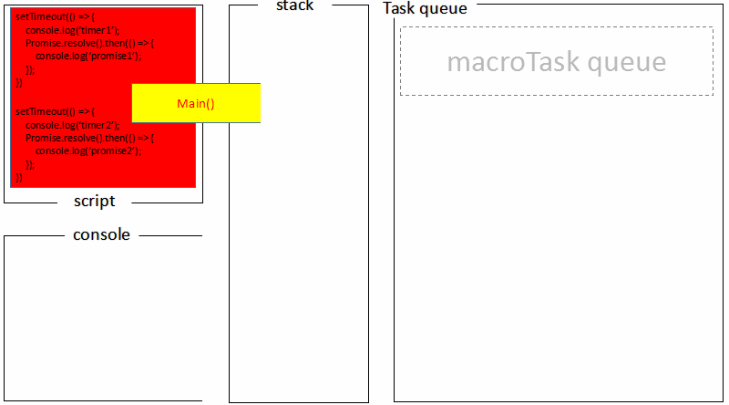

[TOC]

> （1）Event Loop是一个程序结构，用于**等待和发送消息和事件**。（a programming construct that waits for and dispatches events or messages in a program.）
> 异步任务有了运行结果，就在"任务队列"之中放置一个事件。
>
> （2）***所谓的异步，本质上还是借助于多线程的宿主实现的，并非 Javascript 语言本身特性。***而且，几乎所有的异步任务都是并发的，例如多个 Job Queue、Ajax、Timer、I/O(Node)等等。
>
> （3）**JavaScript（引擎）是单线程的，Event loop并不属于JavaScript本身，但JavaScript的运行环境是多线程／多进程的，运行环境实现了Event loop。**
>

## 1. 概念 及 问题 ##

### 1.1 同步任务 ###

在主线程上排队执行的任务，只有前一个任务执行完毕，才能执行后一个任务

### 1.2 异步任务 ###

不进入主线程、而进入"任务队列"（task queue）的任务，只有等主线程任务执行完毕，"任务队列"开始通知主线程，请求执行任务，该任务才会进入主线程执行。

### 1.3 宏任务(macro-task)***、***微任务(micro-task) ###

***macro-task包括***：script(整体代码), setTimeout, setInterval, setImmediate, I/O, UI rendering。

***micro-task包括***：process.nextTick, Promises, Object.observe, MutationObserver。

### 1.4 js调用栈、 任务队列 ###

**后进先出，先进先出**

### 1.5 回调函数（callback） ###

就是那些会被主线程挂起来的代码。异步任务必须指定回调函数，当主线程开始执行异步任务，就是执行对应的回调函数。

### 1.6 Event loop ###

> 主线程**从"任务队列"中读取事件，这个过程是循环不断的**，所以整个的这种**运行机制**又称为Event Loop（事件循环）

是一种程序结构，是实现异步的一种机制，可以简单理解为：

1. 所有任务都在主线程上执行，形成一个执行栈（execution context stack）。
2. 主线程之外，还存在一个"任务队列"（task queue）。系统把异步任务放到"任务队列"之中，然后主线程继续执行后续的任务。
3. 一旦"执行栈"中的所有任务执行完毕，系统就会读取"任务队列"。如果这个时候，异步任务已经结束了等待状态，就会从"任务队列"进入执行栈，恢复执行。
4. 主线程不断重复上面的第三步。

### 1.7为什么JavaScript是单线程？ ###

作为**浏览器脚本语言**，JavaScript的主要用途是与用户互动，以及操作DOM。

## 2. 浏览器 - Event Loop ##

[JavaScript 运行机制详解：再谈Event Loop——阮一峰老师](http://www.ruanyifeng.com/blog/2014/10/event-loop.html)       

[异步操作概述——阮一峰老师](http://javascript.ruanyifeng.com/advanced/single-thread.html) 

[浏览器与Node的事件循环(Event Loop)有何区别?——知乎](<https://zhuanlan.zhihu.com/p/54882306>)

[JS浏览器事件循环机制——博客](https://www.cnblogs.com/yqx0605xi/p/9267827.html)

**浏览器内核**


**事件循环**


**事件循环流程**

> `(macro)task` 中两个不同的任务之间可能穿插着UI的重渲染，那么我们只需要在 `microtask` 中把所有在UI重渲染之前需要更新的数据全部更新（VUE）


- 一开始执行栈空,我们可以把**执行栈认为是一个存储函数调用的栈结构，遵循先进后出的原则**。micro 队列空，macro 队列里有且只有一个 script 脚本（整体代码）。
- 全局上下文（script 标签）被推入执行栈，同步代码执行。在执行的过程中，会判断是同步任务还是异步任务，通过对一些接口的调用，可以产生新的 macro-task 与 micro-task，它们会分别被推入各自的任务队列里。同步代码执行完了，script 脚本会被移出 macro 队列，这个过程本质上是队列的 macro-task 的执行和出队的过程。
- 上一步我们出队的是一个 macro-task，这一步我们处理的是 micro-task。但需要注意的是：当 macro-task 出队时，任务是**一个一个**执行的；而 micro-task 出队时，任务是**一队一队**执行的。因此，我们处理 micro 队列这一步，会逐个执行队列中的任务并把它出队，直到队列被清空。
- **执行渲染操作，更新界面**
- 检查是否存在 Web worker 任务，如果有，则对其进行处理
- 上述过程循环往复，直到两个队列都清空

**event-loop-过程**



***例子***

```js
Promise.resolve().then(()=>{
  console.log('Promise1')
  setTimeout(()=>{
    console.log('setTimeout2')
  },0)
})
setTimeout(()=>{
  console.log('setTimeout1')
  Promise.resolve().then(()=>{
    console.log('Promise2')
  })
},0)
```

***最后输出结果是 Promise1，setTimeout1，Promise2，setTimeout2***

- 一开始执行栈的同步任务（这属于宏任务）执行完毕，会去查看是否有微任务队列，上题中存在(有且只有一个)，然后执行微任务队列中的所有任务输出 Promise1，同时会生成一个宏任务 setTimeout2
- 然后去查看宏任务队列，宏任务 setTimeout1 在 setTimeout2 之前，先执行宏任务 setTimeout1，输出 setTimeout1
- 在执行宏任务 setTimeout1 时会生成微任务 Promise2 ，放入微任务队列中，接着先去清空微任务队列中的所有任务，输出 Promise2
- 清空完微任务队列中的所有任务后，就又会去宏任务队列取一个，这回执行的是 setTimeout2

## 3. NODE - Event Loop ##

[JavaScript 运行机制详解：再谈Event Loop——阮一峰老师](http://www.ruanyifeng.com/blog/2014/10/event-loop.html)        

[异步操作概述——阮一峰老师](http://javascript.ruanyifeng.com/advanced/single-thread.html)

[浏览器与Node的事件循环(Event Loop)有何区别?——知乎](<https://zhuanlan.zhihu.com/p/54882306>)

[Node.js的event loop及timer/setImmediate/nextTick ](<https://github.com/creeperyang/blog/issues/26>)

***异步机制-线程池***


***NODE System***


**运行机制**

- V8 引擎解析 JavaScript 脚本。
- 解析后的代码，调用 Node API。
- libuv 库负责 Node API 的执行。它将不同的任务分配给不同的线程，形成一个 Event Loop（事件循环），以异步的方式将任务的执行结果返回给 V8 引擎。
- V8 引擎再将结果返回给用户。

**六个阶段**

> Node很多API都是基于**事件订阅**完成的，这些API的回调应该都在***poll阶段***完成。

```
   ┌───────────────────────┐
┌─>│        timers         │<————— 执行 setTimeout()、setInterval() 的回调
│  └──────────┬────────────┘
|             |<-- 执行所有 Next Tick Queue 以及 MicroTask Queue 的回调
│  ┌──────────┴────────────┐
│  │     pending callbacks │<————— 执行由上一个 Tick 延迟下来的 I/O 回调（待完善，可忽略）
│  └──────────┬────────────┘
|             |<-- 执行所有 Next Tick Queue 以及 MicroTask Queue 的回调
│  ┌──────────┴────────────┐
│  │     idle, prepare     │<————— 内部调用（可忽略）
│  └──────────┬────────────┘     
|             |<-- 执行所有 Next Tick Queue 以及 MicroTask Queue 的回调
|             |                   ┌───────────────┐
│  ┌──────────┴────────────┐      │   incoming:   │ - (执行几乎所有的回调，除了 close callbacks 以及 timers 调度的回调和 setImmediate() 调度的回调，在恰当的时机将会阻塞在此阶段)
│  │         poll          │<─────┤  connections, │ 
│  └──────────┬────────────┘      │   data, etc.  │ 
│             |                   |               | 
|             |                   └───────────────┘
|             |<-- 执行所有 Next Tick Queue 以及 MicroTask Queue 的回调
|  ┌──────────┴────────────┐      
│  │        check          │<————— setImmediate() 的回调将会在这个阶段执行
│  └──────────┬────────────┘
|             |<-- 执行所有 Next Tick Queue 以及 MicroTask Queue 的回调
│  ┌──────────┴────────────┐
└──┤    close callbacks    │<—————  `close` 回调函数被调用如：socket.on('close', ...)
   └───────────────────────┘
```

***每个阶段***都有一个***先进先出的回调队列***  要执行。而每个阶段都有自己的特殊之处。简单来说，就是当事件循环进入某个阶段后，会执行该阶段特定的任意操作，然后才会执行这个阶段里的回调。当队列被执行完，或者执行的回调数量达到上限后，事件循环才会进入下一个阶段。

**setTimeout 和 setImmediate**

二者非常相似，区别主要在于调用时机不同。

- setImmediate 设计在 poll 阶段完成时执行，即 check 阶段；
- setTimeout 设计在 poll 阶段为空闲时，且设定时间到达后执行，但它在 timer 阶段执行

```js
setTimeout(function timeout () {
  console.log('timeout');
},0);
setImmediate(function immediate () {
  console.log('immediate');
});
```

- 对于以上代码来说，***setTimeout 可能执行在前，也可能执行在后***。
- 首先 setTimeout(fn, 0) === setTimeout(fn, 1)，这是由源码决定的
  进入事件循环也是需要成本的，如果在准备时候花费了大于 1ms 的时间，那么在 timer 阶段就会直接执行 setTimeout 回调
- 如果准备时间花费小于 1ms，那么就是 setImmediate 回调先执行了

但当二者在异步 i/o callback 内部调用时，总是先执行 setImmediate，再执行 setTimeout

```js
const fs = require('fs')
fs.readFile(__filename, () => {
    setTimeout(() => {
        console.log('timeout');
    }, 0)
    setImmediate(() => {
        console.log('immediate')
    })
})
// immediate
// timeout
```

在上述代码中，setImmediate 永远先执行。因为两个代码写在 IO 回调中，IO 回调是在 poll 阶段执行，当回调执行完毕后队列为空，发现存在 setImmediate 回调，所以就直接跳转到 check 阶段去执行回调了。

**process.nextTick**

这个函数其实是独立于 Event Loop 之外的，它有一个自己的队列，当每个阶段完成后，如果存在 nextTick 队列，就会清空队列中的所有回调函数，并且优先于其他 microtask 执行。

## 4. 浏览器与Node 差异 ##

[深入理解js事件循环机制（Node.js篇）](<http://lynnelv.github.io/js-event-loop-nodejs>)

浏览器环境下，microtask 的任务队列是每个 macrotask 执行完之后执行。而在 Node.js 中，microtask 会在事件循环的各个阶段之间执行，也就是一个阶段执行完毕，就会去执行 microtask 队列的任务。

浏览器和 Node 环境下，microtask 任务队列的执行时机不同

- **Node 端，microtask 在事件循环的各个阶段之间执行**
- **浏览器端，microtask 在事件循环的 macrotask 执行完之后执行**


**例子**

```js
setTimeout(()=>{
    console.log('timer1')
    Promise.resolve().then(function() {
        console.log('promise1')
    })
}, 0)
setTimeout(()=>{
    console.log('timer2')
    Promise.resolve().then(function() {
        console.log('promise2')
    })
}, 0)
```

***浏览器端***运行结果：`timer1=>promise1=>timer2=>promise2`



***Node 端运行*** 结果：`timer1=>timer2=>promise1=>promise2`

- 全局脚本（main()）执行，将 2 个 timer 依次放入 timer 队列，main()执行完毕，调用栈空闲，任务队列开始执行；
- 首先进入 timers 阶段，执行 timer1 的回调函数，打印 timer1，并将 promise1.then 回调放入 microtask 队列，同样的步骤执行 timer2，打印 timer2；
- 至此，timer 阶段执行结束，event loop 进入下一个阶段之前，执行 microtask 队列的所有任务，依次打印 promise1、promise2

