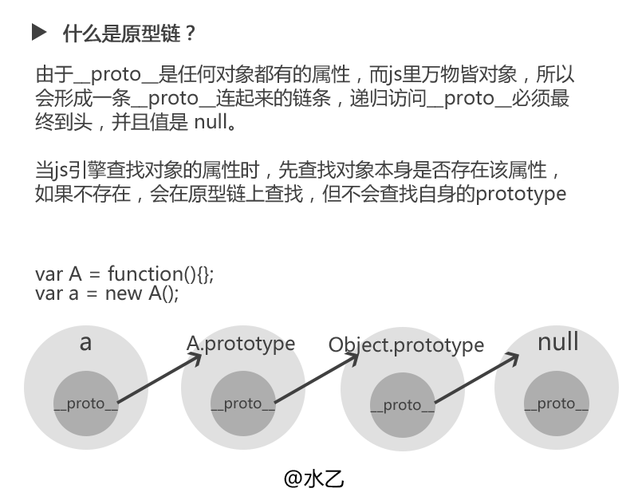

[TOC]

## 1. 原型链

[JS原型链简单图解](https://www.cnblogs.com/libin-1/p/5820550.html)



## 2. 继承， 参考

[JS实现继承的几种方式](https://www.cnblogs.com/humin/p/4556820.html)

## 3. JS中的_proto_ 和 prototype 的区别

[js中__proto__和prototype的区别和关系？](<https://www.zhihu.com/question/34183746/answer/59043879>)

### 3.1 区别 ###


### 3.2 __proto__ 指向 ###


## 4. instance 原理

[js中__proto__和prototype的区别和关系？](<https://www.zhihu.com/question/34183746/answer/59043879>)

```js
//设 L instanceof R 
//通过判断
 L.__proto__.__proto__ ..... === R.prototype ？
//最终返回true or false
```

## 5. Function 和 Object 关系 ##

```js
//////////// function
function a() { [native code] }
a.__proto__ === Function.prototype // ƒ () { [native code] }
a.constructor === a.__proto__.constructor === Function
a.prototype.constructor === a

//////////// Function
Function.__proto__.__proto__ === Function.prototype.__proto__ === Object.prototype
// {constructor: ƒ, __defineGetter__: ƒ, __defineSetter__: ƒ, hasOwnProperty: ƒ, __lookupGetter__: ƒ, …}

//////////// Object
Object.__proto__ === Function.__proto__ === Function.prototype // ƒ () { [native code] }
Object.constructor === Object.__proto__.constructor === Function
Object.prototype.constructor === Object
Object.__proto__.__proto__.__proto__ === Object.prototype.__proto__ === null 
```


## 6. typeof ##

> **总结：**typeof运算符用于判断对象的类型，但是对于一些创建的对象，它们都会返回'object'，有时我们需要判断该实例是否为某个对象的实例，那么这个时候需要用到instanceof运算符，后续记录instanceof运算符的相关用法。

### 1. typeof的语法 ###

1. typeof(表达式)，对表达式做运算
2. typeof 变量名，对变量做运算。

### 2. 简单的示例 ###

```js
 console.log(typeof a);    //'undefined'

 console.log(typeof(true));  //'boolean'

 console.log(typeof '123');  //'string'

 console.log(typeof 123);   //'number'

 console.log(typeof NaN);   //'number'

 console.log(typeof null);  //'object'    

 var obj = new String();

 console.log(typeof(obj));    //'object'

 var  fn = function(){};

 console.log(typeof(fn));  //'function'

 console.log(typeof(class c{}));  //'function'
 
 console.log(typeof symbo()l);  //'symbol'
```

