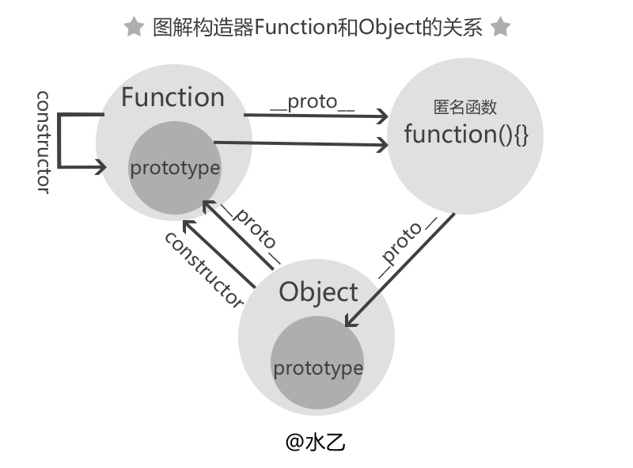
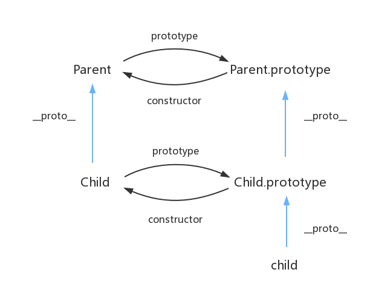

[TOC]

## 1. 原型链

[JS原型链简单图解](https://www.cnblogs.com/libin-1/p/5820550.html)


## 2. 继承， 参考

[JS实现继承的几种方式](https://www.cnblogs.com/humin/p/4556820.html)

## 3. JS中的_proto_ 和 prototype 的区别

[js中__proto__和prototype的区别和关系？](<https://www.zhihu.com/question/34183746/answer/59043879>)

### 3.1 区别 ###


### 3.2 __proto__ 指向 ###


## 4. instance 原理

[js中__proto__和prototype的区别和关系？](<https://www.zhihu.com/question/34183746/answer/59043879>)

```js
//设 L instanceof R 
//通过判断
 L.__proto__.__proto__ ..... === R.prototype ？
//最终返回true or false
```

## 5. Function 和 Object 关系 ##

```js
//////////// function
function a() { [native code] }
a.__proto__ === Function.prototype // ƒ () { [native code] }
a.constructor === a.__proto__.constructor === Function
a.prototype.constructor === a

//////////// Function
Function.__proto__.__proto__ === Function.prototype.__proto__ === Object.prototype
// {constructor: ƒ, __defineGetter__: ƒ, __defineSetter__: ƒ, hasOwnProperty: ƒ, __lookupGetter__: ƒ, …}

//////////// Object
Object.__proto__ === Function.__proto__ === Function.prototype // ƒ () { [native code] }
Object.constructor === Object.__proto__.constructor === Function
Object.prototype.constructor === Object
Object.__proto__.__proto__.__proto__ === Object.prototype.__proto__ === null 
```



## 6. class ##



```js
class Parent {
}

class Child extends Parent {
}

console.log(Child.__proto__ === Parent); // true
console.log(Child.prototype.__proto__ === Parent.prototype); // true
```

## 7. typeof ##

> **总结：**typeof运算符用于判断对象的类型，但是对于一些创建的对象，它们都会返回'object'，有时我们需要判断该实例是否为某个对象的实例，那么这个时候需要用到instanceof运算符，后续记录instanceof运算符的相关用法。

### 1. typeof的语法 ###

1. typeof(表达式)，对表达式做运算
2. typeof 变量名，对变量做运算。

### 2. 简单的示例 ###

```js
 console.log(typeof a);    //'undefined'

 console.log(typeof(true));  //'boolean'

 console.log(typeof '123');  //'string'

 console.log(typeof 123);   //'number'

 console.log(typeof NaN);   //'number'

 console.log(typeof null);  //'object'    

 var obj = new String();

 console.log(typeof(obj));    //'object'

 var  fn = function(){};

 console.log(typeof(fn));  //'function'

 console.log(typeof(class c{}));  //'function'
 
 console.log(typeof symbo()l);  //'symbol'
```

## 8. 闭包 ##

### 8.1 概念 ###

1. **简单讲，闭包就是指有权访问另一个函数作用域中的变量的函数。**
   由于在javascript中，只有函数内部的子函数才能读取局部变量，所以说，闭包可以简单理解成“定义在一个函数内部的函数“。
   所以，在本质上，闭包是将函数内部和函数外部连接起来的桥梁。

2. **MDN 上面这么说**：**闭包是一种特殊的对象**。它由两部分构成：函数，以及创建该函数的环境。环境由闭包创建时在作用域中的任何局部变量组成。

### 8.2 闭包的缺陷 ###

- 闭包的缺点就是常驻内存会增大内存使用量，并且使用不当很容易造成内存泄露。
- 如果不是因为某些特殊任务而需要闭包，在没有必要的情况下，在其它函数中创建函数是不明智的，因为闭包对脚本性能具有负面影响，包括处理速度和内存消耗。

### 8.3 应用 ###

> - **保护函数内的变量安全**。
> - **在内存中维持一个变量**。

1. 用闭包模拟私有方法

   ```js
   var returnNum = (function () {
       var num = 0;
       function changeNum(value) {
           num = value;
       }
       return {
           add: function () {
               changeNum(10);
           },
           delete: function () {
               changeNum(-10);
           },
           getNum: function () {
               return num;
           }
       }
   })();
   ```

   

2. 缓存

   ```js
   var CacheCount = (function () {
       var cache = {};
       return {
          getCache: function (key) {
               if (key in cache) {// 如果结果在缓存中
                   return cache[key];// 直接返回缓存中的对象
               }
               var newValue = getNewValue(key); // 外部方法，获取缓存
               cache[key] = newValue;// 更新缓存
              return newValue;
           }
     };
   })();
   ```

3. setTimeout

```js
`function` `func(param) {``    ``return` `function``() {``        ``console.log(param);``    ``}``}``var` `myFunc = func(``'wheeler'``);``setTimeout(myFunc, 1000);`
```

4. 通过添加另外一个闭包来避免JS对象和DOM对象之间的循环引用

   ```js
   window.onload=function outerFunction()
   {
     var anotherObj=function innerFunction()
      {
               alert("I have avoided the leak!");
      }
   	//通过另外一个闭包来避免JS对象和DOM对象之间的循环引用
     function anotherInnerFunction()
      {
           var obj=document.getElementById("div1");
    		//DOM对象引用了anotherObj函数，但是anotherObj函数无法引用DOM对象
           obj.onclick=anotherObj;
     };
     anotherInnerFunction();
   }	
   ```

   