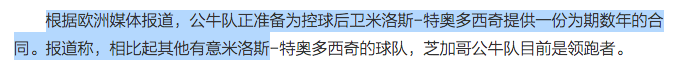

[TOC]

## 1. NodeList、HTMLCollection、NamedNodeMap ##

[深入理解javascript中的动态集合](https://www.cnblogs.com/xiaohuochai/p/5827389.html)

[本地-1. js 选择器原理](..\..\JS工作机制相关\工作原理\记录.md)

***NodeList***

NodeList实例对象是一个类数组对象，它的成员是节点对象，包括childNodes, getElementsByName()和[querySelectorAll()方法](http://www.cnblogs.com/xiaohuochai/p/5798014.html#anchor1)返回值

***HTMLCollection***

HTMLCollection对象与NodeList对象类似，也是节点的集合，返回一个类数组对象。HTMLCollection集合包括getElementsByTagName()、getElementsByClassName()等方法的返回值，以及children、document.links、document.forms等元素集合

***NamedNodeMap***

该对象的常见实例对象是[attributes属性](http://www.cnblogs.com/xiaohuochai/p/5819638.html#anchor4)

## 2. range ##

​    [JS Range 对象的使用](https://segmentfault.com/a/1190000009875696)

Range是指html文档中的区域，如用户用鼠标拖动选中的区域，如下图：



通过Range对象，可以获取用户选中的区域，或者指定选中区域，得到Range的起点和终点、修改或者复制里边的文本，甚至是html。在富文本编辑器开发中，经常会使用到这些功能。

**获取当前选区**

```js
var selection, range;
if (window.getSelection) { 
    //现代浏览器
    selection = window.getSelection();
} else if (document.selection) { 
    //IE
    selection = document.selection.createRange();
}

//Range对象
range = selection.getRangeAt(0);
```

## 3. DocumentFragment ##

[了解DocumentFragment 给我们带来的性能优化](https://www.cnblogs.com/blueSkys/p/3685740.html)

## 4. node.textContent ##

textContent 属性设置或返回指定节点的文本内容，以及它的所有后代。

如果您设置了 textContent 属性，会删除所有子节点，并被替换为包含指定字符串的一个单独的文本节点

## 5. textContent、innerText、innerHTML的区别和差异 ##

[textContent和innerText以及innerHTML的区别](<https://blog.csdn.net/qq_39207948/article/details/86099905>)

（1）textContent属性可以获取指定节点的文本及其后代节点中文本内容，也包括<script>和<style>元素中的内容；

（2）innerText也是获取指定节点的文本及其后代节点中文本内容，但不能获取<script>和<style>元素中的内容。

innerHTML是获取HTML文本结构内容。

（3）textContent会获取display:none的节点的文本；而innerText好像会感知到节点是否呈现一样，不作返回。

也就是说，textContent能够获取元素的所有子节点上的文本，不管这个节点是否呈现；而innerText只返回呈现到页面上的文本。

（4）要注意设置文本时被替换的可不只是文本了；这时textContent 、innerText属性相当于innerHTML属性，会把指定节点下的所有子节点也一并替换掉。

（5）由于 innerText 受 CSS 样式的影响，它会触发重排（reflow），但 textContent 不会。

## 6. node.attributes  —— NamedNodeMap ##

​    let attr = document.querySelector("#app").attributes;
​    console.log(attr); 如下浏览器打印结果：
​    NamedNodeMap {0: id, 1: v-try1, id: id, v-try1: v-try1, length: 2}

## 7. append 和 appendChild 的区别 ##

（1）ParentNode.append()允许追加  DOMString 对象，而 Node.appendChild() 只接受 Node 对象。
（2）ParentNode.append() 没有返回值，而 Node.appendChild() 返回追加的 Node 对象。
（3）ParentNode.append() 可以追加几个节点和字符串，而 Node.appendChild() 只能追加一个节点。

[ ParentNode.append](https://developer.mozilla.org/zh-CN/docs/Web/API/ParentNode/append)   

## 8. JS获取浏览器窗口大小 获取屏幕，浏览器，网页高度宽度 ##

[JS获取浏览器窗口大小 获取屏幕，浏览器，网页高度宽度](https://www.cnblogs.com/wujindong/p/5592908.html)

[深入理解盒模型]( https://www.cnblogs.com/chengzp/p/cssbox.html)

```js
dom.style.width
dom.currentStyle.width
window.getComputedStyle(dom).width
dom.getBoundingClientRect().width
dom.offsetWidth
```


## 9. window.scrollTo(x, y) ##

## 10. document.readySate ##

```js
loading // 加载
document // 仍在加载
interactive // 互动，文档已经完成加载，文档已被解析，但是诸如图像，样式表和框架之类的子资源仍在加载。
complete // 完成，文档和所有子资源已完成加载。状态表示 load 事件即将被触发。当这个属性的值变化时，document 对象上的readystatechange 事件将被触发。
```

## 11. 表单元素 ##

### 1. radio ###

​    document.querySelector("input[name=nzq]:nth-child(1)").checked = true;

```js
var radios = document.querySelectorAll("input[name=nzq]");
  for (var i = 0, len = radios.length; i < len; i++) {
    if (radios[i].checked) {
      console.log(radios[i].value);break;
    }
  }
```

### 2. checkbox ###

```js
 var s = document.querySelectorAll("input[name=chkStudent]");
    var s2 = "";
    for( var i = 0; i < s.length; i++ )
    {
        if ( s[i].checked ){
            s2 += s[i].value+',';
        }
    }
```


### 3. select ###

```js
// onchange
//   document.querySelector("select option:nth-child(1)").selected = true
function clasp(){
   window.itemTitle = [];
   var items = document.querySelectorAll("#ventilationParameters option");
   console.log(items);
   //此处取到了每个item，items[i].text则取到的是option中的文字，下面取到的是value属性
   for(var i = 0;i<items.length;i++){
     if (items[i].selected === true) {
       console.log(items[i].value)
       itemTitle[i] = items[i].value;
     }
   }
 }
```

## 12. 获取子节点 ##

（1）通过获取dom方式直接获取子节点
        `var a = document.getElementById("test").getElementsByTagName("div");`
（2）通过childNodes获取子节点
        `var b =document.getElementById("test").childNodes;`

（3）`firstChild、firstElementChild、lastChild、lastElementChild、parentNode、parentElement、offsetParent、children[1]、previousElementSibling、previousSibling、nextElementSibling、nextSibling`

## 13. 为什么log事件对象的时候currentTarget是null？ ##

[为什么log事件对象的时候currentTarget是null？](https://segmentfault.com/a/1190000010734680)

当调用`console.log(e)`时，currentTarget属性是有值的，但是过后这个值就被重置为`null`了。所以当你展开事件对象，看到的就是`null`。

## 14. getBoundingClientRect ##

[getBoundingClientRect的用法](https://www.cnblogs.com/Songyc/p/4458570.html)

* rectObject = object.getBoundingClientRect();
      返回值类型：TextRectangle对象，每个矩形具有四个整数性质（ 上， 右 ， 下，和左 ）表示的坐标的矩形，以像素为单位。
* rectObject.top：元素上边到视窗上边的距离;
* rectObject.right：元素右边到视窗左边的距离;
* rectObject.bottom：元素下边到视窗上边的距离;
* rectObject.left：元素左边到视窗左边的距离;