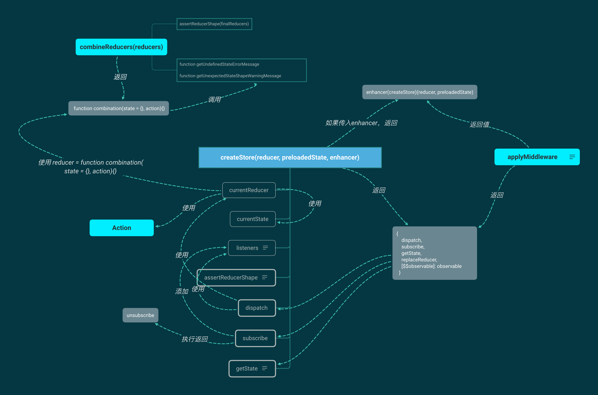

[TOC]

> **状态管理：**把组件之间需要共享的状态抽取出来，遵循特定的约定，统一来管理，让状态的变化可以预测。记录所有 store 中发生的 state 改变，同时实现能记录变更 (mutation)、保存状态快照、历史回滚/时光旅行的先进的调试工具。

## 一、Flux

> [知乎问答—尤雨溪](https://www.zhihu.com/question/33864532/answer/57657275)
>
> [Flux—官网](http://facebook.github.io/flux/docs/in-depth-overview/)

### 1. Flux 是什么？

Flux是Facebook用于构建客户端Web应用程序的应用程序架构，Flux的核心思想就是**数据和逻辑永远单向流动**，解决的核心问题，就是**数据在 React 应用中的流动方式及过程**。

视图层组件不允许直接修改应用状态，只能触发 action。应用的状态必须独立出来放到 store 里面统一管理，通过侦听 action 来执行具体的状态操作。

### 2. 基本概念

- **View**： 视图层
- **Action**（动作）：视图层发出的消息（比如mouseClick）
- **Dispatcher**（派发器）：注册Action，用来接收Actions、执行回调函数
- **Store**（数据层）：用来存放应用的状态，一旦发生变动，就提醒Views要更新页面

### 3. Action

每个Action都是一个对象，包含一个`actionType`属性（说明动作的类型）和一些其他属性（用来传递数据）。

```js
var ButtonActions = {
  addNewItem: function (text) {
    AppDispatcher.dispatch({
      actionType: 'ADD_NEW_ITEM',
      text: text
    });
  },
};
```

### 4. Dispatcher

Dispatcher 的作用是将 Action 派发到 Store。你可以把它看作一个路由器，负责在 View 和 Store 之间，建立 Action 的正确传递路线。Dispatcher 只能有一个，而且是全局的。

```js
AppDispatcher.register(function (action) {
  switch(action.actionType) {
    case 'ADD_NEW_ITEM':
      ListStore.addNewItemHandler(action.text);
      ListStore.emitChange();
      break;
    default:
      // no op
  }
})
```

### 5. Store

保存数据、逻辑处理、响应 Dispatcher、Store 从 `EventEmitter` 改变View

```javascript
// stores/ListStore.js
var EventEmitter = require('events').EventEmitter;
var assign = require('object-assign');

var ListStore = assign({}, EventEmitter.prototype, {
  items: [],

  getAll: function () {
    return this.items;
  },

  addNewItemHandler: function (text) {
    this.items.push(text);
  },

  emitChange: function () {
    this.emit('change');
  },

  addChangeListener: function(callback) {
    this.on('change', callback);
  },

  removeChangeListener: function(callback) {
    this.removeListener('change', callback);
  }
});
```

### 6. 运作流程


用户进行操作的时候，会从组件发出一个 action，这个 action 流到 store 里面，触发 store 对状态进行改动，然后 store 又触发组件基于新的状态重新渲染。

### 7. Flux 的缺点

- 一个应用可以拥有多个store，多个store直接可能有依赖关系（相互引用）；
- Store封装了数据和处理数据的逻辑。

## 二、Redux

### 1. Redux 做的改进

* 将模型的**更新逻辑**全部集中于一个特定的层（Flux 里的 store，Redux 里的 reducer）。
* **Redux 并没有 dispatcher 的概念**。它依赖纯函数来替代事件处理器。

- 在整个应用只提供**一个Store**，它是一个扁平的树形结构，一个节点状态应该只属于一个组件。
- 保持状态只读，不能修改老状态，只能返回一个新状态。
- 继承Flux基本原则：单向数据流。
- 只有纯函数能改变数据。

### 2. 场景

- View要从多个来源获取数据

- 某个组件的状态，需要共享
- 一个组件需要改变全局状态或者改变另一个组件的状态

### 3. 原则

1. 单一数据源，store

2. store只读，唯一能改store的方法是触发action，action是`动作行为的抽象`

3. 为了描述action如何改变state树，需要编写reducer函数。

   `reducer(state, action) => new state`

### 4. Action

Action 本质上是 JavaScript 普通对象。action 内必须使用一个字符串类型的 `type` 字段来表示将要执行的动作，同时可以自行定义其他任何字段。

> 应用规模越来越大时，可以使用一个文件来定义 action type 常量。

```js
{
  type: ADD_TODO,
  text: 'Build my first Redux app'
}
```

### 5. Action 创建函数

```js
function addTodo(text) {
  return {
    type: ADD_TODO,
    text
  }
}
```

### 6. Reducer

如何响应 [actions](http://cn.redux.js.org/docs/basics/Actions.html) 并发送到 store 。reducer 就是一个纯函数，**只要传入参数相同，返回计算得到的下一个 state 就一定相同。没有特殊情况、没有副作用，没有 API 请求、没有变量修改，单纯执行计算。**

**注意点：**

1. 不要修改 state。

2. 在 default 情况下返回旧的 state。

   > 可用于初始化

#### 6.1 设计 State 结构

把应用的 state 用对象描述。

```js
{
  visibilityFilter: 'SHOW_ALL',
  todos: [
    {
      text: 'Consider using Redux',
      completed: true,
    },
    {
      text: 'Keep all state in a single tree',
      completed: false
    }
  ]
}
```

#### 6.2 reducers

```js
// reducer
function visibilityFilter(state = SHOW_ALL, action) {
  switch (action.type) {
    case SET_VISIBILITY_FILTER:
      return action.filter
    default:
      return state
  }
}


// 各个 reducers 对应的 state 在最终的 "state" 里面用{visibilityFilter：xx， todos: xx}
// 联合reducers
function todoApp(state = {}, action) {
  return {
    visibilityFilter: visibilityFilter(state.visibilityFilter, action),
    todos: todos(state.todos, action)
  }
}

```

### 7. Store

维持应用的 state；

**通过 reducers 生成Store**

```js
// 通过 reducers 生成Store
let store = createStore(todoApp, window.STATE_FROM_SERVER)
```

**提供方法**

- 提供 [`getState()`](https://www.redux.org.cn/docs/api/Store.html#getState) 方法获取 state；
- 提供 [`dispatch(action)`](https://www.redux.org.cn/docs/api/Store.html#dispatch) 方法更新 state；
- 通过 [`subscribe(listener)`](https://www.redux.org.cn/docs/api/Store.html#subscribe) 注册监听器;
- 通过 [`subscribe(listener)`](https://www.redux.org.cn/docs/api/Store.html#subscribe) 返回的函数注销监听器。

**用例**

```js
// 打印初始状态
console.log(store.getState())

// 每次 state 更新时，打印日志
// 注意 subscribe() 返回一个函数用来注销监听器
const unsubscribe = store.subscribe(() =>
  console.log(store.getState())
)

// 发起一系列 action
store.dispatch(addTodo('Learn about actions'))
store.dispatch(addTodo('Learn about reducers'))
store.dispatch(addTodo('Learn about store'))
store.dispatch(toggleTodo(0))
store.dispatch(toggleTodo(1))
store.dispatch(setVisibilityFilter(VisibilityFilters.SHOW_COMPLETED))

// 停止监听 state 更新
unsubscribe();
```

### 8. 流程


Component 中出发一个动作，把对当前的动作的“动作描述”（Action）传入Store，Store根据相应的动作描述调用 Reducer,返回一个新的 State。

### 9. 原理



## 三、React Context

#### 1. **作用**

实现**跨层级**的组件间数据传递。避免props 层层传递。

#### 2. 实现

**两种组件**

* `Context`生产者(Provider)，通常是一个父节点。
* `Context`的消费者(Consumer)，通常是一个或者多个子节点。

#### 3. 使用

**创建**

```js
const {Provider, Consumer} = React.createContext(defaultValue);
```

**Context.Provider**

用于生产共享数据的地方。value:放置共享的数据。

```jsx
<Provider value={/*共享的数据*/}>
    /*里面可以渲染对应的内容*/
</Provider>
```

**Context.Consumer**

消费者，消费**Provider** 产生的数据。

```jsx
<Consumer>
  {value => 	/*根据上下文  进行渲染相应内容*/}
</Consumer>
```

**Class.contextType**

```jsx
class MyClass extends React.Component {
  static contextType = MyContext;
  render() {
    let value = this.context;
    /* 基于这个值进行渲染工作 */
  }
}
```

**局限性**

1. 在组件树中，如果中间某一个组件 ShouldComponentUpdate returning false 了，会阻碍 context 的正常传值，导致子组件无法获取更新。
2. 组件本身 extends React.PureComponent 也会阻碍 context 的更新。

**注意点**

1. Context 应该是唯一不可变的。

2. 组件只在初始化的时候去获取 Context。

3. 会使得组件的复用性变差。

4. **只是想避免层层传递一些属性可以使用组件组合（component composition）**

   ```jsx
   <Page user={user} avatarSize={avatarSize} />
   // ... 渲染出 ...
   <PageLayout user={user} avatarSize={avatarSize} />
   // ... 渲染出 ...
   <NavigationBar user={user} avatarSize={avatarSize} />
   // ... 渲染出 ...
   <Link href={user.permalink}>
     <Avatar user={user} size={avatarSize} />
   </Link>
   
   
   function Page(props) {
     const user = props.user;
     const userLink = (
       <Link href={user.permalink}>
         <Avatar user={user} size={props.avatarSize} />
       </Link>
     );
     return <PageLayout userLink={userLink} />;
   }
   
   // 现在，我们有这样的组件：
   <Page user={user} avatarSize={avatarSize} />
   // ... 渲染出 ...
   <PageLayout userLink={...} />
   // ... 渲染出 ...
   <NavigationBar userLink={...} />
   // ... 渲染出 ...
   {props.userLink}
   ```