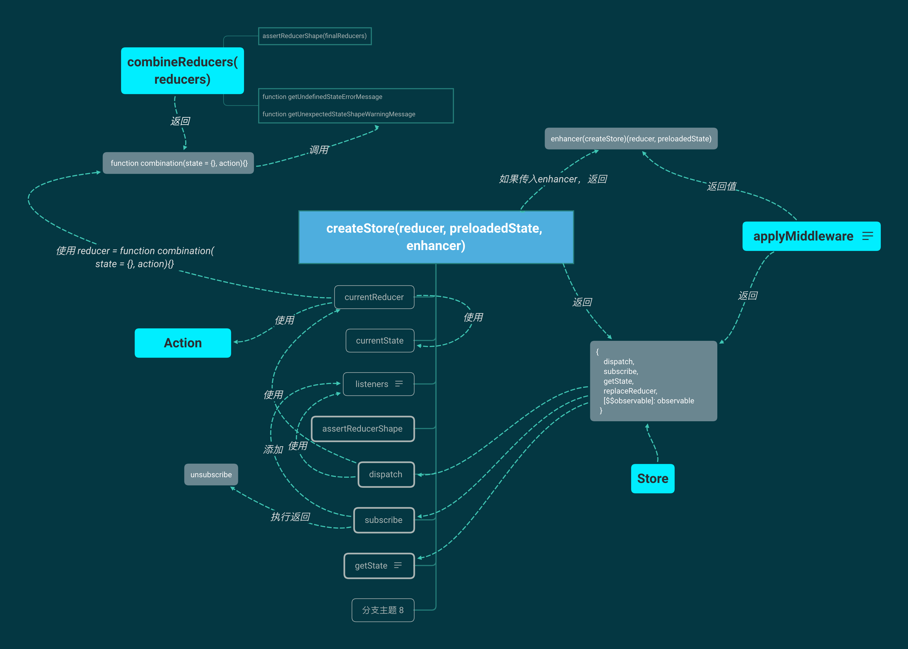
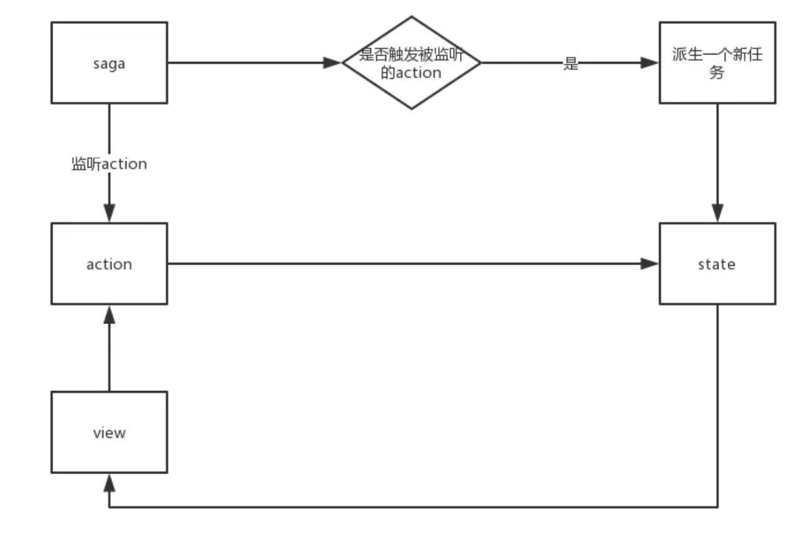

[TOC]

> **状态管理：**把组件之间需要共享的状态抽取出来，遵循特定的约定，统一来管理，让状态的变化可以预测。记录所有 store 中发生的 state 改变，同时实现能记录变更 (mutation)、保存状态快照、历史回滚/时光旅行的先进的调试工具。

## 一、Flux

> [知乎问答—尤雨溪](https://www.zhihu.com/question/33864532/answer/57657275)

### 1. Flux 是什么

Flux是Facebook用于构建客户端Web应用程序的应用程序架构。

**核心思想**：**数据和逻辑永远单向流动**。

**解决的核心问题**：**数据在 React 应用中的流动方式及过程**。

> 视图层组件不允许直接修改应用状态，只能触发 action。

### 2. 基本概念

Flux把一个应用分成了4个部分： *`View`* 、`Action`、 *`Dispatcher`*、` Store`。


> 用户进行操作的时候，会从组件发出一个 action，这个 action 流到 store 里面，触发 store 对状态进行改动，然后 store 又触发组件基于新的状态重新渲染。

#### 2.1 View

 视图层，View 可以是Vue的，也可以是 React的，或者其他的框架和技术。

#### 2.2 Store

存放应用的状态、逻辑处理、响应 Dispatcher。一般 Store 一旦发生改变，都会发送一个事件，比如 change，通知所有的订阅者，改变相应的View。View 可以通过订阅、监听或其他方式，不同的框架有不同的技术。反正 Store 变了，View 就会变。

```js
let ListStore = assign({}, EventEmitter.prototype, {
  items: [],
  getAll,
  addNewItemHandler,
  emitChange,
  addChangeListener,
  removeChangeListener,
});	
```

#### 2.3 Action

视图层发出的消息（比如mouseClick），可以理解为描述用户 “动作” 的的一个对象。

```js
// 包含一个`actionType`属性（说明动作的类型）和一些其他属性（用来传递数据）
{
  	actionType: 'ADD_NEW_ITEM',
    **： **,
}
```

#### 2.4 Dispatcher

派发器，注册Action，用来接收Actions、执行回调函数。可以把它看作一个路由器，负责在 View 和 Store 之间，建立 Action 的正确传递路线。

Flux 要求，View 要想修改 Store，必须经过一套流程。视图先要告诉 Dispatcher，让 Dispatcher dispatch 一个 action，Dispatcher 就像是个中转站或路由器，收到 View 发出的 action，然后转发给 Store。

```js
AppDispatcher.register(function (action) {
  switch(action.actionType) {
    case 'ADD_NEW_ITEM':
      ListStore.addNewItemHandler(action.text);
      ListStore.emitChange();
      break;
    default:
      // no op
  }
})
AppDispatcher.dispatch
```

### 3. 注意点

* Dispatcher 的作用是接收**所有**的 Action，然后发给**所有**的 Store。
* Action 可能是 View 触发的，也有可能是其他地方触发的，比如测试用例。
*  Store 的改变只能通过 Action，不能通过其他方式。也就是说 Store 不应该有公开的 Setter，所有 Setter 都应该是私有的，只能有公开的 Getter。
* 具体 Action 的处理逻辑一般放在 Store 里。

### 4. Flux 的缺点

**个人理解**

- 一个应用拥有多个store，不利于管理。多个store之间可能有依赖关系（相互引用）。
- Store封装了数据和处理数据的逻辑，使得store显得非常臃肿，代码混乱，不利于维护。

**其他**：

> 大家可以参考Stack Overflow一个问答，[Why use Redux over Facebook Flux? ](https://stackoverflow.com/questions/32461229/why-use-redux-over-facebook-flux)
>
> 下列列出关键点：

* Reducer Composition

  **Flux使得跨Store重用功能变得不自然。**

  * 继承公共Store（使用继承时将自己锁定到特定设计中）。
  * 从内部调用外部定义的函数事件处理程序，需要以某种方式操作Flux存储的私有状态。整件事情很混乱。

* Server Rendering

* Developer Experience

  时空穿越、查看应用数据状态困难。

* Simplicity

  引入 Dispatcher 和 (EventEmitter)Store注册，没有保持“简单”的特性。

## 二、Redux

### 1. Redux 是什么

Redux 是 JavaScript 状态容器，提供可预测化的状态管理。其实就是 Flux 架构的一种实现，并在flux的基础上面做出了一些改进。

**原则：**

* 单一数据源，store。

* store只读，唯一能改store的方法是触发action，action是`动作行为的抽象`。

* 使用纯函数来执行修改。为了描述action如何改变state树，需要编写reducer函数。

### 2. 改进

* Redux 单一数据源，Flux 的数据源可以是多个。Flux 每个 Store 只对对应的 View 负责，每次更新都只通知对应的View。
*  **Redux 设想你永远不会变动你的数据**， State 是只读的，不能修改老状态，只能返回一个新状态。Flux 的 State 可以随便改。

* 两者Store 的**更新逻辑**全部集中于一个特定的层，Flux 里的 store，Redux 里的 reducer。
* **Redux 并没有 dispatcher 的概念**，集成在 Store 里面，依赖纯函数来替代事件处理器。

### 3. 使用场景

- View要从多个来源获取数据。
- 某个组件的状态，需要共享。
- 一个组件需要改变全局状态或者改变另一个组件的状态。

### 4. 基本概念

Redux 有三个核心概念：`Store`、`Reducer`、`Action`。


> 用户通过 View 发出 Action（`store.dispatch(action)`），然后 Store 自动调用 Reducer，返回新的 State 。State 一旦有变化，Store 就会调用监听函数（触发重新渲染 View）。

#### 4.1 Reducer

响应 Actions发送到 store ，reducer 就是一个纯函数。

Redux 没有 Dispatcher 的概念，Store 里面已经集成了 dispatch 方法，store.dispatch()是 View 发出 Action 的唯一方法。

Redux 用 Reducer 来处理事件。Store 收到 Action 以后，必须给出一个**新的 State**。这个 State 的计算过程就叫做 Reducer。

> 不修改 state，在 default 情况下返回旧的 state（可用于初始化）。

**纯函数作用**：

只要传入参数相同，返回计算得到的下一个 state 就一定相同。没有特殊情况、没有副作用，没有 API 请求、没有变量修改，单纯执行计算。

#### 4.2 Store

Redux 里面只有一个 Store，整个应用的数据都在这个大 Store 里面。Store 的 State 不能直接修改，每次只能返回一个新的 State。Redux 通过一个 createStore 函数来生成 Store。

```js
// 通过 reducers 生成Store
let store = createStore(todoApp, window.STATE_FROM_SERVER)
```

**提供方法**：

- 提供 [`getState()`](https://www.redux.org.cn/docs/api/Store.html#getState) 方法，获取 state；
- 提供 [`dispatch(action)`](https://www.redux.org.cn/docs/api/Store.html#dispatch) 方法，更新 state；
- 通过 [`subscribe(listener)`](https://www.redux.org.cn/docs/api/Store.html#subscribe) ，注册监听器;
- 通过 [`subscribe(listener)`](https://www.redux.org.cn/docs/api/Store.html#subscribe) ，返回的函数注销监听器。

Store 可以使用 store.subscribe 方法设置监听函数，一旦 State 发生变化，就自动执行这个函数。这样不管 View 是用什么实现的，只要把 View 的更新函数 subscribe 一下，就可以实现 State 变化之后，View 自动渲染了。比如在 React 里，把组件的render方法或setState方法订阅进去就行。

#### 4.3 Action

同Flux。action 内必须使用一个字符串类型的 `type` 字段来表示将要执行的动作，同时可以自行定义其他任何字段。

> 应用规模越来越大时，可以使用一个文件来定义 action type 常量。

```js
{
  type: ADD_TODO,
  text: 'Build my first Redux app'
}
```

Redux 可以用 Action Creator 批量来生成一些 Action。

### 5. 基本使用/创建

#### 5.1 Action

```js
const ADD_TODO = 'ADD_TODO'

// action
{
  type: ADD_TODO,
  text: 'Build my first Redux app'
}
```

**注意点：**

* 当应用规模越来越大时，建议使用单独的模块或文件来存放 action。
* 大型应用使用单独的文件定义 action type 常量。
* **尽量减少在 action 中传递的数据**。

**Action 创建函数**

action 创建函数更容易被移植和测试。

```js
// 可以根据不同的 text 创建 action。
function actionCreator(value) {
  return {
    type: **,
    key: value,
  }
}
```

#### 5.2 Reducer

**设计 State 结构**

在 Redux 应用中，所有的 state 都被保存在一个单一对象中。建议在写代码前先想一下这个对象的结构。

```js
{
  visibilityFilter: 'SHOW_ALL',
  todos: [
    {
      text: 'Consider using Redux',
      completed: true,
    },
    {
      text: 'Keep all state in a single tree',
      completed: false
    }
  ]
}
```

**基本结构**

```js
(previousState, action) => newState
```

**指定 state 的初始状态**

```js
function reducerName(state = initialState, action) {
  return state
}
```

**处理多个 action**

根据不同的action.type 返回不同的 新的状态。

```js
function reducerName(state = initialState, action) {
  switch (action.type) {
    case **:
      return // ...
    case **:
      return // ...
    default:
      return state
  }
}
```

**拆分 Reducer**

解决代码冗长，根据不同的数据类型。

比如 todo：

1. 当前选中的任务过滤条件。
2. 完整的任务列表。

```js
function visibilityFilter(state = initState, action) { // ... }

function todos(state = initState, action) { // ... }
```

> 随着应用的膨胀，我们还可以将拆分后的 reducer 放到不同的文件中, 以保持其独立性并用于专门处理不同的数据域。

**生成主 Reducer**

主 reducer，它调用多个子 reducer 分别处理 state 中的一部分数据，然后再把这些数据合成一个大的单一对象。主 reducer 并不需要设置初始化时完整的 state。初始时，如果传入 `undefined`, 子 reducer 将负责返回它们的默认值。

```js
// 各个 reducers 对应的 state 在最终的 "state" 里面用{visibilityFilter：xx， todos: xx}
// 联合reducers
function todoApp(state = {}, action) {
  return {
    visibilityFilter: visibilityFilter(state.visibilityFilter, action),
    todos: todos(state.todos, action),
  }
}
  
const todoApp = combineReducers({
  visibilityFilter,
  todos,
})
```


#### 5.3. Store

**用例**

```js
// 创建 Store
let store = createStore(Reducers);

// 获取初始状态
store.getState()

// 每次 state 更新时，打印日志
// 注意 subscribe() 返回一个函数用来注销监听器
const unsubscribe = store.subscribe(() =>
  console.log(store.getState())
)

// 发起一系列 action
store.dispatch(actionCreator(data))

// 停止监听 state 更新
unsubscribe();
```

### 6. Redux实例

> [Redux · GitBook —— TODO](http://cn.redux.js.org/docs/basics/Actions.html)

TODO 应用的状态管理，数据类型：TODO项、可见性。

#### `actions.js`

```js
/*
 * action 类型
 */

export const ADD_TODO = 'ADD_TODO'
export const TOGGLE_TODO = 'TOGGLE_TODO'
export const SET_VISIBILITY_FILTER = 'SET_VISIBILITY_FILTER'

/*
 * 其它的常量
 */

export const VisibilityFilters = {
  SHOW_ALL: 'SHOW_ALL',
  SHOW_COMPLETED: 'SHOW_COMPLETED',
  SHOW_ACTIVE: 'SHOW_ACTIVE'
}

/*
 * action 创建函数
 */

export function addTodo(text) {
  return { type: ADD_TODO, text }
}

export function toggleTodo(index) {
  return { type: TOGGLE_TODO, index }
}

export function setVisibilityFilter(filter) {
  return { type: SET_VISIBILITY_FILTER, filter }
}
```

#### `reducers.js`

```js
import { combineReducers } from 'redux'
import {
  ADD_TODO,
  TOGGLE_TODO,
  SET_VISIBILITY_FILTER,
  VisibilityFilters
} from './actions'
const { SHOW_ALL } = VisibilityFilters

// 任务过滤条件的 reducer
function visibilityFilter(state = SHOW_ALL, action) {
  switch (action.type) {
    case SET_VISIBILITY_FILTER:
      return action.filter
    default:
      return state
  }
}

// 任务列表的 reducer
function todos(state = [], action) {
  switch (action.type) {
    case ADD_TODO:
      return [
        ...state,
        {
          text: action.text,
          completed: false
        }
      ]
    case TOGGLE_TODO:
      return state.map((todo, index) => {
        if (index === action.index) {
          return Object.assign({}, todo, {
            completed: !todo.completed
          })
        }
        return todo
      })
    default:
      return state
  }
}

// 生成  主reducer
const todoApp = combineReducers({
  visibilityFilter,
  todos
})

export default todoApp
```

#### `index.js`

```js
import {
  addTodo,
  toggleTodo,
  setVisibilityFilter,
  VisibilityFilters
} from './actions'
import { createStore } from 'redux'
import todoApp from './reducers'

// 创建Store
let store = createStore(todoApp)

// 打印初始状态
console.log(store.getState())

// 每次 state 更新时，打印日志
// 注意 subscribe() 返回一个函数用来注销监听器
const unsubscribe = store.subscribe(() => console.log(store.getState()))

// 发起一系列 action
store.dispatch(addTodo('Learn about actions'))
store.dispatch(addTodo('Learn about reducers'))
store.dispatch(addTodo('Learn about store'))
store.dispatch(toggleTodo(0))
store.dispatch(toggleTodo(1))
store.dispatch(setVisibilityFilter(VisibilityFilters.SHOW_COMPLETED))

// 停止监听 state 更新
unsubscribe()
```

#### 结果


#### 目录结构


### 7. 原理



## 三、React Context

### 1. **作用**

Context 通过组件树提供了一个传递数据的方法，实现**跨层级的组件间**数据传递。避免props 层层传递。

### 2. API

* **`React.createContext`：**创建一个上下文的容器(context), defaultValue可以设置共享的默认数据

  ```jsx
  const {Provider, Consumer} = React.createContext(defaultValue);
  ```

* **`Context.Provider`(生产者)**: 用于生产共享数据（value）的地方。

  ```jsx
  <Provider value={/*共享的数据*/}>
      /*里面可以渲染对应的内容*/
  </Provider>
  ```

  Provider 接收一个 `value` 属性，传递给消费组件。

  **注意点：**

  * 一个 Provider 可以和多个消费组件有对应关系。
  * 多个 Provider 也可以嵌套使用，里层的会覆盖外层的数据。

  * 当 Provider 的 `value` 值发生变化时，它内部的所有消费组件都会重新渲染。Provider 及其内部 consumer 组件都不受制于 `shouldComponentUpdate` 函数，因此当 consumer 组件在其祖先组件退出更新的情况下也能更新。
  * 将 `undefined` 传递给 Provider 时，消费组件的 `defaultValue` 不会生效。

* **`Class.contextType`**: 

  ```jsx
  class MyClass extends React.Component {
    componentDidMount() {let value = this.context;}
    componentDidUpdate() {let value = this.context;}
    componentWillUnmount() {let value = this.context;}
    render() {let value = this.context;}
  }
  MyClass.contextType = MyContext;
  ```

  挂载在 Class 上的 `contextType` 属性会被重赋值为一个由 `React.createContext()` 创建的 Context 对象。可以使用 `this.context` 来消费最近 Context 上的那个值。
  **注意点：**

  * 可以在任何生命周期中访问到。

* **`Context.Consumer`(消费者)**:这个可以理解为消费者。 他是专门消费供应商(**Provider** 上面提到的)产生数据。Consumer需要嵌套在生产者下面。

  ```jsx
  <Consumer>
    {value => /*根据上下文  进行渲染相应内容*/}
  </Consumer>
  ```

  * 传递给函数的 `value` 值等同于往上组件树离这个 context 最近的 Provider 提供的 `value` 值。
  * 如果没有对应的 Provider，`value` 参数等同于传递给 `createContext()` 的 `defaultValue`。

### 3. 使用例子

**父组件定义一个`name`，子组件和子孙组件获取name。**

#### **App.js 父组件**

```js
import React from 'react';
import Son from './son';//引入子组件

// 创建一个 Context,
export const {Provider,Consumer} = React.createContext("默认名称");

export default class App extends React.Component {
    render() {
        let name ="小人头"; // 共享数据
        return (
          	// Provider共享容器 接收一个name属性
            <Provider value={name}>
                <div style={{border:'1px solid red',width:'30%',margin:'50px auto',textAlign:'center'}}>
                    <p>父组件定义的值:{name}</p>
                    <Son />
                </div>
            </Provider>
        );
    }
}
```

#### son.js 子组件

```js
import React from 'react';
import { Consumer } from "./index";//引入父组件的Consumer容器
import Grandson from "./grandson.js";//引入子组件
function Son(props) {
    return (
        //Consumer容器,可以拿到上文传递下来的name属性,并可以展示对应的值
        <Consumer>
            {( name ) =>
                <div style={{ border: '1px solid blue', width: '60%', margin: '20px auto', textAlign: 'center' }}>
                    <p>子组件。获取父组件的值:{name}</p>
                    {/* 孙组件内容 */}
                    <Grandson />
               </div>
            }
        </Consumer>
    );
}
export default Son;
```

#### grandson.js 孙组件

```js
//grandson.js 孙类
import React from 'react';
import { Consumer } from "./index";//引入父组件的Consumer容器
function Grandson(props) {
    return (
         //Consumer容器,可以拿到上文传递下来的name属性,并可以展示对应的值
        <Consumer>
            {(name ) =>
                   <div style={{border:'1px solid green',width:'60%',margin:'50px auto',textAlign:'center'}}>
                   <p>孙组件。获取传递下来的值:{name}</p>
               </div>
            }
        </Consumer>
    );
}
export default Grandson;
```

#### 结果


### 4. **注意点**

1. **应用场景**：*很多*不同层级的组件需要访问同样一些的数据。

2. 会使得组件的复用性变差。

3. 组件本身 extends React.PureComponent 也会阻碍 context 的更新。

4. **只是想避免层层传递一些属性可以使用组件组合（component composition）**

   **层层传递**

   ```jsx
   <Page user={user} avatarSize={avatarSize} />
   // ... 渲染出 ...
   <PageLayout user={user} avatarSize={avatarSize} />
   // ... 渲染出 ...
   <NavigationBar user={user} avatarSize={avatarSize} />
   // ... 渲染出 ...
   <Link href={user.permalink}>
     <Avatar user={user} size={avatarSize} />
   </Link>
   ```

   **组合组件**

   ```jsx
   function Page(props) {
     const user = props.user;
     // 将原来的 Link 和 Avatar 组件组合在一起，并通过 props 传递下去。
     const userLink = (
       <Link href={user.permalink}>
         <Avatar user={user} size={props.avatarSize} />
       </Link>
     );
     return <PageLayout userLink={userLink} />;
   }
   
   // 现在，我们有这样的组件：
   <Page user={user} avatarSize={avatarSize} />
   // ... 渲染出 ...
   <PageLayout userLink={...} />
   // ... 渲染出 ...
   <NavigationBar userLink={...} />
   // ... 渲染出 ...
   {props.userLink}
   ```

## 四、Redux-saga

### 1. Redux-saga 是什么

`redux-saga` 是一个用于管理应用程序 Side Effect（副作用，例如异步获取数据，访问浏览器缓存等）的 library，是一个 redux 中间件（访问完整的 redux state，也可以 dispatch redux action）。redux-saga 使用了 ES6 的 Generator 功能。

>  **作用：**让副作用管理更容易，执行更高效，测试更简单，在处理故障时更容易。

**怎么处理异步？**：

* **思路一：**把异步请求部分放在了 action creator 中，根据不同的请求救过创建不同的action。
  
  * redux-thunk
  * redux-promise
* **思路二：**

  把所有的异步操作看成“线程”，可以通过普通的action去触发它，当操作完成时也会触发action作为输出。（**对action进行监听，接收到action时,派发一个任务（也会触发action）维护state。**）

  * redux-saga

### 2. 辅助函数/概念

**辅助函数：**

* **takeEvery**：action 被触发时，允许多个 “**任务**”同时启动, 在某个特定时刻, 尽管之前还有一个或多个“**任务**”尚未结束, 我们还是可以启动一个新的“**任务**”。

* **takeLatest**：action 被触发时，只允许一个 “**任务**” 在执行，这个“**任务**”是最后被启动的那个。

  ```js
  export default function* rootSaga() {
    yield takeEvery('FETCH_USERS', fetchUsers)
    yield takeLatest('CREATE_USER', createUser)
  }
  ```


**概念**：

* **saga**: 就是用 **"*"** 注册的函数,一个函数就是一个saga。

* **Effects**：Sagas 都用 Generator 函数实现。我们在 Generator 里 yield 纯 JavaScript 对象以表达 Saga 逻辑。 我们称呼那些对象为 *Effect*。Effect包含了一些给 middleware 解释执行的信息（可以把 Effect 看作是发送给 middleware 的指令以执行某些操作）

  可以使用 `redux-saga/effects` 包里提供的函数来创建 Effect，如下：

  1. **`call`**: 创建一个纯文本对象描述函数调用。`redux-saga` middleware 确保执行函数调用并在响应被 resolve 时恢复 generator。
  2. **`take`**: 创建一个effect的描述信息,用来命令middleware在Store上等待指定action,在发起与他相匹配的action之前,Generator将暂停.
  3. **`put`**: 类似dispatch方法,触发一个action,用来命令middleware向Store发起一个action请求,而且是非阻塞的。
  4. **`fork`**: 非阻塞的,遇到它不需要等待他执行完毕,就可以继续往下执行,fork返回的是一个任务,可以被取消。
  5. **`cancel`**: 针对fork方法返回的任务,进行取消。

### 3. 运行流程图



### 4. 使用例子

#### 4.1 基本使用

**`Index.js`**

```js
import { createStore, applyMiddleware } from 'redux'
import createSagaMiddleware from 'redux-saga'

//引入saga文件。
import { rootSaga } from './rootSaga'

//使用 redux-saga 模块的 createSagaMiddleware 工厂函数来创建一个 Saga middleware。
const sagaMiddleware = createSagaMiddleware();

//使用 applyMiddleware 添加 sagaMiddleware 中间件。
const middlewares = [ sagaMiddleware ];

// 创建 Store
const store = createStore(rootReducer, applyMiddleware(...middlewares));

// 使用 saga 中间件运行 rootSaga。
sagaMiddleware.run(rootSaga);
```

**`rootSaga.js`**

```js
import { takeEvery } from 'redux-saga/effects'
import Api from './path/to/api'
import { call, put } from 'redux-saga/effects'

//监听如果有一个调用PRODUCTS_REQUESTED 的action的话,就会匹配到第二个参数所代表的effect
function* rootSaga() {
  yield takeEvery('PRODUCTS_REQUESTED', fetchProducts)
  yield takeLatest('OTHERS_REQUESTED', fetchOthers)
}

//call(fn, ...args) 创建一条描述结果的信息就像在 Redux 里你使用 action 创建器，创建一个将被 Store 执行的、描述 action 的纯文本对象。
function* fetchProducts() {
  // 使用 try/catch 的方式捕获saga的错误信息
  try {
    const products = yield call(Api.fetch, '/products')
    // 创建并 yield 一个 dispatch Effect
    yield put({ type: 'PRODUCTS_RECEIVED', products })
  }catch(error) {
    yield put({ type: 'PRODUCTS_REQUEST_FAILED', error })
  }
  
}

function* fetchOthers() {
  // ...
}
```

#### 4.2 无阻塞调用-fork

fork一个任务,任务会在后台启动,调用者也可以继续它的流程,而不用等待被fork的任务执行结束 当我们需要有并发操作的时候,使用call effect会阻塞saga的执行,使用fork就不需要关心被阻塞,或者等待结果返回在继续执行

```js
const result = yield fork (saga,param)
```

#### 4.3 同时执行多个任务

当需要同步执行多个任务,需要把yield一个包含了effect的数组,Generator将会阻塞,等所有的effect都执行完毕。

```js
const [users, repos] = yield [
  call(fetch, '/users'),
  call(fetch, '/repos')
]
```
