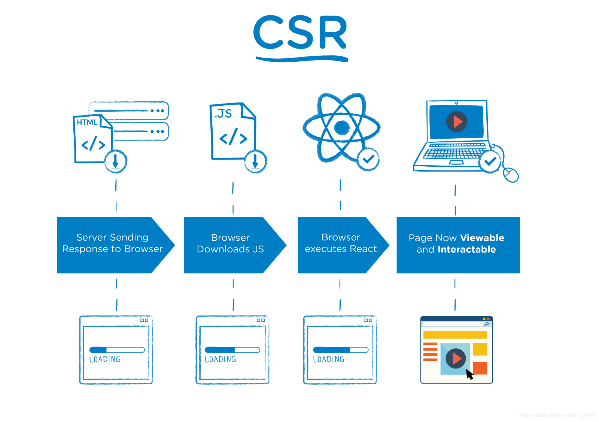
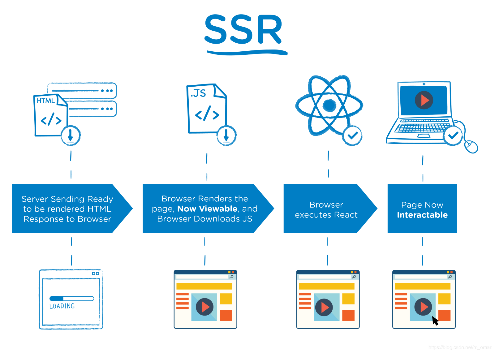

[TOC]
> ***主要参考：***
>
> 1. [“服务端渲染”吊打“客户端渲染”的那些事（The Benefits of Server Side Rendering Over Client Side Rendering）](<https://w3ctech.com/topic/2005>)
>
> 2. [从0开始，搭建Vue2.0的SSR服务端渲染](https://www.jianshu.com/p/c6a07755b08d)

## 1. 概述 ##

### 1.1 SSR 原因 ###

1. 提升页面性能（首屏渲染）
2. 对页面SEO性能优化

简而言之就是服务端渲染能够直接返回比较完整的HTML文件，浏览器便能直接渲染出页面，使得在下载js文件运行的时候，页面已经显示，没有那么容易白屏！

### 1.2 SSR注意点 ###

1. 虽然能够很快渲染出页面，但是没有执行客户端文件（**client.bundle.js**）时页面无法进行交互
2. 获取第一个字节时会更加慢一点，由于ssr需要将完整的渲染过的文件传回browser，而csr只需要返回字节相对较少的json文件即可
3. 使用SSR方式渲染HTML页面的过程中，服务器的吞吐量会明显少于用CSR渲染HTML页面时服务器的吞吐量。

### 1.3 预渲染 ###

[预渲染实践](<https://www.jianshu.com/p/0b3742988475>)

**改善少数营销页面的SEO**, 核心是使用 [prerender-spa-plugin](https://github.com/chrisvfritz/prerender-spa-plugin)，

### 1.4 预渲染 和 服务端渲染区别 ###

**预渲染**使用场景更多的时我们所说的**静态页面**的形成，而**服务端渲染**适用于**大型的、与服务端有数据交互的功能型网站**，一个明显的使用场景就是**电商网站**。

### 1.3 CSR、SSR ###





Google 和 Bing 可以很好对同步 JavaScript 应用程序进行索引

SEO优化，SSR和预渲染

## 2. 配置 ##

[从0开始，搭建Vue2.0的SSR服务端渲染](https://www.jianshu.com/p/c6a07755b08d)

[文件夹——vue-ssr-demo](./vue-ssr-demo)

> **我们使用服务端渲染是为了弥补单页面应用SEO能力不足的问题因此，实际上我们第一次在浏览器地址栏输入url，并且得到返回页面之后，所有的操作仍然是单页面应用在控制。我们所做的服务端渲染，只是在平时返回的单页面应用html上增加了对应路由的页面信息，好让爬虫获取到而已**

## 3. 总结个人口水话 ##

（1）、**服务端入口文件**
根据**不同的路由信息** 渲染 **对应路由下的组件**，并且 **请求得到相应的store state数据**，通过 **`JSON.stringfy`** 把state数据放入渲染好的 `HTML`页面 返回对应路由下面的页面

（2）、**客户端入口文件**
将客户端的入口文件打包后，**通过渲染后端的HTML页面**引入, 该入口文件判断是否有 服务端传入的 `state`

```js
if (window.__INITIAL_STATE__) {
  store.replaceState(window.__INITIAL_STATE__)
}
```

