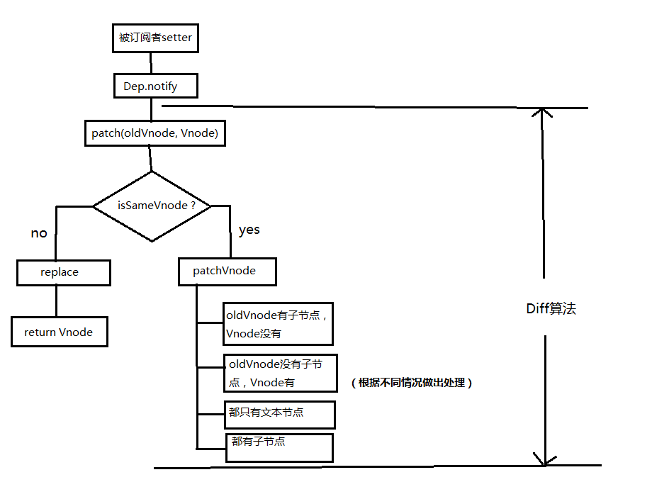

> [Vue diff算法思路](<https://blog.csdn.net/qq_18223479/article/details/83995939>)
>
> [析vue2.0的diff算法](https://segmentfault.com/a/1190000008782928)
>
> [Vue列表渲染中的key值的重要性](<https://www.jianshu.com/p/a634eb3c19c2>)
>
> [详解vue的diff算法](https://juejin.im/post/5affd01551882542c83301da) — main



vue的diff算法用于**视图更新**，也可以说是dom更新。俗话说有对比才有差距，vue也是通过将dom前后进行对比，再进行更新。dom是树状结构，因此对比过程中需要先将它化成对象的形式（虚拟dom）如：

```js
var Vnode = {
    tag: 'div',
    children: [
        { tag: 'p', text: '123' }
    ]
};
```

**对比是逐层进行的**，源码中调用**patch方法**（给dom打补丁,代码只保留核心部分）

```js
function patch (oldVnode, vnode) {
    // some code
    if (sameVnode(oldVnode, vnode)) { // 进一步判断，判断是否需要替换子节点，如果替换又需要替换哪些子节点
    	patchVnode(oldVnode, vnode)
    } else { // 用新的节点替换旧节点
    	const oEl = oldVnode.el // 当前oldVnode对应的真实元素节点
    	let parentEle = api.parentNode(oEl)  // 父元素
    	createEle(vnode)  // 根据Vnode生成新元素
    	if (parentEle !== null) {
            api.insertBefore(parentEle, vnode.el, api.nextSibling(oEl)) // 将新元素添加进父元素
            api.removeChild(parentEle, oldVnode.el)  // 移除以前的旧元素节点
            oldVnode = null
    	}
    }
    // some code 
    return vnode
}
```

判断两节点是否值得比较，值得比较则执行`patchVnode`：

```js
function sameVnode (a, b) {
  return (
    a.key === b.key &&  // key值
    a.tag === b.tag &&  // 标签名
    a.isComment === b.isComment &&  // 是否为注释节点
    // 是否都定义了data，data包含一些具体信息，例如onclick , style
    isDef(a.data) === isDef(b.data) &&  
    sameInputType(a, b) // 当标签是<input>的时候，type必须相同
  )
}
```

**如果不相同，就直接用新的节点替换旧节点。如果相同，就要进一步判断，判断是否需要替换子节点，如果替换又需要替换哪些子节点。**源码中调用patchVnode方法：

```js
patchVnode (oldVnode, vnode) {
  	// 找到对应的真实dom，称为el
    const el = vnode.el = oldVnode.el 
    let i, oldCh = oldVnode.children, ch = vnode.children // 获取对应子节点
    
    // 判断Vnode和oldVnode是否指向同一个对象，如果是，那么直接return
    if (oldVnode === vnode) return 
  	// 如果他们都有文本节点并且不相等，那么将el的文本节点设置为Vnode的文本节点。
    if (oldVnode.text !== null && vnode.text !== null && oldVnode.text !== vnode.text) {
        api.setTextContent(el, vnode.text) 
    }
  	// 两个节点都有子节点，进一步判断如何更新子节点
  	else {
        updateEle(el, vnode, oldVnode)  
        if (oldCh && ch && oldCh !== ch) {
            updateChildren(el, oldCh, ch) // 如果两者都有子节点，则执行updateChildren函数比较子节点，这一步很重要
        } else if (ch){ // 如果oldVnode没有子节点而Vnode有，则将Vnode的子节点真实化之后添加到el
            createEle(vnode)
        } else if (oldCh){ // 如果oldVnode有子节点而Vnode没有，则删除el的子节点
            api.removeChildren(el)
        }
    }
}
```

其他情况都比较好处理，但是当两个节点都有子节点时，判断的情况稍微多一点。updateChildren源码：

```js
updateChildren (parentElm, oldCh, newCh) {
    let oldStartIdx = 0, newStartIdx = 0
    let oldEndIdx = oldCh.length - 1
    let oldStartVnode = oldCh[0]
    let oldEndVnode = oldCh[oldEndIdx]
    let newEndIdx = newCh.length - 1
    let newStartVnode = newCh[0]
    let newEndVnode = newCh[newEndIdx]
    let oldKeyToIdx
    let idxInOld
    let elmToMove
    let before
    while (oldStartIdx <= oldEndIdx && newStartIdx <= newEndIdx) {
      	// 判断 4 个指针是不是为空，为空只移动指针位置
        if (oldStartVnode == null) {   // 对于vnode.key的比较，会把oldVnode = null
            oldStartVnode = oldCh[++oldStartIdx] 
        }else if (oldEndVnode == null) {
            oldEndVnode = oldCh[--oldEndIdx]
        }else if (newStartVnode == null) {
            newStartVnode = newCh[++newStartIdx]
        }else if (newEndVnode == null) {
            newEndVnode = newCh[--newEndIdx]
        }else if (sameVnode(oldStartVnode, newStartVnode)) {
            patchVnode(oldStartVnode, newStartVnode)
          	// 改变指针位置
            oldStartVnode = oldCh[++oldStartIdx]
            newStartVnode = newCh[++newStartIdx]
        }else if (sameVnode(oldEndVnode, newEndVnode)) {
            patchVnode(oldEndVnode, newEndVnode)
	          // 改变指针位置
            oldEndVnode = oldCh[--oldEndIdx]
            newEndVnode = newCh[--newEndIdx]
        }else if (sameVnode(oldStartVnode, newEndVnode)) {
            patchVnode(oldStartVnode, newEndVnode)
          	// 真实dom中的第一个节点会移到最后
            api.insertBefore(parentElm, oldStartVnode.el, api.nextSibling(oldEndVnode.el))
          	// 改变指针位置
            oldStartVnode = oldCh[++oldStartIdx]
            newEndVnode = newCh[--newEndIdx]
        }else if (sameVnode(oldEndVnode, newStartVnode)) {
            patchVnode(oldEndVnode, newStartVnode)
          	// 真实dom中的最后一个节点会移到最前
            api.insertBefore(parentElm, oldEndVnode.el, oldStartVnode.el)
          	// 改变指针位置
            oldEndVnode = oldCh[--oldEndIdx]
            newStartVnode = newCh[++newStartIdx]
        }else { // 上面情况都不匹配时
            if (oldKeyToIdx === undefined) {
              	// 根据oldChild的key生成一张hash表
                oldKeyToIdx = createKeyToOldIdx(oldCh, oldStartIdx, oldEndIdx)
            }
          	
          	// 用S的key与hash表做匹配
            idxInOld = oldKeyToIdx[newStartVnode.key]
          	
          	// 匹配失败
            if (!idxInOld) {
              	// 将newStartVnode生成对应的节点插入到dom中对应的oldS位置
                api.insertBefore(parentElm, createEle(newStartVnode).el, oldStartVnode.el)
                newStartVnode = newCh[++newStartIdx]
            }
          	// 匹配成功
            else {
              	// 匹配的dom。
                elmToMove = oldCh[idxInOld]
              	// newStartVnode和匹配节点不是sameNode
                if (elmToMove.sel !== newStartVnode.sel) {
                // 将newStartVnode生成对应的节点插入到dom中对应的oldS位置，oldS和S指针向中间移动。
                    api.insertBefore(parentElm, createEle(newStartVnode).el, oldStartVnode.el)
                }else { // sameNode
                  	// 在真实dom中将成功的节点移到最前面，
                    patchVnode(elmToMove, newStartVnode)
                    oldCh[idxInOld] = null
                    api.insertBefore(parentElm, elmToMove.el, oldStartVnode.el)
                }
                newStartVnode = newCh[++newStartIdx]
            }
        }
    }
  	// 将多余的newCh根据index添加到dom中去（如上图）
    if (oldStartIdx > oldEndIdx) {
        before = newCh[newEndIdx + 1] == null ? null : newCh[newEndIdx + 1].el
        addVnodes(parentElm, before, newCh, newStartIdx, newEndIdx)
    }
  	// 在真实dom中将区间为[oldS, oldE]的多余节点删掉
  	else if (newStartIdx > newEndIdx) {
        removeVnodes(parentElm, oldCh, oldStartIdx, oldEndIdx)
    }
}
```

源码有点长，简单来说，就是**用指针的方式把新旧节点的子节点的首尾节点标记**，即`oldStartIndex(1)，oldEndIndex(2)，newStartIndex(3), newEndIndex(4)`（英文太长用1 2 3 4顺序标记）依次比较13，14，23，24。这样会出现四种情况

1. **13**
   * 相同，那么就会**调用`patchVnode`方法，继续判断这两个节点的子节点，**同时oldStartIndex，newStartIndex指向下个节点
   * 不相同，继续其他的比较，只要有一个比较相同，就会跳出。

2. **14**
   * 相同的话就把**newEl插到oldEl（真实dom）前面**
   * 不相同的话继续比较。
3. **23**
   * 相同的话就把**newEl插到oldEl后面**
   * 不相同还是继续比
4. **24**
   * 相同的话就**调用patchVnode方法，继续判断这两个节点的子节点，同时oldEndIndex，newEndIndex指向上个节点。**

## 其他

### `diff` 函数

* 调用 `walk`，进行深度优先遍历

### `walk` 函数

> 最后如果　`patch`　存在，说明有更新，将补丁放入对应位置
> `patches[index] = patch`

* 是否相等 `newNode === oldNode`
* 旧节点不存在，直接插入
* 新节点不存在，删除旧节点
* 新节点是 `VNode`， `isVNode(newNode)`
  * 旧节点也是 `VNode`，相同类型节点的 diff
    * 新老节点的　`tag` 和 `key` 属性相同
      * 新老节点属性的对比
      * 新老节点子节点的对比，调用 `diffChildren`
  * 旧节点不是 `VNode`，新节点替换旧节点
* 新节点是文本节点，`isVText(newNode)`
  * 旧节点不是文本节点，将旧节点替换成文本节点
  * 旧节点是文本节点，替换文本

## `diffProps` 函数

> 遍历　`props = Object.assign({}, newProps, oldProps)`

* 没有新属性，删除旧属性
* 没有旧属性或者新属性不等于旧属性

## `diffChildren`

> **新节点**按旧节点的顺序重新排序 `const sortedSet = sortChildren(oldChildren, newNode.children)`
>
> 遍历次数：`len = oldLen > newLen ? oldLen : newLen`

* 旧节点不存在
  * 新节点存在，进行插入操作
* 旧节点存在