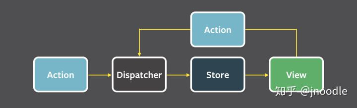
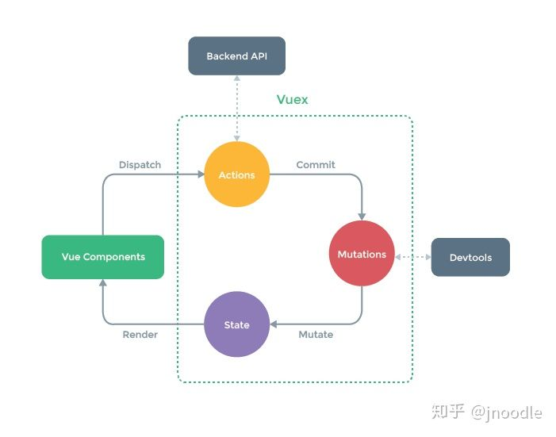

[TOC]

# 一、主要参考

 [Vuex、Flux、Redux、Redux-saga、Dva、MobX](https://zhuanlan.zhihu.com/p/53599723)

> 解决思路：**把组件之间需要共享的状态抽取出来，遵循特定的约定，统一来管理，让状态的变化可以预测**
>
> Vuex/Redux单一状态树：能够直接地定位任一特定的状态片段，在调试的过程中也能轻易地取得整个当前应用状态的快照。

# 二、Flux



**注意事项：**

* 一个应用可以拥有多个 Store，多个Store之间可能有依赖关系
* Store 封装了数据还有处理数据的逻辑

# 三、Redux


**运转流程：**

1. 用户通过 View 发出 Action

```js
store.dispatch(action);
```

2、然后 Store 自动调用 Reducer，并且传入两个参数：当前 State 和收到的 Action。 Reducer 会返回新的 State 

```text
let nextState = xxxReducer(previousState, action);
```

3、State 一旦有变化，Store 就会调用监听函数。

```js
store.subscribe(listener);
```

4、listener可以通过 store.getState() 得到当前状态。如果使用的是 React，这时可以触发重新渲染 View。

```js
function listerner() {
  let newState = store.getState();
  component.setState(newState);   
}
```

**注意事项：**

* 只有一个 Store，整个应用的数据都在这个大 Store 里面。Store 的 State 不能直接修改，每次只能返回一个新的 State。

* 和 Flux 一样，Redux 里面也有 Action，Action 就是 View 发出的通知，告诉 Store State 要改变。Action 必须有一个 type 属性，代表 Action 的名称，其他可以设置一堆属性，作为参数供 State 变更时参考。

  ```js
  const action = {
    type: 'ADD_TODO',
    payload: 'Learn Redux'
  };
  ```

  Redux 可以用 Action Creator 批量来生成一些 Action。

* Redux 没有 Dispatcher 的概念，Store 里面已经集成了 dispatch 方法。store.dispatch()是 View 发出 Action 的唯一方法。
* Redux 用一个叫做 Reducer 的**纯函数**来处理事件。Store 收到 Action 以后，必须给出一个**新的 State**（就是刚才说的Store 的 State 不能直接修改，每次只能返回一个新的 State**）**，这样 View 才会发生变化。这种 State 的计算过程就叫做 Reducer。
*  Reducer 是一个纯函数，对于相同的输入，永远都只会有相同的输出，不会影响外部的变量，也不会被外部变量影响，不得改写参数。

# 四、Vuex



**注意事项：**

* 每一个 Vuex 里面有一个全局的 Store，包含着应用中的状态 State

* 更改 Vuex 的 store 中的状态的唯一方法是提交 mutation，**mutation 都是同步事务**

  ``` store.commit('increment')```

* Action，处理**异步**。View 通过 store.dispatch('increment') 来触发某个 Action，Action 里面不管执行多少异步操作，完事之后都通过 store.commit('increment') 来触发 mutation，一个 Action 里面可以触发多个 mutation。所以 Vuex 的Action 类似于一个灵活好用的中间件。

**对比Redux：**

* Redux： view——>actions——>reducer——>state变化——>view变化（同步异步一样）

* Vuex： 
  * view——>commit——>mutations——>state变化——>view变化（同步操作）
  * view——>dispatch——>actions——>mutations——>state变化——>view变化（异步操作）