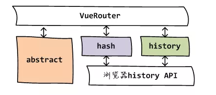
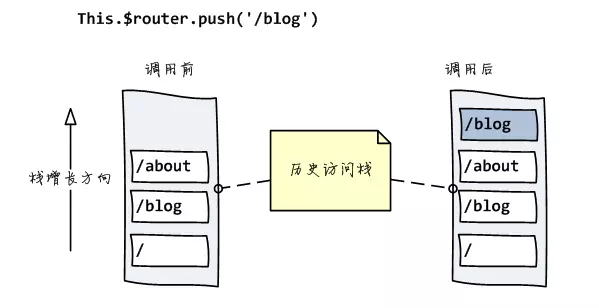
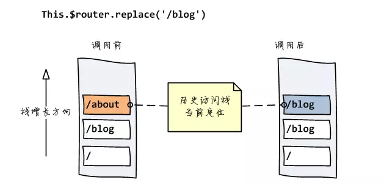
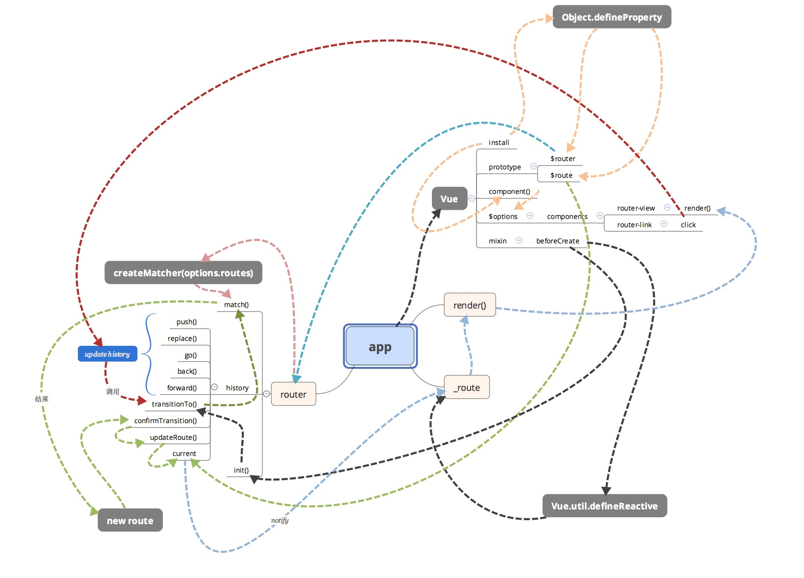

[TOC]
## 1. 前端路由优缺点 ##

**优点：**

* 用户体验好，不需要每次都从服务器全部获取，快速展现给用户

**缺点：**

* 使用浏览器的前进，后退键的时候会重新发送请求
* 没有合理利用缓存，单页面无法记住之前滚动的位置，无法再前进，后退的时候记住滚动的位置。（***可解决***）

## 2. 前端路由概述

**前端路由是直接找到与地址匹配的一个组件或对象并将其渲染出来。**

改变浏览器地址而不向服务器发出请求有两种方式: history / hash。

**vue-router 提供了三种运行模式**：

* hash: 使用 URL hash 值来作路由。默认模式。
* history: 依赖 HTML5 History API 和服务器配置。查看 HTML5 History 模式。
* abstract: 支持所有 JavaScript 运行环境，如 Node.js 服务器端。




## 3. history API
[Manipulating the browser history](<https://developer.mozilla.org/zh-CN/docs/Web/API/History_API>)

[History Api以及hash操作](https://www.cnblogs.com/hellohello/p/8040289.html)

**history.pushState**

```js
history.pushState(stateObj, "page 2", "bar.html");
```

**history.replaceState**

`history.replaceState()` 的使用与 `history.pushState()` 非常相似，区别在于  `replaceState()`  是修改了当前的历史记录项而不是新建一个。 注意这并不会阻止其在全局浏览器历史记录中创建一个新的历史记录项。

`replaceState()` 的使用场景在于为了响应用户操作，你想要更新状态对象state或者当前历史记录的URL。

```js
history.replaceState(stateObj, "page 3", "bar2.html");
```

**popstate 事件**

[`window.onpopstate`](https://developer.mozilla.org/zh-CN/docs/Web/API/Window/onpopstate)

**[获取当前状态](https://developer.mozilla.org/zh-CN/docs/Web/API/History_API#%E8%8E%B7%E5%8F%96%E5%BD%93%E5%89%8D%E7%8A%B6%E6%80%81)**

```js
let currentState = history.state;
```

## 4. Hash

[History Api以及hash操作](https://www.cnblogs.com/hellohello/p/8040289.html)

> 1. hash值会附在浏览器url地址的尾部，如www.xx.com?a=123#one。
>
> 2. hash被修改之后，可以点击后退前进，回到修改前后的页面，**hashchange事件会被触发，页面不会刷新。**
> 3. hash的优势就是**兼容性**更好,在老版IE中都有运行,问题在于url中一直存在`#`**不够美观**,而且hash路由更像是Hack而非标准

**修改hash以及检测hash变化的两种方式：**

```html
<a href="#two">click to change hash two</a>
<button onclick="location.hash='a'+Math.random()">
    随机hash
</button>
<script>
    window.onhashchange = function(){
        console.log(location.hash)
    }

    window.addEventListener("hashchange",function(){
        console.log(location.hash)
    })
</script>
```

## 5. 简单路由实现 ##

```js
const NotFound = { template: '<p>Page not found</p>' }
const Home = { template: '<p>home page</p>' }
const About = { template: '<p>about page</p>' }

const routes = {
  '/': Home,
  '/about': About
}

new Vue({
  el: '#app',
  data: {
    currentRoute: window.location.pathname
  },
  computed: {
    ViewComponent () {
      return routes[this.currentRoute] || NotFound
    }
  },
  render (h) { return h(this.ViewComponent) }
})
```

## 6. VUE-ROUTER ##

> [vue-router源码分析-整体流程](https://zhuanlan.zhihu.com/p/24104410)
>
> [浅谈vue-router原理](https://www.jianshu.com/p/4295aec31302)

### 6.1 $router 方法图示 ###





### 6.2 渲染流程图示 ###



### 6.3 路由改变到视图更新的流程 ###

```js
$router.push() //调用方法

HashHistory.push() //根据hash模式调用,设置hash并添加到浏览器历史记录（添加到栈顶）（window.location.hash= XXX）

History.transitionTo() //监测更新，更新则调用History.updateRoute()

History.updateRoute() //更新路由

{app._route= route} //替换当前app路由

vm.render() //更新视图
```

### 6.4 源码相关 ###

#### 6.4.1 index.js ####

这是一个 Vue.js 插件的经典写法，给插件对象增加 install 方法用来安装插件具体逻辑，同时在最后判断下如果是在浏览器环境且存在 window.Vue 的话就会自动使用插件。

**INIT: ** 初始化主要就是给 app 赋值，针对于 HTML5History 和 HashHistory 特殊处理，因为在这两种模式下才有可能存在进入时候的不是默认页，需要根据当前浏览器地址栏里的 path 或者 hash 来激活对应的路由，此时就是通过调用 transitionTo 来达到目的；而且此时还有个注意点是针对于 HashHistory 有特殊处理

**为什么不直接在初始化 HashHistory 的时候监听 hashchange 事件呢？**

这个是为了修复[https://github.com/vuejs/vue-router/issues/725](https://link.zhihu.com/?target=https%3A//github.com/vuejs/vue-router/issues/725)这个 bug 而这样做的，简要来说就是说如果在 beforeEnter 这样的钩子函数中是异步的话，beforeEnter 钩子就会被触发两次，原因是因为在初始化的时候如果此时的 hash 值不是以 / 开头的话就会补上 #/，这个过程会触发 hashchange 事件，所以会再走一次生命周期钩子，也就意味着会再次调用 beforeEnter 钩子函数。

[transitionTo 方法的大概逻辑](#6.4.6 transitionTo——base.js)

```js
/* @flow */
// 导入 install 模块
import { install } from './install'
import { createMatcher } from './create-matcher'
// ...
import { inBrowser, supportsHistory } from './util/dom'
// ...

export default class VueRouter {
// ...
  constructor (options: RouterOptions = {}) {
    this.app = null
    this.options = options
    this.beforeHooks = []
    this.afterHooks = []
    // 创建 match 匹配函数
    this.match = createMatcher(options.routes || [])
    // 根据 mode 实例化具体的 History
    let mode = options.mode || 'hash'
    this.fallback = mode === 'history' && !supportsHistory
    if (this.fallback) {
      mode = 'hash'
    }
    if (!inBrowser) {
      mode = 'abstract'
    }
    this.mode = mode

    switch (mode) {
      case 'history':
        this.history = new HTML5History(this, options.base)
        break
      case 'hash':
        this.history = new HashHistory(this, options.base, this.fallback)
        break
      case 'abstract':
        this.history = new AbstractHistory(this)
        break
      default:
        assert(false, `invalid mode: ${mode}`)
    }
  }

 init (app: any /* Vue component instance */) {
// ...
    this.app = app
    const history = this.history
    if (history instanceof HTML5History) {
      history.transitionTo(getLocation(history.base))
    } else if (history instanceof HashHistory) {
      history.transitionTo(getHash(), () => {
        window.addEventListener('hashchange', () => {
          history.onHashChange()
        })
      })
    }

    history.listen(route => {
      this.app._route = route
    })
  }
// ...
}
}

// 赋值 install
VueRouter.install = install

// 自动使用插件
if (inBrowser && window.Vue) {
  window.Vue.use(VueRouter)
}
```

#### 6.4.2 install.js-**Vue.use 使用的方法** ####

**Vue.mixin：**首先判断实例化时 options 是否包含 router，如果包含也就意味着是一个带有路由配置的实例被创建了，此时才有必要继续初始化路由相关逻辑。然后给当前实例赋值 _router，这样在访问原型上的 $router 的时候就可以得到 router 了。

```js
// router-view router-link 组件
import View from './components/view'
import Link from './components/link'

// export 一个 Vue 引用
export let _Vue

// 安装函数
export function install (Vue) {
  if (install.installed) return
  install.installed = true

  // 赋值私有 Vue 引用
  _Vue = Vue

  // 注入 $router $route
  Object.defineProperty(Vue.prototype, '$router', {
    get () { return this.$root._router }
  })

  Object.defineProperty(Vue.prototype, '$route', {
    get () { return this.$root._route }
  })
    
  // beforeCreate mixin
  Vue.mixin({
    beforeCreate () {
      // 判断是否有 router
      if (this.$options.router) {
        // 赋值 _router
        this._router = this.$options.router
        // 初始化 init
        this._router.init(this)
        // 定义响应式的 _route 对象
        Vue.util.defineReactive(this, '_route', this._router.history.current)
      }
    }
  })

  // 注册组件
  Vue.component('router-view', View)
  Vue.component('router-link', Link)
// ...
}
```

为啥要 export 一个 Vue 引用？**

> **在其他地方使用 Vue 的一些方法而不必引入 vue 依赖包**（前提是保证 install 后才会使用）。

#### 6.4.3 create-matcher.js  ####

**据传入的 routes 配置生成对应的路由 map，然后直接返回了 match 匹配函数。**

路由记录在分析 match 匹配函数那里以及分析过了，这里还需要了解下创建路由对象的 createRoute，存在于[src/util/route.js](#6.4.7  createRoute——route.js) 中

```js
/* @flow */

import Regexp from 'path-to-regexp'
// ...
import { createRouteMap } from './create-route-map'
// ...

export function createMatcher (routes: Array<RouteConfig>): Matcher {
  // 创建路由 map
  const { pathMap, nameMap } = createRouteMap(routes)
 
  // 匹配函数
  function match (
    raw: RawLocation,
    currentRoute?: Route,
    redirectedFrom?: Location
  ): Route {
	// ...
  }

  function redirect (
    record: RouteRecord,
    location: Location
  ): Route {
	// ...
  }

  function alias (
    record: RouteRecord,
    location: Location,
    matchAs: string
  ): Route {
	// ...
  }

  function _createRoute (
    record: ?RouteRecord,
    location: Location,
    redirectedFrom?: Location
  ): Route {
    if (record && record.redirect) {
      return redirect(record, redirectedFrom || location)
    }
    if (record && record.matchAs) {
      return alias(record, location, record.matchAs)
    }
    return createRoute(record, location, redirectedFrom)
  }
  // 返回
  return match
}
// ...
```

#### 6.4.4 create-route-map.js ####

* **根据用户路由配置对象生成普通的根据 path 来对应的路由记录**

* **根据 name 来对应的路由记录的 map，方便后续匹配对应。**

```js
/* @flow */

import { assert, warn } from './util/warn'
import { cleanPath } from './util/path'

// 创建路由 map
export function createRouteMap (routes: Array<RouteConfig>): {
  pathMap: Dictionary<RouteRecord>,
  nameMap: Dictionary<RouteRecord>
} {
  // path 路由 map
  const pathMap: Dictionary<RouteRecord> = Object.create(null)
  // name 路由 map
  const nameMap: Dictionary<RouteRecord> = Object.create(null)
  // 遍历路由配置对象 增加 路由记录
  routes.forEach(route => {
    addRouteRecord(pathMap, nameMap, route)
  })

  return {
    pathMap,
    nameMap
  }
}

// 增加 路由记录 函数
function addRouteRecord (
  pathMap: Dictionary<RouteRecord>,
  nameMap: Dictionary<RouteRecord>,
  route: RouteConfig,
  parent?: RouteRecord,
  matchAs?: string
) {
  // ... 
}

function normalizePath (path: string, parent?: RouteRecord): string {
  // ...
}
```


#### 6.4.5 实例化 History——base.js ####

所有的 History 类都是在 src/history/ 目录下，现在呢不需要关心具体的每种 History 的具体实现上差异，只需要知道他们都是继承自 src/history/base.js 中的 History 类的

```js
/* @flow */

// ...
import { inBrowser } from '../util/dom'
import { runQueue } from '../util/async'
import { START, isSameRoute } from '../util/route'
// 这里从之前分析过的 install.js 中 export _Vue
import { _Vue } from '../install'

export class History {
// ...
  constructor (router: VueRouter, base: ?string) {
    this.router = router
    this.base = normalizeBase(base)
    // start with a route object that stands for "nowhere"
    this.current = START
    this.pending = null
  }
// ...
}

// 得到 base 值
function normalizeBase (base: ?string): string {
  if (!base) {
    if (inBrowser) {
      // respect <base> tag
      const baseEl = document.querySelector('base')
      base = baseEl ? baseEl.getAttribute('href') : '/'
    } else {
      base = '/'
    }
  }
  // make sure there's the starting slash
  if (base.charAt(0) !== '/') {
    base = '/' + base
  }
  // remove trailing slash
  return base.replace(/\/$/, '')
}
// ...
```

#### 6.4.6 transitionTo——base.js ####

执行约定的各种钩子以及处理异步组件问题

> 注意一个概念：路由记录，每一个路由 route 对象都对应有一个 matched 属性，它对应的就是路由记录，他的具体含义在调用 match() 中有处理；通过之前的分析可以知道这个 match 是在 [src/create-matcher.js](#6.4.3 create-matcher.js ) 中的

```js
/* @flow */

import type VueRouter from '../index'
import { warn } from '../util/warn'
import { inBrowser } from '../util/dom'
import { runQueue } from '../util/async'
import { START, isSameRoute } from '../util/route'
import { _Vue } from '../install'

export class History {
// ...
  transitionTo (location: RawLocation, cb?: Function) {
    // 调用 match 得到匹配的 route 对象
    const route = this.router.match(location, this.current)
    // 确认过渡
    this.confirmTransition(route, () => {
      // 更新当前 route 对象
      this.updateRoute(route)
      cb && cb(route)
      // 子类实现的更新url地址
      // 对于 hash 模式的话 就是更新 hash 的值
      // 对于 history 模式的话 就是利用 pushstate / replacestate 来更新
      // 浏览器地址
      this.ensureURL()
    })
  }
  // 确认过渡
  confirmTransition (route: Route, cb: Function) {
    // ...
  }
  // 更新当前 route 对象
  updateRoute (route: Route) {
    const prev = this.current
    this.current = route
    // 注意 cb 的值 
    // 每次更新都会调用 下边需要用到！
    this.cb && this.cb(route)
    // 执行 after hooks 回调
    this.router.afterHooks.forEach(hook => {
      hook && hook(route, prev)
    })
  }
}
// ...
```

#### 6.4.7  createRoute——route.js ####

#### 6.4.8 router-link 和 router-view 组件 ####

**router-view 组件**

```js
export default {
  name: 'router-view',
  functional: true, // 功能组件 纯粹渲染
  props: {
    name: {
      type: String,
      default: 'default' // 默认default 默认命名视图的name
    }
  },
  render (h, { props, children, parent, data }) {
    // ...
    // 调用 createElement 函数 渲染匹配的组件
    return h(component, data, children)
  }
}
```

**router-link 组件**

```js
// ...
import { createRoute, isSameRoute, isIncludedRoute } from '../util/route'
// ...
export default {
  name: 'router-link',
  props: {
    // 传入的组件属性们
    to: { // 目标路由的链接
      type: toTypes,
      required: true
    },
    // 创建的html标签
    tag: {
      type: String,
      default: 'a'
    },
    // 完整模式，如果为 true 那么也就意味着
    // 绝对相等的路由才会增加 activeClass
    // 否则是包含关系
    exact: Boolean,
    // 在当前（相对）路径附加路径
    append: Boolean,
    // 如果为 true 则调用 router.replace() 做替换历史操作
    replace: Boolean,
    // 链接激活时使用的 CSS 类名
    activeClass: String
  },
  render (h: Function) {
    // ...
    // 创建元素
    return h(this.tag, data, this.$slots.default)
  }
}

function findAnchor (children) {
  // ...
}

function createHref (base, fullPath, mode) {
  // ...
}
```

