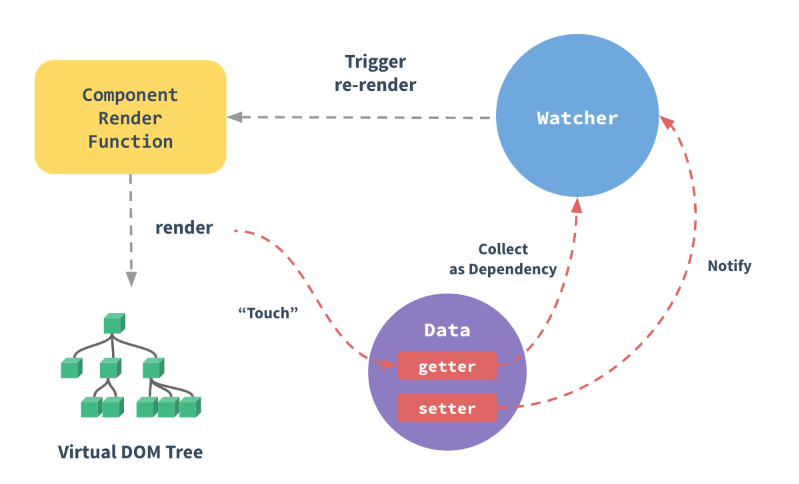

[TOC]

[Vue源码解析一(生命周期)———— vv小虫](https://blog.csdn.net/vv_bug/article/details/84954607)

[Vue源码解析二(render&mount)———— vv小虫](https://blog.csdn.net/vv_bug/article/details/85057354)

## 1. Vue.prototype.$nextTick ##

[vue之nextTick全面解析](https://www.cnblogs.com/xujiazheng/p/6852124.html)

**常用的场景是在进行获取数据后，需要对新视图进行下一步操作或者其他操作时，发现获取不到dom。因为赋值操作只完成了数据模型的改变并没有完成视图更新。**

当你设置 vm.someData = ‘new value’ ，该组件不会立即重新渲染。当刷新队列时，组件会在事件循环队列清空时的下一个“tick”更新。多数情况我们不需要关心这个过程，但是如果你想在 DOM 状态更新后做点什么，这就可能会有些棘手。虽然 Vue.js 通常鼓励开发人员沿着“数据驱动”的方式思考，避免直接接触 DOM，但是有时我们确实要这么做。为了在数据变化之后等待 Vue 完成更新 DOM ，可以在数据变化之后立即使用 Vue.nextTick(callback) 。

* promise.then
* MutationObserver 监听节点变化
* setTimeout(fn, 0)

## 2. **render方法的源码** ##

**vue文件中如果提供了render方法,render方法不执行?**

这其实跟**vue-loader有关**,当vue-loader在加载.vue文件的时候,当发现.vue文件中有template标签的时候,就会把template解析完毕后然后创建render方法,替换当前vm的render方法,所以我们在.vue文件中提供的render方法其实是被覆盖掉了,所以如果在.vue文件中使用render方法的时候,我们需要去掉template标签（不要HTML）.

所以整个render对象看完我们可以知道,**render对象最后就是返回了一个vnode对象.** 

**_update方法中接受到了vnode对象后,最后通过下面代码转成了dom对象:**

```js
vm.$el = vm.__patch__(prevVnode, vnode)
```

## 3. Watcher对象 ##

> instance/lifecycle.js

可以监听响应式数据的变化,然后Watcher对象中会判断需不需要刷新组件,触发updateComponent方法,然后触发vm的_update方法,最后更新dom~~

## 4. initMixin  ##

初始化

## 5. stateMixin ##

Vue.prototype.set、Vue.prototype.delete、 Vue.prototype.watch、defineReactive 

## 6. lifecycleMixin ##

1. Vue.prototype._update :vnode对象更新时候触发
2. Vue.prototype.forceUpdate:强制更新vnode对象Vue.prototype.
3. forceUpdate :强制更新vnode对象Vue.prototype.forceUpdate:强制更vnode对象Vue.prototype.destroy :销毁当前vnode对象

## 7. renderMixin ##

Vue.prototype.$nextTick
Vue.prototype._render

## 8. update ##

[vue-react——1.3 两者相比——更新性能](../../问题.md)

> 改变data 会触发update



