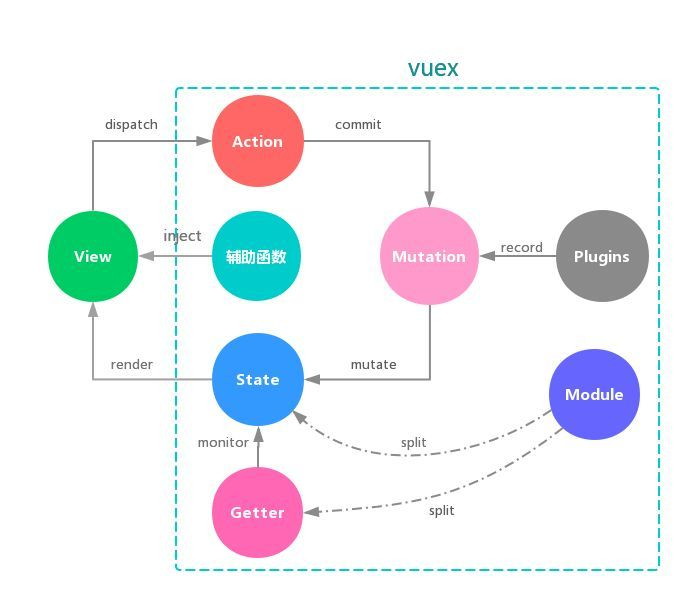
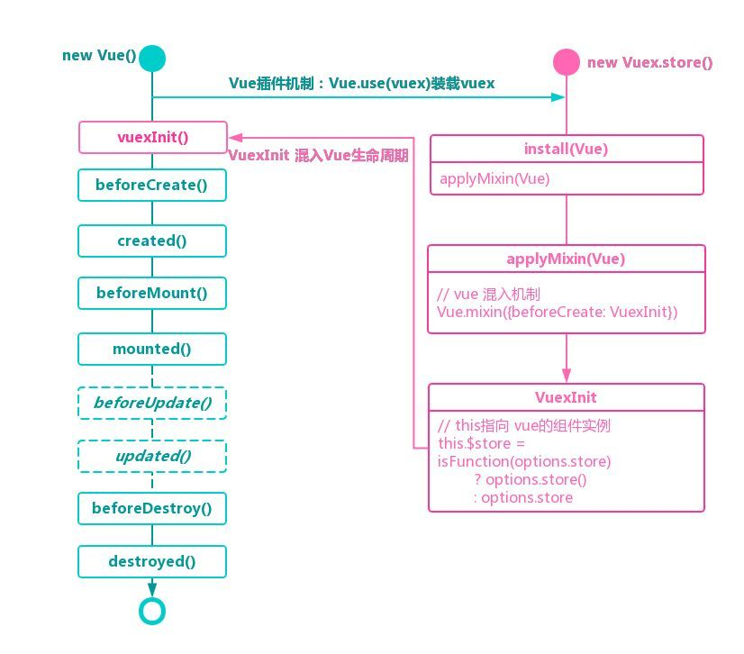
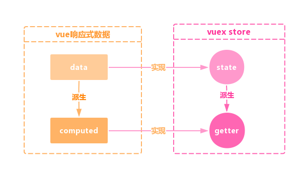

[TOC]
> [深入Vuex原理（上）](https://www.sohu.com/a/290830922_505779)
>
> [深入Vuex 原理   (下) ](<http://www.sohu.com/a/290896541_505779>)

## 1. 核心对象 ##

state、getter、mutations、actions、modules、plugins

## 2. 核心原理 ##

* vue数据响应式的原理 Object.defineProperty
* 非父子组件之间的通讯 bus

## 3. VUEX 图示



## 4. 流程 ##



```js
//（1）(new Vue(), new Vuex.store()) 
Vue.use(Vuex)

//（2）就是把 store注册到$store上面
Vuex.install = function (Vue, options) {
    Vue.mixin({
        beforeCreate: function () {
            const options = this.$options
            if (options.store) {
                this.$store = options.store
            } else if (options.parent && options.parent.$store) {
                this.$store = options.parent.$store
            }
        }
    })
}

//（3)
Vue.mixin({ beforeCreate: vuexInit }); // beforeCreate是 Vue 得生命周期得钩子

//（4）VuexInit
this.$store = typeof options.store === 'function'
    ? options.store()
	: options.store

//（5）
beforeCreate()

//（6）
created() .....
```

## 5. 源码 ##



### 5.1 state ###

```js
get state () {
	return this._vm._data.$$state
}
```

使用 `this.$store.getters.xxx` 获取 xxx 属性时，实际上是获取的 `store._vm.data.$$state` 对象上的同名属性。那么我们将关注点放在 _vm 上。我们通过 Store 的 constructor 找到了**处理 state 和 getter 的核心函数 resetStoreVM(this, state)。**

### 5.2 resetStoreVM(this, state) ###

```js
store._vm = new Vue({
    data: {
    	$$state: state
    }
})
```

上述代码初始化了一个 Vue 实例 _vm，由于 Vue 的 data 是响应式的，所以，$$state 也是响应式的，那么当我们在一个组件实例中对 state.xxx 进行 更新时，基于 Vue 的 data 的响应式机制，所有相关组件的 state.xxx 的值都会自动更新，UI 自然也会自动更新！可见，这和 Vue 的中央事件总线 设计思想如出一辙，同样借助 Vue 对象特性(响应式的data)作为其他组件的通信桥梁，实现组件间的通信 以及数据共享。

### 5.3 getter ###

在 resetStoreVM 中可以看到对于 wrappedGetters(经过包装，收集的 getters，处理细节忽略)的处理。

```js
const computed = {};
// 处理getters
forEachValue(wrappedGetters, (fn, key) => {
    computed[key] = () => fn(store) // 将getter存储在computed上
    //this.$store.getters.XXX的时候获取的是store._vm.XXX
    Object.defineProperty(store.getters, key, {
        get: () => store._vm[key],
        enumerable: true
    })
})

// 后续处理
store._vm = new Vue({
	computed
})
```

