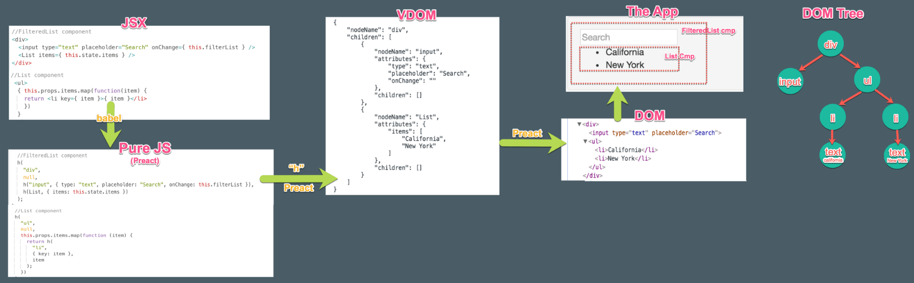
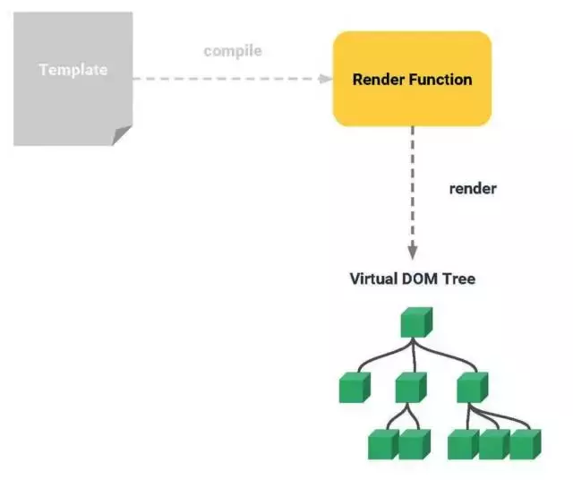
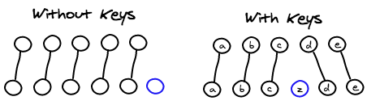

[TOC]

## 1. VUE/REACT/JQuery ##

[react和vue的渲染流程对比 以及 特点对比](<https://www.jianshu.com/p/1960f378b5b4>)

### 1.1 react的特点 ###

1. 声明式设计
2. 高效 −React通过对DOM的模拟（虚拟dom），最大限度地减少与DOM的交互。
3. 灵活 −React可以与已知的库或框架很好地配合。
4. JSX − JSX 是 JavaScript 语法的扩展。
5. 组件 − 通过 React 构建组件，使得代码更加容易得到复用，能够很好的应用在大项目的开发中
6. 单向响应的数据流 − React 实现了单向响应的数据流，从而减少了重复代码，这也是它为什么比传统数据绑定更简单。

### 1.2 vue的特点 ###

1. MVVM框架
2. 双向数据绑定
3. 数据驱动
4. 组件化
5. 轻量
6. 简洁
7. 高效
8. 模块友好

### 1.3 vue/react相比 ###

> [个人理解Vue和React区别](https://juejin.im/post/5b8b56e3f265da434c1f5f76)

#### 1.3.1 **react和vue的相似之处：**

1. **虚拟dom**
2. 提供了响应式和**组件化**的视图组件
3. **关注核心库**，伴随于此，有配套的路由和负责处理全局状态管理的库
4. 数据驱动的框架，不直接操纵dom，而是操纵数据来改变页面的内容。

#### 1.3.2 **vue的优势**

1. API设计上简单，语法简单，学习成本低

2. 基于依赖追踪的观察系统，并且异步队列更新

3. 简单的语法及项目搭建 ，更快的渲染速度和更小的体积

4. 渲染性能

   渲染用户界面的时候，dom的操作成本是最高的，那为了尽可能的减少对dom的操作，Vue和React都利用虚拟DOM来实现这一点，但**Vue的Virtual DOM实现的权重要轻得多，因此比React的引入开销更少。**

5. **更新性能**
   在`react中`，当一个组件的状态发生变化时，它将会引起`整个组件的子树都进行重新渲染，从这个组件的根部开始`。那为了**避免子组件不必要的重新渲染，您需要随时使用`shouldComponentUpdate`，**并使用不可变的数据结构。 `在Vue中，组件的依赖关系在它的渲染期间被自动跟踪`，因此系统准确地知道哪些组件实际上需要重新渲染。这就意味着在更新方面,vue也是快于React。

   > Vue宣称可以更快地计算出Virtual DOM的差异，这是由于它在渲染过程中，会跟踪每一个组件的依赖关系，不需要重新渲染整个组件树。 

6. 开发中
   在开发中，Vue 每秒最高处理 10 帧，而 React 每秒最高处理不到 1 帧。这是由于 **React 有大量的检查机制**，这会让它提供许多有用的警告和错误提示信息。vue在实现这些检查时，也更加密切地关注了性能方面。

#### 1.3.3 **react的优势**

1. 更适合大型应用和更好的可测试性
2. Web端和移动端原生APP通吃
3. 更大的生态系统，更多的支持和好用的工具（搭配的router和redux以及其中间件包含了很多重要的思想）
4. 比较适合中大型项目（便于测试和后续调试）
5. 是一种在内存中描述dom数状态的数据结构
6. 支持在服务端渲染

#### 1.3.4 区别

> [个人理解Vue和React区别](https://juejin.im/post/5b8b56e3f265da434c1f5f76)

1. **设计理念**

   Vue 使用的是可变数据，而React更强调数据的不可变。所以应该说没有好坏之分，Vue更加简单，而React构建大型应用的时候更加鲁棒。

2. **监听数据变化的实现原理不同**

   - Vue 通过 getter/setter 以及一些函数的劫持，能精确知道数据变化，不需要特别的优化就能达到很好的性能
   - React 默认是通过比较引用的方式进行的，如果不优化（PureComponent/shouldComponentUpdate）可能导致大量不必要的VDOM的重新渲染

3. **数据流的不同**

   * React一直提倡的是单向数据流，他称之为 onChange/setState()模式。
   * Vue1.0中我们可以实现两种双向绑定，Vue2.x 中可以通过 `v-model`实现。

4. **HoC 和 mixins**

   在 Vue 中我们组合不同功能的方式是通过 mixin，而在React中我们通过 HoC (高阶组件）。

5. **组件通信的区别**

   * Vue : `provide/inject `、`bus`、`props` 和 回调/事件的机制。
   * React：`props`和回调、context。

   > Vue事件， React 回调函数

6. **模板渲染方式的不同**

   * React 是通过JSX渲染模板。

     React是在组件JS代码中，通过原生JS实现模板中的常见语法，比如插值，条件，循环等，都是通过JS语法实现的

   * Vue是通过一种拓展的HTML语法进行渲染。

     Vue是在和组件JS代码分离的单独的模板中，通过指令来实现的，比如条件语句就需要 v-if 来实现

   > React更加纯粹更加原生，而Vue的做法显得有些独特，会把HTML弄得很乱。
   >
   > **例子：**
   >
   > react中render函数是支持闭包特性的，所以我们import的组件在render中可以直接调用。但是在Vue中，由于模板中使用的数据都必须挂在 this 上进行一次中转，所以我们import 一个组件完了之后，还需要在 components 中再声明下，这样显然是很奇怪但又不得不这样的做法。

### 1.4 jquery/vue ###

[jquery和vue的区别是什么](http://www.php.cn/js-tutorial-412970.html)

  JS框架大体上可以分为两种。

1. 类似jQuery，通过**修改html的DOM结构来渲染UI的库**，**基本都是浏览器原生操**作，更方便的选取和操作DOM对象，数据和界面是在一起的，开发效率更底下，学习成本低，可以看做是对原生js的一个库，封装了很多东西，兼容好，jquery侧重样式操作，动画效果等，**操作真实DOM**。
   * 数据都是在在服务器端进行修改可以使用
2. 类似于AngularJS/ReactJS/vue。
   * 可维护性
   * 重用性
   * 避免频繁的操作dom/虚拟dom
   * **处理大量的数据**很方便
   * 数据与视图分离
   * 通过数据去驱动视图的变化，只关心数据的变化，dom操作被封装
   * 组件化开发

### 1.5 react的渲染流程 ###

1. react中 我们用**jsx来写组件**，它会被**babel转换成纯js**，然后Preact的h函数会将这段js**转换成**DOM树，最后Preact的Virtual DOM算法会将virtual DOM转换成**真实的DOM树**，来构建我们的应用。

2. 真实的Virtual DOM会比下面的例子更复杂，但它本质上是一个嵌套着数组的原生对象。当新一项被加进去这个JavaScript对象时，一个函数会计算新旧Virtual DOM之间的差异并反应在真实的DOM上。计算差异的算法是高性能框架的秘密所在。



### 1.6 vue的渲染流程 ###

1. Vue的编译器在**编译模板**之后，会把这些模板**编译成一个渲染函数**。

2. 渲染函数被调用的时候就会渲染并且返回一个**虚拟DOM的树**。

3. 当我们有了这个虚拟的树之后，再**交给一个patch函数**，负责把这些虚拟DOM真正**施加到真实的DOM上**。

   > Vue有自身的响应式系统来侦测在渲染过程中所依赖到的数据来源。

4. 在渲染过程中，**侦测到的数据来源**之后，之后就可以**精确感知数据源的变动。**到时候就可以根据需要重新进行渲染。

5. 当**重新进行渲染之后**，会生成一个新的树，将**新树与旧树进行对比**，就可以最终得出应施加到真实DOM上的改动。最后再通过patch函数施加改动。



## 2. computed 与 watch ##

[做面试的不倒翁：浅谈 Vue 中 computed 实现原理](https://segmentfault.com/a/1190000016387717)

**computed 和 watch 的差异**

1. `computed` 是计算一个新的属性，并将该属性挂载到 vm（Vue 实例）上( defineComputed(vm, key, userDef))，而 `watch` 是监听已经存在且已挂载到 `vm`上的数据，所以用 `watch` 同样可以监听 `computed` 计算属性的变化（其它还有 `data`、`props`）
2. `computed` 本质是一个惰性求值的观察者，具有缓存性，只有当依赖变化后，第一次访问 `computed` 属性，才会计算新的值，而 `watch` 则是当数据发生变化便会调用执行函数
4. **计算属性在大多数情况下更合适**, **数据变化时执行异步或开销较大的操作时使用`watch` 选项**

## 3. [Vue2.0 v-for 中 :key 到底有什么用？](https://www.cnblogs.com/zhumingzhenhao/p/7688336.html) ##

**使用key来给每个节点做一个唯一标识，Diff算法就可以正确的识别此节点，找到正确的位置区插入新的节点。**



**key的作用**

* **为了高效的更新虚拟DOM**。

* vue中在使用相同标签名元素的过渡切换时，也会使用到key属性，其目的也是为了让vue可以区分它们，否则vue只会替换其内部属性而不会触发过渡效果。**见 [知识点.md——4. 用 `key` 管理可复用的元素](./知识点.md)**

* 当 Vue.js 用 v-for 正在更新已渲染过的元素列表时，它默认用“就地复用”策略。如果数据项的顺序被改变，Vue 将不会移动 DOM 元素来匹配数据项的顺序， 而是简单复用此处每个元素，并且确保它在特定索引下显示已被渲染过的每个元素。

  > ##### 1. 更准确
  >
  > 因为带key就不是`就地复用`了，在sameNode函数 `a.key === b.key`对比中可以避免就地复用的情况。所以会更加准确。
  >
  > ##### 2. 更快
  >
  > 利用key的唯一性生成map对象来获取对应节点，比遍历方式更快。(这个观点，就是我最初的那个观点。从这个角度看，map会比遍历更快。)
  >
  > [第 1 题：写 React / Vue 项目时为什么要在列表组件中写 key，其作用是什么？ #1](https://github.com/Advanced-Frontend/Daily-Interview-Question/issues/1)

## 4. [vue当中如何通过一个点击事件使一个input显示的同时获取焦点](https://segmentfault.com/q/1010000011481239) ##

1、autofocus
2、

```js
directives: {
    focus: {
      inserted(el, { value }) {
        if (value) {
          el.focus();
        }
      },
    },
},
```

```html
<input type="number" ref="input" v-focus="focusStatus" autofocus="autofocus" v-model="goods.price" @blur="changePrice">
```

拓展它的focus
通过点击事件让focusStatus变成true

3、this.$refs.input.focus();

## 5. v-show 和 v-if ##

* `v-if` 是“真正”的条件渲染，因为它会确保在**切换过程中条件块内的事件监听器和子组件适当地被销毁和重建**。当切换v-if模块时，Vue.js 有一个**局部编译/卸载过程**，因为 v-if 之中的模板也可能包括数据绑定或子组件。

* `v-if` 也是**惰性的**：如果在初始渲染时条件为假，则什么也不做——直到条件第一次变为真时，才会开始渲染条件块。

* `v-show` 不管初始条件是什么，元素总是会被渲染，并且只是简单地**基于 CSS 进行切换。**

* `v-if` 有更高的切换开销，而 `v-show` 有更高的初始渲染开销。因此，如果需要非常频繁地切换，则使用 `v-show` 较好；如果在运行时条件很少改变，则使用 `v-if` 较好。

## 6. solt 和 props ##

**props**

props是用来接收参数的 例如父组件向子组件传参 可以放在props中

**slot**

slot：插槽 slot分发模式主要用于在组件中插入标签或者组件之间的相互嵌套
个人认为如果组件中有需要单独定义的地方 可以使用slot

## 7. vue 生命周期 ##

> [如何解释vue的生命周期才能令面试官满意？](<https://juejin.im/post/5ad10800f265da23826e681e>)
>
> [Vue父子组件生命周期执行顺序及钩子函数的个人理解](https://www.cnblogs.com/yuliangbin/p/9348156.html)

1. beforeCreate()，实例初始化自动调用

2. created()，实例创建后调用

3. beforeMount()，在mount之前运行,元素已经加载，但是 属性值没渲染

4. mounted()，在编译结束时调用,加载完成

   ```js
   if (!vm.$options.render) { /* ../ */}
   // ...
   vm._update(vm._render(), hydrating)
   
   // ...
   if (vm.$vnode == null) {
   		// ...
       callHook(vm, 'mounted')
     }
   ```

5. beforeUpdate()，在实例挂载后，再次更新实例时调用,属性值未渲染

6. updated()，在实例挂载之后，再次更新实例并更新完DOM结构后调用,属性值修改后

7. beforeDestroy()，在开始销毁实例时调用

8. destroyed()，在实例销毁后调用，Vue 实例指示的所有东西都会解绑定，所有的事件监听器会被移除，所有的子实例也会被销毁。

9. actived()，在动态组件初始化渲染的过程中调用

10. deactived()，在动态组件移除的过程中调用

 


```js
initLifecycle(vm)
initEvents(vm)
initRender(vm)
callHook(vm, 'beforeCreate')
initInjections(vm) // resolve injections before data/props
initState(vm)
initProvide(vm) // resolve provide after data/props
callHook(vm, 'created')
```

1. **new Init()**
   vue的构造函数中就只调用了一个init方法(我们已经来到了生命周期图的init函数了):init方法哪里来的呢? 我们可以下面调用了:

   ```js
   // 初始化
   initMixin(Vue)
   ```

2. init方法中的events跟lifecyle,字面意思就可以知道是注册**“事件”跟“生命周期”的意思**

   **initlifecyle**
   初始化一些生命周期的变量(未渲染、未销毁等等)

   ```js
     vm._watcher = null
     vm._inactive = null
     vm._directInactive = false
     vm._isMounted = false
     vm._isDestroyed = false
     vm._isBeingDestroyed = false
   ```

   **initEvent**

   ```js
   // 就是我们执行vm.once、vm. once、vm.once、vm.on、vm.$emit方法发送的一些事件,分为注册事件跟触发事件(观察者模式)
   ```

3. **callHook(vm, 'beforeCreate')**
   在beforeCreate的时候千万不要去修改data里面赋值的数据，最早也要放在created里面去做（添加一些行为）。

4. **initInjections**

   ```js
   initInjections(vm) // resolve injections before data/props
   initState(vm)
   initProvide(vm) // resolve provide after data/props
   ```

   在父类或者超类组件中定义了一些基础数据,子类组件需要拿到这些基础数据,我们就可以用inject, inject中包含了initInjections跟initProvide.
   [知识点.md——14.4 依赖注入](./知识点.md)

5. **initState**的目的就是初始化一些**响应式操作**,具体有:**data属性、props属性、computed属性、watch属性、methods属性**

6. **initProvide**

7. **callHook(vm, 'created')**

8. 判断instance（实例）里面是否含有**“el”option（选项）**，如果没有的话，它会调用`vm.$mount(el)`这个方法（首先会判断对象是否有**el选项**。**如果有的话就继续向下编译，如果没有**el选项**，则停止编译，也就意味着停止了生命周期，直到在该vue实例上调用`vm.$mount(el)`。

9. 判断是否含有“template”这个选项，如果有的话，它会把template解析(template编译的过程)成一个`render function `

   ```js
   render (h) {
     return h('div', {}, this.text)
   }
   ```

   render函数里面的传参h就是Vue里面的createElement方法，return返回一个createElement方法，其中要传3个参数，第一个参数就是创建的div标签；第二个参数是我们组件上面的props，或者是事件之类的东西；第三个参数就是div标签里面的内容。

   **render函数是发生在beforeMount和mounted之间的**当执行完render function之后，就会调用mounted这个钩子

   > beforeMount的时候，$el还只是我们在HTML里面写的节点，然后到mounted的时候，它就把渲染出来的内容挂载到了DOM节点上。

10. mountComponent

    ```js
     // 1.
     callHook(vm, 'beforeMount')
    ```

11. updateComponent

    ```js
    // 1.
    render()
    
    // 2.
    callHook(vm, 'mounted')
    ```

12. lifecycleMixin 
    **_update**
     ```callHook(vm, 'beforeUpdate')```

    **destroy** 

    ```js
    // 1.
    callHook(vm, 'beforeDestroy')
    
    // 2.
    if (vm._watcher) {
    	vm._watcher.teardown()
    }
    let i = vm._watchers.length
    while (i--) {
    	vm._watchers[i].teardown()
    }
    // remove reference from data ob
    // frozen object may not have observer.
    if (vm._data.__ob__) {
    	vm._data.__ob__.vmCount--
    }
    // call the last hook...
    vm._isDestroyed = true
    // invoke destroy hooks on current rendered tree
    vm.__patch__(vm._vnode, null)
    // fire destroyed hook
    
    // 3.
    callHook(vm, 'destroyed')
    ```

13. **额外**
    * 在使用.vue文件开发的过程当中，**我们在里面写了template模板，在经过了vue-loader的处理之后，就变成了render function，最终放到了vue-loader解析过的文件里面**。这样做有什么好处呢？原因是由于在解析template变成render function的过程，是一个非常耗时的过程，vue-loader帮我们处理了这些内容之后，当我们在页面上执行vue代码的时候，效率会变得更高。
    * 在这个过程当中，Vue为我们提供了**renderError**方法，这个方法只有在开发的时候它才会被调用，在正式打包上线的过程当中，它是不会被调用的。它主要是帮助我们**调试render里面的一些错误。**
    * 后续的钩子函数执行的过程都是需要外部的触发才会执行。比如说有数据的变化，会调用beforeUpdate，然后经过Virtual DOM，最后updated更新完毕。当组件被销毁的时候，它会调用beforeDestory，以及destoryed。

## 8. 组件依赖关系追踪原理 ##

Vue宣称可以更快地计算出Virtual DOM的差异，这是由于它在渲染过程中，会跟踪每一个组件的依赖关系，不需要重新渲染整个组件树。

<http://www.php.cn/js-tutorial-409801.html>

## 9. Vue 能不能挂载到body或html标签上，为什么？ ##

提供的元素只能作为挂载点。不同于 Vue 1.x，所有的**挂载元素会被 Vue 生成的 DOM 替换。**因此不推荐挂载root实例到 `<html>` 或者 `<body>` 上。也就是，vue 的挂载容器不能是html 和 body。

## 10. 父子通信 ##

1. props和$emit
2. 插槽和具名插槽

## 11. [Vue为什么不能检测数组变动](https://segmentfault.com/a/1190000015783546) ##

## 12. [Vue实例里面的data属性为什么用函数返回](<https://blog.csdn.net/major_zhang/article/details/79102249>) ##

当一个组件被定义， data 必须声明为返回一个初始数据对象的函数，因为组件可能被用来创建多个实例。如果 data 仍然是一个纯粹的对象，则所有的实例将共享引用同一个数据对象！通过提供 data 函数，每次创建一个新实例后，我们能够调用 data 函数，从而返回初始数据的一个全新副本数据对象。 

## 13. proxy 和 Object.defineProperty

[Vue3.0 尝鲜，Object.defineProperty VS Proxy](<https://blog.csdn.net/qq_36436877/article/details/86136545>)

[数据劫持 OR 数据代理（Proxy与Object.defineProperty）](<https://blog.csdn.net/mmjinglin/article/details/85097794>)

[第 51 题：Vue 的响应式原理中 Object.defineProperty 有什么缺陷？为什么在 Vue3.0 采用了 Proxy，抛弃了 Object.defineProperty？ #90]()

**针对对象**

在数据劫持这个问题上，Proxy 可以被认为是 Object.defineProperty() 的升级版。外界对某个对象的访问，都必须经过这层拦截。因此它是针对 整个对象，而不是 对象的某个属性，所以也就不需要对 keys 进行遍历。

```js
let obj = {
  name: 'Eason',
  age: 30
}
let handler = {
  get (target, key, receiver) {
    console.log('get', key)
    return Reflect.get(target, key, receiver)
  },
  set (target, key, value, receiver) {
    console.log('set', key, value)
    return Reflect.set(target, key, value, receiver)
  }
}
let proxy = new Proxy(obj, handler)
proxy.name = 'Zoe' // set name Zoe
proxy.age = 18 // set age 18
```

Proxy 是针对 obj 的。因此无论 obj 内部包含多少个 key ，都可以走进 set。(省了一个 Object.keys() 的遍历)，另外这个 Reflect.get 和 Reflect.set 可以理解为类继承里的 super，即调用原来的方法。

**支持数组**

Proxy 不需要对数组的方法进行重载，省去了众多 hack，减少代码量等于减少了维护成本，而且标准的就是最好的。

```js
let arr = [1,2,3]
let proxy = new Proxy(arr, {
    get (target, key, receiver) {
        console.log('get', key)
        return Reflect.get(target, key, receiver)
    },
    set (target, key, value, receiver) {
        console.log('set', key, value)
        return Reflect.set(target, key, value, receiver)
    }
})
proxy.push(4)
// 能够打印出很多内容
// get push     (寻找 proxy.push 方法)
// get length   (获取当前的 length)
// set 3 4      (设置 proxy[3] = 4)
// set length 4 (设置 proxy.length = 4)
```

**嵌套支持**
本质上，Proxy 也是不支持嵌套的，这点和 Object.defineProperty() 是一样的。因此也需要通过逐层遍历来解决。**Proxy 的写法是在 get 里面递归调用 Proxy 并返回**，代码如下：

```js
let obj = {
  info: {
    name: 'eason',
    blogs: ['webpack', 'babel', 'cache']
  }
}
let handler = {
  get (target, key, receiver) {
    console.log('get', key)
    // 递归创建并返回
    if (typeof target[key] === 'object' && target[key] !== null) {
      return new Proxy(target[key], handler)
    }
    return Reflect.get(target, key, receiver)
  },
  set (target, key, value, receiver) {
    console.log('set', key, value)
    return Reflect.set(target, key, value, receiver)
  }
}
let proxy = new Proxy(obj, handler)
// 以下两句都能够进入 set
proxy.info.name = 'Zoe'
proxy.info.blogs.push('proxy')
```

**其他**

- Proxy 的第二个参数可以有 13 种拦截方法，这比起 Object.defineProperty() 要更加丰富
- Proxy 作为新标准受到浏览器厂商的重点关注和性能优化，相比之下 Object.defineProperty() 是一个已有的老方法。

## 14. vue源码解析－事件机制

> [vue源码解析－事件机制](https://segmentfault.com/a/1190000009750348)