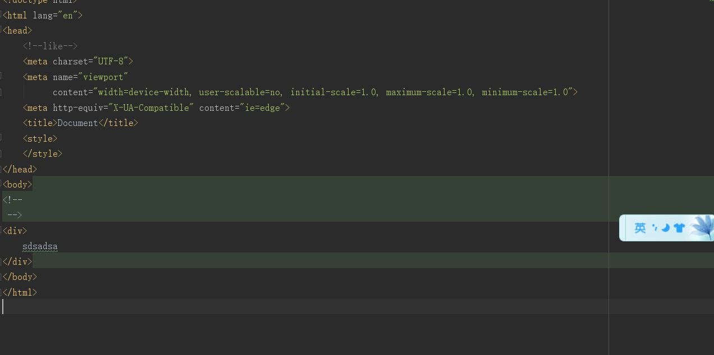
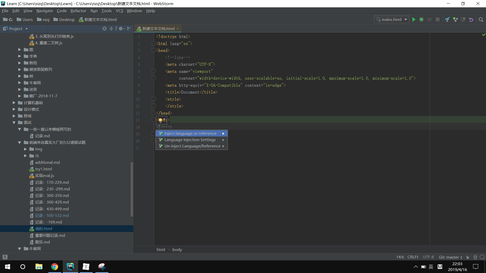

[TOC]
## 1. 缩进相关
	Code Style => Javascript

## 2. 忽略文件
	File Types

## 3.【webstorm】提示requested without authorization，页面未授权

Build,Execution,Deployment => Debugger => Allow unsigned request

## 4. 设置注释
	livetemplate => user

## 5. WebStorm: 更改默认的文件模板
https://blog.csdn.net/enzymer/article/details/51265326

## 6. 无缘无故 html 文件中加入 `<body></body> 会出错` ##

