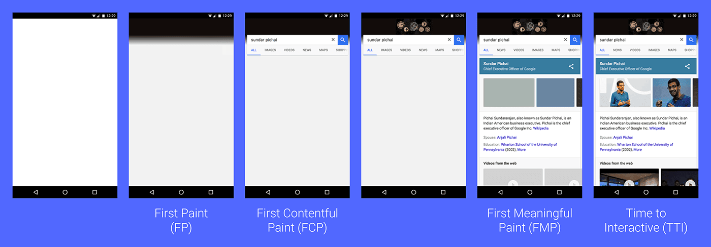
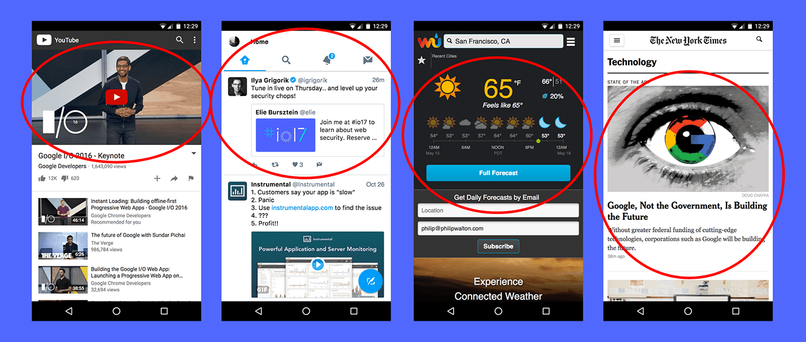
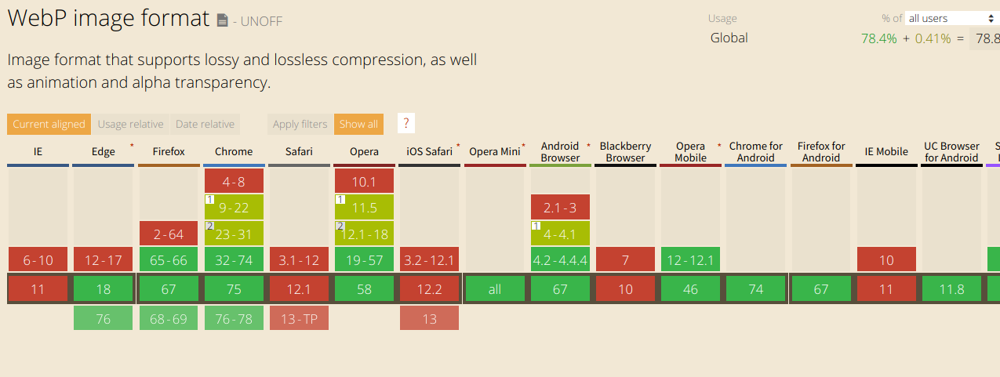
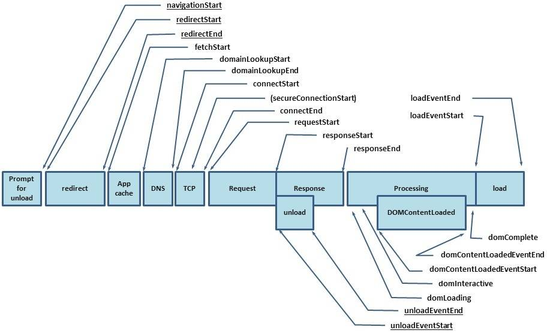

[TOC]

> 文章出于总结和学习目的！
>
> 参考网站：
>
> 1. [嗨，送你一张Web性能优化地图](<https://mp.weixin.qq.com/s/C2Zx3KPNPkgj-aHnOY43Iw>)
> 2. [以用户为中心的性能指标](<https://developers.google.com/web/fundamentals/performance/user-centric-performance-metrics>)
> 3. [前端性能量化标准](<https://yq.aliyun.com/articles/598162>)
> 4. [使用 RAIL 模型评估性能](<https://developers.google.com/web/fundamentals/performance/rail>)
> 5. [优秀前端必知的话题：我们应该做些力所能及的优化](https://segmentfault.com/a/1190000016572057)
> 6. [本地-YaHoo 军规](./YaHoo军规/YaHoo军规.md)
>
> 页面加载性能和页面渲染性能

# １、性能度量标准/设定目标

> * 指标重要性取决于应用
> * 根据度量标准设定一个现实的目标

[Performance](<https://developer.mozilla.org/zh-CN/docs/Web/API/Performance>)

## 1.1 性能度量标准

> FCP < FMP < DCL(DOMContentLoaded Event) < L(Onload Event)

下表是与页面加载性能相关的用户体验。



| 用户体验         | 描述                                                         |
| :--------------- | :----------------------------------------------------------- |
| 在发生吗？       | 网页浏览顺利开始了吗？服务端有响应吗？                       |
| 是否有用？       | 是否已渲染可以与用户互动的足够内容？用户是否能看到足够的内容？ |
| 是否可用？       | 用户是否可以和页面交互，还是页面仍在忙于加载？               |
| 是否令人愉快的？ | 交互是否流程和自然，没有卡段或闪烁？                         |

### 1.1.1 First paint and first contentful paint (它在发生吗？)

***首次绘制* (FP) 和 *首次内容绘制* (FCP)**。 这些指标用于标记导航之后浏览器在屏幕上渲染像素的时间点。这两个指标其实指示了我们通常所说的白屏时间。

白屏时间计算存在争议，如下：

1. 白屏时间 = FCP - FP （个人认为）

2. 白屏时间 = FCP - performance.timing.navigationStart（**路由改变**，用户再按下回车的瞬间到首次内容渲染，见 @寻找海蓝 [文章](<https://juejin.im/post/5d00820b5188255ee806a1c7>)）

3. 不兼容performance.timing 的浏览器，如IE8，使用如下方式：

   ```html
   <!--
   [前端优化-如何计算白屏和首屏时间](https://www.cnblogs.com/longm/p/7382163.html)
   
   白屏时间 = firstPaint - pageStartTime;
   -->
   
   <head>
     <meta charset="UTF-8">
     <title>白屏</title>
     <script type="text/javascript">
       window.pageStartTime = Date.now();
     </script>
     <!-- 页面 CSS 资源 -->
     <script type="text/javascript">
       // 白屏时间结束点
       window.firstPaint = Date.now();
     </script>
   </head>
   ```
   
   

这两个指标之间的主要差别在于：

* FP 标记浏览器渲染*任何*在视觉上**不同于导航前屏幕内容**（就是输入网址enter之前的内容，可通过Performance查看）的时间点。 
* FCP 标记的是浏览器渲染来自 **DOM 第一个内容**的时间点，该内容可能是文本、图像、SVG 甚至 `<canvas>` 元素。

在控制台查看 paint 性能：

```js
window.performance.getEntriesByType('paint')
```

在代码中查看 paint 性能：

```js
const observer = new PerformanceObserver((list) => {
  for (const entry of list.getEntries()) {
    // `entry` is a PerformanceEntry instance.
    console.log(entry.entryType, entry.startTime, entry.duration);
  }
});

// register observer for long task notifications
observer.observe({entryTypes: ["paint"]});
```

### 1.1.2 **First meaningful paint and hero element timing（它是否有用？）** 

**FMP(首次有意义绘制)** 是回答“它是否有用？”的度量标准。当前并没有制定标准，需要根据自己的页面来确定那一部分是最重要的（主角元素计时），然后度量这部分渲染出的时间作为FMP。



chrome 提供的性能分析工具 `Lighthouse` 可以测量出页面的 FMP。其使用的算法是：页面绘制布局变化最大的那次绘制（根据 页面高度/屏幕高度 调节权重）

```js
First meaningful paint = Paint that follows biggest layout change
layout significance = number of layout objects added / max(1, page height / screen height)
```

### 1.1.3 **Time to interactive（它是否可用？）** 

***可交互时间* (TTI)** 指标用于标记应用已进行视觉渲染并能可靠响应用户输入的时间点。

无法响应用户输入原因：

- 页面组件运行所需的 JavaScript 尚未加载
- 耗时较长的任务阻塞主线程

TTI 指标可识别页面初始 JavaScript 已加载且主线程处于空闲状态（没有耗时较长的任务）的时间点。

### 1.1.4 Long tasks（它是否令人愉快的？）

当用户有输入时，触发相应的事件，浏览器将相应的任务放入事件循环队列中。js 单线程逐个处理事件循环队列中的任务。 
如果有一个任务需要消耗特别长的时间，那么队列中的其他任务将被阻塞，那么 ui 渲染就被阻塞了。任务耗时较长表现为滞后或卡顿，而这也是目前网页不良体验的主要根源。


[Long Tasks API](https://w3c.github.io/longtasks/) 可以将任何耗时超过 50 毫秒的任务标示为可能存在问题，并向应用开发者显示这些任务。 选择 50 毫秒的时间是为了让应用满足在 100 毫秒内响应用户输入的 [RAIL 指导原则](https://developers.google.com/web/fundamentals/performance/rail)。

### 1.1.5 其他

1. **输入响应**（Input responsiveness）
   界面响应用户输入所需的时间

2. **感知速度指数**（Perceptual Speed Index，简称PSI）

   [Speed Indx](https://sites.google.com/a/webpagetest.org/docs/using-webpagetest/metrics/speed-index)

   测量页面在加载过程中视觉上的变化速度，分数越低越好。

3. **自定义指标**

   由业务需求和用户体验来决定。


## 1.2 性能测试

> 性能测量代码最重要的规则是不应降低性能。

### 1.2.1 本地开发时性能的测量

[Lighthouse](https://yq.aliyun.com/go/articleRenderRedirect?url=https://developers.google.com/web/tools/lighthouse/) 和 [Web Page Test](https://yq.aliyun.com/go/articleRenderRedirect?url=https://www.webpagetest.org/) ，这些工具不能在用户的机器上运行，所以它们不能反映用户真实的用户体验。

### 1.2.2 实际用户的设备上测量

> 1. hack 的方式，可能使性能变差
> 2.  新的 API
>    * [`PerformanceObserver`](https://developer.mozilla.org/en-US/docs/Web/API/PerformanceObserver)
>    * [`PerformanceEntry`](https://developer.mozilla.org/en-US/docs/Web/API/PerformanceEntry) 
>    *  [`DOMHighResTimeStamp`](https://developer.mozilla.org/en-US/docs/Web/API/DOMHighResTimeStamp)

1. **检测耗时较长任务**的**`hack`**手段

   ```js
   (function detectLongFrame() {
     var lastFrameTime = Date.now();
     requestAnimationFrame(function() {
       var currentFrameTime = Date.now();
   
       if (currentFrameTime - lastFrameTime > 50) {
         // Report long frame here...
       }
   
       detectLongFrame(currentFrameTime);
     });
   }());
   ```

   此代码以无限循环的 `requestAnimationFrame` 开头，并记录每次迭代所花费的时间。 如果当前时间距离前次时间超过 50 毫秒，则会认为原因在于存在耗时较长的任务。 虽然大部分情况下此代码都行得通，但其也有不少缺点：

   - 此代码会给每个帧增加开销。
   - 此代码会阻止空闲块。
   - 此代码会严重消耗电池续航时间。

2. FP 和 FCP

   [如上所诉](#1.1.1 、First paint and first contentful paint (它在发生吗？))

3. 用关键元素测量 FMP

   标准中并未定义 FMP，需要根据页面的实际情况来定 FMP。一个较好的方式是测量页面关键元素渲染的时间。参考文章 [User Timing and Custom Metrics](https://yq.aliyun.com/go/articleRenderRedirect?url=https://speedcurve.com/blog/user-timing-and-custom-metrics/)。

   > - [performance.mark](http://www.w3.org/TR/user-timing/#dom-performance-mark)  记录自navigationStart以来的时间（以毫秒为单位）
   > - [performance.measure](http://www.w3.org/TR/user-timing/#dom-performance-measure)  记录两个标记之间的差异
   > - performance.clearMarks 清除标记

   测量 css 加载完成时间：

   ```html
   <link rel="stylesheet" href="/sheet1.css">
   <link rel="stylesheet" href="/sheet4.css">
   <script>
   	performance.mark("stylesheets done blocking");
   </script>
   ```

   测量关键图片加载完成时间：

   ```html
   
   <script>
     performance.clearMarks("img displayed");
     performance.mark("img displayed");
   </script>
   ```

   测量文字类元素加载完成时间：

   ```html
   <p>This is the call to action text element.</p>
   <script>
     performance.mark("text displayed");
   </script>
   ```

   计算加载时间：

   ```js
   function measurePerf() {
     var perfEntries = performance.getEntriesByType("mark");
     for (var i = 0; i < perfEntries.length; i++) {
       console.log("Name: " + perfEntries[i].name +
         " Entry Type: " + perfEntries[i].entryType +
         " Start Time: " + perfEntries[i].startTime +
         " Duration: "   + perfEntries[i].duration  + "\n");
     }
   }
   ```

   

4. 测量 TTI

   采用谷歌提供的 [tti-polyfill](https://yq.aliyun.com/go/articleRenderRedirect?url=https://github.com/GoogleChromeLabs/tti-polyfill)。

   ```js
   import ttiPolyfill from './path/to/tti-polyfill.js';
   
   ttiPolyfill.getFirstConsistentlyInteractive().then((tti) => {
     ga('send', 'event', {
       eventCategory: 'Performance Metrics',
       eventAction: 'TTI',
       eventValue: tti,
       nonInteraction: true,
     });
   });
   ```

   [TTI 标准定义文档](https://yq.aliyun.com/go/articleRenderRedirect?url=https://docs.google.com/document/d/1GGiI9-7KeY3TPqS3YT271upUVimo-XiL5mwWorDUD4c/preview#)

5. 测量 Long Tasks

   ```js
   const observer = new PerformanceObserver((list) => {
     for (const entry of list.getEntries()) {
       ga('send', 'event', {
         eventCategory: 'Performance Metrics',
         eventAction: 'longtask',
         eventValue: Math.round(entry.startTime + entry.duration),
         eventLabel: JSON.stringify(entry.attribution),
       });
     }
   });
   
   observer.observe({entryTypes: ['longtask']});
   ```

   

6. 跟踪输入延迟

   阻塞主线程的耗时较长任务可能会导致事件侦听器无法及时执行。 [RAIL 性能模型](https://developers.google.com/web/fundamentals/performance/rail)指出，为提供流畅的界面体验，界面应在**用户执行输入后的 100 毫秒内作出响应**，若非如此，请务必探查原因。

   **将事件时间戳与当前时间作比较**，如果两者相差超过 100 毫秒，您可以并应该进行报告。

   ```js
   const subscribeBtn = document.querySelector('#subscribe');
   
   subscribeBtn.addEventListener('click', (event) => {
     // Event listener logic goes here...
   
     //　当前时间　－　事件时间戳
     const lag = performance.now() - event.timeStamp;
     if (lag > 100) {
       ga('send', 'event', {
         eventCategory:'Performance Metric'
         eventAction: 'input-latency',
         eventLabel: '#subscribe:click',
         eventValue:Math.round(lag),
         nonInteraction: true,
       });
     }
   });
   ```

   

7. 资源下载时长

   ```js
   //　如上
   observer.observe({entryTypes: ['resource']});
   ```
   
   
## 1.3 设定目标

> [使用 RAIL 模型评估性能](<https://developers.google.com/web/fundamentals/performance/rail>)

- 响应在 100 毫秒以内响应
- *`Long tasks`*不能超过了 50ms
- 动画在 10 毫秒内生成一帧
- 空闲最大程度增加空闲时间
- 速度指标（Speed Index）小于1250ms；
- 3G网络环境下可交互时间小于5s；
- 重要文件的大小预算小于170kb；

用户如何评价性能延迟：

| 延迟与用户反应 |                                                              |
| :------------- | ------------------------------------------------------------ |
| 0 - 16 ms      | 人们特别擅长跟踪运动，如果动画不流畅，他们就会对运动心生反感。 用户可以感知每秒渲染 60 帧的平滑动画转场。也就是每帧 16 毫秒（包括浏览器将新帧绘制到屏幕上所需的时间），留给应用大约 10 毫秒的时间来生成一帧。 |
| 0 - 100 ms     | 在此时间窗口内响应用户操作，他们会觉得可以立即获得结果。时间再长，操作与反应之间的连接就会中断。 |
| 100 - 300 ms   | 用户会遇到轻微可觉察的延迟。                                 |
| 300 - 1000 ms  | 在此窗口内，延迟感觉像是任务自然和持续发展的一部分。对于网络上的大多数用户，加载页面或更改视图代表着一个任务。 |
| 1000+ ms       | 超过 1 秒，用户的注意力将离开他们正在执行的任务。            |
| 10,000+ ms     | 用户感到失望，可能会放弃任务；之后他们或许不会再回来。       |

# ２、编码优化

## 2.1 JS

1.  数据存取

   > *推荐的做法是缓存对象成员值。将对象成员值缓存到局部变量中会加快访问速度*

   * 字面量与局部变量的访问速度最快，数组元素和对象成员相对较慢
   * 变量从局部作用域到全局作用域的搜索过程越长速度越慢
   * 对象在原型链中存在的位置越深，找到它的速度就越慢
   * 对象嵌套的越深，读取速度就越慢

2. DOM编程

   > DOM和JavaScript是2个独立的功能，只通过API连接，用JavaScript操作DOM天生就慢，所以应尽量减少用JavaScript操作DOM。

   1. 减少访问DOM的次数，把运算尽量留在ECMAScript这一端处

   2. innerHTML在绝大多数浏览器中比原生DOM方法要快（最新版的chrome除外），推荐使用。

   3. 用element.cloneNode()代替document.createElement()，稍快一些。

   4. 缓存HTML集合的length.

      [js中DOM集合的"动态"特性](https://www.cnblogs.com/foti/p/3606462.html)
      
      ```js
      //这会是一个死循环，因为取HTML集合的length会重复执行查询的过程。
      var addDivs=document.getElementsByTagName('div');
      for(var i=0,len=addDivs.length;i<len;i++){      document.body.appendChild(document.createElement('div'));
      }
      ```
      
      

3. 流程控制

   > [如何从性能方面选择for，map和forEach？](https://www.zhihu.com/question/263645361)

   * 避免使用for...in（它能枚举到原型，所以很慢）
   * 在JS中倒序循环会略微提升性能
   * 减少迭代的次数（减少循环次数）
   * 基于循环的迭代比基于函数(`map`等)的迭代快
   * [look-up表代替if-else](<http://www.php.cn/js-tutorial-406588.html>)（用Map表代替大量的if-else和switch会提升性能）
     * 查找表，**利用数组和对象**
     * **switch优于if**

4. 其他

   * 尽量不用with，eval语句，try-catch的catch子句要谨慎使用

   * 消除闭包

   * 获取某些属性也可能造成重排

     [本地——春招面试/深信服/记录.md——2. 获取某些属性也可能造成重排](../面试/春招面试/深信服/记录.md)

     - offsetTop、offsetLeft、offsetWidth、offsetHeight
     - scrollTop、scrollLeft、scrollWidth、scrollHeight
     - clientTop、clientLeft、clientWidth、clientHeight
     - getComputedStyle()
     - getBoundingClientRect

   * 不要一条一条地修改 DOM 的样式。

     - 预先定义好 `class` 对应的 `css`
     - 使用 **documentFragment** 对象，在内存里操作 DOM
     - 先把 DOM 给 **display:none** (有一次 repaint)，再把他显示出来
     - **clone** DOM 节点到内存，再交换

   * 不要把 **DOM 节点的属性值**放在一个循环里当成循环里的变量。不然这会导致大量地读写这个结点的属性。

## 2.2 CSS

### 2.2.1 css性能

> [CSS性能优化的8个技巧](<https://juejin.im/post/5b6133a351882519d346853f>)

#### 2.2.1.1 css 选择器

- 减少css嵌套，最好不要套三层以上

- 不要在ID选择器前面进行嵌套

- 减少通配符`*`或者类似`[hidden="true"]`这类选择器的使用

- 不要在类名前面加上标签名

  别使用`p.ty_p` 来进行定位，这样往往效率更差，类名应该在全局范围除非公用否则是唯一的。

#### 2.2.1.2 css 所占大小、公用

- 缩写css

- 去除无用CSS

- 拆分出公共css文件，建立公共样式类

- cssSprite，合成所有icon图片

  用宽高加上bacgroud-position的背景图方式显现出我们要的icon图，这是一种十分实用的技巧，极大减少了http请求。

#### 2.2.1.3 利用原有机制

- 巧妙运用css的继承机制
- 少用css rest

#### 2.2.1.4 css 编码

- **尽可能的修改层级比较低的 DOM节点**。减少 `reflow`　面积

- 千万不要使用 table 布局。因为可能很小的一个小改动会造成整个 table 的重新布局。

- 使用 `fixed` 或 `absolute` 的 `position`，那么修改他们的 CSS 是会大大减小 `reflow` 

- 尽可能多的使用`opacity` 和 `transform`，3d加速

- 不用css表达式

- 减少使用昂贵的属性

  **所有需要浏览器进行操作或计算的属性相对而言都需要花费更大的代价**，我们应该尽量减少使用昂贵属性，如`box-shadow`/`border-radius`/`filter`/`opacity`/`:nth-child`等。

#### 2.2.1.5 文件加载

见下文　[4.3 优先加载关键的CSS](#4.3 优先加载关键的CSS)

### 2.2.2 css动画优化

[CSS3 动画卡顿性能优化的完美解决方案](https://www.jb51.net/article/147736.htm)

#### 2.2.2.1 概念

1. **主线程负责**：运行 JavaScript；计算 HTML 元素的 CSS 样式；页面的布局；将元素绘制到**一个或多个位图**中；将这些位图交给合成线程。
2. **合成线程负责**：通过 GPU 将位图绘制到屏幕上；通知主线程更新页面中可见或即将变成可见的部分的位图；计算出页面中哪部分是可见的；计算出当你在滚动页面时哪部分是即将变成可见的；当你滚动页面时将相应位置的元素移动到可视区域。

#### 2.2.2.2 优化方案

- [开启CSS3硬件加速](<https://www.jianshu.com/p/601298f97664>)，`transform`

- [`will-change`](<https://developer.mozilla.org/zh-CN/docs/Web/CSS/will-change>)

  告知浏览器该**元素会有哪些变化的方法**，这样浏览器可以在元素属性真正发生变化之前提前做好对应的优化准备工作。

- 动画过程有闪烁（通常发生在动画开始的时候），可以尝试下面的Hack

  ```css
  -webkit-backface-visibility: hidden;
  -moz-backface-visibility: hidden;
  -ms-backface-visibility: hidden;
  backface-visibility: hidden;
  -webkit-perspective: 1000;
  -moz-perspective: 1000;
  -ms-perspective: 1000;
  perspective: 1000;
  ```

***例子***

> 例如tranform:translate(-20px,0)到transform:translate(0,0)，主**线程只需要进行一次**tranform:translate(-20px,0)到transform:translate(0,0)，然后合成线程去一次将-20px转换到0px，这样的话，**总计1+20计算**。
>
> 在使用height，width，margin，padding作为transition的值时，会造成浏览器主线程的工作量较重，例如从margin-left：-20px渲染到margin-left:0，主线程需要计算样式margin-left:-19px,margin-left:-18px，一直到margin-left:0，而且每一次主线程计算样式后，合成进程都需要绘制到GPU然后再渲染到屏幕上，前后总共进行**20次主线程渲染**，**20次合成线程渲染**，20+20次，**总计40次计算。**


## 2.3 HTML

> 可参考 **SEO优化** 相关，见 [本地——/SEO优化/记录.md](./SEO优化/记录.md)

1. `title` 标签

   帮助用户和搜索引擎判断当前页面的主旨和中心思想，将当前页面最核心的关键词写进title标签中

2. `mate` 标签的 `keywords` 和 `description`

3. `h1`-`h6`标签

   h标签是**搜索引擎在排名**时重点考虑的一个因素，一级标题具备更多的权重，在同一个页面中只能出现一次，而其它标题则可以出现多次，根据需要表现的**内容的重要程度**，分别**使用不同的标题标签**。

4. **网站结构布局**：尽量简单、开门见山，提倡扁平化结构
5. **语义化书写HTML代码**
6. `<a>`，用 `title` 属性加以说明
7. ``， 用`alt` 属性加以说明

# ３、静态资源优化

## 3.1 使用Brotli或Zopfli进行纯文本压缩

[brotli压缩](https://www.cnblogs.com/Leo_wl/p/9170390.html)

在最高级别的压缩下Brotli会非常慢（但较慢的压缩最终会得到更高的压缩率）以至于服务器在等待动态资源压缩的时间会抵消掉高压缩率带来的好处，但它非常适合静态文件压缩，因为它的解压速度很快。

使用Zopfli压缩可以比Zlib的最大压缩提升3％至8％。

## 3.2 图片优化

[web前端优化之图片优化](<https://juejin.im/post/59a7725b6fb9a02497170459>)

[浅探前端图片优化](https://segmentfault.com/a/1190000017481260)

### 3.2.1 响应式图片

[img元素srcset属性浅析](<http://www.cnntt.com/archives/2635>)

> 不同的尺寸屏幕加载不同尺寸的图片，节省网站的访问流量和页面渲染的效率

1. 可以通过服务器图片资源配置命名规则来获取图片

   ```html
   或
   ```

2. 通过css定义来加载不同的背景bg图片

   ```css
   /*　第一种 */
   @media only screen and (max-width : 480px) {
     .img {background-image: url(bg-480.jpg);}
   }
   @media only screen and (max-width : 360px) {
     .img {background-image: url(bg-360.jpg);}
   }
   
   /* 第二种 */
   /* 
   为普通屏幕使用 pic-1.jpg，为高分屏使用 pic-2.jpg，如果更高的分辨率则使用 pic-3.jpg
   */
   body {
     background-image: -webkit-image-set(
       url(../images/pic-1.jpg) 1x, 
       url(../images/pic-2.jpg) 2x, 
       url(../images/pic-3.jpg) 600dpi);
   	background-image: image-set( 
       url(../images/pic-1.jpg) 1x, 
       url(../images/pic-2.jpg) 2x, 
       url(../images/pic-3.jpg) 600dpi);
    }
   ```

3. Img的`srcset`和`sizes`的方法

   这两个img属性是`html5`的属性，有浏览器的兼容问题

   ```html
   
   ```

   `src`: 当设备不支持`srcset`，`sizes`属性时，使用这个属性。

   `srcset`: 指定图片的地址和对应的图片质量。

   `sizes`: 用来设置图片的尺寸零界点。

   ```html
   
   ```

   对于`srcset`和`sizes`，[详解点击查看](https://link.juejin.im/?target=http%3A%2F%2Fwww.w3cplus.com%2Fcss3%2Fsrcset-sizes.html)

4. picture 标签实现

    通过媒体查询的方式，根据页面宽度（当然也可以添加其他参考项）加载不同图片，具体`picture`详情[点击查看](https://link.juejin.im/?target=http%3A%2F%2Fblog.csdn.net%2Fhanks10100%2Farticle%2Fdetails%2F39012095)

   ```html
   <picture>  
     <source srcset="3.jpg" media="(min-width: 320px)">  
     <source srcset="2.jpg" media="(min-width: 480px)">  
       
   </picture>
   ```

### 3.2.2 webP

[WebP 相对于 PNG、JPG 有什么优势？](<https://www.zhihu.com/question/27201061/answer/148981118>)

WebP的优势在于它具有更优的图像数据压缩算法，在拥有肉眼无法识别差异的图像质量前提下，带来更小的图片体积，同时具备了无损和有损的压缩模式、Alpha 透明以及动画的特性，在 JPEG 和 PNG 上的转化效果都非常优秀、稳定和统一。



### 3.2.3 其他

* CSSSprites(背景精灵图/雪碧图)
* `css`和`css3`制作简单的图标和动画（代替gif图片）
* 字体图库代替图标,  [Iconfont](https://link.juejin.im/?target=http%3A%2F%2Fwww.iconfont.cn%2F) 
* SVG技术替换图片
* html5 canvas绘画图形
* favicon.ico要小而且可缓存
* 压缩
* 图片延迟加载（懒惰加载）（js/lazyload.js）
* base64

## 3.3 Gzip

[前端性能优化之gzip](https://segmentfault.com/a/1190000012571492) 

- gzip能在压缩的基础上再进行压缩50%以上
- 请求头中有个`accept-Encoding`来标识对压缩的支持。如果客户端支持gzip压缩，响应时对请求的资源进行压缩并返回给客户端，浏览器按照自己的方式解析，在http响应头，我们可以看到`content-encoding:gzip`，这是指服务端使用了gzip的压缩方式。
- node读取的是生成目录中的文件，所以要先用webpack等其他工具进行压缩成gzip

## 3.4 其他

### 3.4.1 CDN

> [【前端词典】CDN 带来这些性能优化](https://juejin.im/post/5d1385b25188253dc975b577) —— 关键
>
> [趣讲CDN](https://juejin.im/post/5c188d06f265da615114acb0)

`CDN`的全称是 `Content Delivery Network`，即内容分发网络。CDN 是构建在网络之上的内容分发网络，依靠部署在各地的服务器，通过中心平台的**负载均衡**、**内容分发**、**调度**等功能模块，**使用户就近获取所需内容，降低网络拥塞，提高用户访问响应速度和命中率。**

**CDN 的优势**

1. CDN 节点解决了跨运营商和跨地域访问的问题，**访问延时**大大降低；
2. 大部分请求在 CDN 边缘节点完成，CDN 起到了分流作用，**减轻了源站的负载**；
3. 降低“广播风暴”的影响，提高网络访问的**稳定性**；节省骨干网带宽，减少带宽需求量。
4. 跨域不携带`cookie`。

**核心内容**

1. **缓存**

   将从根服务器请求来的资源按要求缓存。

2. **回源**

   当有用户访问某个资源的时候，如果被解析到的那个 CDN 节点没有缓存响应的内容，或者是缓存已经到期，就会回源站去获取。没有人访问，CDN 节点不会主动去源站请求资源。

# ４、资源加载/交付优化

> 对页面**加载资源**以及**用户与网页之间的交付**过程进行优化。

## 4.1 异步无阻塞加载JS

JS的加载与执行会阻塞页面渲染，可以将Script标签放到页面的最底部。但是更好的做法是异步无阻塞加载JS。有多种无阻塞加载JS的方法：

* `defer`
* `async`
* 动态创建`script`标签
* 使用XHR异步请求JS代码并注入到页面。

## 4.2 优先加载关键的CSS

CSS资源的加载对浏览器渲染的影响很大，默认情况下浏览器只有在完成<head>标签中CSS的加载与解析之后才会渲染页面。

### 4.2.1 内联首屏关键CSS（Critical CSS）

[初始拥塞窗口](https://link.juejin.im/?target=https%3A%2F%2Ftylercipriani.com%2Fblog%2F2016%2F09%2F25%2Fthe-14kb-in-the-tcp-initial-window%2F)

[为什么都说首屏html大小限制在14KB以内](<https://www.jianshu.com/p/71e40b6ca809>)

> $$
> html Size < (14.6 kb === ), TCP包(数据段)的荷载 <= MSS < MTU
> $$
>
> - Maximum Segment Size，是传输控制协议(TCP)的一个参数，以字节数定义一个计算机或通信设备所能接受的分段的最大数据量
> - MTU: Maximum Transmission Unit，是指一种通信协议的某一层上面所能通过的最大数据包大小（以字节为单位）。最大传输单元这个参数通常与通信接口有关（网络接口卡、串口等）。
> - MSS最大为1500 - 6 - 2 - 20 - 20=1452
>   * PPPoE首部6
>   * PPP协议2
>   * 数据链路层最大data为1500-8=1492
>   * IPv4首部最少20，IPv6首部40
>   * TCP首部最少20
>

**内联CSS能够使浏览器开始页面渲染的时间提前，减少首次有效绘制时间**，因为在HTML下载完成之后就能渲染了。

### 4.2.2 异步加载CSS

> CSS会阻塞渲染，在CSS文件请求、下载、解析完成之前，浏览器将不会渲染任何已处理的内容。

**实现浏览器异步加载CSS：**

- JavaScript动态创建样式表link元素

  ```js
  // 创建link标签
  const myCSS = document.createElement( "link" );
  myCSS.rel = "stylesheet";
  myCSS.href = "mystyles.css";
  // 插入到header的最后位置
  document.head.insertBefore( myCSS, document.head.childNodes[ document.head.childNodes.length - 1 ].nextSibling );
  ```

- link  `media`　属性

  将link元素的`media`属性设置为用户浏览器不匹配的媒体类型（或媒体查询），如`media="print"`，甚至可以是完全不存在的类型`media="noexist"`。对浏览器来说，如果样式表不适用于当前媒体类型，其优先级会被放低，会在不阻塞页面渲染的情况下再进行下载。

  在文件加载完成之后，将`media`的值设为`screen`或`all`，从而让浏览器开始解析CSS。

  ```html
  <link rel="stylesheet" href="mystyles.css" media="noexist" onload="this.media='all'">
  ```

- link `rel`　属性

  [Alternative style sheets](<https://developer.mozilla.org/en-US/docs/Web/CSS/Alternative_style_sheets>)

  通过`rel`属性将`link`元素标记为`alternate`备用样式表

  ```html
  <link rel="alternate stylesheet" href="mystyles.css" onload="this.rel='stylesheet'">
  ```

- [`rel="preload"`](https://link.juejin.im/?target=https%3A%2F%2Fwww.w3.org%2FTR%2Fpreload%2F)，Web标准

  ```html
  <link rel="preload" href="mystyles.css" as="style" onload="this.rel='stylesheet'">
  ```

  `as`是必须的。忽略`as`属性，或者错误的`as`属性会使`preload`等同于`XHR`请求，浏览器不知道加载的是什么内容，因此此类资源加载优先级会非常低。

  看起来，`rel="preload"`的用法和上面两种没什么区别，都是**通过更改某些属性，使得浏览器异步加载CSS文件但不解析，直到加载完成并将修改还原，然后开始解析**。

  但是**使用preload，比使用不匹配的media方法能够更早地开始加载CSS**。

## 4.3 使用Intersection Observer实现懒加载

懒加载常用的做法：

- 可以通过Intersection Observer延迟加载图片、视频、广告脚本、或任何其他资源。
- 可以先加载低质量或模糊的图片，当图片加载完毕后再使用完整版图片替换它。

> 延迟加载所有体积较大的组件、字体、JS、视频或Iframe是一个好主意

## 4.4 资源提示（Resource Hints）

[一箩筐的预加载技术](http://www.alloyteam.com/2015/10/prefetching-preloading-prebrowsing/)

`Resource Hints`（资源提示）定义了HTML中的Link元素与`dns-prefetch`、`preconnect`、`prefetch`与`prerender`之间的关系。它可以帮助浏览器决定应该连接到哪些源，以及应该获取与预处理哪些资源来提升页面性能。

### 4.4.1 DNS prefetch

> [Chrome总是会做类似的处理](https://docs.google.com/presentation/d/18zlAdKAxnc51y_kj-6sWLmnjl6TLnaru_WH0LJTjP-o/present?slide=id.g120f70e9a_041)，用户只要在地址栏敲入一部分域名，如果命中了历史常用的网站，Chrome就会提前解析DNS、预拉取页面。
>
> Firefox 3.5+ 也内置了 DNS Prefetching 技术并对DNS预解析做了相应优化设置

DNS prefetching通过指定具体的URL来告知客户端未来会用到相关的资源，使浏览器尽早的解析DNS。比如我们需要一个在example.com的图片或者视频文件。在<head>就可以这么写：

```html
<link rel="dns-prefetch" href="//example.com">
```

当请求这个域名下的文件时就不需要等待DNS查询了。

**常见场景：**

* 项目中有用到第三方的代码
* 静态资源和HTML不在一个域上，而在CDN上
* 在重定向前可以加上`DNS` `prefetch`

### 4.4.2 Preconnect

preconnect不光会解析DNS，还会建立TCP握手连接和TLS协议（如果需要）。用法如下：

```html
<link rel="preconnect" href="http://css-tricks.com">
```

### 4.4.3 Prefetch

> 注意：prefetch并没有同域的限制

当能确定网页在未来一定会使用到某个资源时，开发者可以让浏览器提前请求并且缓存好以供后续使用。**prefetch**支持预拉取图片、脚本或者任何可以被浏览器缓存的资源。

```html
<link rel="prefetch" href="image.png">
```

**缺点/限制：**

- 客户端可能会在弱网络下不去请求较大的字体文件
- Firefox则只会在浏览器空闲的时候prefetch资源

prefetch很适用于优化webfonts的性能。以前，字体文件必须等DOM和CSSOM创建好后才能下载。

### 4.4.4 subresource

可以用来指定资源是最高优先级的。比如，在Chrome和Opera中我们可以加上下面的代码：

```html
<link rel="subresource" href="styles.css">
```

### 4.4.5 Prerender

`prerender`可以让浏览器提前加载指定页面的所有资源。

```html
<link rel="prerender"  href="/thenextpage.html" />
```

prerender就像是在后台打开了一个隐藏的tab，会下载所有的资源、创建DOM、渲染页面、执行JS等等。如果用户进入指定的链接，隐藏的这个页面就会进入马上进入用户的视线。

**常见场景：**

- 搜索到了一个明显正确的结果时
- 登录成功后的页面就很可能接下来会被加载
- 阅读一个多页面的文章或者有页码的内容时

## 4.5 Preload

[Preload：有什么好处？（上）](http://www.alloyteam.com/2016/05/preload-what-is-it-good-for-part1/)

**Preload**（[规范](https://w3c.github.io/preload/)）是一项新的Web标准，旨在提升性能，让Web开发者对加载的控制更加粒度化。它让开发者有**自定义加载**逻辑的能力，免受基于脚本的loader所带来的性能损耗。

**as 属性可以让浏览器做到很多subresource和prefetch做不到的事情：**

- **浏览器可以设置正确的资源优先级**，使得资源可以被正确地加载，重要的资源不再会被延迟，不再被不重要的资源阻塞。
- 浏览器会保证请求对应正确的内容安全策略（[Content-Security-Policy](http://www.html5rocks.com/en/tutorials/security/content-security-policy/) ）指令，不会发起非法请求。
- 浏览器会基于资源类型发送正确的 Accept 首部。（比如获取图片时指定对“image/webp”的支持）
- 浏览器知道资源的类型，所以可以稍后决定资源是否在后续请求中保持可重用。

## 4.6 快速响应的用户界面

> 应用越复杂，主动管理UI线程就越重要

**部分指标**

1. PSI（Perceptual Speed Index，感知速度指数）
   
   [Speed Indx](https://sites.google.com/a/webpagetest.org/docs/using-webpagetest/metrics/speed-index)

   * 骨架屏
   * Loading　动画过渡
   
2. 输入响应（Input responsiveness）指标

**大任务处理（同上）：**

* 将一个大任务拆分成多个小任务分布在不同的`Macrotask`中执行（通俗的说是将大的JS任务拆分成多个小任务异步执行）。
* 使用WebWorkers，它可以在UI线程外执行JS代码运算，不会阻塞UI线程，所以不会影响用户体验。

## 4.7 其他

* 减少重定向
* 减少`DNS`查找

# ５、构建优化

## 5.1 使用预编译

**`Vue`**，**单文件组件开发项目**，组件会在编译阶段将模板编译为渲染函数。执行时可以**直接执行渲染函数**进行渲染。

而如果直接**引入vue.min.js**，运行时需要先将模板**编译**成渲染函数，**再执行**渲染函数进行渲染。

## 5.2 使用 Tree-shaking、Scope hoisting、Code-splitting

1. [`Tree-shaking`](https://webpack.js.org/guides/tree-shaking/)是一种在构建过程中清除无用代码的技术。通过在 `package.json` 中添加 `sideEffects` 来启用 `Tree Shaking` ，即摇树优化，帮助我们删掉一些不用的代码。

2. [Webpack 3 的新功能：Scope Hoisting](<https://juejin.im/entry/5971483951882552681c4a30>)

   **作用：**

   * 检查import链，并尽可能的将散乱的模块放到一个函数中，前提是不能造成代码冗余
   * 可以让代码体积更小
   * 可以降低代码在运行时的内存开销，同时它的运行速度更快，减少函数声明
   * 从局部作用域到全局作用域的搜索过程变短

   ```js
   module.exports = {
     plugins: [
       new webpack.optimize.ModuleConcatenationPlugin()
     ]
   }
   ```

3. `code-splitting`，把代码分离到不同的bundle中，然后可以**按需加载**或**并行加载**这些文件。code-splitting可以用于获取更小的bundle，以及控制资源加载优先级，如果使用合理，会极大影响加载时间。

## 5.3 服务端渲染（SSR）

单页应用需要等JS加载完毕后在前端渲染页面，也就是说在JS加载完毕并开始执行渲染操作前的这段时间里浏览器会产生白屏。

服务端渲染（Server Side Render，简称SSR）的意义在于弥补主要内容在**前端渲染的成本**，**减少白屏时间，提升首次有效绘制的速度**。

**做法是：**使用服务端**渲染静态HTML**来获得更快的首次有效绘制，一旦JavaScript加载完毕再将页面接管下来。

## 5.4 Dynamic import

> 在之前版本的 [webpack](https://webpack.js.org/) 中，我们想实现动态加载使用的是 [require.ensure](https://webpack.js.org/api/module-methods/#require-ensure) ，而在新版本中，取而代之的 [import()](https://github.com/tc39/proposal-dynamic-import) ，这是TC39关于使用 [import()](https://github.com/tc39/proposal-dynamic-import)的提案。

使用import函数可以在运行时动态地加载ES2015模块，从而实现按需加载的需求。

在**单页应用**中，切换路由的时候动态导入当前路由所需的模块，会避免加载冗余的模块（试想如果在首次加载页面时一次性把整个站点所需要的所有模块都同时加载下来会加载多少非必须的JS，应该尽可能的让加载的JS更小，只在首屏加载需要的JS）。

> 使用静态import导入初始依赖模块。其他情况下使用动态import按需加载依赖

## 5.5 缓存

[彻底弄懂HTTP缓存机制及原理](https://www.cnblogs.com/chenqf/p/6386163.html) —— 主要

[深入理解浏览器的缓存机制](https://www.jianshu.com/p/54cc04190252)

[http协商缓存VS强缓存](https://www.cnblogs.com/wonyun/p/5524617.html)

> 强制缓存(size: from disk cache)、对比缓存(status: 304)。
>
> **Memory Cache 也就是内存中的缓存，主要包含的是当前中页面中已经抓取到的资源,例如页面上已经下载的样式、脚本、图片等。**
>
> 缓存规则信息包含在响应header
>
> 现在默认浏览器均默认使用HTTP 1.1

### 5.5.1 强制缓存

强制缓存优先级高于对比缓存响应header中有两个字段来标明失效规则，如下：

* `Expires`（HTTP1.0），服务端返回的到期时间，户端时间可能跟服务端时间有误差，这就会导致缓存命中的误差。所以HTTP 1.1 的版本，使用Cache-Control替代。

* `Cache-Control`（HTTP1.1） 取值有`private`、`public`、`no-cache`、`max-age`，`no-store`，默认为`private`。

  | 字段        | 作用                                             |
  | :---------- | :----------------------------------------------- |
  | private     | 客户端可以缓存                                   |
  | public      | 客户端和代理服务器都可缓存                       |
  | max-age=xxx | 缓存的内容将在 xxx 秒后失效                      |
  | no-cache    | 需要使用对比缓存来验证缓存数据（后面介绍）       |
  | no-store    | 所有内容都不会缓存，强制缓存，对比缓存都不会触发 |

### 5.5.2 协商缓存

浏览器第一次请求数据时，服务器会将**缓存标识与数据****一起返回给客户端**，客户端将二者备份至**缓存数据库**中。再次请求数据时，客户端将备份的缓存标识发送给服务器，服务器根据缓存标识进行判断，判断成功后，返回**304**状态码，通知客户端比较成功，可以使用缓存数据。

协商缓存一共分为两种标识传递，如下：

- `Last-Modified`(response header) / `If-Modified-Since`(request header用来发送last-modified)
- `Etag`(资源在服务器的唯一标识（生成规则由服务器决定）) / `If-None-Match`(发送Etag)。（优先级高于`Last-Modified` / `f-Modified-Since`）

### 5.5.3　缓存失效操作

| 用户操作    | Expires/Cache Control             | Last-Modified/Etag     |
| :---------- | --------------------------------- | ---------------------- |
| 地址栏回车  | 有效                              | 有效                   |
| 新开窗口    | 有效                              | 有效                   |
| 前进/后退   | 有效                              | 有效                   |
| F5/按钮刷新 | 无效，重置max-age=0               | 有效                   |
| Ctrl+F5     | 无效，重置cache-control: no-cache | 无效，请求头丢弃该选项 |

### 5.5.4 hash、chunkhash、contenthash

### 5.5.5 其他

* [localStorage](https://developer.mozilla.org/en-US/docs/Web/API/Storage/LocalStorage) 
* [manifest离线缓存](<https://www.jianshu.com/p/140413865d33>)
  * 离线浏览  ——  用户可以在离线状态浏览⽹网站旧数据
  * 更快的速度  ——  因为数据存储在本地，所以速度会更快
  * 减轻服务器的负载  ——  浏览器只会下载在服务器上发生改变的资源

# ６、其他	

- HTTP2
- 使用最高级的CDN（付费的比免费的强的多）
- 优化字体
- 其他垂直领域的性能优化

# ７、性能监控

> [深入理解前端性能监控](<https://juejin.im/post/5caaacc0e51d452b45296487>)

​	性能检测工具来持续监视网站的性能



# ８、本地链接

- `seo` 优化

  [本地——/前端优化/SEO优化/记录.md](./SEO优化/记录.md)

- 首屏优化

  [本地——/前端优化/首屏优化/知识点.md](./首屏优化/知识点.md)

- `YaHoo` 军规

  [本地——/前端优化/YaHoo军规/YaHoo军规.md](./YaHoo军规/YaHoo军规.md)