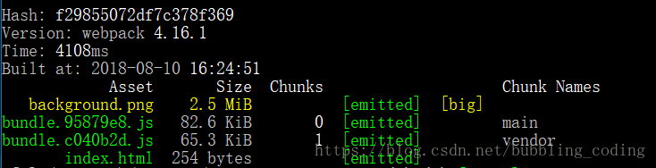

[TOC]


## 1. 模块热替换 ##

[参考地址-官网](https://www.webpackjs.com/guides/hot-module-replacement/)

### 1.1 启用 HMR ###

> **HMR** *不适用于生产环境，*[生产环境构建指南](https://www.webpackjs.com/guides/production)*。*

启用此功能需要更新 [webpack-dev-server](https://github.com/webpack/webpack-dev-server) 的配置，和使用 webpack 内置的 HMR 插件。

> *如果你使用了* `webpack-dev-middleware` *而没有使用* `webpack-dev-server`*，请使用* [`webpack-hot-middleware`](https://github.com/webpack-contrib/webpack-hot-middleware) *package 包，以在你的自定义服务或应用程序上启用 HMR。*

**webpack.config.js**

```js
const path = require('path');
  const HtmlWebpackPlugin = require('html-webpack-plugin');
  const CleanWebpackPlugin = require('clean-webpack-plugin');
  const webpack = require('webpack');

  module.exports = {
    // ...
    devServer: {
      contentBase: './dist',
      hot: true
    }
  };
```

**worker.js**

```js
if (module.hot) {
  	module.hot.accept('./print.js', function() {
    console.log('Accepting the updated printMe module!');
    printMe();
  })
}
```

> [注意点](https://www.webpackjs.com/guides/hot-module-replacement/#%E9%97%AE%E9%A2%98)

### 1.2 HMR 修改样式表 ###

**CSS 的模块热更新**，借助于 `style-loader` 。

## 2. Tree shaking ##

[参考1-官网](https://www.webpackjs.com/guides/tree-shaking/)，[参考2-博客](https://www.colabug.com/4053006.html)

### 2.1 sideEffects  ###

- `false` ，所有文件代码都没有副作用
- 数组，指定文件代码是没有副作用

**「副作用」**的定义是，在导入时**会执行特殊行为的代码**，而不是仅仅暴露一个 export 或多个 export。举例说明，例如 ***polyfill***，它影响全局作用域，并且通常不提供 export。**有副作用的不能tree sharking!**

> **注意**，任何导入的文件都会受到 tree shaking 的影响。这意味着，如果在项目中使用类似 `css-loader` 并导入 CSS 文件，则需要将其添加到 side effect 列表中，以免在生产模式中无意中将它删除

```js
{
  "name": "your-project",
  "sideEffects": [
    "./src/some-side-effectful-file.js",
    "*.css"
  ]
}
```

> 还可以在 [`module.rules` 配置选项](https://github.com/webpack/webpack/issues/6065#issuecomment-351060570) 中设置 `"sideEffects"`

### 2.2 压缩输出 ###

> *注意，也可以在命令行接口中使用* `--optimize-minimize` *标记，来使用* `UglifyJSPlugin`

从 webpack 4 开始，也可以通过 `"mode"` 配置选项轻松切换到压缩输出，只需设置为 `"production"`。

**webpack.config.js**

```js
module.exports = {
  // ...
  mode: "production"
};
```

### 2.3 tree sharking 条件 ###

- 使用 ES2015 模块语法（即 `import` 和 `export`）
- 在项目 `package.json` 文件中，添加一个 `sideEffects`入口
- **引入一个能够删除未引用代码(dead code)的压缩工具(minifier)（例如 `UglifyJSPlugin`,  webpack4 开始可以设置 `mode`: `"production"`来代替）**

## 3.  devtool ##

[参考-官网](https://www.webpackjs.com/configuration/devtool/)

> **生产环境**，在使用 `uglifyjs-webpack-plugin` 时，你必须提供 `sourceMap：true` 选项来启用 source map 支持。
>
> **鼓励你在生产环境中启用 source map**，因为它们对调试源码(debug)和运行基准测试(benchmark tests)很有帮助。

### 3.1 对于开发环境 ###

* `eval` - **映射到转换后的代码**
* `eval-source-map` - **行数能够正确映射，会映射到原始代码中。**
* `cheap-eval-source-map` - 类似 `eval-source-map`，每个模块使用 `eval()` 执行。这是 **"cheap(低开销)" 的 source map**，因为它没有生成列映射(column mapping)，只是**映射行数。它会忽略源自 loader 的 source map，**并且仅显示转译后的代码，就像 `eval` devtool。
* `cheap-module-eval-source-map` - 类似 `cheap-eval-source-map`，并且，在这种情况下，**源自 loader 的 source map 会得到更好的处理结果。然而，loader source map 会被简化为每行一个映射(mapping)。**

### 3.2 特定场景 ###

以下选项对于开发环境和生产环境并不理想。他们是一些特定场景下需要的，例如，针对一些第三方工具。

* `inline-source-map` - source map 转换为 DataUrl 后添加到 bundle 中。
* `cheap-source-map` - 没有列映射(column mapping)的 source map，忽略 loader source map。
* `inline-cheap-source-map` - 类似 `cheap-source-map`，但是 source map 转换为 DataUrl 后添加到 bundle 中。
* `cheap-module-source-map` - 没有列映射(column mapping)的 source map，将 loader source map 简化为每行一个映射(mapping)。
* `inline-cheap-module-source-map` - 类似 `cheap-module-source-map`，但是 source mapp 转换为 DataUrl 添加到 bundle 中。

### 3.3 对于生产环境

这些选项通常用于生产环境中：

* `(none)`（省略 `devtool` 选项） - 不生成 source map。这是一个不错的选择。
* `source-map` - 整个 source map 作为一个单独的文件生成。它为 bundle 添加了一个引用注释，以便开发工具知道在哪里可以找到它。

> 你应该将你的服务器配置为，不允许普通用户访问 source map 文件！

* `hidden-source-map` - 与 `source-map` 相同，但不会为 bundle 添加引用注释。如果你只想 source map 映射那些源自错误报告的错误堆栈跟踪信息，但不想为浏览器开发工具暴露你的 source map，这个选项会很有用。

> 你不应将 source map 文件部署到 web 服务器。而是只将其用于错误报告工具。

* `nosources-source-map` - 创建的 source map 不包含 `sourcesContent(源代码内容)`。它可以用来映射客户端上的堆栈跟踪，而无须暴露所有的源代码。你可以将 source map 文件部署到 web 服务器。

> 这仍然会暴露反编译后的文件名和结构，但它不会暴露原始代码。


## 4. 指定环境变量 ##

[参考-官网](https://www.webpackjs.com/guides/production/#%E6%8C%87%E5%AE%9A%E7%8E%AF%E5%A2%83)

### 4.1 基本使用 ###

许多 library 将通过与 `process.env.NODE_ENV` 环境变量关联，以决定 library 中应该引用哪些内容。例如，当不处于*生产环境*中时，某些 library 为了使调试变得容易，可能会添加额外的日志记录(log)和测试(test)。其实，**当使用 `process.env.NODE_ENV === 'production'` 时，一些 library 可能针对具体用户的环境进行代码优化，从而删除或添加一些重要代码。**我们可以使用 webpack 内置的 **[`DefinePlugin`](https://www.webpackjs.com/plugins/define-plugin) 为所有的依赖定义这个变量**：

> process 是 node 的全局变量，并且 process 有 env 这个属性，但是没有 NODE_ENV 这个属性。
>
> 1. 这个变量并不是 process.env 直接就有的，而是通过设置得到的。
> 2. 这个变量的作用是：我们可以通过判断这个变量区分开发环境或生产环境。

**webpack.prod.js**

```js
  const webpack = require('webpack');
  const merge = require('webpack-merge');
  const common = require('./webpack.common.js');

  module.exports = merge(common, {
    plugins: [
      new webpack.DefinePlugin({
        'process.env.NODE_ENV': JSON.stringify('production')
      })
    ]
  });
```

> 技术上讲，`NODE_ENV` 是一个由 Node.js 暴露给执行脚本的系统环境变量。通常用于决定在开发环境与生产环境(dev-vs-prod)下，服务器工具、构建脚本和客户端 library 的行为。然而，与预期不同的是，无法在构建脚本 `webpack.config.js` 中，将 `process.env.NODE_ENV` 设置为 `"production"`，请查看 [#2537](https://github.com/webpack/webpack/issues/2537)。
>
> **例如 `process.env.NODE_ENV === 'production' ? '[name].[hash].bundle.js' : '[name].bundle.js'` 这样的条件语句，在 webpack 配置文件中，无法按照预期运行。**
>
> 还要注意，任何位于 `/src` 的本地代码都可以关联到 process.env.NODE_ENV 环境变量，所以以下检查也是有效的：

**src/worker.js**

```js
  import { cube } from './math.js';

  if (process.env.NODE_ENV !== 'production') {
    console.log('Looks like we are in development mode!');
  }
```

### 4.2疑问? ###

为什么 [webpack官网](https://www.webpackjs.com/guides/production/#%E6%8C%87%E5%AE%9A%E7%8E%AF%E5%A2%83) 里面说:

> process.env.NODE_ENV === 'production' ? '[name].[hash].bundle.js' : '[name].bundle.js'`这样的条件语句，在 webpack 配置文件中，无法按照预期运行。

但是 [MiniCssExtractPlugin 官网](https://www.npmjs.com/package/mini-css-extract-plugin#minimal-example) 里面可以如下使用：

```js
const devMode = process.env.NODE_ENV !== 'production'
```

### 4.3 解惑 ###

[参考-网友博客](https://blog.csdn.net/icewfz/article/details/76640319)

1. 在初始状态下 " *配置文件* "  和  " *src 下面的文件* "  输出的`process.env.NODE_ENV`值都是 `undefined`。
2. webpack config文件中定义的变量是为了你将要打包的文件中用的。配置如下：

```js
// 方式一
new webpack.DefinePlugin({
    'process.env.NODE_ENV': JSON.stringify('production')
})

// 方式二
{
    mode: 'production'
}
```

> *记住，只设置* `NODE_ENV`*，则不会自动设置* `mode`。

3. 如何在`webpack`配置文件里获取`NODE_ENV`的值呢，这样就可以根据不同的值定义相关的参数了，如上所述，答案是：`corss-env`，在package.json里增加如下配置：

```js
"scripts": {
    "build-cross-env":"cross-env NODE_ENV=production webpack"
  }
```

>通过`cross-env NODE_ENV=production`，信息传递给了webpack的配置文件, src文件下面不能访问。

## 5. 代码分离 ##

[参考-官网](https://www.webpackjs.com/guides/code-splitting/)

### 5.1 概述 ###

把代码分离到不同的 bundle 中，然后可以**按需加载或并行加载**这些文件。代码分离可以用于获取**更小的 bundle**，以及**控制资源加载优先级**，如果使用合理，会极大影响加载时间。

有三种常用的代码分离方法：

- **入口起点**：使用 [`entry`](https://www.webpackjs.com/configuration/entry-context) 配置手动地分离代码。
- **防止重复**：使用 [`CommonsChunkPlugin`](https://www.webpackjs.com/plugins/commons-chunk-plugin) 去重和分离 chunk。
- **动态导入**：通过模块的内联函数调用来分离代码。

### 5.2 动态导入(dynamic imports) ###

当涉及到动态代码拆分时，webpack 提供了两个类似的技术。对于动态导入，第一种，也是优先选择的方式是，使用符合 [ECMAScript 提案](https://github.com/tc39/proposal-dynamic-import) 的 [`import()` 语法](https://www.webpackjs.com/api/module-methods#import-)。第二种，则是使用 webpack 特定的 [`require.ensure`](https://www.webpackjs.com/api/module-methods#require-ensure)。让我们先尝试使用第一种……

> `import()` *调用会在内部用到* [promises](https://developer.mozilla.org/en-US/docs/Web/JavaScript/Reference/Global_Objects/Promise)*。如果在旧有版本浏览器中使用* `import()`*，记得使用 一个 polyfill 库（例如* [es6-promise](https://github.com/stefanpenner/es6-promise) *或* [promise-polyfill](https://github.com/taylorhakes/promise-polyfill)*），来 shim* `Promise`*。*

**worker.js**

```js
// 方式一
const _ = await import(/* webpackChunkName: "lodash" */ 'lodash');

// 方式二
import(/* webpackChunkName: "print" */ './print').then(module => {
      var print = module.default;
      print();
});
```

> *注意当调用 ES6 模块的* `import()` *方法（引入模块）时，必须指向模块的* `.default` *值，因为**它才是 promise 被处理后返回的实际的* `module` *对象**。*

**webpack.config.js**

```js
output: {
    filename: '[name].bundle.js',
    chunkFilename: '[name].bundle.js',
    path: path.resolve(__dirname, 'dist')
}
```

### 5.3 bundle 分析 ###

[参考——官网](https://www.webpackjs.com/guides/code-splitting/#bundle-%E5%88%86%E6%9E%90-bundle-analysis-)

## 6. 缓存 ##

### 6.1 hash、chunkhash和contenthash三者的区别 ###

[参考-网友博客](https://blog.csdn.net/u014628388/article/details/82389328)

**hash**

**跟整个webpack构建项目相关**的，每次项目构建hash对应的值都是不同的，即使项目文件没有做**“任何修改”**。

> 其实是有修改的，因为每次webpack打包编译都会注入webpack的运行时代码，导致整个项目有变化，所以每次hash值都会变化的。


**chunkhash**

**根据不同的入口文件(Entry)进行依赖文件解析、构建对应的chunk，生成对应的hash值。**我们在生产环境里把一些公共库和程序入口文件区分开，单独打包构建，接着我们采用chunkhash的方式生成hash值，那么只要我们不改动公共库的代码，就可以保证其hash值不会受影响。

 ***对css使用了chunkhash之后***，它与依赖它的chunk共用chunkhash，测试后会发现，***css与js文件名的chunkhash值是一样的***，`JS` 和 `CSS` 相互影响。

**css文件最好使用contenthash**。



**contenthash**

contenthash表示**由文件内容产生的hash值**，内容不同产生的contenthash值也不一样。

### 6.2 实现图片/字体的缓存 ###

对于图片、字体等静态资源，生成对应的文件hash值是由对应的`file-loader`来计算的。

那么这些静态文件的hash值使用的是什么hash值呢？

其实就是`hash`属性值。此hash非webpack每次项目构建的hash，它是***由file-loader根据文件内容计算出来的，不要误认为是webpack构建的hash***。

## 7. 多种配置类型(configuration types) ##

[参考-官网](<https://www.webpackjs.com/configuration/configuration-types/>)

### 7.1 导出为一个函数

```js
 module.exports = function(env, argv) {
   return {
     mode: env.production ? 'production' : 'development',
     devtool: env.production ? 'source-maps' : 'eval',
     plugins: [
       new webpack.optimize.UglifyJsPlugin({
         compress: argv['optimize-minimize'] // 只有传入 -p 或 --optimize-minimize
       })
     ]
   };
};
```

当 webpack 配置对象[导出为一个函数](https://www.webpackjs.com/configuration/configuration-types#exporting-a-function)时，可以向起传入一个"环境对象(environment)"。也可以通过 [指定环境变量](#4. 指定环境变量) 中的 `cross-env NODE_ENV=production webpack"` 配置

```bash
webpack --env.NODE_ENV=local --env.production --progress
```

> *如果设置* `env` *变量，却没有赋值，*`--env.production` *默认将* `--env.production` *设置为* `true`*。还有其他可以使用的语法。有关详细信息，请查看* [webpack CLI](https://www.webpackjs.com/api/cli/#environment-options) *文档。*

### 7.2 导出一个 Promise

webpack 将运行由配置文件导出的函数，并且等待 Promise 返回。便于需要异步地加载所需的配置变量。

```js
module.exports = () => {
  return new Promise((resolve, reject) => {
    setTimeout(() => {
      resolve({
        entry: './app.js',
        /* ... */
      })
    }, 5000)
  })
}
```

### 7.3 导出一个配置对象 ###

### 7.4 导出数组，多个配置对象 ###


## 8. webpack-dev-server的刷新模式inline和iframe详解 ##

[参考-博客](https://segmentfault.com/a/1190000014141798)

***iframe***

1. 在网页中嵌入了一个`iframe`，将我们自己的应用注入到这个`iframe`当中去。
2. 在页面头部有一个提示框，用于显示构建过程的状态信息。
3. 加载了`live.bundle.js`文件，其不但创建了`iframe`标签，同时包含`socket.io`的`client`代码，以和`webpack-dev-server`进行`websocket`通讯，从而完成自动编译打包、页面自动刷新的功能。

***inline***

1. 构建消息在浏览器控制台显示。
2. `socket.io`的`client`代码被打包进了你的包(`bundle`)中，以此来与`webpack-dev-server`进行`websocket`通讯，从而完成自动编译打包、页面自动刷新的功能。
3. 但是，每一个入口文件都会被插入上述的一段脚本，使得打包后的`bundle`文件很臃肿。

**总结**

1. `Iframe mode`和`Inline mode`最后达到的效果都是一样的，都是监听文件的变化，然后再将编译后的文件推送到前端，完成页面的`reload`的。
2. 通过设置`devServer.inline`切换两种模式，默认为`inline`模式。
3. 当使用HMR功能时，推荐使用`inline mode`。


## 9. 模式 ##

[参考-官网](<https://www.webpackjs.com/concepts/mode/>)

> *记住，只设置* `NODE_ENV`*，则不会自动设置* `mode`*。*

### 9.1 用法 ###

只在配置中提供 `mode` 选项：

```javascript
module.exports = {
  mode: 'production'
};
```

或者从 [CLI](https://www.webpackjs.com/api/cli/) 参数中传递：

```bash
webpack --mode=production
```

### 9.2 production ###

> 会将 `process.env.NODE_ENV` 的值设为 `production`。启用 `FlagDependencyUsagePlugin`, `FlagIncludedChunksPlugin`, `ModuleConcatenationPlugin`, `NoEmitOnErrorsPlugin`, `OccurrenceOrderPlugin`, `SideEffectsFlagPlugin` 和 `UglifyJsPlugin`.

**mode: production**

```js
// webpack.production.config.js
module.exports = {
+  mode: 'production',
-  plugins: [
-    new UglifyJsPlugin(/* ... */),
-    new webpack.DefinePlugin({ "process.env.NODE_ENV": JSON.stringify("production") }),
-    new webpack.optimize.ModuleConcatenationPlugin(),
-    new webpack.NoEmitOnErrorsPlugin()
-  ]
}
```

### 9.3 development ###

> 会将 `process.env.NODE_ENV` 的值设为 `development`。启用 `NamedChunksPlugin` 和 `NamedModulesPlugin`。

**mode: development**

```js
// webpack.development.config.js
module.exports = {
+ mode: 'development'
- plugins: [
-   new webpack.NamedModulesPlugin(),
-   new webpack.DefinePlugin({ "process.env.NODE_ENV": JSON.stringify("development") }),
- ]
}
```

## 10. output ##

### 10.1 output.library ###

对于用途广泛的 library，我们希望它能够兼容不同的环境，例如 CommonJS，AMD，Node.js 或者作为一个全局变量。**为了让你的 library 能够在各种用户环境(consumption)中可用，需要在 `output` 中添加 `library` 属性。**

为了让 library 和其他环境兼容，还需要在配置文件中添加 `libraryTarget` 属性。这是可以控制 library 如何以不同方式暴露的选项，`output.libraryTarget` 的默认选项是 `var`。

```js
  output: {
      path: path.resolve(__dirname, 'dist'),
      filename: 'webpack-numbers.js',
      library: 'webpackNumbers'
      library: 'webpackNumbers',
      libraryTarget: 'umd'
    },
```

### 10.2 output.publicPath 和 devServer.publicPath ###

***output.publicPath 和 devServer.publicPath*** 的区别

*devServer.publicPath* 的意义就是**决定外部能以怎样的路径通过 devServer来访问构建在内存中的文件**，这个字段未显式设定时，则会去沿用 `output.publicPath` 字段的显式值（如果output.publicPath有的话，否则就用自己的 `default` 值）。*output.publicPath* 的意义是**用来为构建的文件生成满足特定需求的前缀，并将这个前缀提供给需要的 resolver、plugin 或者其他的配置字段**。

> HtmlWebpackPlugin 中的filename 也会依赖于public.publicPath

[参考-博客](<https://www.jianshu.com/p/7d43d45b3ebf>)

### 10.3 output.path ###

这个字段只在 `production` 配置下有效，如果你去试一下的话，你会发现在 `development` 配置下，无论你给把它配置成什么值（前提必须是一个合规的绝对地址），它都不会对你访问开发时构建在内存中的文件产生影响，所以 `development` 配置下，直接忽略就好了。另外，它的 `default` 值是 `path.resolve(__dirname, './dist')


## 11. webpack.optimize.ModuleConcatenationPlugin ##

[Webpack 3 的新功能：Scope Hoisting](<https://juejin.im/entry/5971483951882552681c4a30>)

过去 webpack 打包时的一个取舍是将 bundle 中各个模块单独***打包成闭包***。这些打包函数使你的 JavaScript 在浏览器中***处理的更慢***。相比之下，一些工具像 Closure Compiler 和 RollupJS 可以提升(hoist)或者***预编译所有模块到一个闭包中***，***提升你的代码在浏览器中的执行速度***。这个插件会在 webpack 中实现以上的预编译功能。

## 12. devServer ##

> `devServer` 构建的文件是在内存里的，而非你电脑的磁盘上，但是如果内存中找不到想要的文件时，`devServer` 会根据文件的路径尝试去电脑的磁盘上找，如果这样还找不到才会 `404`。
>
> 开发时在内存和 `contentBase` 下真实的磁盘路径中存在着同样文件名的文件，那么 `devServer` 返回的是内存的那个

### 12.1 devServer.historyApiFallback ###

```js
 historyApiFallback: {
     rewrites: [
         { from: /.*/, to: path.posix.join(devConfig.assetsPublicPath, 'index.html') },
     ],
 },
```

当使用 [HTML5 History API](https://developer.mozilla.org/en-US/docs/Web/API/History) 时，任意的 `404` 响应都可能需要被替代为 `index.html`。通过传入以下启用：

```js
historyApiFallback: true
```

通过传入一个对象，比如使用 `rewrites` 这个选项，此行为可进一步地控制：

```js
historyApiFallback: {
  rewrites: [
    { from: /^\/$/, to: '/views/landing.html' },
    { from: /^\/subpage/, to: '/views/subpage.html' },
    { from: /./, to: '/views/404.html' }
  ]
}
```

### 12.2 devServer.publicPath ###

决定外部能够以什么样的路径访问到构建的文件。

与 output.publicPath 的关系 [查看](#10.2 output.publicPath 和 devServer.publicPath)

## 13. VUE-CLI 中常见配置 ##

[参考-博客](<https://www.cnblogs.com/tylerdonet/p/7156359.html>)

### 13.1 .babelrc文件 ###

这个文件放在根目录下面设置转码规则的。例如要想在代码中使用es6，就要在这个文件中配置`"presets": ["es2015"]`。在项目代码中要使用jsx语法除了安装[babel-plugin-transform-vue-jsx](https://github.com/vuejs/babel-plugin-transform-vue-jsx)插件之外，还要配置`"plugins": ["transform-runtime", "transform-vue-jsx"]`。

### 13.2 .editorconfig文件 ###

这个文件配置编辑器的编码风格

[EditorConfig 介绍-博客](<https://www.jianshu.com/p/712cea0ef70e>)

### 13.3 .eslintrc  ###

[参考-博客](<https://www.jianshu.com/p/ad6784d028aa>)

**配置 ESLint**

可以通过以下三种方式配置 ESLint:

- 使用 .eslintrc 文件（支持 JSON 和 YAML 两种语法）；
- 在 package.json 中添加 eslintConfig 配置块；
- 直接在代码文件中定义。

**.eslintrc 文件示例：**

```json
{
  "env": {
    "browser": true,
  },
  "globals": {
    "angular": true,
  },
  "rules": {
    "camelcase": 2,
    "curly": 2,
    "brace-style": [2, "1tbs"],
    "quotes": [2, "single"],
    "semi": [2, "always"],
    "space-in-brackets": [2, "never"],
    "space-infix-ops": 2,
  }
}
```

> 放在项目根目录，则会应用到整个项目；如果子目录中也包含 .eslintrc 文件，则子目录会忽略根目录的配置文件，应用该目录中的配置文件。这样可以方便地对不同环境的代码应用不同的规则。

### 13.4 .eslintignore文件 ###

想要引入三方js库，但是这些库不符合eslint规范，可以在这个文件里忽略掉，例如：

```yaml
build/*.js
config/*.js
static
```

### 13.5 .gitignore文件 ###

这个文件用于配置不需要加入版本管理的文件，例如：

```YAML
.DS_Store
node_modules/
npm-debug.log
test/unit/coverage
test/e2e/reports
selenium-debug.log
.idea
/clear
/src/modules/cache.js
```

### 13.6 .browserslist ###

[参考-博客](<https://www.jianshu.com/p/d45a31c50711>)

[npm地址](https://www.npmjs.com/package/browserslist)

这个配置能够分享目标浏览器和nodejs版本在不同的前端工具。这些工具能根据目标浏览器自动来进行配置。

**使用方法**

(1) package.json （推荐

```js
{
  "browserslist": [
    "last 1 version",
    "> 1%",
    "maintained node versions",
    "not dead"
  ]
}
```

(2) .browserslistrc

```bash
# Browsers that we support

last 1 version
> 1%
maintained node versions
not dead
```

Browserslist 的数据都是来自[Can I Use](http://caniuse.com/)的。如果你想知道配置语句的查询结果可以使用[online demo](<https://browserl.ist/>)

### 13.7 .postcssrc.js ###

[参考-官网](https://github.com/michael-ciniawsky/postcss-load-config)

> 只是多种配置方式的一种

```js
module.exports = {
  "plugins": {
    "postcss-import": {},
    "postcss-url": {},
    // to edit target browsers: use "browserslist" field in package.json
    "autoprefixer": {}
  }
}
```


## 14. eslint ##

[参考-中文官网](<https://cn.eslint.org/>)

## 15. watch 和 watchOption ##

[参考-webpack](https://www.webpackjs.com/configuration/watch/)

> *webpack-dev-server 和 webpack-dev-middleware 里 Watch 模式默认开启。*

## 16. SplitChunksPlugin ##

[参考1-webpack-英文](http://webpack.html.cn/plugins/split-chunks-plugin.html)

[参考2-博客-中文](<https://segmentfault.com/a/1190000015938570>)

> 默认配置即是我们推荐的web最佳实践,但是你项目的最佳策略根据项目类型可能会有所不同

默认将所有来源于`node_modules`的模块分配到叫做`venders`的缓存组,所有引用**超过两次**的模块分配到`default`缓存组.