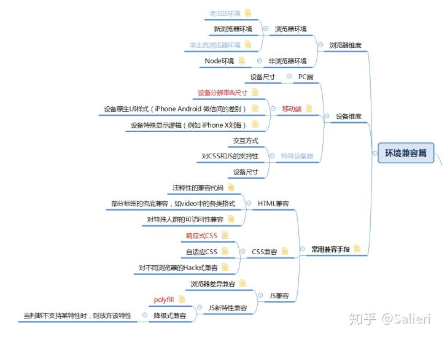

[前端有哪些常见*兼容*问题，如何解决啊？](https://www.zhihu.com/question/302297294/answer/531124958) ——　[Salieri](https://www.zhihu.com/people/salieri-67)

> 作者：Salieri
>
> 链接：https://www.zhihu.com/question/302297294/answer/531124958
>
> 来源：知乎
>
> 著作权归作者所有。商业转载请联系作者获得授权，非商业转载请注明出处。

## 一、针对浏览器的兼容

这部分的主要目的是针对不同的浏览器环境（比如主流的Chrome,Firefox,Edge...）和浏览器内部的不同特性，进行CSS,和JS上的代码兼容（新浏览器一般在HTML上遵循同样的规范，所以除了针对老版IE外，很少需要单独在HTML上进行代码兼容）。

而针对浏览器兼容的常用手法主要分两类：

### 1. 编写代码时的兼容

指在编写代码时，向源代码中加入兼容代码，实现兼容性。

优点：兼容代码在源码中，易于调试定位和选择性兼容。

缺点：源码中额外的兼容性代码，可能破坏原代码的结构，且需要人工维护。

常见方案包括：

1. HTML注释性兼容（HTML识别，**条件注释法(IE10+已经不支持条件注释)**）
2. 利用JS兼容HTML的缺失功能
3. 手动编写CSS的各种prefixer或CSS Hack
4. 利用IDE的插件，自动插入CSS的prefixer
5. 手动为JS的新特性编写或引入相应的polyfill

### 2. 集成代码时的兼容

指在源码完成后，利用代码集成工具打包集成时，通过工具的loader或插件自动完成代码兼容。

优点：代码兼容部分由插件自动处理，只需在必要时提供兼容性配置，不需要额外关心兼容细节

缺点：兼容部分在源码中不可见，需要额外了解插件的工作机制，有时候会引入不必要的兼容代码导致代码体积增大。

常用的打包集成工具包括[Webpack](https://link.zhihu.com/?target=https%3A//webpack.js.org/)，[Gulp](https://link.zhihu.com/?target=https%3A//gulpjs.com/)，[Browserify](https://link.zhihu.com/?target=http%3A//browserify.org/)等

常用的兼容插件包括：

1. Babel中的[preset-env](https://link.zhihu.com/?target=https%3A//babeljs.io/docs/en/babel-preset-env)
2. Babel中的[polyfill](https://link.zhihu.com/?target=https%3A//babeljs.io/docs/en/babel-polyfill)
3. postcss中的[autoprefixer](https://link.zhihu.com/?target=https%3A//github.com/postcss/autoprefixer)

## 二、针对硬件设备的兼容

主要目的是针对不同的硬件设备环境（比如PC端，Android端，IphoneX端，Ipad端...），进行现实逻辑，页面尺寸和交互方式上的功能兼容。

主要考虑因素包括：

### 1. 设备尺寸&分辨率

针对不同设备尺寸的兼容方案包括：

1. 响应式CSS（主要兼容PC端和移动端）
2. 自适应CSS（主要兼容同一类硬件设备下的不同尺寸，也可用于兼容PC端和移动端）
3. 利用JS配合CSS进行兼容（主要兼容不同尺寸的移动端设备）
4. 针对不同设备区别设计（不属于严格意义上的兼容）

### 2. 交互方式

这一点在某些场景下需要区分，比如移动端的滑动事件和PC端的拖动事件等

兼容方案：

1. 使用JS兼容不同设备下的相关事件

### 3. 特殊设备显示逻辑

比如IphoneX上的刘海，有可能导致正常的页面吸底样式在滑动时出现问题。

兼容方案：

1. 使用JS代码进行兼容

## 三、兼容方案总结

1. HTML注释性兼容（HTML识别，**条件注释法(IE10+已经不支持条件注释)**）
2. CSS的prefixer或CSS Hack兼容
3. CSS响应式兼容
4. CSS自适应兼容
5. 利用JS兼容HTML功能
6. 利用JS判断设备差异并配合CSS兼容
7. 利用JS兼容不同设备间差异
8. JS polyfill 兼容
9. 依赖代码集成工具兼容