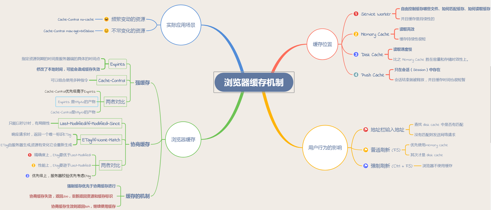

[TOC]

## 1. 浏览器并行下载相关 ##

### 1.1 `DNS`查找 ###

一个页面所需要访问的域名数量为n，那么就需要n次DNS查找，而**DNS查找通常是blocking call，**就是说在得到结果之后才能继续，所以越多的DNS查找，反应速度就越慢。

### 1.2 并发请求数 ###

> [浏览器可以并行下载多少个资源？](https://www.jianshu.com/p/8a86f414a69e)

**同一时间针对同一域名下的请求有一定数量限制**。超过限制数目的请求会被阻止。浏览器的并发数目一般限制在10以内,HTTP1.1 比 HTTP1.0 并发链接量高

### 1.3 网页效率之DNS查找和并行下载 ###

> [**网页效率之DNS查找和并行下载**](https://blog.csdn.net/21aspnet/article/details/6570449)

减少唯一主机名的数量有可能减少页面中并行下载的数量。避免DNS查找会缩短响应时间，但减少并行下载可能会增加响应时间。我的指导方针是将这些组件拆分为***至少两个但不超过四个主机名。这在减少DNS查找和允许高度并行下载之间产生了很好的折衷。***

### 1.4 并行下载 ###

**连接数** = 不同域名的**主机数**（最好至少两个但不超过四个主机名） *  服务器允许的**最大连接数**（或浏览器单个域名的最大请求数）

**下载数** = **连接数** * 每个连接内部的**流水线请求数**

> * **流水线请求**：在一个TCP连接内，多个HTTP请求可以并行，**下一个HTTP请求在上一个HTTP请求的应答完成之前就发起。**
>* 对服务器和浏览器来说，一个连接里**多个流水线请求**能够**比多个并行连接更好**些
> * 浏览器所允许的最多连接数,由**浏览器所允许最多连接数**(network.http.max-connections，缺省为24)，**和每个服务器所允许的最大连接数**(network.http.max-connections-per-server，缺省为8)决定。

## 2. 跨域 ##

> [**详解跨域(最全的解决方案)**](<https://www.imooc.com/article/21976>)

### 2.1 什么是跨域？ ###

**访问不同源的资源那就是我们所说的跨域**。访问同源的资源是被浏览器允许的，但是如果访问不同源（**同源是指，域名、协议、端口均为相同**）的资源，浏览器默认是不允许的。

### 2.2 什么是浏览器同源策略 ###

> [浏览器同源策略是什么？没有同源策略会怎么样？](https://www.jianshu.com/p/2547b0a15707)

同源策略（Same origin policy）是一种约定，它是浏览器最核心也最基本的安全功能，如果缺少了同源策略，则浏览器的正常功能可能都会受到影响。**可以说 Web 是构建在同源策略基础之上的，浏览器只是针对同源策略的一种实现**。

它的核心就在于**它认为站点装载的任何内容都是不安全的。当浏览器半信半疑的将脚本在沙箱运行时，它们应该只被允许访问来自同一站点的资源，而不是那些来自其它站点可能怀有恶意的资源。**

同源策略又分为以下两种：

1. ***DOM 同源策略***：禁止对不同源页面 DOM 进行操作。主要场景是 **iframe 跨域的情况**，**不同域名的 iframe 是限制互相访问的。**
2. ***XMLHttpRequest 同源策略***：禁止使用 XHR 对象向不同源的服务器地址发起 HTTP 请求。

### 2.3 不同源会怎么样？

对于js脚本有限制。
主要表现在3点
（1） 无法用js读取非同源的Cookie、LocalStorage 和 IndexDB 无法读取。
（2） 无法用js获取非同源的DOM 。
（3） 无法用js发送非同源的AJAX请求 。更准确的说，js可以向非同源的服务器发请求，但是服务器返回的数据会被浏览器拦截。

### 2.4 是谁来执行同源策略的？

> [关于跨域限制，仅仅是浏览器的行为，和服务端无关](https://segmentfault.com/a/1190000012163420)

同源策略是由浏览器来执行。所有的限制都是浏览器的作用。这是浏览器为了保护用户的数据安全而采取的策略。

### 2.5 同源策略如何保护用户数据安全？没有同源策略会怎么样？ ###

**（1） 无法用js读取非同源的Cookie、LocalStorage 和 IndexDB 无法读取。**

防止恶意网站通过js获取用户其他网站的cookie。

**（2） 无法用js获取非同源的DOM 。**

如果没有这一条，恶意网站可以通过iframe打开银行页面，可以获取dom就相当于可以获取整个银行页面的信息。

**（3） 无法用js发送非同源的AJAX请求 。**

> [AJAX跨域访问被禁止的原因](<https://blog.csdn.net/hcrw01/article/details/84289109>)

**例子：**

假设有一个黑客叫做小黑，他从网上抓取了一堆美女图做了一个网站，每日访问量爆表。
为了维护网站运行，小黑挂了一张收款码，觉得网站不错的可以适当资助一点，可是无奈伸手党太多，小黑的网站入不敷出。
于是他非常生气的在网页中写了一段js代码，使用ajax向淘宝发起登陆请求，因为很多数人都访问过淘宝，所以电脑中存有淘宝的cookie，不需要输入账号密码直接就自动登录了，然后小黑在ajax回调函数中解析了淘宝返回的数据，得到了很多人的隐私信息，转手一卖，小黑的网站终于盈利了。
如果跨域也可以发送AJAX请求的话，小黑就真的获取到了用户的隐私并成功获利了！！！

### 2.6 跨域的判定流程

> [浏览器和服务器实现跨域(CORS)判定的原理](https://blog.csdn.net/zmx729618/article/details/53319383)

1. 浏览器先根据同源策略对前端页面和后台交互地址做匹配，若同源，则直接发送数据请求；若不同源，则发送跨域请求。
2. 服务器解析程序收到浏览器跨域请求后，根据自身配置返回对应文件头。若未配置过任何允许跨域，则文件头里不包含`Access-Control-Allow-origin`字段，若配置过域名，则返回`Access-Control-Allow-origin`+ `对应配置规则里的域名的方式`。
3. 浏览器根据接受到的http文件头里的`Access-Control-Allow-origin`字段做匹配，若无该字段，说明不允许跨域；若有该字段，则对字段内容和当前域名做比对，如果同源，则说明可以跨域，浏览器发送该请求；若不同源，则说明该域名不可跨域，不发送请求

### 2.7 跨域的解决办法 ###

1. jsonp跨域
   jsonp跨域其实也是JavaScript设计模式中的一种代理模式。在html页面中通过相应的标签从不同域名下加载静态资源文件是被浏览器允许的，所以我们可以通过这个“犯罪漏洞”来进行跨域。一般，我们可以动态的创建script标签，再去请求一个带参网址来实现跨域通信

   ```js
   //原生的实现方式
   let script = document.createElement('script');
   script.type = "text/javascript";
   script.src = 'http://www.nealyang.cn/login?username=Nealyang&callback=callback';
   document.body.appendChild(script);
   ```

2. document.domain + iframe 跨域

   这种跨域的方式最主要的是要求主域名相同。什么是主域名相同呢？
   `www.geekjc.com  aaa.geekjc.com ba.ad.geekjc.com `这三个主域名都是geekjc.com,而主域名不同的就不能用此方法。

   ```js
   document.domain = 'geekjc.com'
   ```

3. window.name + iframe 跨域

4. location.hash + iframe 跨域

5. postMessage跨域这是由H5提出来的一个炫酷的API，IE8+，chrome,ff都已经支持实现了这个功能。这个功能也是非常的简单，其中包括接受信息的Message事件，和发送信息的postMessage方法。

   发送信息的postMessage方法是向外界窗口发送信息

   ```js
   otherWindow.postMessage(message,targetOrigin);
   ```
   
6. 跨域资源共享 CORS
   
> [CORS 跨域资源共享](<https://blog.haoduoyu.cc/2016/11/20/CORS-%E8%B7%A8%E5%9F%9F%E8%B5%84%E6%BA%90%E5%85%B1%E4%BA%AB/>)
   >
> [HTTP访问控制（CORS）](https://developer.mozilla.org/zh-CN/docs/Web/HTTP/Access_control_CORS)——主要

**CORS 背后的的基本思想，就是使用自定义的 HTTP 头部让浏览器与服务器进行沟通，从而决定请求或响应的成功和失败。**

CORS 需要浏览器和服务器同时支持。目前，大部分浏览器都支持该功能 [(浏览器支持情况)](http://caniuse.com/#search=cors)。CORS 通信与同源的 AJAX 通信没有差别。浏览器一旦发现 AJAX 请求跨源，就会自动添加一些附加的头信息，有时还会多出一次附加的请求，但用户不会有感觉。因此，实现 CORS 通信的关键是服务器。只要服务器实现了 CORS 接口，就可以跨源通信。

   > **错误捕获**：如果 Origin 指定的源，不在许可范围内，服务器会返回一个正常的 HTTP 回应。浏览器发现，这个回应的头信息没有包含 Access-Control-Allow-Origin 字段，就知道出错了，从而抛出一个错误，被 XMLHttpRequest 的 onerror 回调函数捕获。

   **响应头**

> [http之Access-Control-Max-Age](https://blog.csdn.net/john1337/article/details/78928851)

   ```http
   Access-Control-Allow-Origin: <origin> | *
   Access-Control-Max-Age: <delta-seconds>
   Access-Control-Allow-Credentials: true
   Access-Control-Allow-Methods: <method>[, <method>]*
   ```

   > `Access-Control-Allow-Credentials` 头 工作中与[`XMLHttpRequest.withCredentials`](https://developer.mozilla.org/zh-CN/docs/Web/API/XMLHttpRequest/withCredentials) 或Fetch API中的[`Request()`](https://developer.mozilla.org/zh-CN/docs/Web/API/Request/Request) 构造器中的`credentials` 选项结合使用。Credentials必须在前后端都被配置（即the `Access-Control-Allow-Credentials` header 和 XHR 或Fetch request中都要配置）才能使带credentials的CORS请求成功。
   >
   > 不同源`key`

   **预检请求** —— preflight

7. WebSocket协议跨域

   WebSocket protocol是HTML5一种新的协议。它实现了浏览器与服务器全双工通信，同时允许跨域通讯，是server push技术的一种很好的实现。

   原生WebSocket API使用起来不太方便，[我们使用Socket.io](http://xn--socket-hz8ig3bo82im51b.io/)，它很好地封装了webSocket接口，提供了更简单、灵活的接口，也对不支持webSocket的浏览器提供了向下兼容。

8. node代理跨域

## 3. 浏览器缓存机制 ##

> [深入理解浏览器的缓存机制](https://www.jianshu.com/p/54cc04190252)

### 3.1 概述

> [设计一个无懈可击的浏览器缓存方案：关于思路，细节，ServiceWorker，以及HTTP/2](https://zhuanlan.zhihu.com/p/28113197)
>
> * `Memory Cache`、`Service Worker`、`HTTP Cache`、`Push Cache`
>



|状态	|类型	|说明|
|----|----|----|
|200	|form memory cache| 不请求网络资源，资源在内存当中，一般脚本、字体、图片会存在内存当中|
|200	|form disk ceche|	不请求网络资源，在磁盘当中，一般非脚本会存在内存当中，如css等|
|200	|资源大小数值|	从服务器下载最新资源|
|304	|报文大小|	请求服务端发现资源没有更新，使用本地资源|

### 3.2 Memory Cache

主要包含的是当前文档中页面中已经抓取到的资源。例如页面上已经下载的样式、脚本、图片等。

其中最重要的缓存资源其实是preloader相关指令（例如`<link rel="prefetch">`）下载的资源。总所周知preloader的相关指令已经是页面优化的常见手段之一，而通过这些指令下载的资源也都会暂存到内存中。

内存缓存在缓存资源时并不关心返回资源的HTTP缓存头`Cache-Control`是什么值，同时资源的匹配也并非仅仅是对URL做匹配，还可能会对`Content-Type`，`CORS`等其他特征做校验。

### 3.3 Service workers 

本质上充当Web应用程序与浏览器之间的代理服务器

### 3.4 HTTP缓存

#### 3.4.1 强制缓存 ####

> 强制缓存(size: from disk cache)、对比缓存(status: 304)。
>
> 缓存规则信息包含在响应header

（1）强制缓存优先级高于对比缓存，也就是说，当执行强制缓存的规则时，如果缓存生效，直接使用缓存，不再执行对比缓存规则。

（2）对于强制缓存来说，响应header中会有两个字段来标明失效规则（Expires、Cache-Control）

* ***Expires***的值为**服务端返回的到期时间**，即下一次请求时，请求时间小于服务端返回的到期时间，直接使用缓存数据。不过Expires 是HTTP 1.0的东西，现在默认浏览器均默认使用HTTP 1.1，所以它的作用基本忽略。另一个问题是，到期时间是由服务端生成的，但是客户端时间可能跟服务端时间有误差，这就会导致缓存命中的误差。所以HTTP 1.1 的版本，使用Cache-Control替代。
* Cache-Control 是最重要的规则。常见的取值有private、public、no-cache、max-age，no-store，默认为private。
  * private: 客户端可以缓存
  * public: 客户端和代理服务器都可缓存（前端的同学，可以认为public和private是一样的）
  * max-age=xxx: 缓存的内容将在 xxx 秒后失效
  * no-cache: 需要使用对比缓存来验证缓存数据（后面介绍）
  * no-store:  **所有内容都不会缓存，强制缓存，对比缓存都不会触发**（对于前端开发来说，缓存越多越好，so...基本上和它说886）
* 浏览器缓存，Pragma

#### 3.4.2 协商缓存 ####

（1）对比缓存，顾名思义，需要进行比较判断是否可以使用缓存。浏览器第一次请求数据时，服务器会将缓存标识与数据一起返回给客户端，客户端将二者备份至缓存数据库中。再次请求数据时，客户端将备份的缓存标识发送给服务器，服务器根据缓存标识进行判断，判断成功后，返回304状态码，通知客户端比较成功，可以使用缓存数据。缓存标识的传递是我们着重需要理解的，它在请求header和响应header间进行传递，一共分为两种标识传递，接下来，我们分开介绍。

* Last-Modified(response header) / If-Modified-Since(request header用来发送last-modified)
* Etag(服务器响应请求时，告诉浏览器当前资源在服务器的唯一标识（生成规则由服务器决定）) / If-None-Match(发送Etag)。（优先级高于Last-Modified  /  If-Modified-Since）

### 3.5 push 缓存

“推送缓存”是针对HTTP/2标准下的推送资源设定的。推送缓存是session级别的，如果用户的session结束则资源被释放；即使URL相同但处于不同的session中也不会发生匹配。推送缓存的存储时间较短，在Chromium浏览器中只有5分钟左右，同时它也并非严格执行HTTP头中的缓存指令。

## 4. css、js阻塞

> * [原来 CSS 与 JS 是这样阻塞 DOM 解析和渲染的](https://juejin.im/post/59c60691518825396f4f71a1)
>

- `CSS`下载 不会阻塞 `DOM` 的解析，但会阻塞 DOM 渲染。

  > 基于性能与用户体验的考虑，浏览器会尽量减少渲染的次数。

- JS 阻塞 DOM 解析和渲染，但浏览器会"偷看"DOM，预先下载相关资源。

- 浏览器遇到` <script>`且没有 defer 或 async 属性的 标签时，会触发页面渲染。

  因此如果前面 CSS 资源尚未加载完毕时，浏览器会等待它加载完毕在执行脚本。

  > `<script>`与`<link>`同时在头部的话，`<script>`在上可能会更好	

- 相邻的 `script` 标签理解为同一个 `macro` (同一个`script`)任务。

- 外部脚本与外部样式是并行加载`（即在　`下载`　阶段，<script>、<link>互不影响，符合上述结论），但`直到外部样式加载完毕，外部脚本才开始执行（即外部样式的下载，虽然不会影响外部脚本的下载，但会影响脚本的运行）

> `defer`属性用来通知浏览器脚本将在文档完成解析后，触发 DOMContentLoaded 事件前执行。

## 5. 浏览器内核

1. chrome：Webkit–>blink(现在是blink啦)
3. safari：webkit
3. opera: presto -> blink
4. FireFox：Gecko
5. IE:Trident


## 6. 输入URL浏览器是如何工作的

> [一个网页从打开到显示的全过程](https://blog.csdn.net/dataiyangu/article/details/79946416)
>
> [从输入域名到最后呈现经历的过程](<https://juejin.im/post/5abdc4a86fb9a028bf056b5d>)

### 6.1 DNS解析

1. 浏览器首先搜索浏览器自身缓存的DNS记录。Chrome 缓存1000条DNS解析结果，缓存时间大概在一分钟左右。
2. 如果浏览器缓存中没有找到需要的记录或记录已经过期，则搜索hosts文件（Hosts是一个没有扩展名的系统文件，其基本作用就是将一些常用的网址域名与其对应的IP地址建立一个关联“数据库”，）和操作系统缓存，通过hosts文件，你可以手动指定一个域名和其对应的IP解析结果，并且该结果一旦被使用，同样会被缓存到操作系统缓存中。
3. 如果在hosts文件和操作系统缓存中没有找到需要的记录或记录已经过期，则向域名解析服务器发送解析请求。其实第一台被访问的域名解析服务器就是我们平时在设置中填写的DNS服务器一项，当操作系统缓存中也没有命中的时候，系统会向DNS服务器正式发出解析请求。这里是真正意义上开始解析一个未知的域名。一般一台域名解析服务器会被地理位置临近的大量用户使用（特别是ISP的DNS），一般常见的网站域名解析都能在这里命中。
4. 如果域名解析服务器也没有该域名的记录，则开始递归+迭代解析。
5. 获取域名对应的IP后，一步步向上返回，直到返回给浏览器。

### 6.2 发起TCP请求

1. **浏览器会选择一个大于1024的本机端口**向目标IP地址的80端口**发起TCP连接**请求。经过标准的TCP握手流程，建立TCP连接。

### 6.3 发起HTTP请求

1. 发起HTTP请求，其本质是在建立起的TCP连接中，按照HTTP协议标准发送一个索要网页的请求。

### 6.4 负载均衡/CDN

1. **当一台服务器无法支持大量的用户访问时，将用户分摊到两个或多个服务器上的方法叫负载均衡。**
2. 一般，如果我们的平台配备了负载均衡的话，前一步DNS解析获得的IP地址应该是我们Nginx负载均衡服务器的IP地址。所以，我们的浏览器将我们的网页请求发送到了Nginx负载均衡服务器上。
3. Nginx根据我们设定的分配算法和规则，选择一台后端的真实Web服务器，与之建立TCP连接、并转发我们浏览器发出去的网页请求。
4. Web服务器收到请求，产生响应，并将网页发送给Nginx负载均衡服务器。
5. Nginx负载均衡服务器将网页传递给filters链处理，之后发回给我们的浏览器 (而Filter的功能可以理解成先把前一步生成的结果处理一遍，再返回给浏览器。比如可以将前面没有压缩的网页用gzip压缩后再返回给浏览器。)

### 6.5 浏览器渲染

[浏览器渲染过程与性能优化](https://juejin.im/post/59d489156fb9a00a571d6509)

> 注意：下述这个过程是逐步完成的，为了更好的用户体验，在浏览器**还没接收到完整的HTML文件时**，它就开始渲染页面了，渲染引擎将会尽可能早的将内容呈现到屏幕上，**并不会等到所有的html都解析完成之后再去构建和布局render树**，它是解析完一部分内容就显示一部分内容。**在遇到外部链入的脚本或图片时，会再次发生HTTP请求重复下述步骤**。在收到css文件后对已经渲染的页面重新渲染，加入它们对应的样式，图片文件加载完立刻显示在相应的位置。在这一过程中**可能会触发重绘或重排**。加载的image、css文件、js文件等静态内容，因此开始了第二部分)。

1. 浏览器会将HTML解析成一个DOM树，DOM 树的构建过程是一个深度遍历过程：当前节点的所有子节点都构建好后才会去构建当前节点的下一个兄弟节点。
2. 将CSS解析成 CSS Rule Tree 。
3. 根据DOM树和CSSOM来构造 Rendering Tree。注意：Rendering Tree 渲染树并不等同于 DOM 树，因为一些像Header或display:none的东西就没必要放在渲染树中了。
4. 有了Render Tree，浏览器已经能知道网页中有哪些节点、各个节点的CSS定义以及他们的从属关系。
5. layout，顾名思义就是计算出每个节点在屏幕中的位置。
6. 绘制，即遍历render树，并使用UI后端层绘制每个节点。
7. 网页静态资源加载（和6交叉）
   CDN叫内容分发网络，是依靠部署在各地的边缘服务器，使用户就近获取所需内容，降低网络拥塞，提高用户访问响应速度。

### 6.6 额外

> [URL长度限制](https://blog.csdn.net/woxueliuyun/article/details/41866611)

HTTP RFC2616协议没有规定URL的最大长度，但规定服务器如果不能处理太长的URL，就得返回414状态码（Request-URI Too Long）。
HTTP RFC2616协议指出，某些旧的客户端或代理，可能无法处理超过255个字节的URI。
HTTP协议没有规定URL的最大长度，那么URL的最大长度与用户的浏览器有关，同时和服务器能够处理的最大长度URL有关。
站点地图协议（sitemap protocol），限制URL的长度是2048，如果你想让搜索引擎能够搜索到你，2048是最大极限了。
    ie 2083
    safari 80000 以上
    Firefox 65536
    Opera 190000 以上
    Chrome 8182
    Apache Server 8192