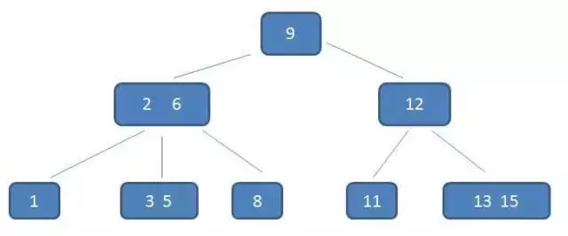

[TOC]
## 1. 理解参考
[漫画算法：什么是 B 树？](https://www.jianshu.com/p/8b653423c586)

## 2. 一个m阶的B树具有如下几个特征：
1. **根结点至少有两个子女，最少可以有１和关键词**。
2. 每个中间节点都包含**k-1个元素和k个孩子**，其中 m/2 <= k <= m
4. 所有的**叶子结点都位于同一层**。
5. 每个节点中的元素从小到大排列，节点当中k-1个元素正好是k个孩子包含的元素的**值域分划。**

## 3. 应用
1. 文件系统
2. 部分数据库索引，比如著名的非关系型数据库MongoDB