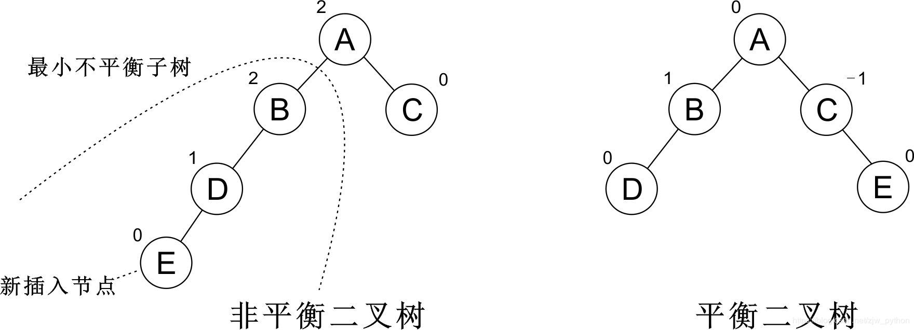

[TOC]
## 实现参考 

[平衡二叉树AVL（JS实现）](https://blog.csdn.net/zjw_python/article/details/85044001)

平衡二叉树（Self-balancing binary search tree）又被称为**AVL树**（有别于AVL算法），是一种**二叉排序树**。由3位科学家共同发明，用他们**首字母命名 又被称为AVL树**。距离插入节点最近的，且平衡因子的绝对值大于1的节点为根的子树，我们称为**最小不平衡子树**。

## 特性和其他 ##

* 它是一 棵空树或它的左右两个子树的高度差(平衡因子)绝对值不超过1
* 左右两个子树都是一棵平衡二叉树
* 平衡二叉树必定是二叉搜索树，反之则不一定
* 平衡二叉树：每个结点的平衡因子都为 1、－1、0 的二叉排序树。或者
* 每个结点的左右子树的高度最多差1的二叉排序树。

**概念**

* **平衡因子（平衡度）**：二叉树上结点的左子树深度减去右子树的深度的值称为平衡因子**BF**（或反之定义）

**实现方法**

* 平衡二叉树的常用实现方法有AVL、红黑树、替罪羊树、Treap、伸展树等

**目的**

* 减少二叉查找树层次，提高查找速度

**AVL 和 二叉排序树**

* AVL树的查找平均时间复杂度要比二叉搜索树低——它是O(logN)。也就是说，在**大量的随机数据中AVL树的表现要好得多**。