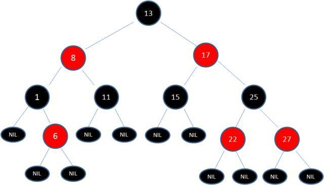

[TOC]
## 概述
[漫画算法：什么是红黑树？](http://www.sohu.com/a/201923614_466939)

红黑树（平衡二叉树）,R-B Tree，全称是Red-Black Tree，又称为“红黑树”，它一种**平衡二叉树**（自平衡的排序二叉树）。红黑树的每个节点上都有存储位表示节点的颜色，可以是红(Red)或黑(Black)。

## 特性

[五分钟搞懂什么是红黑树（全程图解）](http://www.360doc.com/content/18/0904/19/25944647_783893127.shtml)

1. 左子树上所有结点的值均小于或等于它的根结点的值。

2. 右子树上所有结点的值均大于或等于它的根结点的值。

3. 左、右子树也分别为二叉排序树。

4. 节点是红色或黑色。

5. 根节点是黑色。

6. 每个叶子节点都是黑色的空节点（NIL节点）。

7. 每个红色节点的两个子节点都是黑色。(从每个叶子到根的所有路径上不能有两个连续的红色节点)
8. 从任一节点到其每个叶子的所有路径都包含相同数目的黑色节点。

## 应用

 红黑树的应用比较广泛，主要是用它来**存储有序的数据**，它的时间复杂度是**O(logN)**，效率非常之高。在O(log n)时间内做查找，插入和删除，这里的n 是树中元素的数目。

* Java集合中的TreeSet和TreeMap
* Java8 中，HashMap
* C++ STL中的set、map
* Linux虚拟内存的管理

