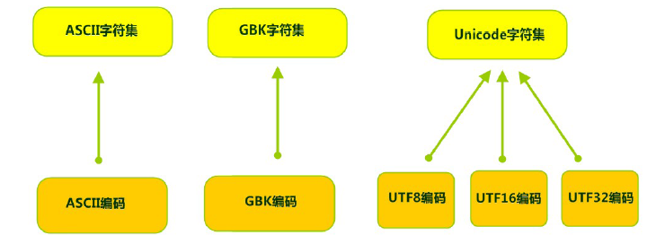

[TOC]

## 1. 计算机编码 ##

[【计算机基础】字符集与字符编码](https://segmentfault.com/a/1190000008661872)

[字符集和编码-主要参考](https://segmentfault.com/a/1190000018713183)

### 1.1 基本概念 ###

* **编码**：把一种信息格式转换为另一种信息格式。对与计算机而言，此过程是把我们自然世界里的字符、声频、音频等转换为二进制形式。
* **解码**：编码的逆过程。
* **乱码**：不能正确显示字符的现象，原因多是编码与解码所用的映射关系不匹配。
* **字符集**：某一系统所有字符的集合。如：中文字符集包括汉字、汉字符号等。
* **字符编码**：把字符集中的字符编码成指定集合中的对象。如Unicode编码、GB2312字符编码。通常，人们认为字符集和字符编码是同义词（因为特定的字符编码会有唯一的字符集与之对应）。

### 1.2 字符集 ###

（1）***ASCII字符集*** ：

ASCII（American Standard Code for Information Interchange，美国信息交换标准代码）是基于拉丁字母的一套电脑编码系统，用于显示现代英语，主要包括控制字符（回车键、退格、换行键等）和可显示字符（英文大小写字符、阿拉伯数字和西文符号）。

简单的说就是美国发明了计算机之后，用7位（bits）表示一个字符，来表达自己语言的文字，一个字节是8位，还空了一位，最高位被置为0。然后国际商业机器公司又加入了一些扩展，比如音标什么的，这下把8位全用上了。

（2）ISO-8859-1字符集：

欧洲其他国家用电脑的时候发现全是英语，你让我们这些母语不是英语的人怎么办,于是制定了ISO-8859-1字符集，兼容ASCII编码（比如ASCII中97表达的是是小写的a，ISO-8859-1中97依然是小写的a，ISO-8859-1没有修改ASCII原来的字符集，只是在你的基础上扩展）。

（3）***GBxxx字符集：***

* GB：就是国标的意思，是为了显示中文而设计的一套字符集。
* GB2312：终于，计算机传到中国了。美国人发明的ascii码，只要表达大小写26个字母，加上些字符就行了，但是中国的汉字很多，无法用1字节也就是八位标识，所以当时就制定了GB2312，规定了每个字占据2bytes。由于要和ASCII兼容，那这2bytes最高位不可以为0了（否则和ASCII会有冲突）。
* ***GBK：******最常用的中文码表***。是在GB2312标准基础上的扩展规范，使用了双字节编码方案，共收录了21003个汉字，完全兼容GB2312标准，同时支持繁体汉字以及日韩汉字等。
  之前只知道中国汉字多，但是没有想到这么多啊，原来规定汉子和计算机语言对应关系的时候，漏掉了好多汉字，所以在GB2312的基础上做了个扩展。

* GB18030：最新的中文码表。收录汉字70244个，采用多字节编码，每个字可以由1个、2个或4个字节组成。支持中国国内少数民族的文字，同时支持繁体汉字以及日韩汉字等。

（4）***Unicode字符集*** ：

> ***UTF-32（使用4个字节存储一个字符）;UTF-16（使用2个字节存储一个字符）;UTF-8（使用1-4个字节变长编码）等实现。***

Unicode编码系统为表达任意语言的任意字符而设计，是业界的一种标准，也称为统一码、标准万国码。
它最多使用***4个字节的数字来表达每个字母、符号，或者文字***。***有三种编码方案，UTF-8、UTF-16和UTF-32。最为常用的UTF-8编码***。

* 128个US-ASCII字符，只需一个字节编码。
* 拉丁文等字符，需要二个字节编码。
* 大部分常用字（含中文），使用三个字节编码。
* 其他极少使用的Unicode辅助字符，使用四字节编码。

***字符集和编码***

