[TOC]


> [关于HTTP协议，一篇就够了](https://www.cnblogs.com/ranyonsue/p/5984001.html)

## 1 http 简介与具体过程 ##

### 1.1 简介 ###

HTTP协议是Hyper Text Transfer Protocol（超文本传输协议）的缩写,是基于客户端/服务端（C/S）的架构模型，通过一个可靠的链接来交换信息，是一个无状态、无连接、媒体独立的请求/响应协议。用于从万维网（WWW:World Wide Web ）服务器传输超文本到本地浏览器的传送协议

HTTP基于TCP/IP通信协议来传递数据（HTML 文件, 图片文件, 查询结果等）。

### 1.2 HTTP 工作原理 ###

HTTP协议工作于客户端-服务端架构上。浏览器作为HTTP客户端通过URL向HTTP服务端即WEB服务器发送所有请求。

Web服务器有：Apache服务器，IIS服务器（Internet Information Services）等。

Web服务器根据接收到的请求后，向客户端发送响应信息。

HTTP默认端口号为80，但是你也可以改为8080或者其他端口。

### 1.3 特点 ###

- HTTP是**无连接**：无连接的含义是**限制每次连接只处理一个请求**。服务器处理完客户的请求，并收到客户的应答后，即断开连接。采用这种方式可以节省传输时间。
- HTTP是**媒体独立**的：这意味着，**只要客户端和服务器知道如何处理的数据内容，任何类型的数据都可以通过HTTP发送。客户端以及服务器指定使用适合的MIME-type内容类型。**
- HTTP是**无状态**：HTTP协议是无状态协议。无状态是指协议**对于事务处理没有记忆能力。**缺少状态意味着如果后续处理需要前面的信息，则它必须重传，这样可能导致每次连接传送的数据量增大。另一方面，在服务器不需要先前信息时它的应答就较快。

### 1.4 工作概况 ###


## 2 request 和 response 报文 ##

***Request***

**请求行（request line）、请求头部（header）、空行和请求数据四个部分组成，下图给出了请求报文的一般格式。**

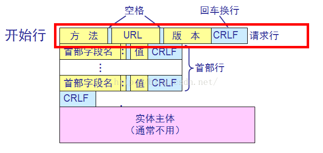

***Response***

**响应也由四个部分组成，分别是：状态行(HTTP-Version Status-Code Reason-Phrase CRLF)、消息报头、空行和响应正文。**

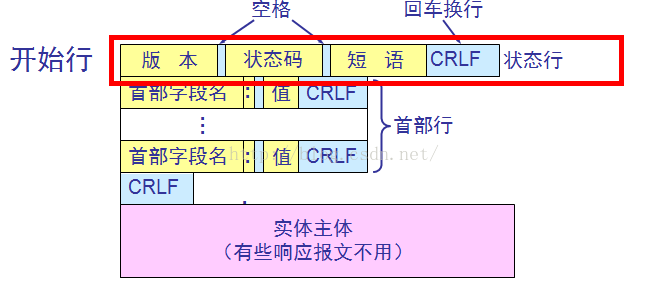

## 3. HTTP方法及其安全性和幂等性 ##
### 3.1 方法
* GET
获取
* HEAD
获取报文首部。
和 GET 方法类似，但是不返回报文实体主体部分，主要用于确认 URL 的有效性以及资源更新的日期时间等。

* POST
添加

* PUT
修改

* PATCH
> 对资源进行部分修改
> 
> PUT 也可以用于修改资源，但是只能完全替代原始资源，PATCH 允许部分修改。

  ```http
PATCH /file.txt HTTP/1.1
Host: www.example.com
Content-Type: application/example
If-Match: "e0023aa4e"
Content-Length: 100
[description of changes]
  ```

* DELETE
删除文件

* OPTIONS
查询指定的 URL 能够支持的方法。
会返回 `Allow: GET, POST, HEAD, OPTIONS` 这样的内容。

* CONNECT
  要求在与代理服务器通信时建立隧道。
  SSL（Secure Sockets Layer，安全套接层）和 TLS（Transport Layer Security，传输层安全）协议把通信内容加密后经网络隧道传输。

  ```html
  CONNECT www.example.com:443 HTTP/1.1
  ```

* TRACE
回馈服务器收到的请求，用于远程诊断服务器。


### 3.2 安全、幂等

***安全性***，仅指该方法的***多次调用不会产生副作用***，不涉及传统意义上的“安全”，这里的***副作用是指资源状态***。即，安全的方法不会修改资源状态，尽管多次调用的返回值可能不一样(被其他非安全方法修改过)。	

***幂等性***，是指该方法***多次调用返回的效果(形式)一致***，客户端可以重复调用并且期望同样的结果。幂等的含义类似于编程语言中的setter方法[1]，一次调用和多次调用产生的效果是一致的，都是对一个变量进行赋值。安全性和幂等性含义有些接近，容易搞混。

***HTTP方法的安全性和幂等性见下表 :***

| 方法名  | 安全性 | 幂等性 |
| :-----: | :----: | :----: |
|   GET   |   是   |   是   |
|  HEAD   |   是   |   是   |
| OPTIONS |   是   |   是   |
| DELETE  |   否   |   是   |
|   PUT   |   否   |   是   |
|  POST   |   否   |   否   |

（1）可以认为安全的方法都是只读的方法(GET, HEAD, OPTIONS)

（2）DELETE方法的语义表示删除服务器上的一个资源，第一次删除成功后该资源就不存在了，资源状态改变了，所以DELETE方法不具备安全特性。然而***HTTP协议规定DELETE方法是幂等的***，每次删除该资源都要返回状态码200 OK，服务器端要实现幂等的DELETE方法，必须记录所有已删除资源的元数据(Metadata),否则，第二次删除后返回的响应码就会类似404 Not Found了。

（3）PUT和POST方法语义中都有修改资源状态的意思，因此都不是安全的。但是PUT方法是幂等的，POST方法不是幂等的，这么设计的理由是：

- HTTP协议规定，POST方法修改资源状态时，URL指示的是该资源的父级资源，待***修改资源的ID信息在请求体中携带***。而PUT方法修改资源状态时，***URL直接指示待修改资源***。因此，***同样是创建资源，重复提交POST请求可能产生两个不同的资源，而重复提交PUT请求只会对其URL中指定的资源起作用，也就是只会创建一个资源。***

## 4 HTTP 状态码 ##

[参考-博客](https://www.cnblogs.com/jly144000/archive/2017/12/07/7998615.html)

[腾讯云社区——状态码](https://cloud.tencent.com/developer/section/1190116)

> 1xx 表示**通知信息**的，如请求收到了或正在进行处理，需要请求者继续执行操作。
>
> 2xx 表示**成功**，如接受或知道了。
>
> 3xx 表示**重定向**，表示要完成请求还必须采取进一步的行动。
>
> 4xx 表示**客户的差错**，如请求中有错误的语法或不能完成。
>
> 5xx 表示**服务器的差错**，如服务器失效无法完成请求。

### 4.1 常见状态码 ###

* 100 Continue

  > 1. HTTP `100 Continue`信息状态响应代码表明目前为止的所有内容都是正常的，并且**客户端应该继续请求或者如果它已经完成则忽略它。**
  > 2. 状态：100 Continue
  > 3. **场景**：大资源POST(cors 不是-option) [How to handle “100 continue” HTTP message?](https://zhuanlan.zhihu.com/p/30830041)

* 101 Switching Protocols

  > 1. HTTP **101 Switching Protocols**响应代码指示**服务器**正在根据**发送包括[`Upgrade`](https://developer.mozilla.org/en-US/docs/Web/HTTP/Headers/Upgrade)请求头的消息的客户端的请求**   ***切换到的协议***。
  > 2. 服务器在此响应中包含一个[`Upgrade`](https://developer.mozilla.org/en-US/docs/Web/HTTP/Headers/Upgrade)响应标题，指示它切换到的协议。
  > 3. 状态 101 Switching Protocols
  > 4. **场景**：websocket

* 200 OK 服务器成功处理了请求

* 204 请求被受理但没有资源可以返回

  > 1. 没有数据，**浏览器不用刷新页面.也不用导向新的页面**
  >
  > 2. **场景**：对于一些提交到服务器处理的数据，只需要返回是否成功的情况下，可以考虑使用状态码204来作为返回信息，从而省掉多余的数据传输
  >
  >    put

* 206

  > 1. HTTP `206 Partial Content`成功状态响应代码指示请求已成功并且主体包含所请求的数据范围，如`Range`请求标题中所述。如果只有一个范围，则整个响应`Content-Type`设置为文档的类型，并提供一个`Content-Range`。如果发送了几个范围，则`Content-Type`设置为`multipart/byteranges`并且每个片段都覆盖一个范围，并且使用`Content-Range`和`Content-Type`对其进行描述。
  > 2. ****场景**：发生在客户端继续请求一个[未完成的下载](http://blogs.msdn.com/b/ieinternals/archive/2011/06/03/send-an-etag-to-enable-http-206-file-download-resume-without-restarting.aspx)（暂停或网络中断）的时候**
  > 3. 状态 ：206 Partial Content
  > 4. **实例**：
  >
  > ```
  > 包含一个范围的响应：
  > HTTP/1.1 206 Partial Content
  > Date: Wed, 15 Nov 2015 06:25:24 GMT
  > Last-Modified: Wed, 15 Nov 2015 04:58:08 GMT
  > Content-Range: bytes 21010-47021/47022
  > Content-Length: 26012
  > Content-Type: image/gif
  > ... 26012 bytes of partial image data ...
  > 
  > 包含以下几个范围的响应：
  > HTTP/1.1 206 Partial Content
  > Date: Wed, 15 Nov 2015 06:25:24 GMT
  > Last-Modified: Wed, 15 Nov 2015 04:58:08 GMT
  > Content-Length: 1741
  > Content-Type: multipart/byteranges; boundary=String_separator
  > 
  > --String_separator
  > Content-Type: application/pdf
  > Content-Range: bytes 234-639/8000
  > 
  > ...the first range...
  > --String_separator
  > Content-Type: application/pdf
  > Content-Range: bytes 4590-7999/8000
  > 
  > ...the second range
  > --String_separator--
  > ```
  >
  > 状态：206 Partial Content

  

* 301 永久性重定向，请求的URL已移走

  > 1. 被请求的**资源已永久移动到新位置**，并且将来任何对此资源的引用都应该使用本响应返回的若干个URI之一。如果可能，拥有链接编辑功能的**客户端应当自动把请求的地址修改为从服务器反馈回来的地址。**除非额外指定，否则这个响应**也是可缓存的**。新的永久性的URI应当**在响应的Location域中返回**。除非这是一个HEAD请求，否则响应的实体中应当包含指向新的URI的超链接及简短说明。
  > 2. 如果这**不是一个GET或者HEAD请求，因此浏览器禁止自动进行重定向**（（**第二次 POST 时，环境可能已经发生变化（POST 方法不是幂等）**）），除非得到用户的确认，因为请求的条件可能因此发生变化。
  > 3. **注意：**对于**某些使用HTTP/1.0协议**的浏览器，当它们发送的POST请求得到了一个301响应的话，接下来的重定向请求将会变成GET方式。
  > 4. 搜索引擎更新它们到资源的链接（在 SEO 中，据说链接汁被发送到新的 URL）
  > 5. 状态： 301 Moved Permanently
  >
  > ```js
  > res.writeHead(301,{
  >             'Location': 'http://127.0.0.1:3000/login'
  >         })
  > ```

  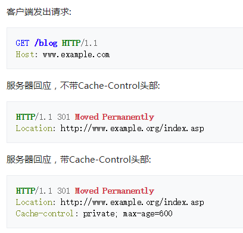

* 302 临时重定向，维护

  > 1. 要求客户端执行临时重定向（原始描述短语为“Moved Temporarily”）。由于这样的重定向**是临时**的，**客户端应当继续向原有地址发送以后的请求**。只有**在Cache-Control或Expires中进行了指定的情况下，这个响应才是可缓存的。** **新的临时性的URI应当在响应的Location域中返回。除非这是一个HEAD请求，否则响应的实体中应当包含指向新的URI的超链接及简短说明。**
  > 2. 如果这不是一个GET或者HEAD请求，那么浏览器禁止自动进行重定向（**第二次 POST 时，环境可能已经发生变化（POST 方法不是幂等）**），除非得到用户的确认，因为请求的条件可能因此发生变化。
  > 3. **注意：**虽然RFC 1945和RFC 2068规范不允许客户端在重定向时改变请求的方法，但是很**多现存的浏览器将302响应视作为303响应，并且使用GET方式访问在Location中规定的URI，而无视原先请求的方法。** **因此状态码303和307被添加了进来，用以明确服务器期待客户端进行何种反应。**
  > 4. 搜索引擎不会更新他们到资源的链接（在 SEO 中，据说链接果汁不会被发送到新的 URL）
  > 5. 状态 ： 302 Found

  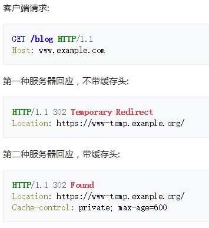

* 303 See Other（查看其他）

  > 1. 对应当前请求的响应可以在另一个URI上被找到，**当响应于POST（或PUT / DELETE）接收到响应时，客户端应该假定服务器已经收到数据，并且应该使用单独的GET消息发出重定向。**这个方法的存在主要是为了允许由脚本激活的POST请求输出重定向到一个新的资源。这个新的URI**不是原始资源的替代引用。**同时，**303响应禁止被缓存**。当然，**第二个请求（重定向）可能被缓存。**新的URI应当在响应的Location域中返回。除非这是一个HEAD请求，否则响应的实体中应当包含指向新的URI的超链接及简短说明。
  > 2. **注意：**许多HTTP/1.1版以前的浏览器不能正确理解303状态。如果需要考虑与这些浏览器之间的互动，302状态码应该可以胜任，因为大**多数的浏览器处理302响应时的方式恰恰就是上述规范要求客户端处理303响应时应当做的。**
  > 3. 状态 ： 303 See Other

  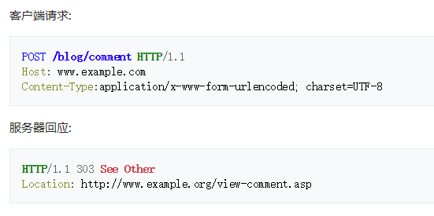

* 304 表示未修改，客户的缓存资源是最新的，要客户端使用缓存

  > 1. HTTP **304 Not Modified**客户端重定向响应代码指示不需要重新传输请求的资源。这是对缓存资源的隐式重定向。这发生在请求方法是安全的时候，比如一个 `GET`或者一个`HEAD`请求，或者当请求是有条件的并且使用一个 `If-None-Match`或者一个`If-Modified-Since`标头时。
  > 2. 等效`200` `OK`响应会包括头`Cache-Control`，`Content-Location`，`Date`，`ETag`，`Expires`，和`Vary`。
  > 3. 状态：304 Not Modified

* 307 Temporary Redirect（临时重定向）

  > 1. HTTP **307 Temporary Redirect**重定向状态响应代码指示所请求的资源已暂时移动到由`Location`标题给定的 URL 。
  > 2. **原始请求的方法和主体被重用来执行重定向的请求**。在你想要改变方法的情况下，改为`GET`使用`303` `See Other`。当你想给一个`PUT`不是上传资源的方法，而是一个确认信息（如“你成功上传 XYZ”）时，这很有用。
  > 3. `307`和`302`之间的唯一区别在于`307`该方法和主体将不会被重定向的请求时改变保证。使用`302`，一些老客户错误地将方法改变为`GET`：使用非`GET`方法的行为，然后`302`在Web上不可预知，而使用`307`的行为则是可预测的。对于`GET`请求，它们的行为是相同的。
  > 4. 状态 ： 307 Temporary Redirect

* 308 Permanent Redirect （永久重定向）

  > 1. HTTP **308 Permanent Redirect**重定向状态响应代码指示所请求的资源已明确移动到`Location`标题给定的 URL 。浏览器重定向到这个页面，搜索引擎更新它们到资源的链接（在 SEO 中，据说链接汁被发送到新的 URL）。
  > 2. 请求方法和主体不会被更改，`301`但有时可能会被错误地更改为[`GET`](https://developer.mozilla.org/en-US/docs/Web/HTTP/Headers/GET)方法。
  > 3. 一些 Web 应用程序可能会以非标准方式使用`308 Permanent Redirect`并用于其他目的。例如，Google 云端硬盘使用`308 Resume Incomplete`响应来向客户端指示上传不完整的时间。

* 400 Bad Request

  > 1. 400 由于语法无效，HTTP**400 Bad Request** 响应状态码指示服务器无法理解请求。客户不应未经修改就重复此请求。
  > 2. 状态 400 Bad Request 

* 401 Unauthorized

  > 1. HTTP `401 Unauthorized`客户端错误状态响应代码指示该请求尚未应用，因为它缺少目标资源的有效认证凭证。此状态与包含有关如何正确授权信息的`WWW-Authenticate`标头一起发送。
  > 2. 状态：401 Unauthorized

* 403 Forbidden

  > 1. HTTP `403 Forbidden`客户端错误状态响应代码指示服务器理解请求但拒绝授权。这种状态与此类似`401`，但在这种情况下，重新认证将不会产生任何影响。访问是永久禁止的并且与应用程序逻辑相关联（如不正确的密码）。
  > 2. 状态：403 Forbidden

* 405 Method Not Allowed

  > 1. HTTP **405 Method Not Allowed**响应状态码指示服务器已知请求方法，但已被禁用且无法使用。这**两个强制性方法，`GET`和`HEAD`，绝不能被禁用，不应返回该错误代码。**
  > 2. 状态：405 Method Not Allowed

* ###### 409 ######

  > （Conflict）表示请求的资源与资源的当前状态发生冲突

* ###### 410 ######

  > （Gone）表示服务器上的某个资源被永久性的删除

* 500 内部服务器错误
> 服务器遇到一个错误，使其无法为请求提供服务

* 503 服务器正忙，服务器超时
> 服务器暂时处于超负载或正在进行停机维护，现在无法处理请求。

### 4.2 一些状态码的使用场景 ###

1. **使用301的场景：（一般是资源位置永久更改）**

   1. 域名到期不想续费（或者发现了更适合网站的域名），想换个域名。
   2. 在搜索引擎的搜索结果中出现了不带www的域名，而带www的域名却没有收录，这个时候可以**用301重定向来告诉搜索引擎我们目标的域名是哪一个**。
   3. 空间服务器不稳定，换空间的时候。

2. **302的场景：（一般是普通的重定向需求：临时跳转）**

   1. 未登录前先使用302重定向到登录页面,登录成功后再跳回到原来请求的页面

      > 比如我未登录京东前我就访问京东的个人界面https://home.jd.com/,然后就会重定向到登录界面，响应的状态码为302，并且返回了location为登录界面的url，并且附带了ReturnUrl方便我们登录后跳回到https://home.jd.com/

   2. 有时候需要自动刷新页面，比如5秒后回到订单详细页面之类。

   3. 系统进行升级或者切换某些功能时，需要临时更换地址

   4. 像微博之类的使用短域名，用户浏览后需要重定向到真实的地址之类。

      > 例如我访问一个微博的秒拍视频链接：http://t.cn/RuUMBnI，然后重定向到了实际的视频地址miaopai.com，状态码为302。

   5. 电脑端与移动端的转换

   6. 比如我访问网页端页面https://www.taobao.com/，302重定向到了移动端页面m.taobao.com

3. **303**
   几乎没有，一般就是用302

4. **307的场景**

   很少用，与302类似，只不过是针对POST方法的请求不允许更改方法

5. **308的场景**

   很少用，与301类似，只不过是针对POST方法的请求不允许更改方法

### 4.3 引申的问题和思考 ###

1. 303和307的存在，归根结底是由于POST方法的非幂等属性引起的。

2. 308 的存在，返回时301对于某些使用HTTP/1.0协议的浏览器，当它们发送的POST请求得到了一个301响应的话，接下来的重定向请求将会变成GET方式。

3. 301/302/303/307/308的区别 及注意点

   > 1. 301，302是http1.0的内容，303、307、308是http1.1的内容。
   >
   > 2. 301和302本来在规范中是**不允许**重定向时改变请求方法的（将POST改为GET），但是许多浏览器却**允许重定向时改变请求方法**（这是一种不规范的实现）。
   >
   > 3. 301表示搜索引擎在抓取新内容的同时也将旧的网址交换为重定向之后的网址；302表示旧地址A的资源还在（仍然可以访问），这个重定向只是临时地从旧地址A跳转到地址B，搜索引擎会抓取新的内容而保存旧的网址。
   >
   > 4. 因为301与302的区别，所以导致产生302网络劫持，故不建议使用302重定向（然而浏览器默认是使用302重定向）
   >
   >    **网络劫持**参考 [本地——记录：170-229.md——204. 301和302的区别](../../面试/春招面试/前端来自真实大厂的532道面试题/记录：170-229.md)

4. 301请求码进行跳转被谷歌认为是将网站地址由 **HTTP 迁移到 HTTPS的最佳方法**, 但是淘宝就是 302跳转

5. 实体应该包含一个带有指向新URI的超链接的短超文本注释

   >  since many pre-HTTP/1.1 user agents do not understand the *** status.

6. 401 和 403 的区别

   > 1. 401 用于认证，而不是授权。接收到401响应时。
   >    服务器会告诉您，“您没有经过身份验证——或者根本没有经过身份验证，或者身份验证不正确——但是请重新进行身份验证，然后重试。”为了帮助您解决问题，它将始终包含描述如何进行身份验证的www-authenticate头。
   >
   > 2. 为了获得授权，我使用403禁止响应。它是永久的，它与我的应用程序逻辑有关，它比401更具体。
   >    服务器收到403的响应后会告诉您：“对不起。我知道你是谁——我相信你说你是谁——但你只是没有访问这个资源的权限。如果你向系统管理员友好地询问，你可能会得到许可。但在你的困境改变之前，请不要再打扰我。”
   > 3. 对于认证丢失或不正确的情况，应使用401未经授权响应，并且当用户经过认证但未被授权对给定资源执行请求的操作时，应随后使用403禁止响应。

## 5. HTTP长连接（HTTP persistent connection ） ##

[HTTP的长连接和短连接](https://www.cnblogs.com/cswuyg/p/3653263.html)

[HTTP Keep-Alive模式](https://www.cnblogs.com/skynet/archive/2010/12/11/1903347.html)

### 5.1 概述 ###

**长链接** ：就是数据传输完成了保持TCP连接不断开（不发RST包、不四次握手），等待在同域名下继续用这个通道传输数据；**相反的就是短连接**。

> http 1.0中默认是关闭的，需要在http头加入"Connection: Keep-Alive"，才能启用Keep-Alive。
>
> http 1.1中默认启用Keep-Alive，如果加入"Connection: close "，才关闭。
>
> 是否能完成一个完整的Keep-Alive连接就看服务器设置情况。

**优点**

> 可以报告错误而不必关闭TCP连接
>
> errors can be reported without the penalty of closing the TCP connection

1. HTTP请求和响应可以通过管道连接。流水线允许客户机在不等待每个响应的情况下发出多个请求，从而使单个TCP连接的使用效率更高，运行时间更低。
2. 通过减少TCP打开造成的数据包数量，并允许TCP有足够的时间来确定网络的拥塞状态，可以减少网络拥塞。
3. 由于TCP的连接打开握手没有花费时间，因此后续请求的延迟会减少。

### 5.2  问题 ###

**(1) 长连接的数据传输完成识别 —— 使用长连接之后，客户端、服务端怎么知道本次传输结束呢？（如何判断http消息的大小、消息的数量）？**

1. ***Conent-Length***

   > **静态页面或图片**等

   Conent-Length表示实体内容长度，客户端（服务器）可以根据这个值来判断数据是否接收完成。

2. ***Transfer-Encoding***

   > **动态页面** 等
   >
   > 即如果要一边产生数据，一边发给客户端，服务器就需要使用"Transfer-Encoding: chunked"这样的方式来代替Content-Length。

   服务器是不可能预先知道内容大小，可以使用Transfer-Encoding：chunk模式来传输数据了。chunk编码将数据分成一块一块的发生。Chunked编码将使用若干个Chunk串连而成，由一个标明**长度为0**的chunk标示结束。

## 6. 流水线技术（管道化连接） ##

使用了HTTP长连接（HTTP persistent connection ）之后的好处，包括可以使用HTTP 流水线技术，**它是指，在一个TCP连接内，（多条请求放入队列）当第一条请求发往服务器的时候，第二第三条请求也可以开始发送了，在高延时网络条件下，这样做可以降低网络的环回时间，提高性能。**

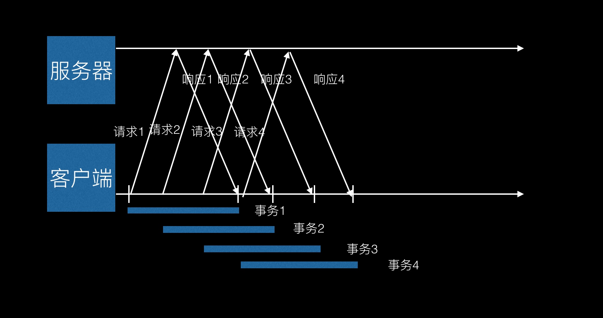

**限制**

- 如果客户端无法**确认连接是持久**的，就不应该使用管道
- 必须**按照与请求相同的顺序回送HTTP响应**，因为HTTP报文中是没有序列号的，所以如果收到的响应失序了，就没办法将其与请求匹配起来
- HTTP客户端必须做好连接会在**任意时刻关闭的准备**，还要**准备好重发所有未完成的管道化请求**
- HTTP客户端**不应该用管道化的方式发送会产生副作用的请求**，比如`POST`请求。

### 6.1 Head of line blocking ###

第一个请求耗费了服务器很多的处理时间，那么后面的请求都要等待第一个处理完，也就出现了线头阻塞。

## 7. request 和 response 报文头部字段 ##

**request 头**

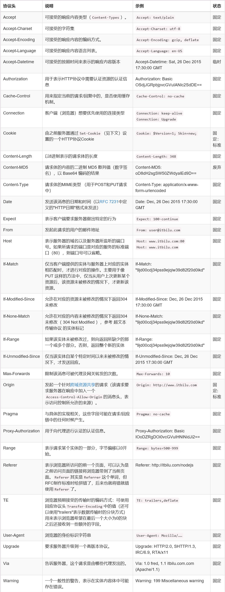

**response 头**

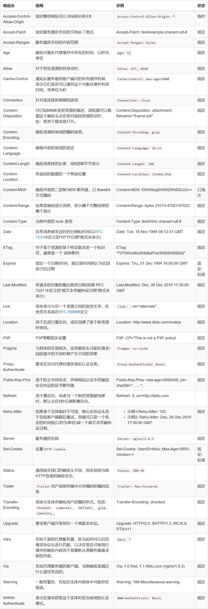

1. referer 当前页面 对html的请求来自上一个页面的 url, ajax请求是当前的url

2. HTTP 请求消息头部实例： 

   ```http
   Host：rss.sina.com.cn 
   User-Agent：Mozilla/5、0 (Windows; U; Windows NT 5、1; zh-CN; rv:1、8、1、14) Gecko/20080404 Firefox/2、0、0、14 
   Accept：text/xml,application/xml,application/xhtml+xml,text/html;q=0、9,text/plain;q=0、8,image/png,*/*;q=0、5 
   Accept-Language：zh-cn,zh;q=0、5 
   Accept-Encoding：gzip,deflate 
   Accept-Charset：gb2312,utf-8;q=0、7,*;q=0、7 
   Keep-Alive：300 
   Connection：keep-alive 
   Cookie：userId=C5bYpXrimdmsiQmsBPnE1Vn8ZQmdWSm3WRlEB3vRwTnRtW &lt;-- Cookie 
   If-Modified-Since：Sun, 01 Jun 2008 12:05:30 GMT 
   Cache-Control：max-age=0 
```

   

3. HTTP 响应消息头部实例： 

   ```http
   Status：OK - 200 &lt;-- 响应状态码，表示 web 服务器处理的结果。 
   Date：Sun, 01 Jun 2008 12:35:47 GMT 
   Server：Apache/2、0、61 (Unix) 
   Last-Modified：Sun, 01 Jun 2008 12:35:30 GMT 
   Accept-Ranges：bytes 
   Content-Length：18616 
   Cache-Control：max-age=120 
   Expires：Sun, 01 Jun 2008 12:37:47 GMT 
   Content-Type：application/xml 
   Age：2 
   X-Cache：HIT from 236-41、D07071951、sina、com、cn &lt;-- 反向代理服务器使用的 HTTP 头部 
   Via：1.0 236-41.D07071951.sina.com.cn:80 (squid/2.6.STABLE13) 
   Connection：close
   ```


## 8. HTTP的基本优化 ##

> 影响一个HTTP网络请求的因素主要有两个：**带宽和延迟。**

1. **带宽**
2. **延迟**
   1. **浏览器阻塞（HOL blocking）**：浏览器会因为一些原因阻塞请求。浏览器对于同一个域名，同时只能有 4 个连接（这个根据浏览器内核不同可能会有所差异），超过浏览器最大连接数限制，后续请求就会被阻塞。
   2. **DNS 查询（DNS Lookup）**：浏览器需要知道目标服务器的 IP 才能建立连接。将域名解析为 IP 的这个系统就是 DNS。这个通常可以利用DNS缓存结果来达到减少这个时间的目的。
   3. **建立连接（Initial connection）**：HTTP 是基于 TCP 协议的，浏览器最快也要在第三次握手时才能捎带 HTTP 请求报文，达到真正的建立连接，但是这些连接无法复用会导致每次请求都经历**三次握手和慢启动**。三次握手在高延迟的场景下影响较明显，慢启动则对文件类大请求影响较大。

## 9. HTTP,HTTP2.0,SPDY,HTTPS ##

[HTTP1.0、HTTP1.1和HTTP2.0的区别](https://www.jianshu.com/p/be29d679cbff)

### 9.1 HTTP1.0和HTTP1.1的区别 ###

HTTP1.0只是使用一些较为简单的网页上和网络请求上

1. **缓存处理**
   * HTTP1.0 使用 last-modified,Expires
   * HTTP1.1 使用Entity tag，cache-control
2. **带宽优化及网络连接的使用**
   * HTTP1.0中，存在一些浪费带宽的现象，例如客户端**只是需要某个对象的一部分，**而服务器却将整个对象送过来了，并且不支持**断点续传功能** [断点续传功能——详情](#10. 断点续传原理)
3. **错误通知的管理**，在HTTP1.1中新增了24个错误状态响应码，如
   * [http 409](#409)
   * [http 410](#410)
4. **Host头处理**
   * HTTP1.1的请求消息和响应消息都应支持Host头域，且请求消息中如果没有Host头域会报告一个错误（400 Bad Request）。

5.  **长连接**，HTTP 1.1支持**长连接（Persistent Connection）**和**请求的流水线（Pipelining）处理**，在一个TCP连接上可以传送多个HTTP请求和响应，减少了建立和关闭连接的消耗和延迟，在HTTP1.1中默认开启Connection： keep-alive，一定程度上弥补了HTTP1.0每次请求都要创建连接的缺点。

### 9.2 HTTPS与HTTP的区别 ###

* HTTPS协议需要到CA申请证书，一般免费证书很少，需要交费。
* HTTP协议运行在TCP之上，所有传输的内容都是明文，HTTPS运行在SSL/TLS之上，SSL/TLS运行在TCP之上，所有传输的内容都经过加密的。
* HTTP和HTTPS使用的是完全不同的连接方式，用的端口也不一样，前者是**80**，后者是**443**。
* HTTPS可以有效的**防止运营商劫持**，解决了防劫持的一个大问题。

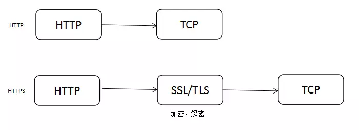

### 9.3 SPDY：HTTP1.x的优化 ###

google提出了SPDY的方案，优化了HTTP1.X的**请求延迟**，解决了HTTP1.X的**安全性** ， SPDY位于HTTP之下，TCP和SSL之上，这样可以轻松兼容老版本的HTTP协议(将HTTP1.x的内容封装成一种新的frame格式)，同时可以使用已有的SSL功能。


**具体优化如下：**

1. **多路复用**，针对HTTP高延迟的问题，SPDY优雅的采取了多路复用（multiplexing）。**多路复用通过多个请求stream共享一个tcp连接的方**式，解决了HOL blocking（Head-of-line *blocking*）的问题，降低了延迟同时提高了带宽的利用率。

2. **请求优先级**（request prioritization）。多路复用带来一个新的问题是，在连接共享的基础之上有可能会导致**关键请求被阻塞**。SPDY允许给每个request**设置优先级，这样重要的请求就会优先得到响应**。
   比如浏览器加载首页，首页的html内容应该优先展示，之后才是各种静态资源文件，脚本文件等加载，这样可以保证用户能第一时间看到网页内容。

3. **header压缩。**前面提到**HTTP1.x的header很多时候都是重复多余的**。选择合适的压缩算法可以减小包的大小和数量。

4. **基于HTTPS的加密协议传输**，大大提高了传输数据的可靠性。

5. ###### 服务端推送（server push） ######

   **把客户端所需要的资源伴随着index.html一起发送到客户端，省去了客户端重复请求的步骤。正因为没有发起请求，建立连接等操作，所以静态资源通过服务端推送的方式可以极大地提升速度。**

### 9.4 **HTTP2.0和SPDY的区别** ###

HTTP2.0可以说是SPDY的升级版（其实原本也是基于SPDY设计的），但是，HTTP2.0 跟 SPDY 仍有不同的地方。
**HTTP2.0和SPDY的区别：**

1. HTTP2.0 支持**明文 HTTP 传输**，而 SPDY 强制使用 HTTPS
2. HTTP2.0 消息**头的压缩算法**采用 [HPACK](https://links.jianshu.com/go?to=http%3A%2F%2Fhttp2.github.io%2Fhttp2-spec%2Fcompression.html)，而非 SPDY 采用的 [DEFLATE](https://links.jianshu.com/go?to=http%3A%2F%2Fzh.wikipedia.org%2Fwiki%2FDEFLATE)

### 9.5 HTTP2.0和HTTP1.X 的区别 ###

1. **新的二进制格式**（Binary Format），**HTTP1.x的解析是基于文本**。基于文本协议的格式解析存在天然缺陷，**文本的表现形式有多样性**，要做到健壮性考虑的场景必然很多，**二进制则不同，只认0和1的组合**。基于这种考虑HTTP2.0的协议解析决定采用二进制格式，实现方便且健壮。
2. **多路复用**（MultiPlexing），即连接共享，即每一个request都是是用作连接共享机制的。一个request对应一个id，这样一个连接上可以有多个request，每个连接的request可以随机的混杂在一起，接收方可以根据request的 id将request再归属到各自不同的服务端请求里面。
3. **header压缩**，如上文中所言，对前面提到过HTTP1.x的header带有大量信息，而且每次都要重复发送，**HTTP2.0使用encoder来减少需要传输的header大小，通讯双方各自cache一份header fields表，既避免了重复header的传输，又减小了需要传输的大小。**
4. **服务端推送**（server push），同SPDY一样，HTTP2.0也具有server push功能。[参考](#服务端推送（server push）)

### 9.6 HTTP2.0的多路复用和HTTP1.X中的长连接复用的区别 ###

* HTTP/1.* 一次请求-响应，建立一个连接，用完关闭；每一个请求都要建立一个连接；
* HTTP/1.1 Pipeling解决方式为，**若干个请求排队串行化单线程处理，后面的请求等待前面请求的返回才能获得执行机会，一旦有某请求超时等，后续请求只能被阻塞，毫无办法，也就是人们常说的[线头阻塞](#6.1 Head of line blocking)；**
* HTTP/2多个请求可同时在一个连接上**并行执行**。某个请求任务耗时严重，不会影响到其它连接的正常执行；

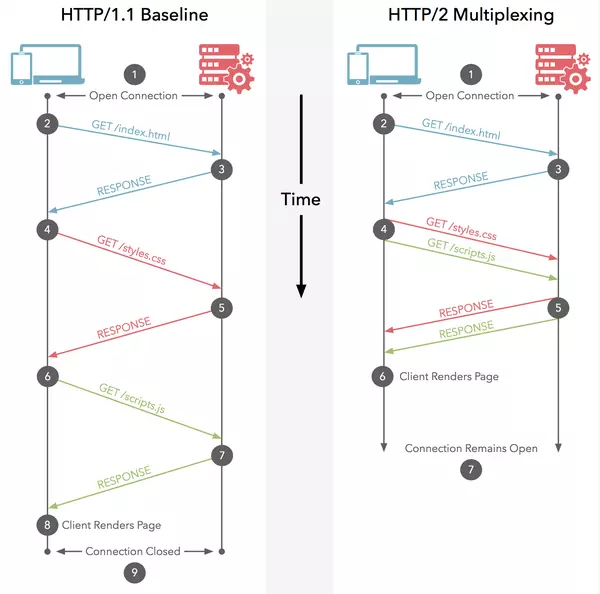

## 10. 断点续传原理 ##

[HTTP必知必会——断点续传原理](<https://www.jianshu.com/p/012c8a4dc661>)

> 要实现断点续传的功能，通常都需要客户端记录下当前的下载进度，并在**需要续传的时候通知服务端本次需要下载的内容片段。**
>
> HTTP1.1协议（RFC2616）中定义了断点续传相关的HTTP头 Range和Content-Range字段

***示例 ：***

> 1. 客户端下载一个1024K的文件，已经下载了其中512K
> 2. 网络中断，客户端请求续传，因此需要在HTTP头中申明本次需要续>传的片段：
>    `Range:bytes=512000-`
>    这个头通知服务端从文件的512K位置开始传输文件
> 3. 服务端收到断点续传请求，从文件的512K位置开始传输，并且在HTTP头中增加：
>    `Content-Range:bytes 512000-/1024000`
>    此时服务端返回的HTTP状态码应该是206，而不是200。

***问题***

（1）终端发起续传请求时，URL对应的文件内容在**服务端**已经发生**变化**，此时续传的数据肯定是错误！

> * 此时我们需要有一个标识文件唯一性的方法。在RFC2616中也有相应的定义，比如实现Last-Modified来标识文件的最后修改时间，这样即可判断出续传文件时是否已经发生过改动。同时RFC2616中还定义有一个ETag的头，可以使用**ETag头来放置文件的唯一标识，比如文件的MD5值**。
>   终端在发起续传请求时应该在HTTP头中申明If-Match 或者If-Modified-Since 字段，帮助服务端判别文件变化。
> * 另外RFC2616中同时定义有一个**If-Range头**，终端如果在续传是使用If-Range。**If-Range中的内容可以为最初收到的ETag头或者是Last-Modfied中的最后修改时候。**服务端在收到续传请求时，通过If-Range中的内容进行校验
> * **校验一致时返回206的续传回应，不一致时服务端则返回200回应，回应的内容为新的文件的全部数据。** 

## 11. HTTPS ##

[掘金-谈谈 HTTPS](<https://juejin.im/post/59e4c02151882578d02f4aca>)

### 11.1 什么是 HTTPS ###

HTTPS（全称：Hyper Text Transfer Protocol over Secure Socket Layer），是以安全为目标的HTTP通道，简单讲是HTTP的安全版。


### 11.2 HTTP 与 HTTPS 的区别 ###

- HTTP 是明文传输，HTTPS 通过 SSL\TLS 进行了加密
- HTTP 的端口号是 80，HTTPS 是 443
- HTTPS 需要到 CA 申请证书，一般免费证书很少，需要交费
- HTTP的连接很简单，是无状态的；HTTPS 协议是由 SSL+HTTP 协议构建的可进行加密传输、身份认证的网络协议，比 HTTP 协议安全。

### 11.3  HTTPS优缺点 ###

#### 11.3.1 优点

- 建立一个信息安全通道，来保证数据传输的安全
- 加密隐私数据：防止您访客的隐私信息(账号、地址、手机号等)被劫持或窃取。
- 安全身份认证：验证网站的真实性，防止钓鱼网站。
- 防止网页篡改：防止数据在传输过程中被篡改，保护用户体验。
- 地址栏安全锁：地址栏头部的“锁”型图标使您的访客放心浏览网页，提高用户信任度。
- 提升网站流量：谷歌开始针对启用HTTPS网站给予更高的搜索引擎权重。

#### 11.3.2　缺点

[前端安全学习dns解析https dns劫持](<https://www.jianshu.com/p/9fd307782c7a?utm_campaign=maleskine&utm_content=note&utm_medium=seo_notes&utm_source=recommendation>)
1. 安全
  * HTTPS协议的加密范围有限，在黑客攻击、拒绝服务攻击、服务器劫持等方面几乎起不到什么作用
  * SSL证书的信用链体系并不安全，特别是在某些国家可以控制CA根证书的情况下
2. 加密解密过程。
  * 用户体验，页面的加载时间延长近50%，HTTPS协议握手阶段比较费时
  * 服务器端资源占用高
  * 耗电10%~20%
  * SEO方面
3. 费用
  * 需要支付证书授权的高额费用，小网站没必要
  
### 11.4 HTTPS 过程 ###

> ***`HTTPS` 采用混合的加密机制，使用非对称密钥加密用于传输对称密钥来保证传输过程的安全性，之后使用对称密钥加密进行通信来保证通信过程的效率。***
一个HTTPS请求实际上包含了两次HTTP传输，可以细分为8步。

1. 客户端向服务器发起HTTPS请求，连接到服务器的443端口
2. 服务器端有一个密钥对，即公钥和私钥，是用来进行非对称加密使用的，服务器端保存着私钥，不能将其泄露，公钥可以发送给任何人。
3. 服务器将**自己的公钥**发送给客户端。
4. 客户端收到服务器端的公钥之后，会**对公钥进行检查，验证其合法性**，如果发现发现公钥有问题，那么HTTPS传输就无法继续。严格的说，这里应该是验证服务器发送的数字证书的合法性，关于客户端如何验证数字证书的合法性，下文会进行说明。如果公钥合格，那么客户端会生成一个随机值，**这个随机值就是用于进行对称加密的密钥**，我们将该密钥称之为client key，即客户端密钥，这样在概念上和服务器端的密钥容易进行区分。然后**用服务器的公钥对客户端密钥进行非对称加密**，这样客户端密钥就变成密文了，至此，HTTPS中的第一次HTTP请求结束。
5. 客户端会发起HTTPS中的第二个HTTP请求，将加密之后的**客户端密钥**发送给服务器。
6. 服务器接收到客户端发来的密文之后，会用自己的**私钥对其进行非对称解密，解密之后的明文就是客户端密钥**，然后用**客户端密钥对数据进行对称加密，**这样数据就变成了密文。
7. 然后服务器将加密后的密文发送给客户端。
8. 客户端收到服务器发送来的密文，用**客户端密钥对其进行对称解密**，得到服务器发送的数据。这样HTTPS中的第二个HTTP请求结束，整个HTTPS传输完成。

### 11.5 确保服务器发送的数字证书的合法性 ###

要想让客户端信赖公钥，公钥也要找一个担保人，证书认证中心（Certificate Authority），简称**CA**，CA本身也有一对公钥和私钥，CA会用CA自己的**私钥对要进行认证的公钥进行非对称加密**，此处待认证的公钥就相当于是明文，加密完之后，得到的**密文再加上证书的过期时间、颁发给、颁发者等信息，就组成了数字证书**。操作系统中都会内置100多个全球公认的CA，

1. 首先**客户端会用设备中内置的CA的公钥尝试解密数字证书**，如果所有内置的CA的公钥都无法解密该数字证书，说明该数字证书不是由一个全球知名的CA签发的，这样客户端就无法信任该服务器的数字证书。
2. 如果**有一个CA的公钥能够成功解密该数字证书**，说明该数字证书就是由该CA的私钥签发的，因为被私钥加密的密文只能被与其成对的公钥解密。
3. 此之外，还需要检查客户端当前访问的服务器的域名是与数字证书中提供的“**颁发给**”这一项吻合，还要检查数字证书是否过期等。

### 11.6 可预防攻击

1. 中间人攻击
2. 流量劫持

### 11.7 漏洞

[HTTPS攻击原理与防御](<https://www.sohu.com/a/207227672_99907709>)

主要攻击方式：**(局域网的)中间人攻击**，即所谓的Main-in-the-middle attack(MITM)，顾名思义，就是攻击者插入到原本直接通讯的双方，让双方以为还在直接跟对方通讯，但实际上双方的通讯对方已变成了中间人，信息已经是被中间人获取或篡改。

**防止 ：**

1. 不要随意连入公共场合内的WiFi，或者使用未知代理服务器
2. 不要安装不可信或突然出现的描述文件，信任伪造的证书
3. App内部需对服务器证书进行单独的对比校验，确认证书不是伪造的
   - 查看证书是否过期
   - 服务器证书上的域名是否和服务器的实际域名相匹配
   - 校验证书链
   - 打包证书校验

#### 11.7.1 HTTPS 降级攻击

[HTTPS 降级攻击的场景剖析与解决之道](<https://juejin.im/post/58501c8f2f301e00573e7197>)

##### 11.7.1.1 TLS 降到SSL

攻击者可利用 SSL 3.0 漏洞获取安全连接当中某些是SSL3.0加密后的明文内容。因为**兼容性问题，当浏览器进行 HTTPS 连接失败的时候，将会尝试使用旧的协议版本**，于是，加密协议由更加安全的协议，比如 **TLS 1.2降级成 SSL 3.0**。

如果服务器提供有漏洞的 SSL 3.0 协议的支持，同时，攻击者又能作为中间人控制被攻击者的浏览器发起漏洞版本的 HTTPS 请求，那虽然攻击者监听到的也是加密过的数据，但因为**加密协议有漏洞，可以解密这些数据**。攻击者可以利用此漏洞，截获用户的隐私数据，比如 Cookie，这样攻击者就可以拿到这些隐私数据，进行更深层次的攻击，进而造成了用户隐私的泄漏。

##### 11.7.2.2 HTTPS降到HTTP

假如客户端直接访问HTTPS的URL，攻击者是没办法直接进行降级，中间人攻击者在劫持了客户端与服务端的HTTP会话后，**将HTTP页面里面所有的 https:// 超链接都换成 http://** ，用户在点击相应的链接时，是使用HTTP协议来进行访问。

就算服务器对相应的URL只支持HTTPS链接，但中间人一样可以和服务建立HTTPS连接之后，将数据使用HTTP协议转发给客户端，实现**会话劫持**。

#### 11.7.2 **SSL证书欺骗攻击**

通过ARP欺骗、DNS劫持甚至网关劫持等等，将客户端的访问重定向到攻击者的机器，让客户端机器与攻击者机器建立HTTPS连接（使用伪造证书），而攻击者机器再跟服务端连接。这样用户在客户端看到的是相同域名的网站，但**浏览器会提示证书不可信**，用户不点击继续浏览就能避免被劫持的。

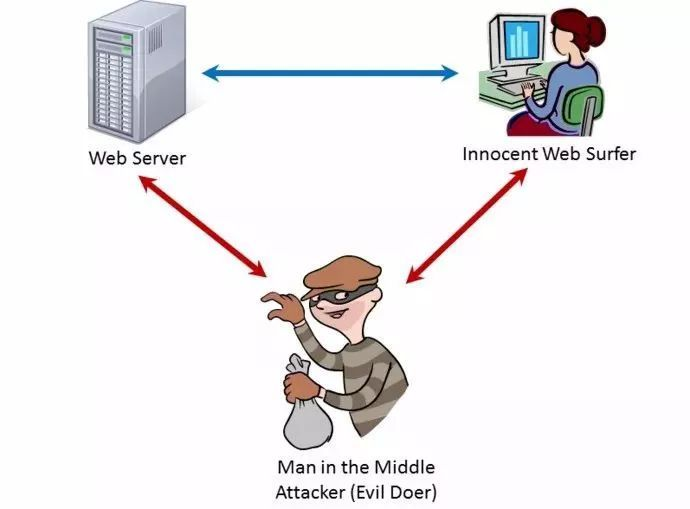

* attacker 会对目标进行中间人攻击，从而让流量流经自己的电脑。
* client 与 attacker 进行 https 加密通信，server 也与 attacker 进行 https 加密通信（**所有的 data 对于 attacker 来说都是明文的**）。


#### 11.7.3 第三类攻击

软件厂商

## 12 通信数据转发

### 12.1 代理

代理服务器接受客户端的请求，并且转发给其它服务器。

使用代理的主要目的是：

- 缓存
- 负载均衡
- 网络访问控制
- 访问日志记录

代理服务器分为正向代理和反向代理两种：

- 用户察觉得到正向代理的存在。

<div align="center">  </div><br>

- 而反向代理一般位于内部网络中，用户察觉不到。

<div align="center">  </div><br>

### 12.2 网关

与代理服务器不同的是，网关服务器会将 HTTP 转化为其它协议进行通信，从而请求其它非 HTTP 服务器的服务。

### 12.3 隧道

使用 SSL 等加密手段，在客户端和服务器之间建立一条安全的通信线路。

