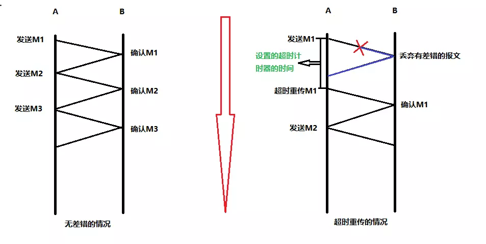
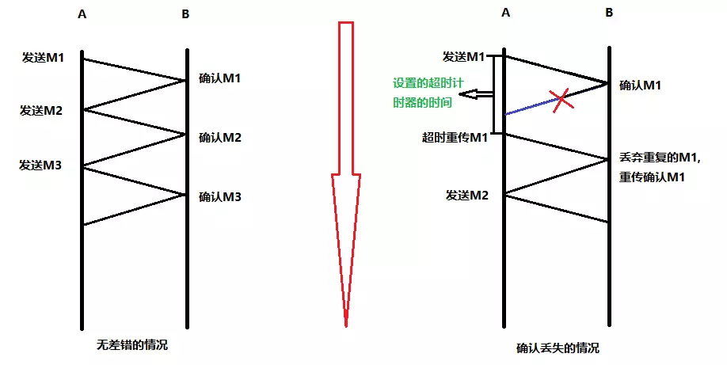
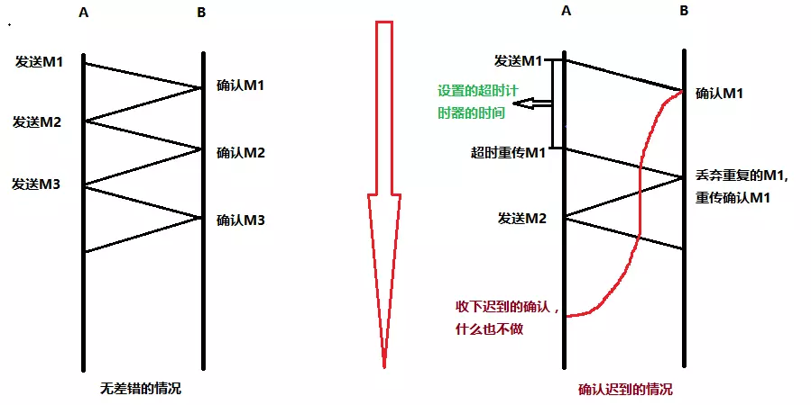
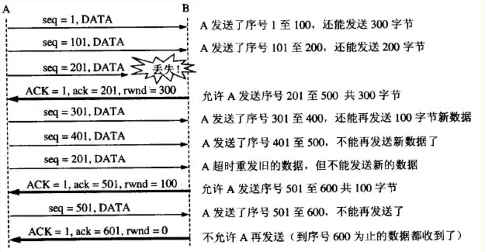
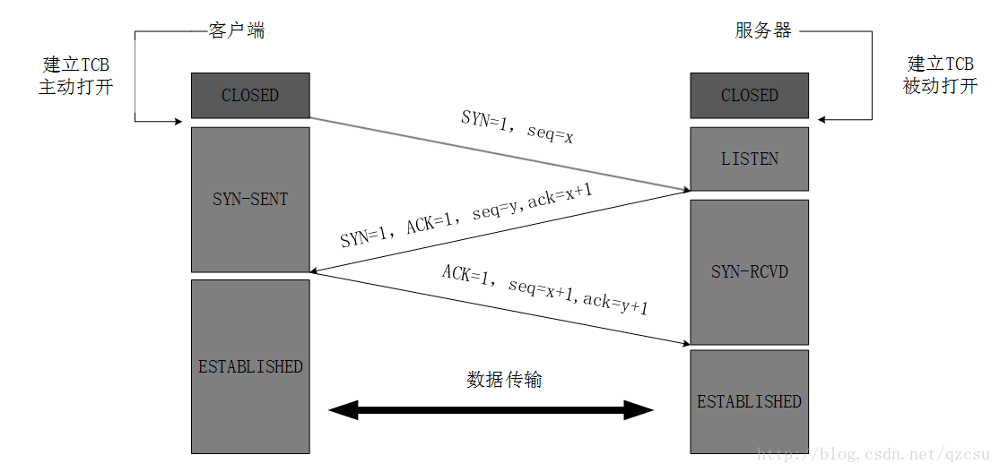
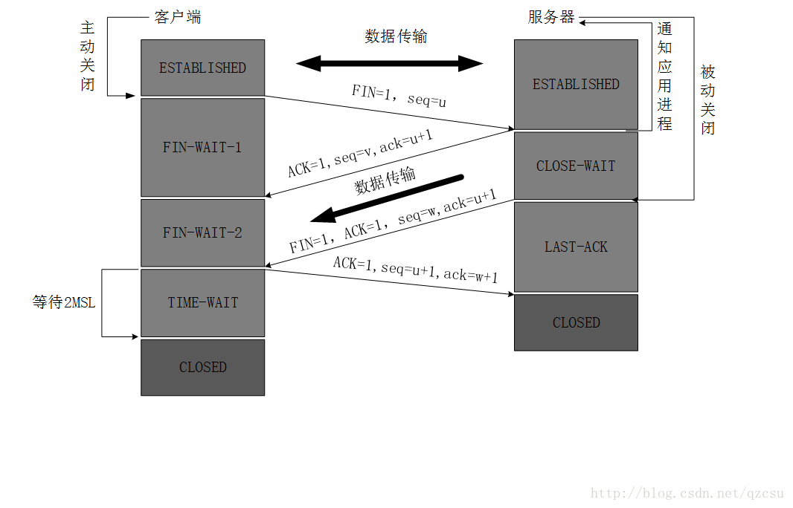
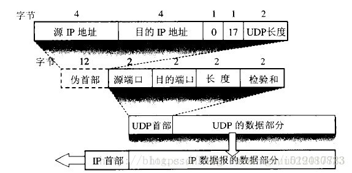

[TOC]

> [搞定计算机网络面试，看这篇就够了（补充版）](<https://juejin.im/post/5b7be0b2e51d4538db34a51e>)
>
> [关于 TCP/IP，必知必会的十个问题](<https://juejin.im/post/598ba1d06fb9a03c4d6464ab>)

## 1. TCP ##

### 1.1 概述 ###

**TCP**：Transmission Control Protocol， 传输控制协议，是一种**面向连接**的、**可靠**的、**基于字节流**的传输层通信协议。

### 1.2 特点 ###

* TCP 是面向连接的。（就好像打电话一样，通话前需要先拨号建立连接，通话结束后要挂机释放连接）
* 每一条 TCP 连接只能有两个端点，每一条TCP连接只能是点对点的（一对一）
* TCP 提供**可靠交付的服务**。通过TCP连接传送的数据**，无差错、不丢失、不重复、并且按序到达**
* TCP 提供全双工通信。TCP 允许通信双方的应用进程在任何时候都能发送数据。TCP 连接的两端都设有发送缓存和接收缓存，用来临时存放双方通信的数据；
* **面向字节流**。TCP 中的“流”（Stream）指的是流入进程或从进程流出的字节序列。“面向字节流”的含义是：虽然应用程序和 TCP 的交互是一次一个数据块（大小不等），但 **TCP 把应用程序交下来的数据仅仅看成是一连串的无结构的字节流**。

### 1.3 应用 ###

* SMTP（电子邮件）
* TELNET（远程终端接入）
* HTTP（万维网）
* FTP（文件传输）
* POP（电子邮件传输）

### 1.4 可靠传输的工作原理 ###

> 1. 发送方在发送完一个分组以后，必须暂时保留副本
> 2. 分组和确认分组都必须使用编号，明确哪一个分组收到了相应的确认
> 3. 超时计时器设置重传时间比分组平均往返时间更长

#### 1.4.1 **停止等待协议**  ####

基本原理就是每发完一个分组就停止发送，等待对方确认。在收到确认后再发下一个分组。 **超时重传：** 当 TCP 发出一个段后，它启动一个定时器，等待目的端确认收到这个报文段。如果不能及时收到一个确认，将重发这个报文段

#### 1.4.2 连续ARQ协议 ####

连续 ARQ 协议可提高信道利用率。**发送方维持一个发送窗口，凡位于发送窗口内的分组可以连续发送出去，而不需要等待对方确认**。接收方一般采用累计确认，对按序到达的最后一个分组发送确认，表明到这个分组为止的所有分组都已经正确收到了。

**优点：** 信道利用率高，容易实现，即使确认丢失，也不必重传。

**缺点：** 不能向发送方反映出接收方已经正确收到的所有分组的信息。 比如：发送方发送了 5条 消息，中间第三条丢失（3号），这时接收方只能对前两个发送确认。发送方无法知道后三个分组的下落，而只好把后三个全部重传一次。这也叫 Go-Back-N（回退 N），表示需要退回来重传已经发送过的 N 个消息。

### 1.5 可靠传输的实现 ###

#### 1.5.1 滑动窗口 ####

- TCP 利用滑动窗口实现流量控制的机制。
- **滑动窗口（Sliding window）是一种流量控制技术**。早期的网络通信中，通信双方不会考虑网络的拥挤情况直接发送数据。由于大家不知道网络拥塞状况，同时发送数据，导致中间节点阻塞掉包，谁也发不了数据，所以就有了滑动窗口机制来解决此问题。
- TCP 中采用**滑动窗口来进行传输控制，滑动窗口的大小意味着接收方还有多大的缓冲区可以用于接收数据。**发送方可以通过滑动窗口的大小来确定应该发送多少字节的数据。当滑动窗口为 0 时，发送方一般不能再发送数据报，但有两种情况除外，一种情况是可以发送紧急数据，例如，允许用户终止在远端机上的运行进程。另一种情况是发送方可以发送一个 1 字节的数据报来通知接收方重新声明它希望接收的下一字节及发送方的滑动窗口大小。

#### 1.5.2  流量控制 ####

**流量控制**就是让发送方的发送速率不要太快，要让接收方来得及接收。

利用**滑动窗口机制**可以很方便地在TCP连接上实现对发送方的流量控制。

设A向B发送数据。在连接建立时，B告诉了A：“我的接收窗口是 rwnd = 400 ”(这里的 rwnd 表示 receiver window) 。因此，发送方的发送窗口不能超过接收方给出的接收窗口的数值。请注意，TCP的窗口单位是字节，不是报文段。假设每一个报文段为100字节长，而数据报文段序号的初始值设为1。大写ACK表示首部中的确认位ACK，小写ack表示确认字段的值ack。

从图中可以看出，B进行了三次流量控制。第一次把窗口减少到 rwnd = 300 ，第二次又减到了 rwnd = 100 ，最后减到 rwnd = 0 ，即不允许发送方再发送数据了。这种使发送方暂停发送的状态将持续到主机B重新发出一个新的窗口值为止。B向A发送的三个报文段都设置了 ACK = 1 ，只有在ACK=1时确认号字段才有意义。

TCP为每一个连接设有一个持续计时器(persistence timer)。只要TCP连接的一方收到对方的零窗口通知，就启动持续计时器。若持续计时器设置的时间到期，就发送一个零窗口控测报文段（携1字节的数据），那么收到这个报文段的一方就重新设置持续计时器。

## 2. TCP三次握手 ##

### 2.1 过程 ###

最开始的时候客户端和服务器都是处于CLOSED状态。主动打开连接的为客户端，被动打开连接的是服务器。

1. TCP服务器进程先创建传输控制块TCB，时刻准备接受客户进程的连接请求，此时服务器就进入了LISTEN（监听）状态；
2. TCP客户进程也是先创建传输控制块TCB，然后向服务器发出连接请求报文，这是报文首部中的同部位SYN=1，同时选择一个初始序列号 seq=x ，此时，TCP客户端进程进入了 SYN-SENT（同步已发送状态）状态。TCP规定，SYN报文段（SYN=1的报文段）不能携带数据，但需要消耗掉一个序号。
3. TCP服务器收到请求报文后，如果同意连接，则发出确认报文。确认报文中应该 ACK=1，SYN=1，确认号是ack=x+1，同时也要为自己初始化一个序列号 seq=y，此时，TCP服务器进程进入了SYN-RCVD（同步收到）状态。这个报文也不能携带数据，但是同样要消耗一个序号。
4. TCP客户进程收到确认后，还要向服务器给出确认。确认报文的ACK=1，ack=y+1，自己的序列号seq=x+1，此时，TCP连接建立，客户端进入ESTABLISHED（已建立连接）状态。TCP规定，ACK报文段可以携带数据，但是如果不携带数据则不消耗序号。
5. 当服务器收到客户端的确认后也进入ESTABLISHED状态，此后双方就可以开始通信了。

### 2.2 引出的问题 ###

**（1）为什么TCP客户端最后还要发送一次确认呢？**

一句话，主要**防止已经失效的连接请求报文突然又传送到了服务器**，从而产生错误。

如果使用的是两次握手建立连接，假设有这样一种场景，客户端发送了第一个请求连接并且没有丢失，只是因为在网络结点中滞留的时间太长了，由于TCP的客户端迟迟没有收到确认报文，以为服务器没有收到，此时重新向服务器发送这条报文，此后客户端和服务器经过两次握手完成连接，传输数据，然后关闭连接。此时此前滞留的那一次请求连接，网络通畅了到达了服务器，这个报文本该是失效的，但是，**两次握手的机制将会让客户端和服务器再次建立连接，这将导致不必要的错误和资源的浪费。**

如果采用的是三次握手，就算是那一次失效的报文传送过来了，服务端接受到了那条失效报文并且回复了确认报文，但是**客户端不会再次发出确认**。由于**服务器收不到确认，就知道客户端并没有请求连接。**

## 3. TCP四次挥手 ##

### 3.1 过程 ###

数据传输完毕后，双方都可释放连接。最开始的时候，客户端和服务器都是处于ESTABLISHED状态，然后客户端主动关闭，服务器被动关闭。

1. **客户端进程发出连接释放报文**，并且停止发送数据。释放数据报文首部，FIN=1，其序列号为seq=u（等于前面已经传送过来的数据的最后一个字节的序号加1），此时，客户端进入FIN-WAIT-1（终止等待1）状态。 TCP规定，FIN报文段即使不携带数据，也要消耗一个序号。
2. 服务器收到连接释放报文，发出确认报文，ACK=1，ack=u+1，并且带上自己的序列号seq=v，此时，服务端就进入了CLOSE-WAIT（关闭等待）状态。TCP服务器通知高层的应用进程，**客户端向服务器的方向就释放**了，这时候处于**半关闭状态**，即客户端已经没有数据要发送了，但是服务器若发送数据，客户端依然要接受。这个状态还要持续一段时间，也就是整个**CLOSE-WAIT状态持续的时间**。
3. 客户端收到服务器的确认请求后，此时，客户端就进入FIN-WAIT-2（终止等待2）状态，等待服务器发送连接释放报文（在这之前还需要接受服务器发送的最后的数据）。
4. 服务器将最后的数据发送完毕后，就向客户端发送连接释放报文，FIN=1，ack=u+1，由于在半关闭状态，服务器很可能又发送了一些数据，假定此时的序列号为seq=w，此时，服务器就进入了LAST-ACK（最后确认）状态，等待客户端的确认。
5. 客户端收到服务器的连接释放报文后，必须发出确认，ACK=1，ack=w+1，而自己的序列号是seq=u+1，此时，客户端就进入了TIME-WAIT（时间等待）状态。注意此时TCP连接还没有释放，必须经过2∗ *∗MSL（最长报文段寿命）的时间后，当客户端撤销相应的TCB后，才进入CLOSED状态。
6. 服务器只要收到了客户端发出的确认，立即进入CLOSED状态。同样，撤销TCB后，就结束了这次的TCP连接。可以看到，服务器结束TCP连接的时间要比客户端早一些。

### 3.2 引出的问题 ###

**（1）为什么客户端最后还要等待2MSL？**
MSL（Maximum Segment Lifetime），TCP允许不同的实现可以设置不同的MSL值。

* **保证客户端发送的最后一个ACK报文能够到达服务器**，因为这个ACK报文可能丢失，站在服务器的角度看来，我已经发送了FIN+ACK报文请求断开了，客户端还没有给我回应，应该是我发送的请求断开报文它没有收到，于是**服务器又会重新发送一次，而客户端就能在这个2MSL时间段内收到这个重传的报文，接着给出回应报文，并且会重启2MSL计时器。**
* **防止类似与“三次握手”中提到了的“已经失效的连接请求报文段”出现在本连接中**。客户端发送完最后一个确认报文后，**在这个2MSL时间中，就可以使本连接持续的时间内所产生的所有报文段都从网络中消失。**这样新的连接中不会出现旧连接的请求报文。

**（2）为什么建立连接是三次握手，关闭连接确是四次挥手呢？**

* 建立连接的时候， 服务器在LISTEN状态下，收到建立连接请求的SYN报文后，把ACK和SYN放在一个报文里发送给客户端。
* 关闭连接时，服务器收到对方的FIN报文时，仅仅表示对方不再发送数据了但是还能接收数据，而自己也未必全部数据都发送给对方了，所以己方可以立即关闭，也可以发送一些数据给对方后，再发送FIN报文给对方来表示同意现在关闭连接，因此，己方ACK和FIN一般都会分开发送，从而导致多了一次。

**（3）如果已经建立了连接，但是客户端突然出现故障了怎么办？**
TCP还设有一个**保活计时器**，显然，客户端如果出现故障，服务器不能一直等下去，白白浪费资源。服务器每收到一次客户端的请求后都会重新复位这个计时器，时间通常是设置为2小时，若两小时**还没有收到客户端的任何数据，服务器就会发送一个探测报文段，以后每隔75秒发送一次。**若一连发送10个探测报文仍然没反应，服务器就认为客户端出了故障，接着就关闭连接。

## 4. UDP ##

### 4.1 概述 ###

用户数据报协议（英语：User Datagram Protocol，缩写为UDP），又称使用者资料包协定，是一个简单的面向数据报的传输层协议，正式规范为RFC 768。
在TCP/IP模型中，UDP为网络层以上和应用层以下提供了一个简单的接口。UDP只提供数据的`不可靠传递`，它一旦把应用程序发给网络层的数据发送出去，就不保留数据备份（所以UDP有时候也被认为是不可靠的数据报协议）。UDP在IP数据报的头部仅仅加入了复用和数据校验（字段）。

### 4.2 特点 ###

* UDP 是无连接的（减少延迟）
* UDP 使用**尽最大努力交付**，即**不保证可靠交付**，因此主机不需要维持复杂的链接状态（这里面有许多参数）
* UDP 是**面向报文**的
* **UDP 没有拥塞控制**，因此网络出现拥塞不会使源主机的发送速率降低（对实时应用很有用，如 直播，实时视频会议等）
* UDP 支持**一对一、一对多、多对一和多对多**的交互通信
* 实现简单：无需维护连接状态
* UDP 的**首部开销小**，只有8个字节，比TCP的20个字节的首部要短

### 4.3 头部 ###

* 因为`UDP不需要应答`，所以来源端口是可选的，如果来源端口不用，那么置为零。

### 4.4 应用 ###

* DNS
* DHCP（动态主机配置协议）
* TFCP（简单文件传输协议）
* NFS（远程文件服务器）

## 5. TCP、UDP 区别 ##

UDP 在传送数据之前不需要先建立连接，远地主机在收到 UDP 报文后，不需要给出任何确认。虽然 UDP 不提供可靠交付，但在某些情况下 UDP 确是一种最有效的工作方式（一般用于即时通信），比如： QQ 语音、 QQ 视频 、直播等等

TCP 提供面向连接的服务。在传送数据之前必须先建立连接，数据传送结束后要释放连接。 TCP 不提供广播或多播服务。由于 TCP 要提供可靠的，面向连接的运输服务（TCP的可靠体现在TCP在传递数据之前，会有三次握手来建立连接，而且在数据传递时，有确认、窗口、重传、拥塞控制机制，在数据传完后，还会断开连接用来节约系统资源），这一难以避免增加了许多开销，如确认，流量控制，计时器以及连接管理等。这不仅使协议数据单元的首部增大很多，还要占用许多处理机资源。TCP 一般用于文件传输、发送和接收邮件、远程登录等场景。