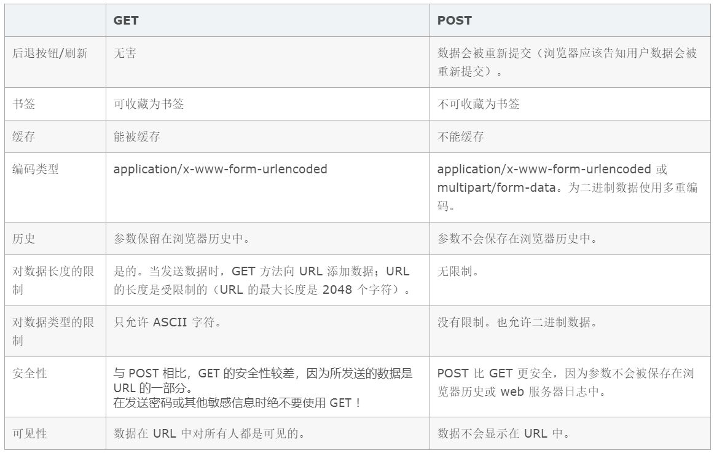

[TOC]

## 1. [URL和URI区别](https://www.cnblogs.com/wuyun-blog/p/5706703.html) ##

* **统一资源标识符(Uniform Resource Identifier).**能够在互联网上被唯一标识和定位的信息资源。
- **统一资源定位符(Uniform Resource Locator).**描述了一台特定的服务器上的某一个具体资源的特定位置。
- **统一资源名称 (Uniform Resource Name, URN)，**用特定命名空间的名字标识资源。

**栗子**

## 2. URL 中 的 *www* 引发的知识 ##

> 下面所用例子的URL：`http://mail.163.com/index.html`
>
> URI 统一资源标识符
>
> 比如 google.com、baidu.com、163.com等加上www，就不再是域名了！

1. `http://:`这个是协议，也就是HTTP超文本传输协议，也就是网页在网上传输的协议。
2. mail：这个是服务器名，代表着是一个邮箱服务器，所以是mail.
3. 163.com:这个是域名，是用来定位网站的独一无二的名字。
4. mail.163.com：这个是网站名，由服务器名+域名组成。
5. /：这个是根目录，也就是说，通过网站名找到服务器，然后在服务器存放网页的根目录
6. index.html：这个是根目录下的默认网页（当然，163的默认网页是不是这个我不知道，只是大部分的默认网页，都是index.html）
7. `http://mail.163.com/index.html`这个叫做URL，统一资源定位符，全球性地址，用于定位网上的资源。
8. mail.163.com 与 xxx.163.com 是不同的域名，但是主域名都是 163.com

## 3.  get和post的区别 ##

[GET和POST两种基本请求方法的区别](https://www.cnblogs.com/logsharing/p/8448446.html)

- GET在浏览器回退时是无害的，而POST会再次提交请求。
  因为**Get请求浏览器有缓存,回退时读取的是缓存中的数据**. 但是**Post没有浏览器缓存会再次发送请求,消耗服务器性能.**

- GET产生的URL地址可以被收藏为书签，而POST不可以。

- GET请求会被浏览器主动cache，而POST不会，除非手动设置。

  > 响应包含适当的Cache-Control或Expires头字段，否则POST方法的响应不可缓存。

- GET请求只能进行url编码，而POST支持多种编码方式。

- GET请求参数会被完整**保留在浏览器历史记录里，**而POST中的参数不会被保留。

- GET请求在URL中传送的参数是有长度限制的，而POST么有。

- 对参数的数据类型，GET只接受ASCII字符，而POST没有限制。

- GET比POST更不安全，因为参数直接暴露在URL上，所以不能用来传递敏感信息。

- GET参数通过URL传递，POST放在Request body中。

- GET产生一个TCP数据包；POST产生两个TCP数据包（firefox 一个报文）。

  - 对于GET方式的请求，浏览器会把http header和data一并发送出去，服务器响应200（返回数据）。

  - 对于POST，**浏览器先发送header，服务器响应100 continue**，浏览器再发送data，服务器响应200 ok（返回数据）。

    > 也就是说，GET只需要汽车跑一趟就把货送到了，而POST得跑两趟，第一趟，先去和服务器打个招呼“嗨，我等下要送一批货来，你们打开门迎接我”，然后再回头把货送过去。

  - 因为POST需要两步，时间上消耗的要多一点，看起来GET比POST更有效。因此Yahoo团队有推荐用GET替换POST来优化网站性能。但这是一个坑！跳入需谨慎。为什么？

    GET与POST都有自己的语义，不能随便混用。
    据研究，在网络环境好的情况下，发一次包的时间和发两次包的时间差别基本可以无视。而在网络环境差的情况下，两次包的TCP在验证数据包完整性上，有非常大的优点。
    并不是所有浏览器都会在POST中发送两次包，Firefox就只发送一次。