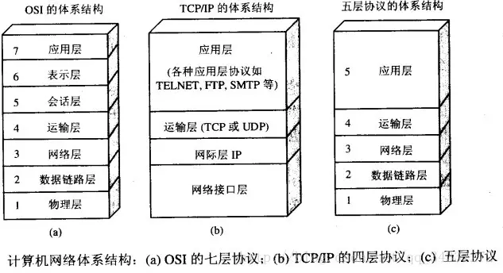

[TOC]

> <http://www.cnblogs.com/maybe2030/p/4781555.html#_label1>
>
> <https://juejin.im/post/5b7be0b2e51d4538db34a51e>

## 1. 概览 ##

### 1.1 应用层 ###

为特定应用程序提供数据传输服务，例如 HTTP、DNS 等协议，定义的应用间的通信和交互的规则。
1. 数据传输基本单位为**报文**
2. 包含的主要协议：FTP（文件传送协议）、Telnet（远程登录协议）、DNS（域名解析协议）、SMTP（邮件传送协议），POP3协议（邮局协议），HTTP协议（Hyper Text Transfer Protocol）。

   [POP3、SMTP和IMAP之间的区别和联系](<https://blog.csdn.net/qq877507054/article/details/71249272>)-接受、传送、接受和传送

### 1.2 表示层 ###

表示层**对上层数据或信息进行变换**以保证一个主机应用层信息可以被另一个主机的应用程序理解。表示层的**数据转换包括数据的加密、压缩、格式转换**等。

1. [LPP](<https://baike.baidu.com/item/LPP/2986191?fr=aladdin>),轻量级表示协议（LPP）描述了在某些受限条件下提供基于 TCP/IP 网络的 OSI应用程序服务的支持方法。

2. [XDP](<https://baike.baidu.com/item/XDP>), Adobe的一种基于XML的文件格式，[文件名后缀](https://baike.baidu.com/item/文件名后缀/8299429)为XDP，它是一种**把PDF格式的文件内容封装在XML容器的机制**。

### 1.3 会话层 ###

会话层管理主机之间的会话进程，即负责**建立、管理、终止进程之间的会话**，并能使会话获得同步。

1. SSL（安全套接层协议），数据机密性、数据完整性、身份合法性
   * 底层：记录层协议，建立在TCP之上，机密性、真实性、重传保护
   * 高层：握手协议，数据交换前双方身份认证以及密码算法和密钥的协商
2. TSL(传输层安全协议)，建立在SSL之上

### 1.4 运输层 ###

**为进程提供通用数据传输服务。**

传输层的任务是根据通信子网的特性，最佳的利用网络资源，为两个端系统的会话层之间，提供**建立、维护和取消传输连接的功能，负责端到端的可靠数据传输**。信息传送的协议数据单元称为**报文段或用户数据包**。

1. 将上层数据分段
2. 提供端到端的、可靠的或不可靠的传输
3. 端到端的差错控制和流量控制问题
4. 包含的主要协议：TCP协议（Transmission Control Protocol，传输控制协议）、UDP协议（User Datagram Protocol，用户数据报协议）

> 重要设备：网关,防火墙

### 1.5 网络层 ###
网络层为主机之间的数据传输服务。
1. 为网络设备提供逻辑地址，进行路由选择、分组转发。
2. 把运输层产生的报文段或用户数据报封装成**分组或包**进行传输（`ip`数据包）

### 1.6 数据链路层 ###

主机之间可以有很多链路，**链路层协议**就是为同一链路的主机提供数据传输服务。
1. 数据链路层把网络层传下来的分组封装成帧
2. **控制帧在在不可靠的物理介质上提供可靠的传输**
  * 物理地址寻址
  * 数据的成帧
  * 流量控制
  * 数据的检错
  * 重发
  * 调节发送速率以使与接收方相匹配
3. 两个网络实体之间提供**数据链路通路的建立、维持和释放**的管理。

> `PPP`协议是一种在串**行链路上传输`IP`数据包的协议的集合**，也是用户计算机和 ISP 进行通信时所使用的数据链路层协议。支持建立链路的**链路控制协议`LCP`**以及一系列的**网络控制协议`NCP`**。
>
> 完成数据链路层上述的一些功能。如，封装成帧。

### 1.7 物理层 ###

 相邻计算机节点之间比特流的透明传送，尽可能屏蔽掉具体传输介质和物理设备的差异，（使数据链路层感觉不到这些差异）
 1. 将信息编码成电流脉冲或其它信号用于网上传输。

> 中继器（Repeater，也叫放大器）
> 集线器

## 2. 数据在各层之间的传递过程

在向下的过程中，需要添加下层协议所需要的首部或者尾部，而在向上的过程中不断拆开首部和尾部。

路由器只有下面三层协议，因为路由器位于网络核心中，不需要为进程或者应用程序提供服务，因此也就不需要传输层和应用层。

## 3. 概念

**协议**：为计算机*网络*中进行数据交换而建立的规则、标准或约定。

**OSI体系结构**：一种[概念模型](https://baike.baidu.com/item/概念模型)，由[国际标准化组织](https://baike.baidu.com/item/国际标准化组织)提出，一个试图使各种计算机在世界范围内互连为网络的标准框架。

**TCP/IP体系结构**：互联网中最常用的。

**五层模型**：结合 OSI 和 TCP/IP 有点，用于学习计算机网络原理。