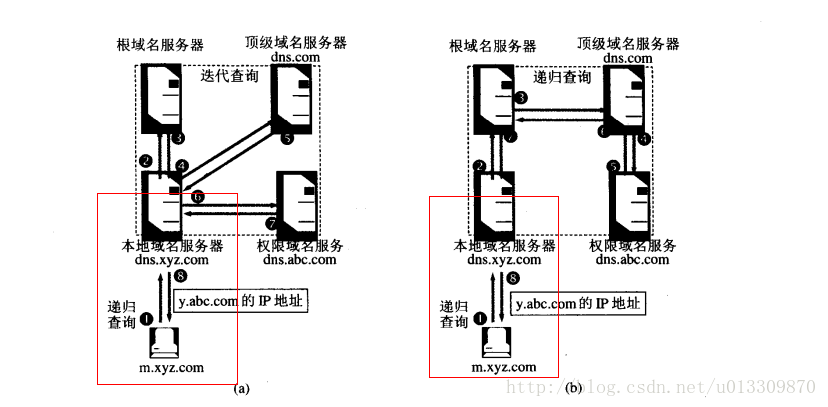

[TOC]

## 1. DNS ##

[参考-博客](https://www.cnblogs.com/penghuwan/p/7728673.html)

> 第一，从协议的层面看，它是一种**应用层协议**
>
> 第二，从实体的层面看，它是一个由**分层的DNS服务器实现的分布式数据库**

### 1.1 DNS查询 ###

**查询方式**

**具体例子**

例如上图所示的例子中，主机cis.poly.edu想知道主机gaia.cs.umass.edu的IP地址，并且主机gaia.cs.umass.edu的权威DNS服务器为dns.umass.edu。

则DNS查询过程如下：

1. 主机cis.poly.edu首先向它的本地DNS服务器dns.poly.edu发送一个DNS查询报文，该查询报文包含有要求转换的主机名gaia.cs.umass.edu

2. 本地DNS服务器dns.poly.edu将该报文转发至根DNS服务器。

3. 该根DNS服务器注意到DNS服务器的edu前缀并向本地DNS服务器dns.poly.edu返回负责edu的顶级域DNS服务器的IP地址列表

4. 本地DNS服务器接收到了返回的报文，根据报文中的IP地址，向该顶级域DNS服务器发送查询报文

5. 顶级域DNS服务器注意到了umass.edu前缀，用包含权威DNS服务器的IP地址进行响应，该权威DNS服务器是负责马萨诸塞大学的dns.umass.edu

6. 本地DNS服务器直接向主机dns.umass.edu重发查询报文

7. 主机dns.umass.edu使用gaia.cs.umass.edu的IP地址作为响应，传回给本地DNS服务器

8. 最终，本地DNS服务器将包含最终结果的查询报文转发给请求主机cis.poly.edu

### 1.2 DNS服务器的层次和类别 ###

DNS服务器是有层次的，它可以分为三种类型：**根DNS服务器， 顶级域**（Top-Level Domain, TLD ）**DNS服务器和权威DNS服务器**，分别对应下面三个层次（从上至下）

### 1.3 什么是本地域名服务器 ###

​    本地DNS一般是指你电脑上网时IPv4或者IPv6设置中填写的那个DNS。这个有可能是手工指定的或者是DHCP自动分配的。
​    如果你的电脑是直连运营商网络，一般默认设置情况下DNS为DHCP分配到的运营商的服务器地址。如果你的电脑和运营商之间还加了无线或者有线路由，那极有可能路由器本身还内置了一个DNS转发器，这玩意的作用是将发往他所有的DNS请求转发到上层DNS。此时由于路由器本身也接管了下挂电脑的DHCP服务，所以它分配给下面电脑的DNS地址就是它自身，所以你能看到电脑的DNS分配到的可能是192.168.1.1。实际上就是路由器自身，而路由器的DNS转发器将请求转发到上层ISP的DNS。所以这里说DNS是局域网或者是运营商的都可以

### 1.4 本地DNS服务器的作用 ###

1. 主机和本地DNS服务器一般是相邻的，当主机发出DNS请求的时候，该请求会被发往本地DNS服务器，它起着代理的作用，并将该请求转发到DNS服务器层次结构中

2. 本地DNS服务器可以通过缓存主机名/IP地址，减少对相同主机名的查询而消耗的时间，改善时延和性能

## 2. URL 中 的 *www* 引发的知识 ##

>  下面所用例子的URL：`http://mail.163.com/index.html`
>
> URI 统一资源标识符
>
> 比如 google.com、baidu.com、163.com等加上www，就不再是域名了！

1. `http://:`这个是协议，也就是HTTP超文本传输协议，也就是网页在网上传输的协议。
2. mail：这个是服务器名，代表着是一个邮箱服务器，所以是mail.
3. 163.com:这个是域名，是用来定位网站的独一无二的名字。
4. mail.163.com：这个是网站名，由服务器名+域名组成。
5. /：这个是根目录，也就是说，通过网站名找到服务器，然后在服务器存放网页的根目录
6. index.html：这个是根目录下的默认网页（当然，163的默认网页是不是这个我不知道，只是大部分的默认网页，都是index.html）
7. `http://mail.163.com/index.html`这个叫做URL，统一资源定位符，全球性地址，用于定位网上的资源。
8. mail.163.com 与 xxx.163.com 是不同的域名，但是主域名都是 163.com
