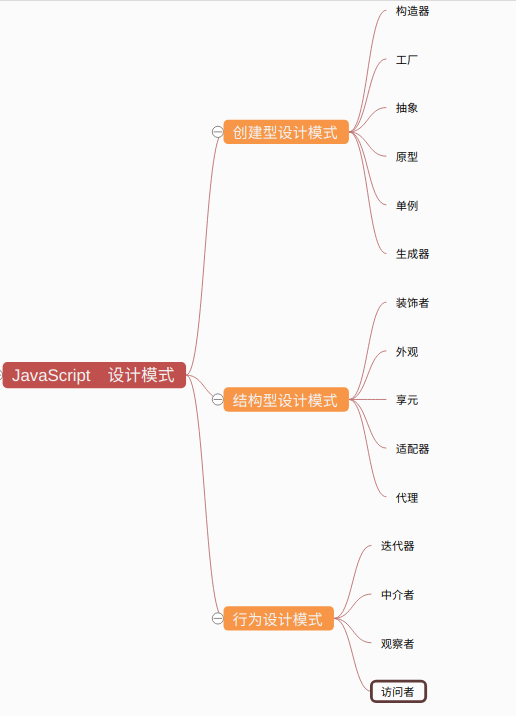

[TOC]
## 网站资源参考

Javascript设计模式（人民邮电出版社）

（英文）https://addyosmani.com/resources/essentialjsdesignpatterns/book/

（中文）https://www.oschina.net/translate/learning-javascript-design-patterns?print
                    网页显示不好看：添加样式（padding: 0 50px;font-family: Palatino, "Palatino Linotype", Georgia, Times, "Times New Roman", serif）

