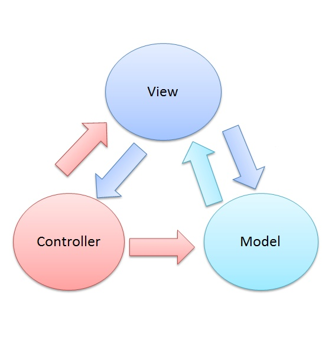
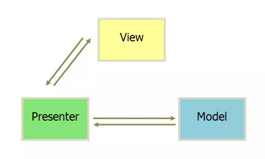
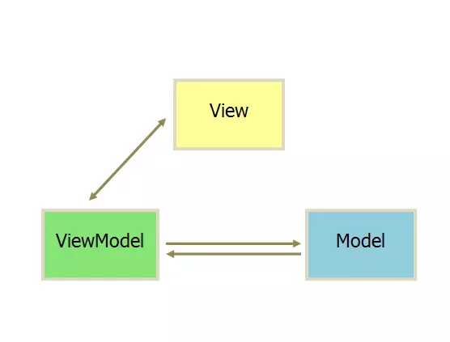

1. [浅析前端开发中的 MVC/MVP/MVVM 模式](https://juejin.im/post/593021272f301e0058273468)
2. [深入理解MVC](<https://blog.csdn.net/zuiyingong6567/article/details/80150834>)，[深入理解MVC](<https://zhuanlan.zhihu.com/p/35680070>)——原文　启发
3. MVC[¶](http://www.digpage.com/mvc.html#mvc)
4. [设计模式之组合模式](https://www.cnblogs.com/snaildev/p/7647190.html)
5. **[GoF的23个经典设计模式**](<https://blog.csdn.net/slowlifes/article/details/17884169>)
6. [MVC，MVP 和 MVVM 的图示](http://www.ruanyifeng.com/blog/2015/02/mvcmvp_mvvm.html)
7. [什么是“组合模式”？](<http://www.fly63.com/article/detial/2838>)
8. [JS设计模式——9.组合模式](https://www.cnblogs.com/JChen666/p/3645038.html)

## 1. MVC

> 三层架构的核心思想是**面向接口编程和各层之间的解耦和可替换性**

1. MVC即Model、View、Controller即模型(业务逻辑)、视图(界面)、控制器(粘合剂)。

2. MVC要实现的目标是将软件**用户界面和业务逻辑分离**以使代码**可扩展性、可复用性、可维护性、灵活性加强**。

3. Controller用来定义**用户界面对用户输入的响应方式**，它**连接模型和视图**，用于**控制应用程序的流程**，**处理用户的行为和数据上的改变**。

   > 将不同的View和不同的Model组织在一起，替双方传递消息，起粘合剂的效果。Controller中的内容能少则少，这样才能提供最大的灵活性。

4. 组成MVC的三个模式分别是组合模式(view)、策咯模式(view, controller)、观察者模式(view,model)

   > **策略模式**
   >
   > 1. 将一个个算法（解决方案）封装在一个个策略类中。
   >
   > **组合模式**
   >
   > 1. 组合模式允许你将对象组合成树形结构来表现**”部分-整体“的层次结构**，使得客户以一致的方式处理单个对象以及对象的组合。
   > 2. 组合模式实现的最关键的地方是——**简单对象和复合对象必须实现相同的接口**。这就是组合模式能够将组合对象和简单对象进行一致处理的原因。
   > 3. 组合模式的类层次结构是树状的， 而我们做Web时视图层是html页面，html的结构不正是树状的吗，这其实就是一个组合模式的应用，只是**浏览器厂商**已经把界面相关的工作帮我们做掉了

## 2. MVP

1. MVC相比，MVP模式通过**解耦View和Model**，**完全分离视图和模型**使职责划分更加清晰；由于View不依赖Model，可以将View抽离出来做成组件。
2. MVP 模式将 Controller 改名为 Presenter，同时**改变了通信方向**（各部分之间的通信，都是双向的）。
3. `View` 非常薄，不部署任何业务逻辑，称为"**被动视图**"（Passive View），即没有任何主动性，而 Presenter非常厚，所有逻辑都部署在那里。
4. MVP定义了Presenter和View之间的接口，用户对View的操作都转移到了Presenter。
5. Presenter作为View和Model之间的“中间人”，除了基本的业务逻辑外，还有大量代码需要对从View到Model和从Model到View的数据进行“手动同步”，这样Presenter显得很**重**，维护起来会比较困难。
6. 在MVC里，View是可以直接访问Model的，但MVP中的**View并不能直接使用Model，而是通过为Presenter提供接口，让Presenter去更新Model，再通过观察者模式更新View**。

## 3. MVVM

1. MVVM(Model View ViewModel)是一种基于MVC和MVP的架构模式，它试图**将用户界面（UI）从业务逻辑和行为中更加清晰地分离出来**。

2. MVVM 模式将 Presenter 改名为 ViewModel，基本上与 **MVP 模式完全一致**。唯一的区别是，它采用**双向绑定**（data-binding）。业务逻辑也主要集中在这里。与MVP不同的是，没有了View为Presente提供的接口，之前由Presenter负责的View和Model之间的数据同步交给了ViewModel中的数据绑定进行处理，当Model发生变化，ViewModel就会自动更新；ViewModel变化，Model也会更新。
3. 在MVVM中，我们可以把Model称为数据层，因为它仅仅关注数据本身，不关心任何行为（格式化数据由View的负责）这里可以把它理解为一个类似json的数据对象。
4. MVVM中的View通过使用模板语法来声明式的将数据渲染进DOM，当ViewModel对Model进行更新的时候，会通过数据绑定更新到View。