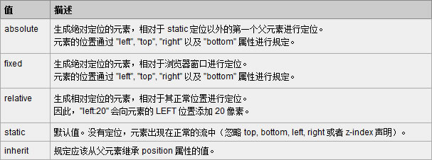

[TOC]

## 1. node多线程 ##

[worker_threads 模块](<https://juejin.im/post/5c63b5676fb9a049ac79a798>)

## 2. node的全局对象及全局变量有哪些 ##

> JavaScript 中有一个特殊的对象，称为全局对象（Global Object），它及其所有属性都可以在程序的任何地方访问，即全局变量。
>
> 1. 在浏览器 JavaScript 中，通常 window 是全局对象。
> 2.  Node.js 中的全局对象是 global，所有全局变量（除了 global 本身以外）都是 global 对象的属性。**global 最根本的作用是作为全局变量的宿主**

Node.js 中你**不可能在最外层定义变量**，因为所有用户代码都是属于当前模块的， 而模块本身不是最外层上下文。

（1）__filename

表示当前正在执行的脚本的文件名。它将输出文件所在位置的绝对路径，且和命令行参数所指定的文件名不一定相同。 如果在模块中，返回的值是模块文件的路径。

（2）__dirname

**__dirname** 表示当前执行脚本所在的目录。

（3）setTimeout(cb, ms)

全局函数在指定的毫秒(ms)数后执行指定函数(cb)。：setTimeout() 只执行一次指定函数。返回一个代表定时器的句柄值。

（4）clearTimeout(t)

全局函数用于停止一个之前通过 setTimeout() 创建的定时器。 参数 **t** 是通过 setTimeout() 函数创建的定时器。

（5）setInterval(cb, ms)

**setInterval(cb, ms)** 全局函数在指定的毫秒(ms)数后执行指定函数(cb)。

返回一个代表定时器的句柄值。可以使用 **clearInterval(t)** 函数来清除定时器。

setInterval() 方法会不停地调用函数，直到 clearInterval() 被调用或窗口被关闭。

（6）console

console 用于提供控制台标准输出

（7）process

process 是一个全局变量，即 global 对象的属性。它用于描述当前Node.js 进程状态的对象，提供了一个与操作系统的简单接口。

## 3. Vue生命周期/钩子函数 ##

[本地——note/Vue/问题.md——7. vue 生命周期](../../Vue/问题.md)

## 4.  JSON.parse()大数据阻塞如何处理 ##

1. [Fetch API(window.fetch)](https://developer.mozilla.org/en-US/docs/Web/API/Fetch_API)我注意到[Response](https://developer.mozilla.org/en-US/docs/Web/API/Response)对象拥有一个异步.json方法。

```js
 fetch('/foo.json')  
    .then(function(response) {  
            response.json().then(function(result) {  
                // result is parsed body of foo.json  
            });  
    });
```

2. 分片
3. worker

## 5. 什么是展示型组件和容器组件？(react) ##

1. **容器型组件**
   容器型组件主要表现为组件怎么工作的、数据怎样更新的，不包含任何Virtual DOM 的修改或组合，也不会包含组件的样式。
   如果映射到Redux上，容器型组件就是使用connect的组件，如果映射到Flux上，就是与store绑定的组件。
   通过使用connect从Redux状态树中获取数据。
   通过直接分发任意的action来改变数据。
   通常由React Redux创建容器型组件。
   感知Redux。
2. **展示型组件**
   展示型组件主要表现为组件是怎样渲染的，包含了Virtual DOM的修改或组合，也包含组件的样式，同进不依赖任何形式的store。一般可以写成无状态函数，但实际上由于很多展示型组件里依然存在生命周期方法，所以不一定都是无状态的组件。
   从this.props中获取数据。
   调用从props中传入的action creator来改变数据
   开发者自身创建展示型组件

## 6. 怎么配置样式的按需加载？ ##

1. **样式的按需加载意义不大。**
   css样式的执行不像js，js引擎是单线程，基于事件循环来运行，有一个下载、解析的过程，做按需加载可以避免卡顿。
   而css样式是由浏览器的渲染引擎来做的，会同时构建style数和DOM树，是一次构建完成的，按需加载反而需要不停的进行样式数的构建。
2. **样式模块化开发很重要。**
   css样式利用less。scss等进行模块化开发很重要，可以避免样式的多余和混乱。
3. **scoped**
   加了scoped的组件样式，css选择器后面会有hash值来区分，是不可能和外面的样式混掉的，你可以在控制台看到这个后缀

## 7. css-loader和style-loader的区别 ##

[本地——webpack/loader and plugin.md——css-loader 和style-loader](../../前端工程化/webpack/loader and plugin.md)

- `css-loader`: 加载.css文件，处理 css 文件
- `style-loader`: 把 js 中 import 导入的样式文件代码，打包到 js 文件中，运行 js 文件时，将样式自动插入到`<style>`标签中

## 8. 如何做JS的按需加载？ ##

```js
var scriptList = {};
function load(url, callback) {
    var script = document.createElement("script");
    script.type = "text/javascript";
    script.src = url;
    document.body.appendChild(script);
    scriptList[url] = script;
    if(typeof(callback) !== "undefined"){
        script.onload = function () {
            callback();
        };
    }
}

function *** () {
    var url = "***.js";
    if (scriptList.hasOwnProperty(url)) {
        // ...
    } else {
        load(url, function () {
            // ... 
        });
    }
}
```

## 10. 解释浏览器端JavaScript的事件循环 ##

[本地——/事件循环/事件循环机制.md](../../JS相关/JS工作机制相关/事件循环/事件循环机制.md)

## 11. 介绍事件委托 ##

[本地——前端来自真实大厂的532道面试题/记录：300-359.md——323. 事件冒泡，事件捕获，事件委托的原理，如何实现委托，事件，委托的有点是什么，事件监听](../前端来自真实大厂的532道面试题/记录：300-359.md)

事件委托实现（由于事件冒泡的事件流模型被所有主流的浏览器兼容，从兼容性角度来说还是建议大家使用事件冒泡模型。）
在JavaScript中，**添加到页面上的事件处理程序数量将直接关系到页面的整体运行性能。**导致这一问题的原因是多方面的。首先，每个函数都是对象，都会占用内存；内存中的对象越多，性能就越差。其次，必须事先指定所有事件处理程序而**导致的DOM访问次数，会延迟整个页面的交互就绪时间。**
**对“事件处理程序过多”问题的解决方案就是事件委托。** **事件委托利用了事件冒泡，只指定一个事件处理程序，就可以管理某一类型的所有事件。**例如，click事件会一直冒泡到document层次。也就是说，我们可以为整个页面指定一个onclick事件处理程序，而不必给每个可单击的元素分别添加事件处理程序。

## 12. 介绍红黑树 ##

[本地——算法\树\红黑树\知识点.md](../../算法/树/红黑树/知识点.md)

## 13. 红黑树跟AVL树有何区别？ ##

[本地——算法\树\红黑树\知识点.md](../../算法/树/红黑树/知识点.md)

## 14. 数组去重怎么做？你能想到的方法都说说。~ ##

1. `for` 和 `indexOf`

2. `for` 和 对象（hash）键值判断

3. `[...new Set([1,2,3,3])]`

4. 优化遍历数组法

   ```js
   // 思路：push 的值是重复的值最右边的或者是不重复的
   function unique(arr) {
       let len = arr.length,
       	temArr = [];
       if(len) {
           for(let i = 0; i < len; i++) {
               for(let j = i + 1; j < len; j++) {
                   if(arr[i] === arr[j]) {
                       i++;
                       j = i;
                   }
               }
               temArr.push(arr[i]);
           }
       }
       return temArr;
   }
   ```

5. indexOf(arr[i])==arr.lastIndexOf(arr[i])

## 15. React和Vue的区别？ ##

[本地——/Vue/问题.md——1. VUE/REACT/JQuery](../../Vue/问题.md)

**react和vue的相似之处：**

1. 使用虚拟dom
2. 提供了响应式和组件化的视图组件
3. 关注核心库，伴随于此，有配套的路由和负责处理全局状态管理的库

**vue的优势**

1. API设计上简单，语法简单，学习成本低

2. 基于依赖追踪的观察系统，并且异步队列更新

3. 简单的语法及项目搭建 ，更快的渲染速度和更小的体积

4. 渲染性能

   渲染用户界面的时候，dom的操作成本是最高的，那为了尽可能的减少对dom的操作，Vue和React都利用虚拟DOM来实现这一点，但**Vue的Virtual DOM实现的权重要轻得多，因此比React的引入开销更少。**

5. **更新性能**
   在`react中`，当一个组件的状态发生变化时，它将会引起`整个组件的子树都进行重新渲染，从这个组件的根部开始`。那为了**避免子组件不必要的重新渲染，您需要随时使用`shouldComponentUpdate`，**并使用不可变的数据结构。 `在Vue中，组件的依赖关系在它的渲染期间被自动跟踪`，因此系统准确地知道哪些组件实际上需要重新渲染。这就意味着在更新方面,vue也是快于React。

   > Vue宣称可以更快地计算出Virtual DOM的差异，这是由于它在渲染过程中，会跟踪每一个组件的依赖关系，不需要重新渲染整个组件树。 

6. 开发中
   在开发中，Vue 每秒最高处理 10 帧，而 React 每秒最高处理不到 1 帧。这是由于 **React 有大量的检查机制**，这会让它提供许多有用的警告和错误提示信息。vue在实现这些检查时，也更加密切地关注了性能方面。

**react的优势**

1. 更适合大型应用和更好的可测试性
2. Web端和移动端原生APP通吃
3. 更大的生态系统，更多的支持和好用的工具（搭配的router和redux以及其中间件包含了很多重要的思想）
4. 比较适合中大型项目（便于测试和后续调试）
5. 是一种在内存中描述dom数状态的数据结构
6. 支持在服务端渲染

## 16. 先说一下vue的双向绑定原理 ##

[本地文件夹——note/Vue/原理相关/vue的双向绑定原理及实现](../../Vue/原理相关/vue的双向绑定原理及实现)

## 17. 说一下这道题的运行结果（是关于JS的异步运行机制） ##

[本地——事件循环/事件循环机制.md](../../JS相关/JS工作机制相关/事件循环/事件循环机制.md)

## 18. HTTP2 你了解吗？ ##

[本地——note/计算机基础/计算机网络/HTTP.md](../../计算机基础/计算机网络/HTTP.md)

## 19. 首屏加载比较慢，你有哪些方法可以优化？ ##

[本地——note/前端优化/首屏优化/知识点.md](../../前端优化/首屏优化/知识点.md)

## 20. vue和React有什么区别？ ##

[本地——/Vue/问题.md——1. VUE/REACT/JQuery](../../Vue/问题.md)

## 21. 说一下从输入URL到页面呈现的具体流程 ##

（1） DNS解析

1. 浏览器首先搜索浏览器自身缓存的DNS记录。Chrome 缓存1000条DNS解析结果，缓存时间大概在一分钟左右。
2. 如果浏览器缓存中没有找到需要的记录或记录已经过期，则搜索hosts文件（Hosts是一个没有扩展名的系统文件，其基本作用就是将一些常用的网址域名与其对应的IP地址建立一个关联“数据库”，）和操作系统缓存，通过hosts文件，你可以手动指定一个域名和其对应的IP解析结果，并且该结果一旦被使用，同样会被缓存到操作系统缓存中。
3. 如果在hosts文件和操作系统缓存中没有找到需要的记录或记录已经过期，则向域名解析服务器发送解析请求。其实第一台被访问的域名解析服务器就是我们平时在设置中填写的DNS服务器一项，当操作系统缓存中也没有命中的时候，系统会向DNS服务器正式发出解析请求。这里是真正意义上开始解析一个未知的域名。一般一台域名解析服务器会被地理位置临近的大量用户使用（特别是ISP的DNS），一般常见的网站域名解析都能在这里命中。
4.  如果域名解析服务器也没有该域名的记录，则开始递归+迭代解析。
5. 获取域名对应的IP后，一步步向上返回，直到返回给浏览器。

   （2）发起TCP请求

1. **浏览器会选择一个大于1024的本机端口**向目标IP地址的80端口**发起TCP连接**请求。经过标准的TCP握手流程，建立TCP连接。

   （3）发起HTTP请求

1. 发起HTTP请求，其本质是在建立起的TCP连接中，按照HTTP协议标准发送一个索要网页的请求。

   （4）负载均衡（注意点）

1. **当一台服务器无法支持大量的用户访问时，将用户分摊到两个或多个服务器上的方法叫负载均衡。**
2. 一般，如果我们的平台配备了负载均衡的话，前一步DNS解析获得的IP地址应该是我们Nginx负载均衡服务器的IP地址。所以，我们的浏览器将我们的网页请求发送到了Nginx负载均衡服务器上。
3. Nginx根据我们设定的分配算法和规则，选择一台后端的真实Web服务器，与之建立TCP连接、并转发我们浏览器发出去的网页请求。
4. Web服务器收到请求，产生响应，并将网页发送给Nginx负载均衡服务器。
5. Nginx负载均衡服务器将网页传递给filters链处理，之后发回给我们的浏览器 (而Filter的功能可以理解成先把前一步生成的结果处理一遍，再返回给浏览器。比如可以将前面没有压缩的网页用gzip压缩后再返回给浏览器。)

   （5）浏览器渲染（见 题392、题489）

>  注意：下述这个过程是逐步完成的，为了更好的用户体验，在浏览器**还没接收到完整的HTML文件时**，它就开始渲染页面了，渲染引擎将会尽可能早的将内容呈现到屏幕上，**并不会等到所有的html都解析完成之后再去构建和布局render树**，它是解析完一部分内容就显示一部分内容。**在遇到外部链入的脚本或图片时，会再次发生HTTP请求重复下述步骤**。在收到css文件后对已经渲染的页面重新渲染，加入它们对应的样式，图片文件加载完立刻显示在相应的位置。在这一过程中**可能会触发重绘或重排**。加载的image、css文件、js文件等静态内容，因此开始了第二部分)。

1. 浏览器会将HTML解析成一个DOM树，DOM 树的构建过程是一个深度遍历过程：当前节点的所有子节点都构建好后才会去构建当前节点的下一个兄弟节点。
2. 将CSS解析成 CSS Rule Tree 。
3. 根据DOM树和CSSOM来构造 Rendering Tree。注意：Rendering Tree 渲染树并不等同于 DOM 树，因为一些像Header或display:none的东西就没必要放在渲染树中了。
4. 有了Render Tree，浏览器已经能知道网页中有哪些节点、各个节点的CSS定义以及他们的从属关系。
5. layout，顾名思义就是计算出每个节点在屏幕中的位置。
6. 绘制，即遍历render树，并使用UI后端层绘制每个节点。
7. 网页静态资源加载（和6交叉）
   CDN叫内容分发网络，是依靠部署在各地的边缘服务器，使用户就近获取所需内容，降低网络拥塞，提高用户访问响应速度。

## 22. 你们平常的开发流程是什么样的？ ##

## 23. 说一下常见的状态码吧？ ##

[本地——note/计算机基础/计算机网络/HTTP.md——4 HTTP 状态码](../../计算机基础/计算机网络/HTTP.md)

## 24. 改变this指向的几种方法？ ##

## 25. 你知道H5的websocket吗？ ##

[看完让你彻底搞懂Websocket原理](https://www.cnblogs.com/fuqiang88/p/5956363.html)

Websocket是基于HTTP协议的，或者说借用了HTTP的协议来完成一部分握手。

**HTTP 请求** 

```http
GET /chat HTTP/1.1
Host: server.example.com
Upgrade: websocket
Connection: Upgrade
Sec-WebSocket-Key: x3JJHMbDL1EzLkh9GBhXDw==
Sec-WebSocket-Protocol: chat, superchat
Sec-WebSocket-Version: 13
Origin: http://example.com
```

**HTTP相应**

```http
HTTP/1.1 101 Switching Protocols
Upgrade: websocket
Connection: Upgrade
Sec-WebSocket-Accept: HSmrc0sMlYUkAGmm5OPpG2HaGWk=
Sec-WebSocket-Protocol: chat
```

## 26. 你知道生成器、迭代器吗？ ##

[本地——/ES6/Generator/Generator.md](note/ES6/Generator/Generator.md)

[本地——/ES6/Iterator 和 for...of 循环/知识点.md](note/ES6/Iterator 和 for...of 循环/知识点.md)

## 27. 说一下cookie和sessionStorage、localStorage吧？ ##

[细说localStorage, sessionStorage, Cookie, Session](https://kmknkk.xin/2018/02/21/%E7%BB%86%E8%AF%B4localStorage-sessionStorage-Cookie-Session/)

## 28. 前端性能 ##

[本地——note/前端优化](note/前端优化)

## 29. position 解释relative和absolute ##

[本地——/前端来自真实大厂的532道面试题/记录：300-359.md——345. float和position的区别](../前端来自真实大厂的532道面试题/记录：300-359.md)

[本地——/前端来自真实大厂的532道面试题/记录：230 -299.md——295. position有哪些，特性](note/面试/前端来自真实大厂的532道面试题/记录：300-359.md)



## 30. 盒模型，如何设置盒模式 ##

[本地——/前端来自真实大厂的532道面试题/记录：500-532.md——510. 介绍一下盒子模型](note/面试/前端来自真实大厂的532道面试题/记录：500-532.md)

当对一个文档进行布局（lay out）的时候，浏览器的渲染引擎会根据标准之一的 **CSS 基础框盒模型**（**CSS basic box model**），将所有元素表示为一个个矩形的盒子（box）。CSS 决定这些盒子的大小、位置以及属性（例如颜色、背景、边框尺寸…）。

每个盒子由四个部分（或称*区域*）组成，其效用由它们各自的边界（Edge）所定义（原文：defined by their respective edges，可能意指容纳、包含、限制等）。如图，与盒子的四个组成区域相对应，每个盒子有四个边界：*内容边界* *Content edge*、*内边距边界* *Padding Edge*、*边框边界* *Border Edge*、*外边框边界* *Margin Edge*。

(1). content,padding,border,margin

(2). 标准模型
width = content
box-sizing: content-box;

(3). IE模型(怪异盒模型)
width = content + padding + border
box-sizing: border-box

## 31. 权重 ##

!important > 行内样式 > ID选择器 > 类选择器、属性选择器、伪类（ `:hover` ） > 标签、伪元素（::before） >  通配符 > 继承 > 浏览器默认属性

## 32. JS 实现下拉框 省市区三级联动延伸到不定数目的层级
再延伸到怎么把数据库中存储的一维数据转换成树状 ##

## 33. promise三个事件并行 ##

**Promise.all** 

```js
const getA = new Promise((resolve, reject) => {
   // ...
})
.then(result => result)

const getB = new Promise((resolve, reject) => {
   // ...
})
.then(result => result)


Promise.all([getA, getB]).then(data=>{
    // ...
})
.catch(e => console.log(e));
```

**顺序执行promise**

1. 连续使用then链式操作

2. 使用promise构建队列

   ```js
   function getResult(){
       var res=[];
       // 构建队列
       function queue(arr) {
         var sequence = Promise.resolve();
         arr.forEach(function (item) {
           sequence = sequence.then(item).then(data=>{
               res.push(data);
               return res
           })
         })
         return sequence
       }
   
       // 执行队列
       queue([getA,getB]).then(data=>{
           return addAB(data[0],data[1])
       })
       .then(data => {
           console.log(data)
       })
       .catch(e => console.log(e));
   
   }
   
   getResult();
   ```

3. 使用async、await实现类似同步编程

## 34. vue的watcher和computer的区别 ##

[本地——note/Vue/知识点.md——3. 计算属性缓存 vs 方法、计算属性 vs 侦听属性](../../Vue/知识点.md)

**computed 和 watch 的差异**

1. `computed` 是计算一个新的属性，并将该属性挂载到 vm（Vue 实例）上( defineComputed(vm, key, userDef))，而 `watch` 是监听已经存在且已挂载到 `vm`上的数据，所以用 `watch` 同样可以监听 `computed` 计算属性的变化（其它还有 `data`、`props`）
2. `computed` 本质是一个惰性求值的观察者，具有缓存性，只有当依赖变化后，第一次访问 `computed` 属性，才会计算新的值，而 `watch` 则是当数据发生变化便会调用执行函数
3. 从使用场景上说，`computed` 适用一个数据被多个数据影响，而 `watch` 适用一个数据影响多个数据
4. 计算属性在大多数情况下更合适, 数据变化时执行异步或开销较大的操作时使用`watch` 选项

## 35. html5增加了哪些新内容 ##

[本地——/HTML5/记录.md——2. HTML5的十大新特性](../../HTML5/记录.md)

## 36. 行内元素和块级元素 ##

**常见的块元素**

```
address - 地址
 blockquote - 块引用
 center - 举中对齐块
 dir - 目录列表
 div - 常用块级容易，也是css layout的主要标签
 dl - 定义列表
 fieldset - form控制组
 form - 交互表单
 h1 - 大标题
 h2 - 副标题
 h3 - 3级标题
 h4 - 4级标题
 h5 - 5级标题
 h6 - 6级标题
 hr - 水平分隔线
 isindex - input prompt
 menu - 菜单列表
 noframes - frames可选内容（对于不支持frame的浏览器显示此区块内容）
 noscript - 可选脚本内容（对于不支持script的浏览器显示此内容）
 ol - 排序列表
 p - 段落
 pre - 格式化文本
 table - 表格
 ul - 非排序列表
```

**常见的内联元素**

```
a - 锚点
abbr - 缩写
acronym - 首字
b - 粗体（不推荐）
bdo - bidi override
big - 大字体
br - 换行
cite - 引用
code - 计算机代码（在引用源码的时候需要）
dfn - 定义字段
em - 强调
font - 字体设定（不推荐）
i - 斜体
img - 图片
input - 输入框
kbd - 定义键盘文本
label - 表格标签
q - 短引用
s - 中划线（不推荐）
samp - 定义范例计算机代码
select - 项目选择
small - 小字体文本
span - 常用内联容器，定义文本内区块
strike - 中划线
strong - 粗体强调
sub - 下标
sup - 上标
textarea - 多行文本输入框
tt - 电传文本
u - 下划线
var - 定义变量
```

**块级元素和内联元素之间的转换**

1. display
   块元素默认display:block;**行内非替换元素(a,span)**默认为display：inline;**行内替换元素(input)**默认为display:inline-block;
   * display:none;不显示该元素，也不会保留该元素原先占有的文档流位置。
   * display:block;转换为块级元素。
   * display:inline;转换为行内元素。
   * display:inline-block;转换为行内块级元素。
2. float
   当把行内元素设置完float:left/right后，该行内元素的display属性会被赋予block值，且拥有浮动特性。行内元素去除了之间的莫名空白。
3. position
   当为行内元素进行定位时，position:absolute与position:fixed.都会使得原先的行内元素变为块级元素。

## 37. 一个页面内有许多icon图片，如何优化存储 ##

1. 雪碧图。小图标合并在一起。减少下载文件数量。

2. 压缩

3. CDN

4. 在线字体 IconFont

5. url-loader 转化为 URLData

   ```js
       {
           test: /.(png|jpe?g|gif|svg)(\?.*)?$/,
           loader: 'url-loader',
           options: {
             limit: 10000,
             name: utils.assetsPath('img/[name].[hash:7].[ext]')
           }
         },
   ```

## 38. link @import ##

[本地——note/CSS/css知识点/知识点.md——3. @import 和 link](../../CSS/css知识点/知识点.md)

**1. 从属关系区别**
`@import`是 **CSS** 提供的语法规则，只有**导入样式表**的作用；`link`是HTML提供的标签，不仅可以加载 CSS 文件，还可以定义 RSS、rel 连接属性等。

**2.加载顺序区别**
加载页面时，`link`标签引入的 CSS 被同时加载；**`@import`引入的 CSS 将在页面加载完毕后被加载。**

**3.兼容性区别**
`@import`是 CSS2.1 才有的语法，故只可在 IE5+ 才能识别；`link`标签作为 HTML 元素，不存在兼容性问题。

**4.DOM可控性区别**
**可以通过 JS 操作 DOM ，插入`link`标签来改变样式；**由于 DOM 方法是基于文档的，无法使用`@import`的方式插入样式。

**5.权重区别(该项有争议，下文将详解)**
`link`引入的样式权重大于`@import`引入的样式。

## 39. `overflow:hidden`清除浮动(**清除包含块内子元素的浮动**)的原理 ##

[本地——note/CSS/css知识点/知识点.md——20. BFC](../../CSS/css知识点/知识点.md)

## 40. 哪些属性可以继承，哪些属性不能被继承 ##

**可继承**

* font
* text-align
* line-height
* color
* visiability
* cursor

**不可继承**

* display
* margin
* border
* padding
* height
* float
* clear

## 41. 箭头函数和普通函数的区别 ##

1. 函数体内的`this`对象，就是**定义时所在的对象**，而不是使用时所在的对象。

2. **不可以当作构造函数**，也就是说，不可以使用`new`命令，否则会抛出一个错误。

3. **不可以使用`arguments`对象**，该对象在函数体内不存在。如果要用，可以用 rest 参数代替。

4. 不可以使用`yield`命令，因此箭头函数**不能用作 Generator** 函数。

5. 箭头函数通过 call()  或   apply() 方法调用一个函数时，只传入了一个参数，对 this 并没有影响。

   ```js
   let obj2 = {
       a: 10,
       b: function(n) {
           let f = (n) => n + this.a;
           return f(n);
       },
       c: function(n) {
           let f = (n) => n + this.a;
           let m = {
               a: 20
           };
           return f.call(m,n);
       }
   };
   console.log(obj2.b(1));  // 11
   console.log(obj2.c(1)); // 11
   ```

## 42. web socket和http的关系 ##

[参考——25. 你知道H5的websocket吗？](#25. 你知道H5的websocket吗？)

## 43. status，readyState ##

**（1）readyState**
XMLHttpRequest对象的一个属性，用来**标识当前XMLHttpRequest对象处于什么状态。**

* 0：初始化，XMLHttpRequest对象还**没有完成初始化**，请未初始化
* 1：载入，服务器连接已建立，XMLHttpRequest对象**开始发送请求**
* 2：载入完成，XMLHttpRequest对象的**请求发送完成**，服务器已接收
* 3：解析，XMLHttpRequest对象开始**读取服务器的响应**
* 4：完成，XMLHttpRequest对象**读取服务器响应结束**

**（2）status**

status是XMLHttpRequest对象的一个属性，表示响应的**HTTP状态码**

**（3）使用**

```js
function loadXMLDoc()
{
	var xmlhttp;
	if (window.XMLHttpRequest)
	{
		//  IE7+, Firefox, Chrome, Opera, Safari 浏览器执行代码
		xmlhttp=new XMLHttpRequest();
	}
	else
	{
		// IE6, IE5 浏览器执行代码
		xmlhttp=new ActiveXObject("Microsoft.XMLHTTP");
	}
    
	xmlhttp.onreadystatechange=function()
	{
		if (xmlhttp.readyState==4 && xmlhttp.status==200)
		{
            // xmlhttp.responseText 获取数据
			// ... 
		}
	}
	xmlhttp.open(method,url,true);
    xmlhttp.setRequestHeder(key, value);
    // xmlhttp.setRequestHeader("Content-type","application/x-www-form-urlencoded");
	xmlhttp.send(data);
}
```

## 44. 垃圾回收机制的理解  ##

[本地——note/JS相关/JS工作机制相关/垃圾回收/知识点.md](../../JS相关/JS工作机制相关/垃圾回收/知识点.md)

## 45. vuex包括什么？对action理解的怎么样？  ##

## 46. object.defneProperty()的缺点  ##

## 47. block元素与inline元素不同  ##

## 48. es5与es6： let,const打包后会怎么变--块级作用域  ##

## 49. 作用域链  ##

## 50. vue 通信机制   ##

## 51. flex弹性布局  ##

## 52. promise如何从then转为catch  ##

## 53. 浏览器内存泄露，闭包内存泄露怎么解决  ##

[本地——JS工作机制相关/垃圾回收/内存泄露.md](../../JS相关/JS工作机制相关/垃圾回收/内存泄露.md)

## 54. 观察者模式如何实现 ##

## 55. 继承 ##

[本地——/JS相关/原型链、继承/继承.md](../../JS相关/原型链、继承/继承.md)

