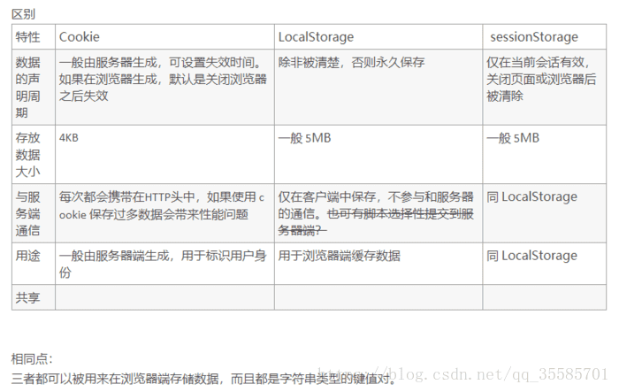
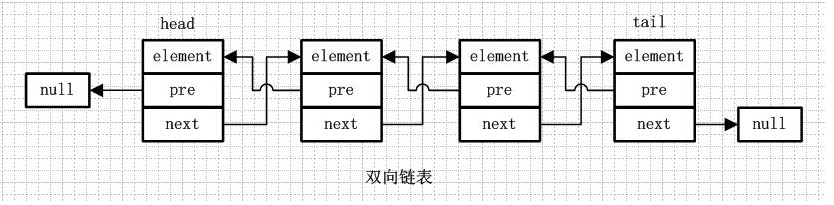
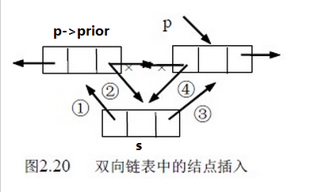
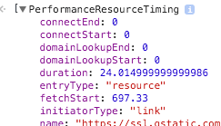

[TOC]

## 169. React的生命周期 ##

[参考-博客](<https://www.cnblogs.com/qiaojie/p/6135180.html>)

*1、getDefaultProps()*

设置默认的props，也可以用dufaultProps设置组件的默认属性.

*2、getInitialState()*

在使用es6的class语法时是没有这个钩子函数的，可以直接在constructor中定义this.state。此时可以访问this.props

*3、componentWillMount()*

组件初始化时只调用，以后组件更新不调用，整个生命周期只调用一次，此时可以修改state。

*4、 render()*

react最重要的步骤，创建虚拟dom，进行diff算法，更新dom树都在此进行。此时就不能更改state了。

*5、componentDidMount()*

组件渲染之后调用，只调用一次。

*6、componentWillReceiveProps(nextProps)*

组件初始化时不调用，组件接受新的props时调用。

*7、shouldComponentUpdate(nextProps, nextState)*

react性能优化非常重要的一环。组件接受新的state或者props时调用，我们可以设置在此对比前后两个props和state是否相同，如果相同则返回false阻止更新，因为相同的属性状态一定会生成相同的dom树，这样就不需要创造新的dom树和旧的dom树进行diff算法对比，节省大量性能，尤其是在dom结构复杂的时候

*8、componentWillUpdata(nextProps, nextState)*

组件初始化时不调用，只有在组件将要更新时才调用，此时可以修改state

*9、render()*

组件渲染

*10、componentDidUpdate()*

组件初始化时不调用，组件更新完成后调用，此时可以获取dom节点。

*11、componentWillUnmount()*

组件将要卸载时调用，一些事件监听和定时器需要在此时清除。

## 168. react的virtual DOM和Diff算法 ##

## 167. 链表找环 ##

## 166. 算法：反转二叉树以及时间复杂度 ##

## 165. 说说bind，apply，call的区别以及bind的实现 ##

### 1. 区别 ###

1. 在调用**bind方法改变this指向时，方法不会执行**，调用**call方法和apply方法时，在改变this指向的同时，执行的方法也会执行**；
2. 使用**bind方法和call方法时入参格式为逗号分割的入参**，使用**apply方法时入参格式为一个数组**，入参依次为数组元素，多个入参就在这一数组中依次添加；

### 2. 实现bind ###

```js
Function.prototype.bind = function(ctx) {
	var self = this;
    return function() {
		return self.apply(ctx, arguments);
	}
}
```

>  ***arguments*** 就像
>
>  `Arguments(3) [Array(1), {…}, "12", callee: ƒ, Symbol(Symbol.iterator): ƒ]`

## 164. 跨域的方法有哪些 ##

参考文件夹 **浏览器 **下的 [记录.md——2.4 跨域的解决办法](../../浏览器/浏览器其他知识/记录.md)

## 163. JS设计模式有哪些 ##

 [Learning  Javascript Design Patterns.pdf](../../设计模式/Learning  Javascript Design Patterns.pdf)

 [JavaScript 设计模式.html](..\..\设计模式\JavaScript 设计模式.html)

- JavaScript 设计模式
  - 构造器模式
  - 模块化模式
  - 揭示模式
  - 单例模式
  - 观察者模式
  - 中介者模式
  - 原型模式
  - 命令模式
  - 外观模式
  - 工厂模式
  - Mixin 模式
  - 装饰模式
  - 亨元（Flyweight）模式
- JavaScript MV* 模式
  - MVC 模式
  - MVP 模式
  - MVVM 模式
- 最新的模块化 JavaScript 设计模式
  - AMD
  - CommonJS
  - ES Harmony
- JQuery 中的设计模式
  - 组合模式
  - 适配器模式
  - 外观模式
  - 观察者模式
  - 迭代器模式
  - 惰性初始模式
  - 代理模式
  - 建造者模式

## 162. Nodejs的线程管理 ##

[Nodejs事件引擎libuv源码剖析之：高效线程池(threadpool)的实现](https://www.cnblogs.com/chenyangyao/p/libuv_threadpool.html)

## 161. cookie，session，localStorage和sessionStorage的区别 ##



> ***cookie*** 和 ***session*** 参考 [博客](https://blog.csdn.net/weixin_36416680/article/details/80506150)

### 1. session ###

在WEB开发中，服务器可以为每个用户浏览器创建一个会话对象（session对象），注意：一个浏览器独占一个session对象(默认情况下)。因此，在需要保存用户数据时，服务器程序可以把用户数据写到用户浏览器独占的session中，当用户使用浏览器访问其它程序时，其它程序可以从用户的session中取出该用户的数据，为用户服务。

### 2. Cookie ###

​	2.1 **什么是Cookie**

* Cookie是HTTP协议的规范之一，它是服务器和客户端之间传输的小数据。
* 首先由服务器通过响应头把Cookie传输给客户端，客户端会将Cookie保存起来。
* 当客户端再次请求同一服务器时，客户端会在请求头中添加该服务器保存的Cookie，发送给服务器。
* Cookie就是服务器保存在客户端的数据！
* Cookie就是一个键值对！！！

​      2.2 **Cookie规范**

* Cookie通过请求头和响应头在服务器与客户端之间传输；
* Cookie大小限制在4KB之内；
* 一台服务器在一个客户端最多保存20个Cookie；
* 一个浏览器最多可以保存300个Cookie；
  虽然Cookie规范是如此，但在今天，浏览器厂商的竞争异常激烈，所以多少会超出Cookie规则的限制。但也不会超出过多！
## 160. 你为什么选择前端 ##

## 159. 模块化思想  ##

[前端工程化-模块化](..\..\前端工程化\模块化\记录.md)

## 158. 前端工程化 ##

[前端工程与性能优化](http://fex.baidu.com/blog/2014/03/fis-optimize/)

[人们常说的前端工程化到底是什么？](<https://www.jianshu.com/p/0d0f268ec73d>)

[怎么给啥也不懂的女朋友讲清楚前端工程化是在做什么？](https://www.zhihu.com/question/41894686/answer/92911687)

## 157. 用JS模拟一个双向链表 ##

***示意图***



***插入***



***实现***

```js
function Node(element) {
  this.element = element
  this.next = null
  this.previous = null
}
function find(element) {
  var currentNode = this.head
  while (currentNode.element != element) {
    if (currentNode.next == null) {
      console.log('can not find this node; maybe not have this node')
      return 'error'
    }
    currentNode = currentNode.next
  }
  return currentNode
}
function insert(newelement, currentelement) {
  var newNode = new Node(newelement)
  var currentNode = this.find(currentelement)
  if (currentNode === 'error') {
    console.log('无法插入，要插入节点不存在')
    return
  }
  if (currentNode.next != null) {
    newNode.next = currentNode.next
    currentNode.next = newNode
    newNode.previous = currentNode
    newNode.next.previous = newNode
  } else {
    currentNode.next = newNode
    newNode.previous = currentNode
  }
}
function remove(element) {
  var currentNode = this.find(element)
  if (currentNode === 'error') {
    console.log('要移除节点不存在')
    return
  }
  /*首先是不是头尾节点的情况*/

  if (currentNode.next != null && currentNode.previous != null) {
    currentNode.previous.next = currentNode.next
    currentNode.next.previous = currentNode.previous
    currentNode.next = null
    currentNode.previous = null
  } else if (currentNode.previous == null) {
    /*当是头节点的时候*/
    this.head = currentNode.next
    currentNode.next.previous = null
    currentNode.next = null
  } else if (currentNode.next == null) {
    /*当是尾节点的时候 */

    currentNode.previous.next = null
    currentNode.previous = null
  }
}
function showlist() {
  var head = this.head
  do {
    console.log(head.element)
    head = head.next
  } while (head != null)
}
function append(element) {
  var lastnode = this.lastNode()
  var newNode = new Node(element)
  lastnode.next = newNode
  newNode.previous = lastnode
}
function lastNode() {
  var head = this.head
  while (head.next != null) {
    head = head.next
  }
  return head
}
function initlist() {
  this.head = new Node('one')
  this.find = find
  this.insert = insert
  this.remove = remove
  this.showlist = showlist
  this.lastNode = lastNode
  this.append = append
}
var list = new initlist()
list.insert('two', 'one')
list.insert('four', 'two')
list.insert('three', 'two')

// console.log(list.head.next)
list.showlist()
list.append('A')
list.append('B')
list.insert('B2', 'B')
list.showlist()
console.log(list.lastNode())
// list.remove('one')
// list.showlist()
console.log(list.find('A').previous)
// console.log(list.find('four').previous)
// console.log(list.head.element)
```

## 156. 浏览器是如何实现通过你的代码去找到指定的元素的 ##

### 1. css ###

[css知识点-本地-16. CSS 选择器解析顺序](..\..\CSS\css知识点\知识点.md)

### 2. js ###

[js知识点-本地-1. js 选择器原理](..\..\js相关\JS工作机制相关\工作原理\记录.md)

## 155. 写一个API，实现jQuery的$(selector)选择器，要求兼容IE6 ##

[IE6、IE7兼容querySelectorAll和querySelector方法-最终版本](https://www.cnblogs.com/jacktang/p/4253249.html)

## 154. 前端安全这块了解多少 ##

[前端安全知识点-本地](../../前端安全/知识点.md)

## 153. 箭头函数和ES5和this的指向区别讲讲 ##

### 1. this 概述 ###

this具体指向什么，取决于你是怎么调用的函数。

```js
var test3 =function () {
	console.log(this);
    return function () {
    	console.log(this)
    }
};
var bb3={
    a:'1',
    cc:test3() //默认在最外层执行(window)
};
bb3.cc(); // bb3
```

### 2. this绑定方式 ###

（1）默认绑定

即没有其他绑定规则存在时的默认规则。这也是函数调用中最常用的规则。

> 注意：**在严格模式下（strict mode），全局对象将无法使用默认绑定，即执行会报undefined的错误**

```js
function foo() {
    "use strict";
    console.log( this.a );
}
var a = 2;
foo(); // Uncaught TypeError: Cannot read property 'a' of undefined
```

（2）隐式绑定

除了直接对函数进行调用外，有些情况是，函数的调用是在某个对象上触发的，即调用位置上存在上下文对象。

```js
function foo() {
    console.log( this.a );
}
var a = 2;
var obj = {
    a: 3,
    foo: foo
};
obj.foo(); // 3
```

（4）多层调用链

`obj2.obj1.foo()` 这里调用链不只一层，存在obj1、obj2两个对象，那么隐式绑定具体会绑哪个对象。这里原则是获取最后一层调用的上下文对象，即obj1。

```js
function foo() {
    console.log( this.a );
}
var a = 2;
var obj1 = {
    a: 4,
    foo: foo
};
var obj2 = {
    a: 3,
    obj1: obj1
};
obj2.obj1.foo(); // 4
```

（5）隐式丢失（函数别名）

```js
function foo() {
    console.log( this.a );
}
var a = 2;
var obj = {
    a: 3,
    foo: foo
};
var bar = obj.foo;
bar(); // 2
```

（6）隐式丢失（回调函数）

```js
function foo() {
    console.log( this.a );
}
var a = 2;
var obj = {
    a: 3,
    foo: foo
};
setTimeout( obj.foo, 100 ); // 2
```

​    虽然参传是obj.foo，因为是引用关系，所以传参实际上传的就是foo对象本身的引用。对于setTimeout的调用，还是 setTimeout -> 获取参数中foo的引用参数 -> 执行 foo 函数，中间没有obj的参与。这里依旧进行的是默认绑定。

（7）new 绑定

```js
function foo(a) {
    this.a = a;
}
var a = 2;
var bar1 = new foo(3);
console.log(bar1.a); // 3
var bar2 = new foo(4);
console.log(bar2.a); // 4
```

（8）硬绑定

***call, apply, bind***

### 3. 箭头函数 ###

**箭头函数的this绑定只取决于外层（函数或全局）的作用域**

[箭头函数-阮一峰老师]( http://es6.ruanyifeng.com/#docs/function#%E7%AE%AD%E5%A4%B4%E5%87%BD%E6%95%B0)

（1）介绍

* 函数体内的this对象，就是定义时所在的对象，而不是使用时所在的对象。
* 不可以当作构造函数，也就是说，不可以使用new命令，否则会抛出一个错误。
* 不可以使用arguments对象，该对象在函数体内不存在。如果要用，可以用 rest 参数代替。
* 不可以使用yield命令，因此箭头函数不能用作 Generator 函数。

```js
/ es6
function foo(){
    return () => {
        console.log( this.a );
    }
}

// es6之前的替代方法
function foo(){
     var self = this;
    return () => {
        console.log( self.a );
    }
}
```

## 152. let和var的区别讲讲 ##

[前端面试题：JS中的let和var的区别](https://www.cnblogs.com/fly_dragon/p/8669057.html)

### 1. var  ###

***变量提升***

```js
var a = 99;            // 全局变量a
f();                   // f是函数，虽然定义在调用的后面，但是函数声明会提升到作用域的顶部。
console.log(a);        // a=>99,  此时是全局变量的a
function f() {
  console.log(a);      // 当前的a变量是下面变量a声明提升后，默认值undefined
  var a = 10;
  console.log(a);      // a => 10
}
// 输出结果：
// undefined
// 10
// 99
```

### 2. let ###

* 不存在变量提升
* let变量不能重复声明
* 暂时性死区

```javascript
var tmp = 123;
if (true) {
  tmp = 'abc'; // ReferenceError
  let tmp;
}
```

* 块级作用域

## 151. ES6的代理是什么 ##

[Proxy](../../ES6/Proxy/知识点.md)

## 150. ES6新特性说说 ##


## 149. webpack有个插件可以解决css兼容性问题你知道吗（postcss-loader） ##


## 148. 如何处理CSS兼容问题 ##


## 147. CSS动画会吗，怎么样用CSS实现一个loading效果 ##

| 属性                                                         | 描述                                                     | CSS  |
| :----------------------------------------------------------- | :------------------------------------------------------- | :--- |
| [@keyframes](http://www.w3school.com.cn/cssref/pr_keyframes.asp) | 规定动画。                                               | 3    |
| [animation](http://www.w3school.com.cn/cssref/pr_animation.asp) | 所有动画属性的简写属性，除了 animation-play-state 属性。 | 3    |
| [animation-name](http://www.w3school.com.cn/cssref/pr_animation-name.asp) | 规定 @keyframes 动画的名称。                             | 3    |
| [animation-duration](http://www.w3school.com.cn/cssref/pr_animation-duration.asp) | 规定动画完成一个周期所花费的秒或毫秒。默认是 0。         | 3    |
| [animation-timing-function](http://www.w3school.com.cn/cssref/pr_animation-timing-function.asp) | 规定动画的速度曲线。默认是 "ease"。                      | 3    |
| [animation-delay](http://www.w3school.com.cn/cssref/pr_animation-delay.asp) | 规定动画何时开始。默认是 0。                             | 3    |
| [animation-iteration-count](http://www.w3school.com.cn/cssref/pr_animation-iteration-count.asp) | 规定动画被播放的次数。默认是 1。                         | 3    |
| [animation-direction](http://www.w3school.com.cn/cssref/pr_animation-direction.asp) | 规定动画是否在下一周期逆向地播放。默认是 "normal"。      | 3    |
| [animation-play-state](http://www.w3school.com.cn/cssref/pr_animation-play-state.asp) | 规定动画是否正在运行或暂停。默认是 "running"。           | 3    |
| [animation-fill-mode](http://www.w3school.com.cn/cssref/pr_animation-fill-mode.asp) | 规定对象动画时间之外的状态。                             | 3    |

```css
animation: name duration timing-function delay iteration-count direction;
```

| 值                          | 描述                                     |
| :-------------------------- | :--------------------------------------- |
| *animation-name*            | 规定需要绑定到选择器的 keyframe 名称。   |
| *animation-duration*        | 规定完成动画所花费的时间，以秒或毫秒计。 |
| *animation-timing-function* | 规定动画的速度曲线。                     |
| *animation-delay*           | 规定在动画开始之前的延迟。               |
| *animation-iteration-count* | 规定动画应该播放的次数。                 |
| *animation-direction*       | 规定是否应该轮流反向播放动画。           |

## 146. CSS3哪些用的比较多 ##

* *border-radius*
* *box-shadow*
* transform/ transition

## 145. 写一个API实现insertAfter ##

```js
function insertAfter(newNode, existingNode) {
    // 获取现有节点的父元素
    const parent = existingNode.parentNode
    // 如果父元素中的最后一个子元素 等于 现有的节点
    if (parent.lastChild === existingNode) {
        // 把现有节点放入父元素子节点后面
        // appendChild在子节点后面追加一个元素
        parent.appendChild(newNode);
    } else {
        // .nextSibling 该属性返回指定节点后的第一个节点
        // insertBefore 第一个参数插入的节点对象，第二参数可选，在其之前插入子节点，如果不传，则在结尾插入。
        parent.insertBefore(newNode, existingNode.nextSibling);
    }
  }
```

## 144. 写一个方法提取一下search里面的参数 ##

[plugin-本地-提取URL中的参数值](../../../plugin/提取URL中的参数值/worker.js)

```js
  function getUrlParam(name) {
    let urlStr = window.location.search
      ,search = ""
      ,matcher = "";
    try{
      search = decodeURIComponent(decodeURIComponent(urlStr));
    } catch {
      try {
        search = decodeURIComponent(urlStr);
      } catch {
        search = urlStr;
      }
    }
    // new RegExp("regexp","g")
    let pattern = new RegExp('[?&]' + name + '\=([^&]+)', 'g');
    // matcher = pattern.match(search);
    matcher = pattern.exec(search);
    return matcher ? matcher[1] : '';
  }
```

## 143. 你的文件上传方案是什么 ##

 [文件上传.md](..\..\文件上传\文件上传.md)

## 142. 你的项目有什么亮点 ##

## 141. 给你一个乱序数组，你怎么样排序 ##

##  [排序](..\..\算法\数组\排序)  ##

## 140. 前端缓存 ##

## 139. 谈谈对原型链继承 ##

## 138. 原型链说一下 ##

## 137. jsonp的原理是什么，处理script标签还可以通过什么实现？（静态资源标签） ##

## 136. 跨域方法说一下 ##

## 135. JS如何获得用户来源（navigator.userAgent） ##

## 134. 如何获取元素的父节点和兄弟节点 ##

（1）通过获取dom方式直接获取子节点

```js
var a = document.getElementById("test").getElementsByTagName("div");
```

（2）通过childNodes获取子节点

```js
var b =document.getElementById("test").childNodes;
```

（3）

```js
firstChild
firstElementChild
lastChild
lastElementChild
parentNode
parentElement
offsetParent
children[1]
previousElementSibling
previousSibling
nextElementSibling
nextSibling
```


##  133. 写一下节点的增删改

[JS DOM节点的增删改查](https://www.cnblogs.com/wuyaxing/p/6429838.html)

## 132. 写一下不知道宽高元素垂直水平居中方法 ##

### 1. 水平垂直居中布局（MDN） ###

[参考-官网](https://css-tricks.com/centering-css-complete-guide/)

[记录：500-532 - 508. 垂直居中的实现](记录：500-532)

* 把要垂直居中的元素相对于父元素绝对定位，top和bottom设为相等的值，我这里设成了0，当然你也可以设为99999px或者-99999px无论什么，只要两者相等就行，这一 步做完之后再将要居中元素的margin设为auto

  ```css
   .father {
       position: relative;
   }
   .son {
       position: absolute;
       top: 0;
       bottom: 0;
       margin:auto 0;
   }
  ```


* Flex

  ```css
  /* 第一种 */
  .father {
      display: flex;
      align-items: center; /*定义body的元素垂直居中*/
      justify-content: center; /*定义body的里的元素水平居中*/
  }

  /* 第二种 */
  .father {
      display: flex;
      flex-direction: column;
      justify-content: center;
  }
  ```

* Table

  ```css
  /*
  <div id="father">
  	<div id="child">我也是一段测试文</div>
  </div>
  */

  #father {
      display: table;
  }
  #child {
      display: table-cell;
      vertical-align: middle;
  }

  /* 文字居中 宽高占满 */

  ```

* vertical-block

  ```css
  .father::before {
      content: " ";
      height: 100%;
      width: 0;
      
      display: inline-block;
      vertical-align: middle;
  }
  .father div {
      
      display: inline-block;
      vertical-align: middle;
  }
  ```

### 2. 水平居中 ###

* text-align
* margin: 0 auto;
* position: absolute;
* display：inline-block;（或display:inline）和text-align:center 实现水平居中

### 3. BOTH ###

```css
body, html {
  height: 100%;
  display: grid;
}
span {
  margin: auto;
}
```

## 131. 写一下清除浮动  ##

[记录：430-499.md - 题 467](记录：430-499.md)

（1）父级div定义伪类

```css
.clearfloat:after{
  	display:block;
    clear:both;
    content:"";
    visibility:hidden;
    height:0
}
.clearfloat{
    zoom:1
}
```

（2）在结尾处添加空div标签clear

```css
.clearfloat{
     clear:both
}
```

（3）父级div定义`overflow:hidden`

（4）父级div定义 `overflow:auto`

（5）父级div定义 `display:table`

（6）额外：父级div也一起浮动，父级定义 height ，撑高

（7）紧跟在其后的元素 clear

## 130. BFC原理  ##

[记录.md - 4. BFC, Block Formatting Context 直译为“块级格式化上下文”](..\一些一直以来模棱两可的\记录.md)

***原理***

- 内部的box会在垂直方向，一个接一个的放置
- 每个元素的margin box的左边，与包含块border box的左边相接触（对于从做往右的格式化，否则相反）
- **box垂直方向的距离由margin决定**，属于同一个bfc的两个相邻box的margin会发生重叠
- b**fc的区域不会与浮动区域的box重叠**
- bfc是一个页面上**的独立的容器**，外面的元素不会影响bfc里的元素，反过来，里面的也不会影响外面的
- **计算bfc高度的时候，浮动元素也会参与计算**


## 129. margin坍塌 ##

## 128. 行内元素和块级元素有哪些，img属于什么元素 ##

[行内元素和块级元素的区别，为何img、input等行内元素可以设置宽高??（夯实基础）](<https://blog.csdn.net/zhouzuoluo/article/details/81064168>)

* 常见块级元素有：html、body、div、header、footer、nav、section、aside、article、p、hr、h1~h6、ul、ol、dl、form、table、tbody、thead、tfoot、tr等；

* 常见行内元素有：span、a、img、textarea、button、input、br、label、select、canvas、progress、cite、code、strong、em、audio、video等

> 行内元素设置宽高无效
> 行内元素设置上下的margin无效
> 行内元素设置上下的padding有效

***行内元素怎么样可设置宽高***

1. 当然使用display:block;和display：inline-block;样式可以实现转换为块级元素和行内块级元素（可设置宽高的行内元素），
2. 行内元素还可以通过添加float来设置宽高，因为不论什么元素本身是什么，当它浮动时就会生成一个块级框；
3. **可替换元素和不可替换元素的分类**
   替换元素：替换元素根据其标签和属性来决定元素的具体显示内容，`<input><textarea><select><object>`等。替换一般有内在尺寸如img默认的src属性引用的图片的宽高，表单元素如input也有默认的尺寸。img和input的宽高可以设定。

## 127. 你有Native开发经验吗，讲下Android如何调用页面的资源 ##

## 126. 了解web移动开发吗，移动端适配方案有哪些 ##

## 125. redux原理讲讲 ##

## 124. 你遇到的最有难度的技术问题是什么 ##

## 123. nodejs了解多少 ##

## 122. 前端性能理解，优化有哪些 ##

## 121. 你对三大框架的理解是什么 ##

## 120. 写一下实现合理化 ##

## 119. 你的技术亮点在哪里 ##

## 118. 博客写了多少篇 ##

## 117. 如何学前端的，看了哪些书 ##

## 116. 如果让你实现一个promise怎么样实现  ##

[本地-Promise实现](..\..\ES6\Promise)

## 115. 原型链断裂了以后的结果是什么 ##

## 114. instanceOf和constructor的区别  ##

[本地-原型链、继承-记录.md-4. instance 原理](..\..\js相关\原型链、继承\记录.md)

```js
//设 L instanceof R
//通过判断
 L.__proto__.__proto__ ..... === R.prototype ？
//最终返回true or false
```

## 113. 如何判断是否为数组？ ##

instanceOf和constructor可以，但是有原型链断裂的风险，Object.toString.call()最稳定

```js
arr instanceof Array;

arr.constructor == Array;

Object.prototype.toString.call(arr) === "[object Array]";
```

## 112. 把undefined和null转成Number分别是什么 ##

```js
isNaN(+undefined) === true;
+null === 0;
```

## 111. typeof array null undefined NaN分别是什么 ##

```JS
typeof arr === "object";
typeof null === "object";
typeof undefined === "undefined";
typeof NaN === "number";
```

## 110. 哪种情况下__proto__和prototype的指向是同一个？ ##

```js
// true
Function.__proto__ === Function.prototype
```

## 109. new和Object.create的区别 ##

[你不知道的javascript之Object.create 和new区别](<https://blog.csdn.net/blueblueskyhua/article/details/73135938>)

***obejct.create***

```js
// Object.create 实现
// Object.create是内部定义一个对象，并且让F.prototype对象 赋值为引进的对象/函数 o，并return出一个新的对象。
Object.create =  function (o) {
    var F = function () {};
    F.prototype = o;
    return new F();
};
```

***new Object()***

var o1 = new Base()的时候new做了什么。

```js
// var o1 = new Base()的时候，JavaScript 实际上执行的是：
var o1 = new Object();
o1.[[Prototype]] = Base.prototype;
Base.call(o1);
```

## 107. 原型链原理 ##

## 106. _*proto*_ 和prototype分别是什么 ##

## 105. webpack的原理 ##

## 104. 算法：给一个无序的数组，让我分割成m组，这个m组里和最大的一组是所有可能的分割情况最小的（二分答案法） ##

## 103. 算法：给你一个无序数字数组，里面是随机的书，并给出一个目标值，求这个数组的两个数，这个数的和等于目标值，要求这两个数并给出下标，你能想到最优的办法是什么吗 ##

提示：快排，双指针

## 102. 实现三栏布局，中间自适应有几种方法 ##

 [三列适应布局.html](..\..\CSS\布局\三列适应布局.html)

## 101. 垂直水平居中的方式 ##

[132. 写一下不知道宽高元素垂直水平居中方法](#132. 写一下不知道宽高元素垂直水平居中方法)

## 100. 现在有一大段文字，如何在页面中设置一个窗口滚动播出这段文件（轮播），轮播图如何解决卡顿问题，有手写过轮播图你，原理是什么 ##

## 99. 你的聊天室项目，如果数据传输出错了怎么办？ ##

## 98. websock的底层原理讲讲 ##

[看完让你彻底搞懂Websocket原理](<https://blog.csdn.net/frank_good/article/details/50856585>)

Upgrade: websocket
Connection: Upgrade

## 97. 数组常用的方法有哪些 ##

[js中数组常用的方法总结，包括ES6](<https://blog.csdn.net/wang729506596/article/details/83019131>)

[forEach究竟能不能改变数组的值](https://www.cnblogs.com/bydzhangxiaowei/p/10472729.html)

## 96. JS的回收机制说一下 ##

 [本地-垃圾回收-知识点.md](../../JS相关/JS工作机制相关/垃圾回收/知识点.md)

## 95. event loop讲讲  ##

[本地-事件循环机制.md](../../JS相关/JS工作机制相关/事件循环/事件循环机制.md)

[Javascript异步编程的4种方法](<http://www.ruanyifeng.com/blog/2012/12/asynchronous%EF%BC%BFjavascript.html>)

## 94. var的变量提升底层原理是什么？ ##

变量提升的根本原因是变量声明与赋值的分离，举个例子 var a = 2；这个代码是分两步进行的。首先是 var a 这一部分的***变量声明***，这个过程是在***代码编译时***进行的。然后是 a = 2; 这一部分的***变量赋值***，这个过程是在***代码执行时***进行的。

代码先编译一遍然后才执行，这样下面的变量提升的代码就容易解释了。

```js
console.log(a)
var a = 2;

b = 3;
var b;
console.log(b)
```

在这段代码编译的过程中，a 与 b 都进行了声明，代码执行的过程中先打印 a ,因为 a 只是声明了还没有赋值，所以结果是 undefined。后打印 b ，因为 b 的赋值在打印的前面，所以结果是 3.

## 93. 浏览器的缓存  ##

[本地-记录：230 -299.md-234强缓存，协商缓存什么时候用哪个](记录：230 -299.md)

## 92. JS如何计算浏览器的渲染时间的 ##

[白屏时间，首屏时间，DOM树构建时间，整页时间](<https://blog.csdn.net/qq_41047322/article/details/82814396>)

[了解 Resource Timing](https://developers.google.cn/web/tools/chrome-devtools/network-performance/understanding-resource-timing)

```js
performance.getEntriesByType('resource').filter(item => item.name.includes("style.css"))
```



## 91. 自我介绍 ##

## 90. web的安全问题？  ##

[本地-知识点.md](..\..\前端安全\知识点.md)

## 89. 发送请求有哪些？ ##

## 88. 让我设计一个页面，选择男或女，搜索出相对性 ##

## 87. 登录原理 ##

[单系统登录机制](<https://www.cnblogs.com/ywlaker/p/6113927.html>)

## 86. 浏览器出于安全考虑有？（同源策略）  ##

[本地-记录.md-2. 跨域](..\..\浏览器\浏览器其他知识\记录.md)

## 85. 遍历数组处理用for循环还有什么方法吗 ##

[参考-97. 数组常用的方法有哪些](#97. 数组常用的方法有哪些)

## 84. 如何去除数组中的重复的项？ ##

## 83. mysql语言写的如何，怎么样判断sql语句的性能？如何优化？ ##

## 82. mysql的底层引擎，发布 ##

## 81. 一般你是如何操作数据库的？会哪些数据库 ##

## 80. nodejs是单线程还是多线程的，为什么能去开很多异步请求去访问其他接口 ##

79. cookie和session的区别和联系

讲下如何负载均衡

## 72.https的请求过程  ##

426. https426. https

## 71. 代码规范 ##

网易<http://nec.netease.com/standard/css-name.html>

百度<http://coderlmn.github.io/code-standards/#_search_engine_optimization>
