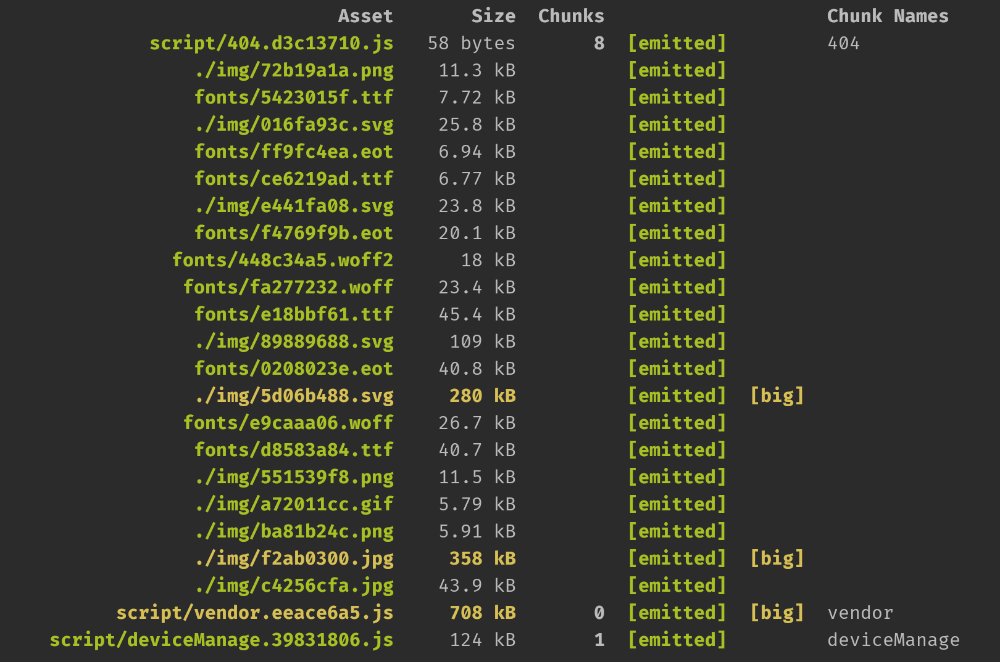
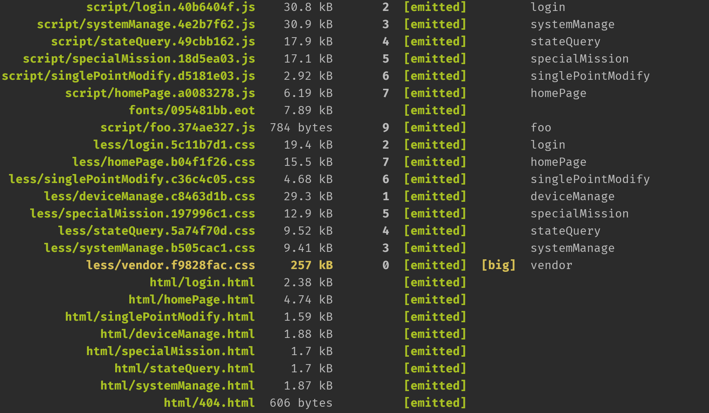

[TOC]

# 一、智能交通系统

## 1. 亮点/难点

### 1. 全局文件样式

**`globalLessVars.js`**

```js
const globalVars = {
    btnBlue : "#025B97",
    btnHoverBlue : "#027BCC",
}
module.exports = globalVars;
```

**`webpack.common.js`**

```js
{
    loader: 'less-loader',   // compiles Less to CSS
    options: {
        globalVars: globalLessVars
    }
}
```

### 2. HTML 模块化

插件：`html-withimg-loader`。

```html
<div>
    #include("./layout/top.html")
</div>
```

https://www.npmjs.com/package/html-withimg-loader

### 3. 页面入口配置

**`entry.json`**

```json
[
    {
        "url": "login",
        "title": "登录"
    },
]
```

**`webpack.common.js`**

```js
entryJSON.map(page => {
    entry[page.url] = path.resolve(__dirname, `../src/page/${page.url}/index.js`)
})
// 出口管理 ， 因为多入口，所以要多个HtmlWebpackPlugin，每个只能管一个入口
let htmlPlugins = entryJSON.map(page => {
    return new HtmlWebpackPlugin({
        filename: path.resolve(__dirname, `../dist/html/${page.url}.html`),
        template: path.resolve(__dirname, `../src/page/${page.url}/index.html`),
        chunks: ['foo','jquery',page.url], // 实现多入口的核心，决定自己加载哪个js文件，这里的 page.url 指的是 entry 对象的 key 所对应的入口打包出来的js文件
        hash: true, // 为静态资源生成hash值
        minify: false,   // 压缩，如果启用这个的话，需要使用html-minifier，不然会直接报错
        xhtml: true,    // 自闭标签
    })
})
```

### 4. 文件的复用

创建表格 

### 5. 地图

双击地图上的点弹出详情框。

点击地图获取地图上面的值。

双击搜索结果，放大地图，显示控制机的位置。

div.__proto__.__proto__.hasOwnProperty("ondblclick")

div.ondblclick = null 可用，dev.ondbclick === undeifined 不可用

### 6. 错误信息轮询

### 7. 控制机管理

**灯组**

* **灯组**

  灯组编号、灯组类型、灯组类型、操作

* **相位**

  灯组编号、灯组类型、灯组类型、灯组颜色

* **配时方案**

  配时，相位编号、相位名称、绿灯时长(秒)、黄灯时长(秒)、闪烁时长(秒)，onEditableSave

### 8. 调度方案配置

方案编号、方案名称、方案类型、开始时间、结束时间


路口名称、方案名称 、方案编号、方案开始时间、方案结束时间、方案类型、方案开始天、方案结束天、方案简介

## 2. 缺点

### 1. hash

### 2. entry

```json
{
    "url" : "homePage",
    "title" : "主页"
},
```

### 3. 代码分离

```javascript
// require.ensure() 是 webpack 特有的，已经被 import() 取代。
require.ensure

import('lodash').then(_ => {
  // Do something with lodash (a.k.a '_')...
})
```

### 4. 没有GZIP压缩



### 5. 项目结构

没点一次二级目录都会重新，挂载，请求渲染

### 6. UI

### 7. 大量的 DOM 操作

### 8. 组件缓存

每次点击的时候都会重新的innerHTML 挂载，然后请求，渲染表格。

1. 放在body, display
2. Cache = []; 缓存 frag;

```js
let frag = document.createDocumentFragment("div");
frag.appendChild(document.querySelector("#csdn-toolbar")); // 从上面删除
```

### 9. `Js` 中太多 `html`

为了减少`DOM` 操作，使用了太多的`innerHTML`