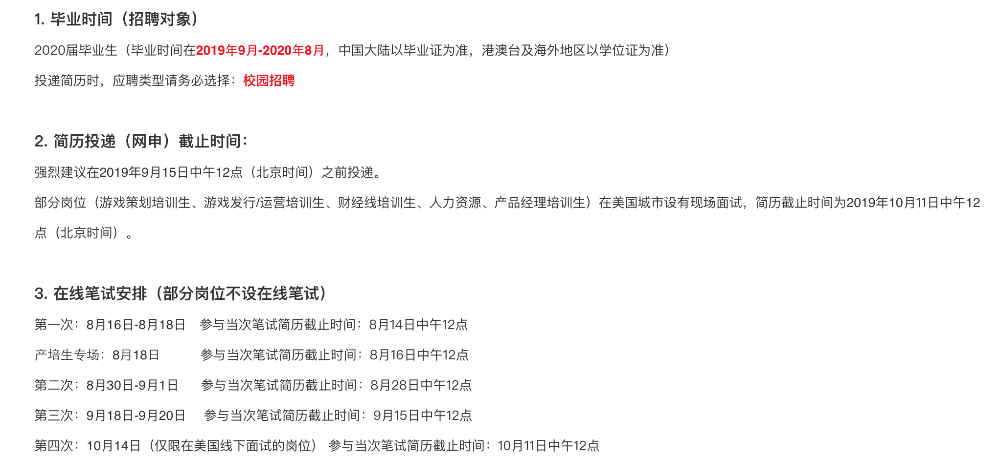
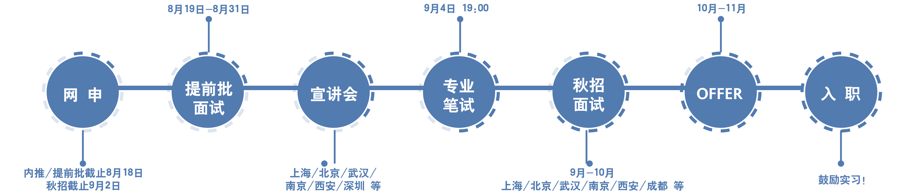
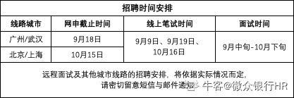
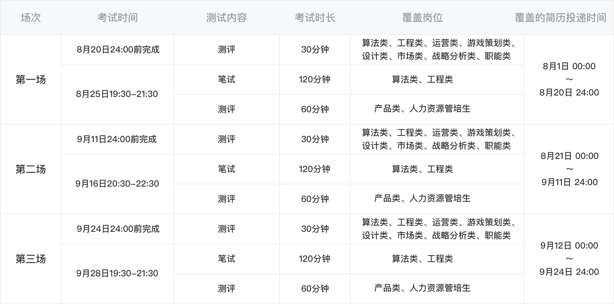

## [腾讯]([https://join.qq.com](https://join.qq.com/))

## [携程](http://campus.ctrip.com/#/job-selector/tech) — 已投

## [Shopee](https://app.mokahr.com/campus_apply/shopee/2962#/candidateHome/applications?_k=lzrhp1) — 已投

* 研发类招聘流程：网申/内推 —— 在线笔试 —— 在线初试 ——在线复试 —— HR 复试 ——Offer

## [微众银行](https://webank.cheng95.com/deliver/flow?channel=1&bole_id=608987&project_id=) — 已投、官网内推

> [牛客](https://www.nowcoder.com/discuss/229383?type=0&order=0&pos=39&page=1)

## [快手](https://campus.kuaishou.cn/#/campus/jobs)

* 网申：8月1日开始
* 宣讲：8月下旬开始
* 笔试：8月25日开始
* 面试：8月底开始
* Offer：9月初开始

## [bilibili](https://campus.bilibili.com/index.html) — 已投

* 网申：8/1 - 10/15
* 笔试：8/20 & 9/10
* 面试：8 - 10

## [58](http://campus.58.com/home.html) — 已投、牛客内推

> [牛客](https://www.nowcoder.com/discuss/225069?type=all&order=time&pos=&page=4)、[秋季招聘](http://campus.chinahr.com/ws/v/5d478d8b52ffdf0455603503/index.html?refer=share#/campus?projectId=5d478d8b52ffdf0455603503)

* 网申时间：2019年8月15号-10月30号（后期若有补招再行通知）
* 笔试时间：9月12日、9月16日、9月19日、10月13日
* 笔试形式：线上笔试（请等待邮件&短信通知，提前准备好电脑，保持网络畅通）
* 面试时间：9月中旬开始（请等待邮件&短信通知）
* 面试安排：初试（专业面）-复试（专业面）-终试（HR面）
* 面试形式：现场面试/视频面试

## [瓜子](http://campus.guazi.com/pro.html) — 已投、牛客内推

> [牛客](https://www.nowcoder.com/discuss/225919?type=all&order=time&pos=&page=0)
>
> [投递]([http://xyz.51job.com/external/MyResume/ResumeEnd.aspx?ctmid=119c557d-5764-4cc9-b311-e3b13c2d632f&css=http%3a%2f%2fimg03.51jobcdn.com%2fehireplus%2f2020%2fstyle%2fehireplus2009%2fnewcp1%2finc%2f&CtmName=%e7%93%9c%e5%ad%90%e4%ba%8c%e6%89%8b%e8%bd%a6&resumeid=9ffff8d8-a2a7-454e-bfa7-f18834a5c3bf](http://xyz.51job.com/external/MyResume/ResumeEnd.aspx?ctmid=119c557d-5764-4cc9-b311-e3b13c2d632f&css=http%3a%2f%2fimg03.51jobcdn.com%2fehireplus%2f2020%2fstyle%2fehireplus2009%2fnewcp1%2finc%2f&CtmName=瓜子二手车&resumeid=9ffff8d8-a2a7-454e-bfa7-f18834a5c3bf))

## [一加](https://career.oneplus.com/cn/campus)

* 网申：9月11日18:00前 
* 笔试:  9月12日 
* 面试:  面试分为初试和复试 
* 签约:  以短信/邮件形式通知， 带好相关材料到指定地点参加签约会

# [top4fun](https://app.mokahr.com/recommendation-apply/tap4fun/3098?recommenderId=122217#/jobs?isCampusJob=1&zhineng=7430&_k=gwmyr8) — 已投、官网

# [招银网络科技](https://cmbnt.cmbchina.com/2020campus/index.html) — 已投、官网

> [牛客](https://www.nowcoder.com/discuss/220275?type=post&order=create&pos=&page=0)

**面向人群：2020届毕业生**

* **第一批次** 9月5日 18:00 截止网申

  武汉、南京、成都、广州、长沙、合肥、重庆、沈阳、大连、长春、哈尔滨

* **第二批次** 9月23日 18:00 截止网申

  北京、西安、上海、深圳、杭州、厦门、天津、济南

**在线测评**

* **测评时间：9月6日（第一批次） 9月24日（第二批次）**

> 注：在线测评包括专业测评和素质测评，专业测评需根据应聘技术方向选择对应试题；
>
> 重要提醒：如您未能在第一批测评前投递简历，还可以参加第二批测评，但后期需前往第二批的

## [贝壳](http://campus.ke.com/zpdetail/190223096#this) — 已投、正式批

## [thoughtworks](https://join.thoughtworks.cn/recruitment/application/22)

## [360](http://campus.chinahr.com/views/2020-qihu360/introduction_1.html) —笔试通过

## [奇安信](https://www.nowcoder.com/discuss/226487?type=post&order=time&pos=&page=1) — 官网、牛客内推

> [牛客](https://www.nowcoder.com/discuss/226487?type=post&order=time&pos=&page=1)