1. 

2. 不同环境

   本地、预发、线下

3. 蘑方

   组件、活动页面。生成页面（可配置，配置时输入数据更新当前模块下的的schema.json 文件。前端通过schema.json 中的内容获取数据）

   **页面**
   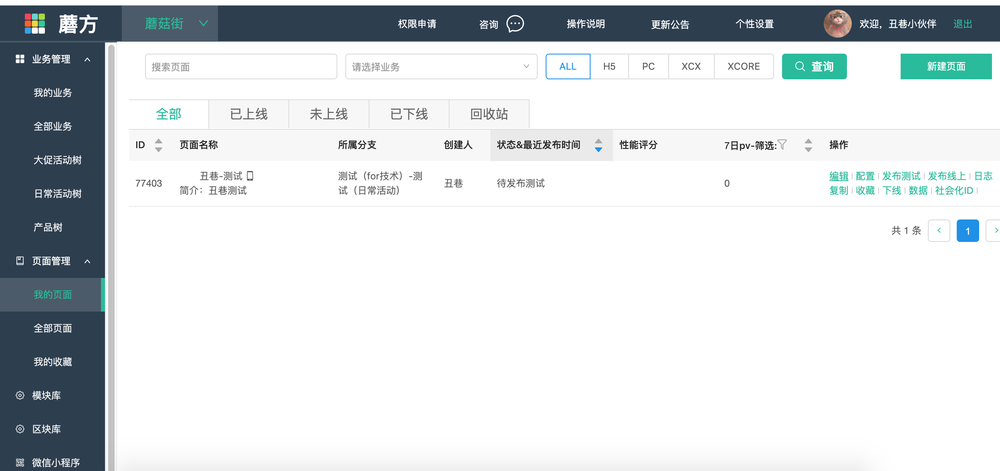

   

   **页面配置**
   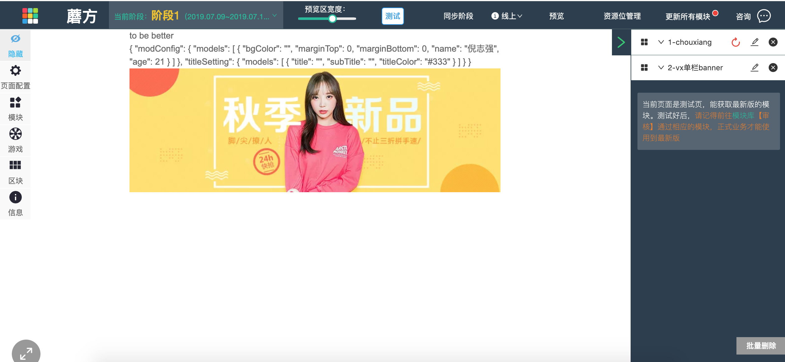

   

   **发布**
   代码提交到 master 分支后会自动 build 发布，就可以在响应的页面中使用模块。

4. 麦田

   资源位，运营填入一些数据，放入线上，前端通过麦田上面的资源位`id`，通过`nwp`请求响应的数据做布局。

   **麦田资源位**
   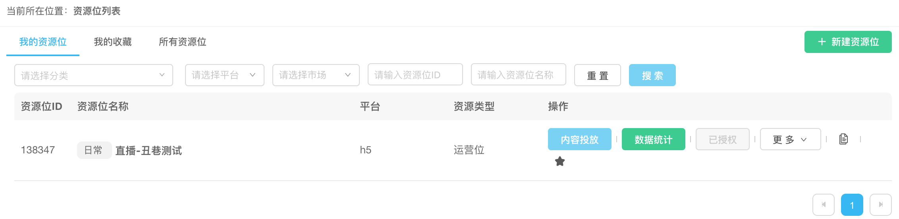

   **麦田**
   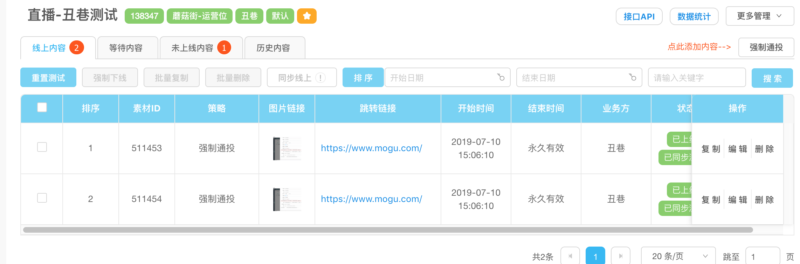

   **获取数据**
   ```js
     return this.mwp('mwp.darwin.get', '3', {
        pid: 133734
     });
   ```

5. 应用管理平台

**MFP应用列表**
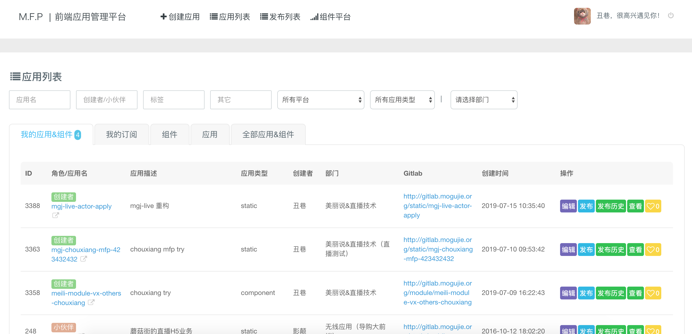


**编辑应用**
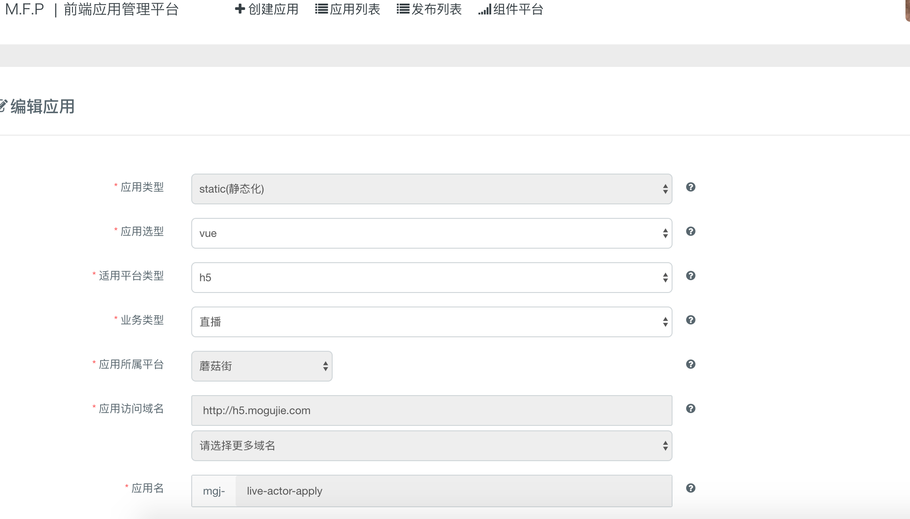


发布历史**

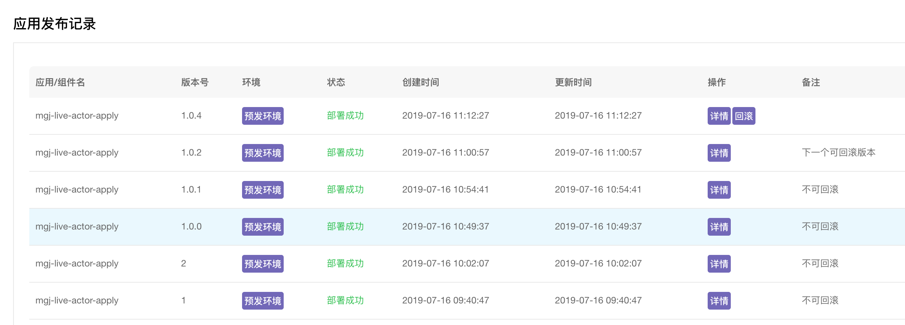


**创建发布**

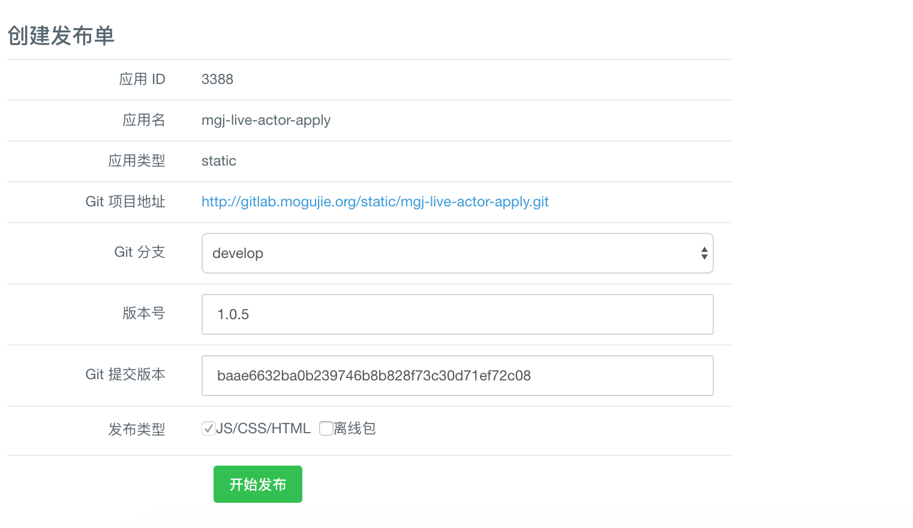


**发布**

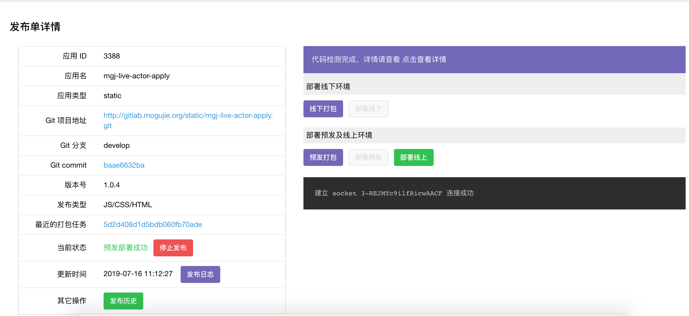

**发布日志、详情**

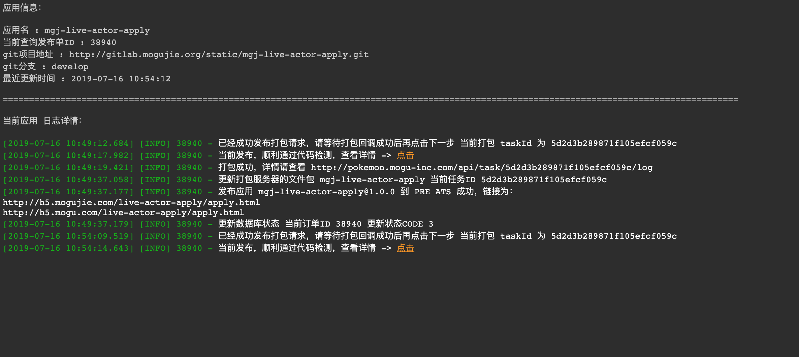


**发布错误**

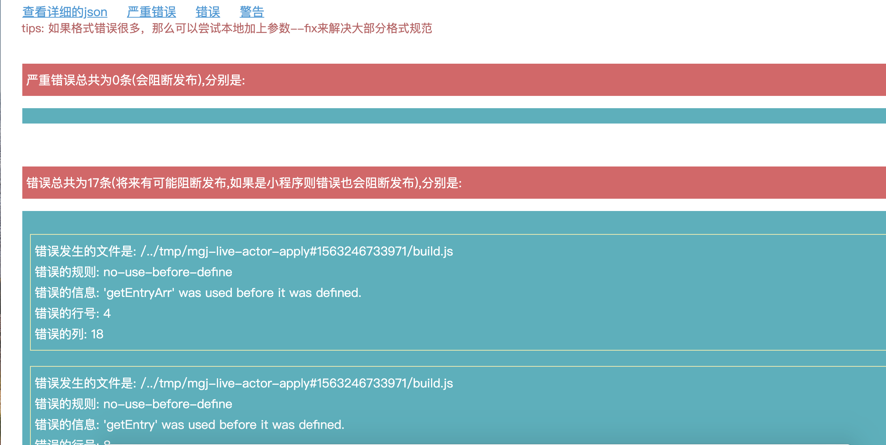